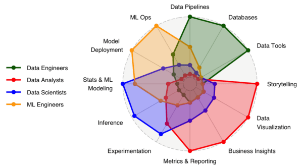
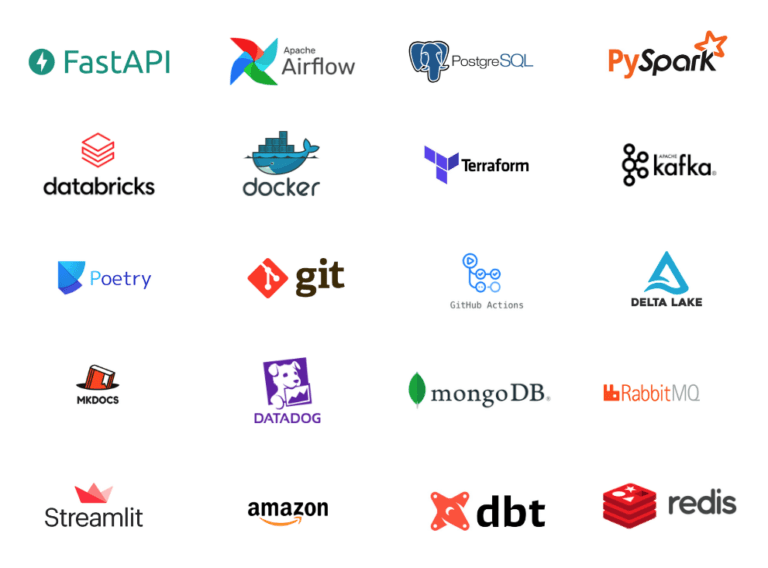
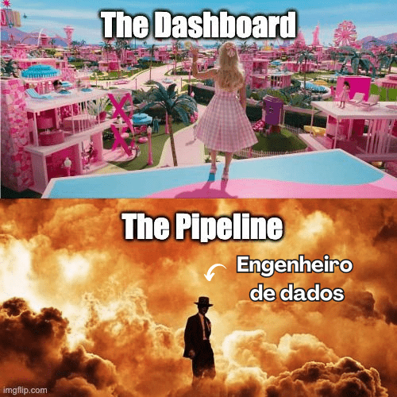
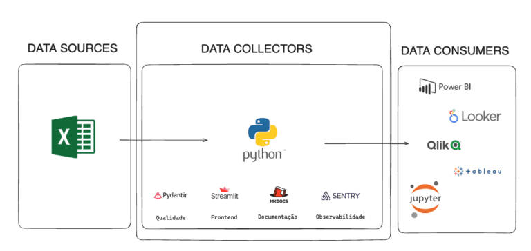
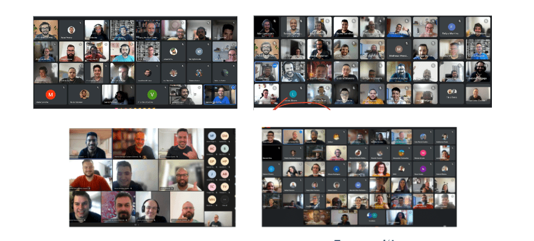

# Automação Data Quality Excel Etl

Seja bem vindo ao Projeto Automação Data Quality Excel Etl

Não perca [nosso workshop aberto](https://www.jornadadedados2024.com.br/) no dia 24/01

Vamos fazer todo o código desse projeto ao vivo

## Conteúdo

Esse repositório faz parte da Jornada de Dados 2024 

Para saber mais [acesse aqui](../README.md)

- [Automação Data Quality Excel Etl](#automação-data-quality-excel-etl)
  - [Conteúdo](#conteúdo)
  - [Você sabe o que faz um engenheiro de dados?](#você-sabe-o-que-faz-um-engenheiro-de-dados)
  - [Ele ainda trabalha com todas essas tecnologias](#ele-ainda-trabalha-com-todas-essas-tecnologias)
  - [Isso explica melhor](#isso-explica-melhor)
  - [Isso explica melhor](#isso-explica-melhor-1)
  - [Te convido a criar uma solução](#te-convido-a-criar-uma-solução)
  - [Mais 500 alunos em 2023 aprovaram com 92% de satisfação](#mais-500-alunos-em-2023-aprovaram-com-92-de-satisfação)
  - [Não perca](#não-perca)
  - [Objetivo](#objetivo)
  - [Pré requisitos](#pré-requisitos)
  - [Possui dúvidas?](#possui-dúvidas)
  - [Agora para o projeto?](#agora-para-o-projeto)

## Você sabe o que faz um engenheiro de dados?

É o responsável por criar plataformas e pipeline de dados com qualidade

## Ele ainda trabalha com todas essas tecnologias

Mas acho que…

## Isso explica melhor

Mas acho que…

## Isso explica melhor

## Te convido a criar uma solução

De engenharia de dados ao vivo comigo dia 24/01 às 20h: “Do Zero ao Deploy”

Vamos iniciar o seu portfólio?

## Mais 500 alunos em 2023 aprovaram com 92% de satisfação

## Não perca 

[Nosso workshop aberto](https://www.jornadadedados2024.com.br/) no dia 24/01

## Objetivo

* Testes com Pytest e Selenium
* Documentando com Mkdcos
* O resto é codando em Python e tomando Coca-Cola

## Pré requisitos

Para você aproveitar ao máximo do Workshop, é importante que você se sinta confortável com SQL e uma experiência com Python também será útil, ideal que você tenha entre 1 e 2 anos de trabalhando com dados.

Caso você não tenha de 1 a 2 anos na área terá que estudar muito SQL e Python em paralelo, acredito que ao menos 1h por dia de estudos fora da jornada

Se você tem **zero experiência** recomendo primeiro realizar todos os cursos de SQL e de [Python do Guanabara](https://www.youtube.com/@CursoemVideo) que é 0800

## Possui dúvidas? 

- Fale comigo [Link do Linkedin](https://www.linkedin.com/in/lucianovasconcelosf/)

## Agora para o projeto?

- Toda a documentação do projeto é feita usando Mkdocs

