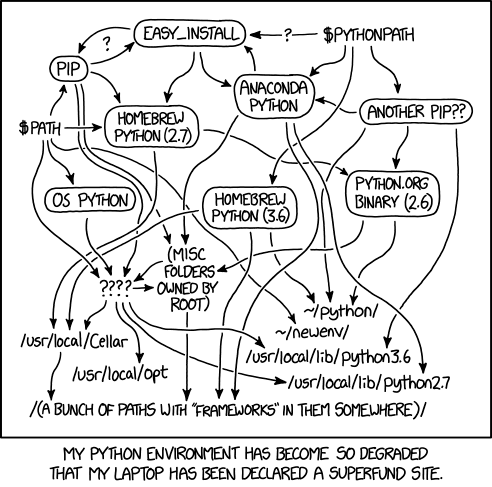
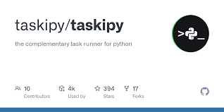

# Fluxo do Workshop

Fique calmo, tudo vai dar certo.



Tem tudo em detalhes aqui no [Data Project Starter Kit](https://github.com/lvgalvao/DataProjectStarterKit)

## 1) Configuração inicial

#### 1) Vamos criar um novo projeto no Git e Github
  
- Acessar site Github e criar nossa pasta
- Fazendo um teste simples para ver se tudo está bem
- Criando um README

```bash
touch README.md
```

- Salvando ele

```bash
git add .
git commit -m "docs: adicionando arquivo README"
git push --set-upstream origin main
```
- Deletando ele
```bash
git add .
git commit -m "docs: remover arquivo README"
git push
```

- Recuperando ele

```bash
git log
git checkout 3eab9123874b4ec51b0ab6d103a9483f2250c23f -- README.md
git add .
git push
```
  
#### 2) Vamos definir nossa versão do Python usando o Pyenv

```bash
python --versions
pyenv versions
pyenv local 3.11.5
```

#### 3) Vamos criar nosso ambiente virtual
Para criar o ambiente virtual, abra o terminal dentro da pasta criada e faça:

```bash
python -m venv nome_do_ambiente_virtual 
# O padrao é utilizar .venv
source nome_do_ambiente_virtual/bin/activate
# Usuários Linux e mac
nome_do_ambiente_virtual\Scripts\Activate
# Usuários Windows
```

#### 4) Instalando uma biblioteca

```bash
pip install selenium
```

#### 4) Replicando ambientes

Agora, se quisermos rodar o nosso projeto em outra máquina, não será necessário baixar as dependências uma a uma, basta fazer:

```bash
pip freeze > requirements.txt
pip install -r requirements.txt  
```

#### 5) Desativando o ambiente virtual

E por fim, para desativar o ambiente virtual:
```bash
deactive
```

#### 6) Criando o .gitignore

```bash
touch .gitignore
```

[Site com exemplo de arquivo](https://www.toptal.com/developers/gitignore/api/python)

#### 7) Melhorando nosso README

```md

    ### Instalação e Configuração

    1. Clone o repositório:

    ```bash
    git clone https://github.com/lvgalvao/dataprojectstarterkit.git
    cd dataprojectstarterkit
    ```

    2. Configure a versão correta do Python com `pyenv`:

    ```bash
    pyenv install 3.11.5
    pyenv local 3.11.5
    ```

    3. Instale as dependências do projeto:

    ```bash
    python -m venv .venv
    # O padrao é utilizar .venv
    source .venv/bin/activate
    # Usuários Linux e mac
    .venv\Scripts\Activate
    # Usuários Windows
    pip install -r requirements.txt  
    ```
```

## 2) Precisamos falar de testes

Diferença entre fases de teste, tipos de teste e formas de execução. Hoje em dia há muita confusão quando se fala em fases de teste, tipos de teste e formas de execução. 

Se você, assim como eu, já ouviu as frases a seguir várias vezes, então esse [artigo é para você!](https://www.zup.com.br/blog/tipos-de-teste)

- “Fulano sabe teste funcional e não automatizado”;
- “desenvolva o teste unitário antes dos funcionais”; 
- “precisamos que os testes sejam 100% automatizados”; 
- “cadê a massa de dados para os testes de contrato?”

### Pirâmide de teste
Uma maneira mais visual de exemplificar um pouco sobre as fases de teste e os tipos de teste que cada fase contempla, é a pirâmide de automação de teste.


#### 1) Criando nosso primeiro teste

```bash
pip install pytest
pip install selenium
```

[Como instalar o webdriver](https://medium.com/@wmonteiro/executando-o-selenium-com-o-python-em-windows-c876bc60bf99)


Vamos criar nosso arquivo de teste

```bash
mkdir tests
cd tests
touch test_app.py
```

arquivo `test_app.py`
```python
from selenium import webdriver
from selenium.common.exceptions import TimeoutException
from time import sleep

# Precismaos definir qual driver vamos utilizar
driver = webdriver.Firefox()

# Define um timeout implícito
driver.set_page_load_timeout(5)  # 5 segundos

# Vamos fazer uma tratativa de try-except de entrar na nossa página
try:
    driver.get("http://localhost:8501")
    sleep(5)
    print("Acessou a página com sucesso")
except TimeoutException:
    print("Tempo de carregamento da página excedeu o limite.")
finally:
    driver.quit()
```

Agora que já temos nosso teste vamos desenvolver nosso primeiro código

Para isso vamos trabalhar com o *streamlit*


Instalando o streamlit

```bash
pip install streamlit
```

Vamos fazer o nosso Hello World

```bash
mkdir src
cd src
touch app.py
```

arquivo `app.py`
```python
import streamlit as st

# Título do App
st.title('Nosso Primeiro App com Streamlit')

# Escrevendo um Hello World com markdown
st.markdown('**Hello world!** 🌍')

# Escrevendo texto
st.write('Esta é uma demonstração de algumas funcionalidades do Streamlit.')

# Input de texto do usuário
input_texto = st.text_input('Digite algo aqui:')

# Mostrando o texto digitado
st.write(f'Você digitou: {input_texto}')

# Slider para números
numero = st.slider('Escolha um número', 0, 100, 50)

# Exibir o número escolhido
st.write(f'Você escolheu o número: {numero}')

# Gráfico de barras simples
import pandas as pd
import numpy as np

# Criando dados aleatórios
dados = pd.DataFrame({
  'colunas': ['A', 'B', 'C', 'D', 'E'],
  'valores': np.random.randn(5)
})
```

### Temos nosso frontend /o/

### Agora vamos para uma tangente

Temos um problema com nosso processo que muda de porta

Sempre que subimos uma nova aplicação ele está usando uma outra porta

Precisamos "matar" esse processo e reutilizar a porta 8501

Usamos o comando lsof (List Open Files) para verificar os processos que estão conectados nessa porta

```bash
lsof -i :8501
```

Depois usamos o comando kill para matar esse processo

```bash
kill -9 [PID]
```

Podemos simplificar usando somente uma linha

```bash
lsof -ti :8501 | xargs kill -9
```

No Windows, o comando `lsof` (List Open Files), que é comum em sistemas baseados em Unix como Linux e macOS, não está disponível. No entanto, você pode realizar uma tarefa similar para verificar quais processos estão usando uma porta específica (por exemplo, a porta 8501) usando o Resource Monitor ou comandos no Prompt de Comando. Aqui estão duas maneiras de fazer isso:

### 1. Usando o Resource Monitor

1. Pressione `Ctrl + Shift + Esc` para abrir o Gerenciador de Tarefas.
2. Vá para a aba "Desempenho" e clique em "Monitor de Recursos" na parte inferior.
3. No Resource Monitor, vá para a aba "Rede".
4. Olhe na seção "Portas de Escuta" para encontrar a porta 8505 e veja quais processos estão associados a ela.

### 2. Usando o Prompt de Comando

1. Abra o Prompt de Comando como administrador (isso é necessário para executar comandos que acessam informações de rede).
    
2. Digite o seguinte comando:
    
    ```cmd
    netstat -ano | findstr :8501
    ```
    
    Esse comando lista todas as conexões e portas de escuta (`netstat -ano`) e filtra os resultados para mostrar apenas as entradas relacionadas à porta 8505 (`findstr :8501`).
    
3. Você verá uma lista de entradas, se houver alguma, mostrando o protocolo, endereço local, endereço estrangeiro, estado, e o PID (ID do Processo) associado à porta 8505.
    
4. Se você quiser saber qual aplicativo está associado a um PID específico, você pode encontrar este PID na aba "Detalhes" do Gerenciador de Tarefas.
Para finalizar um processo em uma linha de comando no Windows, combinando a busca do processo pela porta e o encerramento do processo, você pode usar o PowerShell. O PowerShell é mais poderoso e flexível do que o Prompt de Comando tradicional para este tipo de operação. Aqui está como você pode fazer isso:

Abra o PowerShell como administrador e execute o seguinte comando:

```powershell
Get-NetTCPConnection -LocalPort 8501 | Select-Object -ExpandProperty OwningProcess | ForEach-Object {Stop-Process -Id $_ -Force}
```

Este comando faz o seguinte:

1. `Get-NetTCPConnection -LocalPort 8501`: Obtém todas as conexões TCP que estão escutando na porta 8501.
    
2. `Select-Object -ExpandProperty OwningProcess`: Seleciona os IDs dos processos (PID) que estão escutando naquela porta.
    
3. `ForEach-Object {Stop-Process -Id $_ -Force}`: Para cada PID encontrado, usa o `Stop-Process` para encerrar o processo. A opção `-Force` é usada para garantir que o processo seja encerrado.

### Taskipy - Para não ficar toda essa quantidade de código, vamos usar o Taskipy



Basicamente o Taskipy é um short de comandos

Vamos instalar ele com o comando

```bash
pip install taskipy
```

Criar um arquivo de configuração

```bash
touch pyproject.toml
```

E dentro desse arquivo `pyproject.toml` incluir os comandos que queremos

```toml
[tool.taskipy.tasks]
run = "lsof -ti :8501 | xargs kill -9 | streamlit run src/app.py"
```

Agora conseguimos simplificar e tornar nosso processo de rodar nossa aplicação mais rápido

### Saindo da tangente

```bash
python tests/test_app.py
```

E temos o nosso primeiro teste passando!

Agora temos duas opções.

### Escrever um novo teste ou refatorar.

## 3) Nossa primeira refatoração

Vamos melhorar os nossos testes usando o pytest

1) Vamos criar uma função que inicia o nosso driver

2) Vamos criar uma função que testa se o site está online

Para nossa função vamos usar o módulo fixture do pytest

```python
import pytest
import subprocess
from selenium import webdriver

@pytest.fixture
def driver():
    # Iniciar o Streamlit em background
    process = subprocess.Popen(["streamlit", "run", "src/app.py"])

    # Iniciar o WebDriver usando GeckoDriver
    driver = webdriver.Firefox()
    driver.set_page_load_timeout(5)
    yield driver

    # Fechar o WebDriver e o Streamlit após o teste
    driver.quit()
    process.kill()

def test_app_opens(driver):
    # Verificar se a página abre
    driver.get("http://localhost:8501")
```

Além disso,
Podemos incluir um comando novo no task

```pyproject.toml
test = "lsof -ti :8501 | xargs kill -9 | pytest tests -v"
```

#### Nosso segundo teste


Vamos escrever um teste que cheque se o title ta página é `validador de schema excel`

Para isso vamos criar mais um teste

```python
def test_check_title_is(driver):
    # Verificar se a página abre
    driver.get("http://localhost:8501")
    # Verifica se o titulo de página é
    sleep(5)
    # Capturar o título da página
    page_title = driver.title

    # Verificar se o título da página é o esperado
    expected_title = "Validador de schema excel"  # Substitua com o título real esperado
    assert page_title == expected_title, f"O título da página era '{page_title}', mas esperava-se '{expected_title}'"
```   

Vamos revisitar nossa aplicação também

```python
import streamlit as st

# Título do App
st.title('Validador de schema excel')
```

Nosso teste não passa =(

O motivo? 

**O streamlit e o selenium chamam coisas diferentes com o mesmo nome!**

```python
import streamlit as st

st.set_page_config(
    page_title="Validador de schema excel"
)
```

### 3) Terceira Feature

#### Adicionar um texto no h1

test_app.py
```python
from selenium.webdriver.common.by import By

def test_check_streamlit_h1(driver):
    # Acessar a página do Streamlit
    driver.get("http://localhost:8501")

    # Aguardar para garantir que a página foi carregada
    sleep(5)  # Espera 5 segundos

    # Capturar o primeiro elemento <h1> da página
    h1_element = driver.find_element(By.TAG_NAME, "h1")

    # Verificar se o texto do elemento <h1> é o esperado
    expected_text = "Insira o seu excel para validação"
    assert h1_element.text == expected_text

```

app.py
```python
st.title("Insira o seu excel para validação")
```

### 4) Agora vamos criar um teste que o usuário pode inserir um excel, e vai aparecer uma mensagem de sucesso

Vamos criar nossa nova função


test_app.py
```python
def test_check_usuario_pode_inserir_um_excel_e_receber_uma_mensagem(driver):
    # Acessar a página do Streamlit
    driver.get("http://localhost:8501")

    # Aguardar para garantir que a página foi carregada
    sleep(5)  # Espera 5 segundos

    # Realizar o upload do arquivo de sucesso
    success_file_path = os.path.abspath("data/arquivo_excel.xlsx")
    driver.find_element(By.CSS_SELECTOR, 'input[type="file"]').send_keys(success_file_path)

    # Aguardar a mensagem de sucesso
    sleep(5)
    assert "O schema do arquivo Excel está correto!" in driver.page_source
```

app.py
```python
arquivo = st.file_uploader("Carregue seu arquivo Excel aqui", type=["xlsx"])

if arquivo:
    st.success("O schema do arquivo Excel está correto!")
```

Agora vamos parar com nosso frontend e ir para a parte do backend

## Pydantic

Um exemplo de KPI

Vamos instalar o Pydantic

```bash
pip install "pydantic[email]" openpyxl
```

Criar um arquivo de estes unitários `test_unit.py`

```python
import pytest
from datetime import datetime
from src.contrato import Vendas, CategoriaEnum
from pydantic import ValidationError

# Testes com dados válidos
def test_vendas_com_dados_validos():
    dados_validos = {
        "email": "comprador@example.com",
        "data": datetime.now(),
        "valor": 100.50,
        "produto": "Produto X",
        "quantidade": 3,
        "categoria": "categoria3",
    }
    
    # A sintaxe **dados_validos é uma forma de desempacotamento de dicionários em Python. 
    # O que isso faz é passar os pares chave-valor no dicionário dados_validos como argumentos nomeados para o construtor da classe Vendas.

    venda = Vendas(**dados_validos)
    
    assert venda.email == dados_validos["email"]
    assert venda.data == dados_validos["data"]
    assert venda.valor == dados_validos["valor"]
    assert venda.produto == dados_validos["produto"]
    assert venda.quantidade == dados_validos["quantidade"]
    assert venda.categoria == dados_validos["categoria"]

# Testes com dados inválidos
def test_vendas_com_dados_invalidos():
    dados_invalidos = {
        "email": "comprador",
        "data": "não é uma data",
        "valor": -100,
        "produto": "",
        "quantidade": -1,
        "categoria": "categoria3"
    }

    with pytest.raises(ValidationError):
        Vendas(**dados_invalidos)

# Teste de validação de categoria
def test_validacao_categoria():
    dados = {
        "email": "comprador@example.com",
        "data": datetime.now(),
        "valor": 100.50,
        "produto": "Produto Y",
        "quantidade": 1,
        "categoria": "categoria inexistente",
    }

    with pytest.raises(ValidationError):
        Vendas(**dados)
```

Criar nosso arquivo de contrato `contrato.py`

Porque temos contrato de software"

Pydantic é um serializador de ORM + Json também

```python
primeira_venda = {
    "email": "lvgalvaofilho",
    "valor": 50.50,
}

def validador_email(venda):
    if not isinstance(venda, str) or '@' not in venda:
        raise ValueError(f"Email invalido: {venda}")
    
def validador_de_valor(venda):
    if not isinstance(venda, float) and venda > 0:
        raise ValueError(f"Valor não é valido: {venda}")
    
try:
    validador_email(primeira_venda["email"])
    validador_de_valor(primeira_venda["valor"])
    print("Todos os dados são validos.")
except ValueError as e:
    print(f"Erro na validação {e}")
```

```python
from dataclasses import dataclass, field
from datetime import datetime
from enum import Enum
from typing import Any

class CategoriaEnum(Enum):
    ELETRONICOS = 'eletronicos'
    ALIMENTOS = 'alimentos'
    VESTUARIO = 'vestuario'

def validar_email(valor: Any) -> None:
    if not isinstance(valor, str) or "@" not in valor:
        raise ValueError(f"Email inválido: {valor}")

def validar_positive_float(valor: Any) -> None:
    if not isinstance(valor, float) or valor <= 0:
        raise ValueError(f"Valor inválido (deve ser um float positivo): {valor}")

def validar_positive_int(valor: Any) -> None:
    if not isinstance(valor, int) or valor <= 0:
        raise ValueError(f"Quantidade inválida (deve ser um int positivo): {valor}")

@dataclass
class Vendas:
    email: str = field(metadata={"validate": validar_email})
    data: datetime
    valor: float = field(metadata={"validate": validar_positive_float})
    quantidade: int = field(metadata={"validate": validar_positive_int})
    produto: str
    categoria: CategoriaEnum

    def __post_init__(self):
        for field_name, field_def in self.__dataclass_fields__.items():
            if 'validate' in field_def.metadata:
                validator = field_def.metadata['validate']
                valor = getattr(self, field_name)
                validator(valor)
                
```

```python
from pydantic import BaseModel, EmailStr, PositiveFloat, PositiveInt, validator
from datetime import datetime
from enum import Enum

class CategoriaEnum(str, Enum):
    categoria1 = "categoria1"
    categoria2 = "categoria2"
    categoria3 = "categoria3"


class Vendas(BaseModel):

    """
    Modelo de dados para as vendas.

    Args:
        email (str): email do comprador
        data (datetime): data da compra
        valor (int): valor da compra
        produto (str): nome do produto
        quantidade (int): quantidade de produtos
        categoria (str): categoria do produto

    """
    email: EmailStr
    data: datetime
    valor: PositiveFloat
    quantidade: PositiveInt
    categoria: CategoriaEnum

    @validator('categoria')
    def categoria_deve_estar_no_enum(cls, error):
        return errore
```

# Nossos testes já passam /o/

# Vamos refatorar nossa aplicação

Vamos segregar a lógica do frontend (streamlit)

Do app.py

Vamos sair disso

```python
import streamlit as st

st.set_page_config(
    page_title="Validador de schema excel"
)

st.title("Insira o seu excel para validação")

arquivo = st.file_uploader("Carregue seu arquivo Excel aqui", type=["xlsx"])

if arquivo:
    st.success("O schema do arquivo Excel está correto!")
```
para isso

```python
from frontend import ExcelValidadorUI
from backend import process_excel

def main():
    ui = ExcelValidadorUI()
    ui.display_header()

    upload_file = ui.upload_file()

    if upload_file:
        result, error = process_excel(upload_file)
        ui.display_results(result, error)

if __name__ == "__main__":
    main()
```
# Vamos criar nosso backend

```python
import pandas as pd
from contrato import Vendas

def process_excel(uploaded_file):
    try:
        df = pd.read_excel(uploaded_file)

        # Verificar se há colunas extras no DataFrame
        extra_cols = set(df.columns) - set(Vendas.model_fields.keys())
        if extra_cols:
            return False, f"Colunas extras detectadas no Excel: {', '.join(extra_cols)}"

        # Validar cada linha com o schema escolhido
        for index, row in df.iterrows():
            try:
                _ = Vendas(**row.to_dict())
            except Exception as e:
                raise ValueError(f"Erro na linha {index + 2}: {e}")

        return True, None

    except ValueError as ve:
        return False, str(ve)
    except Exception as e:
        return False, f"Erro inesperado: {str(e)}"
```

# Vamos para o noss último teste!

Arquivo `test_app.py`
```python
def test_failed_upload(driver):
    driver.get("http://localhost:8501")

    # Aguardar um tempo para a aplicação carregar
    sleep(5)

    # Realizar o upload do arquivo de falha
    failure_file_path = os.path.abspath("data/failure.xlsx")
    driver.find_element(By.CSS_SELECTOR, 'input[type="file"]').send_keys(failure_file_path)

    # Aguardar a mensagem de erro
    sleep(5)
    assert "Erro na validação" in driver.page_source
```

Vamos precisar mudar o nosso frontend

```
    def display_results(self):
        return st.success("O schema do arquivo Excel está correto!")        
```

```python
def display_results(self, result, error):
    if error:
        st.error(f"Erro na validação: {error}")
    else:
        st.success("O schema do arquivo Excel está correto!")
```

# Nossa documentação

```
bash
pip install mkdocs mkdocstrings
``` 

Vamos inserir nossa documentação

Vamos revisitar nosso código e inserir as docstrings


backend.py
```python
"""
Processa um arquivo Excel, validando-o contra um esquema específico.
Args:
    uploaded_file: Um arquivo Excel carregado pelo usuário.
Returns:
    Uma tupla (resultado, erro), onde 'resultado' é um booleano indicando se a validação
    foi bem-sucedida e 'erro' é uma mensagem de erro se a validação falhar.
""" 
```

frontend.py
```python
"""
Classe responsável por gerar a interface de usuário para o validador de arquivos Excel.
"""
```

contrato.py
```python
"""
Modelo de dados para as vendas.
Args:
    email (str): email do comprador
    data (datetime): data da compra
    valor (int): valor da compra
    produto (str): nome do produto
    quantidade (int): quantidade de produtos
    categoria (str): categoria do produto
"""
```

```bash
pip install mkdocs "mkdocstrings[python]" mkdocs-material
```

```bash
mkdocs new
```

mkdocs.yml
```
site_name: "My Library"

theme:
  name: "material"

plugins:
- search
- mkdocstrings
```

```
mkdocs gh-deploy
```


# Aula 01

O que é CI/CD?

Começando com nossa primeira pipeline

```yml
name: ci
on: [push, pull_request]

jobs:
  test:
    runs-on: ubuntu-latest

    steps:
      - name: Primeiro passo
        run: echo hello world!

      - name: Segundo Passo
        run: echo $(ls)

      - name: Terceiro passo
        run: echo $(pwd)
```

Legal né?

Repara que no ls, não temos nada!

Agora vamos "puxar nosso código"

Mostrar github actions marketplace

```yml
    steps:
      - name: Copia os arquivos do repositório
        uses: actions/checkout@v4
```

Agora vamos instalar Python

Mostrar github actions marketplace

```yml
    steps:
      - name: Copia os arquivos do repositório
        uses: actions/checkout@v4
```

Instalando o nosso Python

```yml
      - name: Instalar o Python  
        uses: actions/setup-python@v5
        with:
          python-version: '3.11.5' 
```

E se eu tenho mais de um Python?

Exemplo, O pandas ele roda do 3.9 até o 3.12

Como fazer isso?

```yml
jobs:
  build:
    runs-on: ubuntu-latest
    strategy:
      matrix:
        python-version: [3.6, 3.7, 3.8, 3.9, 3.10, 3.11.5]

    - name: Configurar Python ${{ matrix.python-version }}
      uses: actions/setup-python@v5
      with:
        python-version: ${{ matrix.python-version }}
```

Tornando nosso build mais rápido

```yml
      - name: Instalar Dependencias somente de testes
        run: pip install -r requirements-test.txt
```

Rodando os nossos testes

```yml
      - name: Instalar Poetry
        run: pytest tests/test_unit.py
```

Posso definir branchs específicas

```yml
on:
  push:
    branches: [ main ]
  
  pull_request:
    branches: [ main ]
```

## 2) Removendo o push de main

# Temos 1 bug

# Precisamos visualizar mais de 2 erros

Vamos fazer nosso test

```
def test_check_mais_de_uma_mensagem_de_erro(driver):
    # Acessar a página do Streamlit
    driver.get("http://localhost:8501")

    # Aguardar para garantir que a página foi carregada
    sleep(3)  # Espera 5 segundos

    # Realizar o upload do arquivo de sucesso
    success_file_path = os.path.abspath("data/multiplos_erros.xlsx")
    driver.find_element(By.CSS_SELECTOR, 'input[type="file"]').send_keys(success_file_path)

    # Aguardar a mensagem de sucesso
    sleep(3)
    # Localizar todas as ocorrências da mensagem de erro
    error_messages = driver.find_elements(By.XPATH, "//*[contains(text(), 'Erro na validação')]")
```

mudando no UI
```
    def display_results(self, result, errors):
        if errors:
            for error in errors:
                st.error(error)  # Exibe cada erro em uma linha separada
        else:
            st.success("O schema do arquivo Excel está correto!")
```

```
        # Validar cada linha com o schema escolhido
        for index, row in df.iterrows():
            try:
                _ = Vendas(**row.to_dict())
            except Exception as e:
                erros.append(f"Erro na linha {index + 2}: {e}")

        return True, erros
```

```python
```
Para isso precisamos guardar os erros em uma lista

# Salvando no banco

- O que não vamos falar agora.
- Docker e ORM

-> Usar SQL direto e vou usar PANDAS para salvar no SQL

- Quais testes quero fazer?

Vamos falar de um teste de integração

É um teste que vai validar se algo fora do nosso sistema está funcionando corretamente

alguns pontos

`dotenv`

`.env`

`pandas.read_sql()`

`test_integration.py`

```python
import pandas as pd
import os
from dotenv import load_dotenv

load_dotenv(".env")

# Lê as variáveis de ambiente
POSTGRES_USER = os.getenv('POSTGRES_USER')
POSTGRES_PASSWORD = os.getenv('POSTGRES_PASSWORD')
POSTGRES_HOST = os.getenv('POSTGRES_HOST')
POSTGRES_PORT = os.getenv('POSTGRES_PORT')
POSTGRES_DB = os.getenv('POSTGRES_DB')

# Cria a URL de conexão com o banco de dados
DATABASE_URL = f"postgresql://{POSTGRES_USER}:{POSTGRES_PASSWORD}@{POSTGRES_HOST}:{POSTGRES_PORT}/{POSTGRES_DB}"

def test_read_data_and_check_schema():
    df = pd.read_sql('SELECT * FROM vendas', con=DATABASE_URL)

    # Verificar se o DataFrame não está vazio
    assert not df.empty, "O DataFrame está vazio."

    # Verificar o schema (colunas e tipos de dados)
    expected_dtype = {
        'id': 'int64',
        'email': 'object',  # object em Pandas corresponde a string em SQL
        'data': 'datetime64[ns]',
        'valor': 'float64',
        'produto': 'object',
        'quantidade': 'int64',
        'categoria': 'object'
    }

    assert df.dtypes.to_dict() == expected_dtype, "O schema do DataFrame não corresponde ao esperado."

```

um teste_funcional

`test_app.py`

```python
def test_check_usuario_insere_um_excel_valido_e_aparece_um_botao(driver):
    # Acessar a página do Streamlit
    driver.get("http://localhost:8501")

    # Aguardar para garantir que a página foi carregada
    sleep(3)  # Espera 3 segundos

    # Realizar o upload do arquivo de sucesso
    success_file_path = os.path.abspath("data/correto.xlsx")
    driver.find_element(By.CSS_SELECTOR, 'input[type="file"]').send_keys(success_file_path)

    # Aguardar a mensagem de sucesso
    sleep(3)
    assert "O schema do arquivo Excel está correto!" in driver.page_source
    # Verificar se o botão "Salvar no Banco de Dados" está presente
    buttons = driver.find_elements(By.XPATH, "//button")
    save_button = None
    for button in buttons:
        if button.text == "Salvar no Banco de Dados":
            save_button = button
            break

    assert save_button is not None and save_button.is_displayed()
```

## Vamos criar um banco de dados

Será um postgres.

Vamos usar o render

Vamos usar o dbeaver

create.sql
```sql
CREATE TABLE vendas (
    id SERIAL PRIMARY KEY,
    email VARCHAR(255) NOT NULL,
    data TIMESTAMP NOT NULL,
    valor NUMERIC(10, 2) NOT NULL CHECK (valor >= 0),
    quantidade INTEGER NOT NULL CHECK (quantidade >= 0),
    produto VARCHAR(255) NOT NULL,
    categoria VARCHAR(50) NOT NULL
);
```

delete.sql
```sql
-- Exemplo com dados valido

INSERT INTO vendas (email, data, valor, produto, quantidade, categoria)
VALUES (
    'comprador@example.com', 
    '2023-09-15 12:00:00',  -- Substitua pela data atual formatada como string
    100.50, 
    'Produto X', 
    3, 
    'categoria3'
);

-- Exemplo com dado invalido

INSERT INTO vendas (email, data, valor, produto, quantidade, categoria)
VALUES (
    'comprador', 
    '2023-09-15 12:00:00',  -- Substitua pela data atual formatada como string
    100.50, 
    'Produto X', 
    3, 
    'categoria3'
);
```

`app.py`

Vamos ter que criar um novo fluxo -> Desenhar na tela

```python
    if uploaded_file:
        df, result, errors = process_excel(uploaded_file)
        ui.display_results(result, errors)

        if errors:
            ui.display_wrong_message()
        elif ui.display_save_button():
            # Se não houver erros e o botão for exibido, exibir o botão e fazer o log
            save_dataframe_to_sql(df)
            ui.display_success_message()
```

backend.py
```python
import pandas as pd
from contrato import Vendas
from dotenv import load_dotenv
import os

load_dotenv(".env")

# Lê as variáveis de ambiente
POSTGRES_USER = os.getenv('POSTGRES_USER')
POSTGRES_PASSWORD = os.getenv('POSTGRES_PASSWORD')
POSTGRES_HOST = os.getenv('POSTGRES_HOST')
POSTGRES_PORT = os.getenv('POSTGRES_PORT')
POSTGRES_DB = os.getenv('POSTGRES_DB')

# Cria a URL de conexão com o banco de dados
DATABASE_URL = f"postgresql://{POSTGRES_USER}:{POSTGRES_PASSWORD}@{POSTGRES_HOST}:{POSTGRES_PORT}/{POSTGRES_DB}"

# Carrega as variáveis de ambiente
load_dotenv()

def process_excel(uploaded_file):
    try:
        df = pd.read_excel(uploaded_file)
        erros = []
        # Verificar se há colunas extras no DataFrame
        extra_cols = set(df.columns) - set(Vendas.model_fields.keys())
        if extra_cols:
            return False, f"Colunas extras detectadas no Excel: {', '.join(extra_cols)}"

        # Validar cada linha com o schema escolhido
        for index, row in df.iterrows():
            try:
                _ = Vendas(**row.to_dict())
            except Exception as e:
                erros.append(f"Erro na linha {index + 2}: {e}")

        # Retorna tanto o resultado da validação, os erros, quanto o DataFrame
        return df, True, erros

    except Exception as e:
        # Se houver exceção, retorna o erro e um DataFrame vazio
        return pd.DataFrame(), f"Erro inesperado: {str(e)}"
    
def save_dataframe_to_sql(df):
    # Salva o DataFrame no banco de dados
    df.to_sql('vendas', con=DATABASE_URL, if_exists='replace', index=False)
```

`frontend.py`
```python
import streamlit as st

class ExcelValidadorUI:

    def __init__(self):
        self.set_page_config()

    def set_page_config(self):
        st.set_page_config(
            page_title="Validador de schema excel"
        )

    def display_header(self):
        st.title("Insira o seu excel para validação")

    def upload_file(self):
        return st.file_uploader("Carregue seu arquivo Excel aqui", type=["xlsx"])

    def display_results(self, result, errors):
        if errors:
            for error in errors:
                st.error(f"Erro na validação: {error}")
        else:
            st.success("O schema do arquivo Excel está correto!")

    def display_save_button(self):
        return st.button("Salvar no Banco de Dados")

    def display_wrong_message(self):
        return st.error("Necessário corrigir a planilha!")
    
    def display_success_message(self):
        return st.success("Dados salvos com sucesso no banco de dados!")
```

Como criar uma PR?

```
Descrição
Objetivo da PR: Descreva qual é o objetivo principal desta PR. O que ela pretende alcançar? Isso pode incluir a resolução de um problema específico, a implementação de uma nova funcionalidade ou qualquer outra coisa relevante.

Contexto: Explique o contexto por trás desta PR. Isso pode incluir informações adicionais sobre o problema que está sendo resolvido ou a motivação por trás da nova funcionalidade.

Cliente:

Ticket:

Testes Realizados: Descreva os testes que foram realizados para garantir que as alterações funcionam conforme o esperado. Certifique-se de mencionar se foram adicionados novos testes unitários ou se os testes existentes foram atualizados.

Documentação:

```

from logging import debug, info, error, warning, critical

```Log
from frontend import ExcelValidadorUI
from backend import process_excel, save_dataframe_to_sql
from logging import warning
from datetime import datetime

def main():
    ui = ExcelValidadorUI()
    ui.display_header()

    uploaded_file = ui.upload_file()

    if uploaded_file:
        df, result, errors = process_excel(uploaded_file)
        ui.display_results(result, errors)

        if errors:
            ui.display_wrong_message()
        elif ui.display_save_button():
            # Se não houver erros e o botão for exibido, exibir o botão e fazer o log
            save_dataframe_to_sql(df)
            ui.display_success_message()

if __name__ == "__main__":
    main()

```

from logging import basicConfig

basicConfig

```
from frontend import ExcelValidadorUI
from backend import process_excel, save_dataframe_to_sql
from logging import warning, info
from datetime import datetime

from logging import basicConfig

basicConfig (
    filename='meus_logs.txt',
    filemode='a',
    encoding='utf-8',
    format='%(levelname)s:%(asctime)s:%message)s'
)

def main():
    ui = ExcelValidadorUI()
    ui.display_header()

    uploaded_file = ui.upload_file()

    if uploaded_file:
        df, result, errors = process_excel(uploaded_file)
        ui.display_results(result, errors)

        if errors:
            ui.display_wrong_message()
            warning("erro ao subir excel")
        elif ui.display_save_button():
            # Se não houver erros e o botão for exibido, exibir o botão e fazer o log
            save_dataframe_to_sql(df)
            ui.display_success_message()
            info("excel subiu para o banco ás 14h")

if __name__ == "__main__":
    main()
    
```

Tem como colocar no terminal e no arquivo?

Para isso vamos usar o Loguru

```
pip install loguru
```