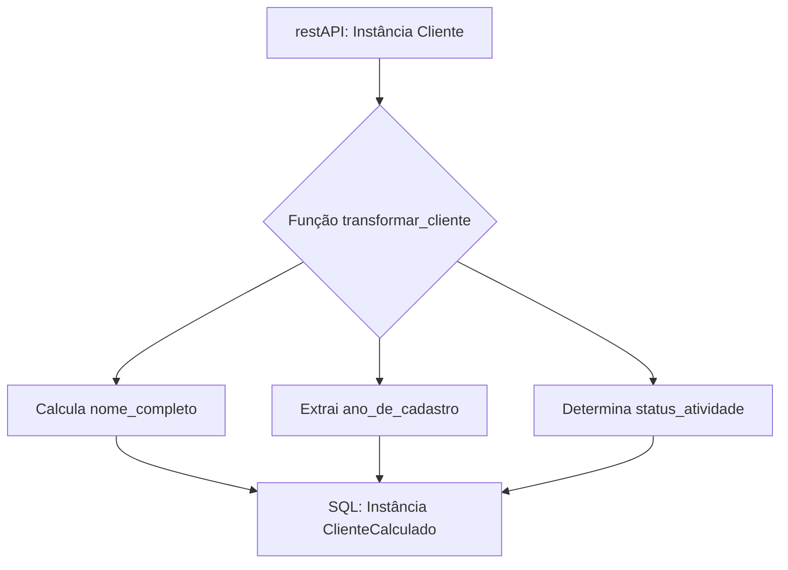
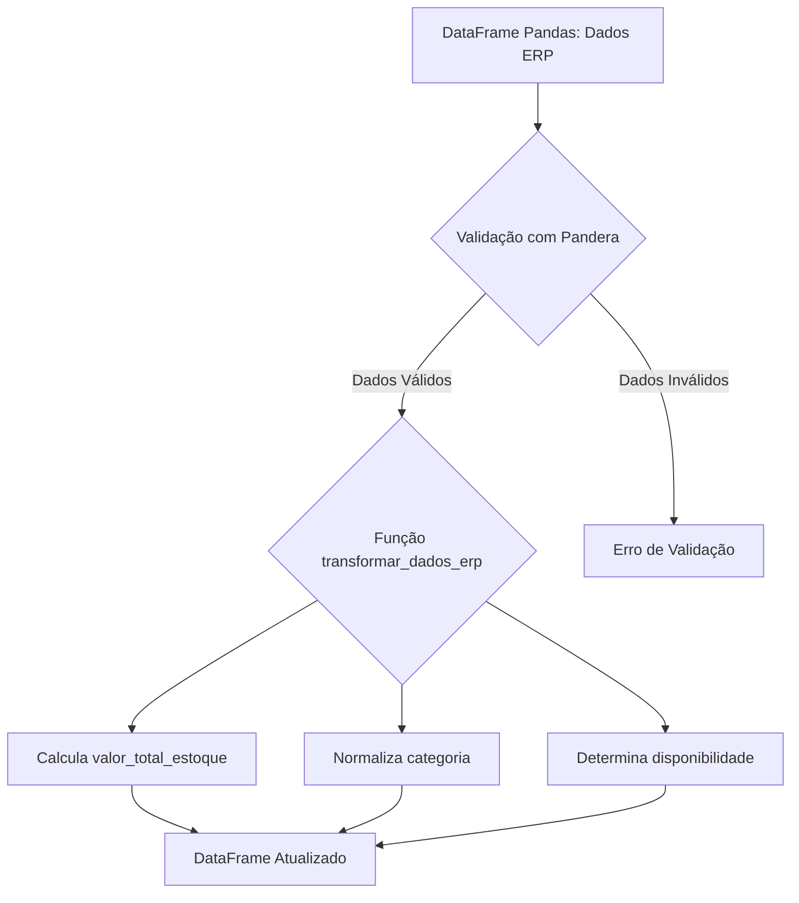

### Projeto 01: Sistema de CRM com Pydantic

### Workflow

### Explicação do Fluxo

* **A**: O processo começa com uma instância da classe `Cliente`, contendo os dados básicos do cliente.
* **B**: Esta instância é então passada para a função `transformar_cliente`, que é responsável por realizar as transformações necessárias.
    * **C**: Dentro da função, o `nome_completo` é calculado concatenando o `nome` e `sobrenome`.
    * **D**: O `ano_de_cadastro` é extraído da `data_de_cadastro`.
    * **E**: O `status_atividade` é determinado com base no valor de `is_ativo`.
* **F**: Com base nos valores calculados e nos dados originais do `Cliente`, é criada uma nova instância de `ClienteCalculado`, que agora inclui tanto os dados originais quanto os campos calculados (`nome_completo`, `ano_de_cadastro`, `status_atividade`).
#### Objetivo

Desenvolver um sistema de gerenciamento de clientes (CRM) utilizando Python e Pydantic, focado na modelagem de dados robusta e na transformação de instâncias de cliente com campos calculados. Este sistema deverá permitir a criação de perfis de clientes, aplicar transformações para gerar novos campos calculados e garantir a integridade dos dados através de testes unitários.

#### Requisitos do Sistema

1. **Contrato de dados**:
    
    * Criar um contrato de dados `Cliente` contendo informações essenciais dos clientes.
    * Implementar um contrato chamado `ClienteCalculado` que herda de `Cliente` e adiciona três novos campos calculados: `nome_completo`, `ano_de_cadastro` e `status_atividade`.
    * Esse contrato precisa ser capaz de receber dados de uma restAPI vinda da equipe de desenvolvimento
2. **Transformação de Dados**:
    
    * Desenvolver uma função `transformar_cliente` que recebe uma instância de `Cliente`, realiza cálculos para os campos adicionais e retorna uma instância de `ClienteCalculado` contendo todos os dados originais mais os campos calculados.
3. **Documentação com MkDocs**:
    
    * Documentar todo o processo de desenvolvimento, modelagem de dados, uso da função de transformação e execução de testes unitários utilizando MkDocs.
4. **Testes Unitários**:
    
    * Criar testes unitários para validar a correta transformação de instâncias de `Cliente` para `ClienteCalculado`, incluindo a verificação dos campos calculados.

#### Especificação das Classes

* **Classe `Cliente`**:
    * Campos: `nome`, `sobrenome`, `email`, `telefone` (opcional), `data_de_cadastro`, `categoria`, `empresa` (opcional), `endereco` (opcional), `is_ativo`, `id_cliente`.
* **Classe `ClienteCalculado`**:
    * Herda todos os campos de `Cliente`.
    * Adiciona campos calculados:
        * `nome_completo`: Concatenação de `nome` e `sobrenome`.
        * `ano_de_cadastro`: Ano extraído de `data_de_cadastro`.
        * `status_atividade`: Determinado com base em `is_ativo`, pode ser "Ativo" ou "Inativo".

#### Transformação de Dados

A função `transformar_cliente` deve realizar as seguintes operações:

* Concatenar `nome` e `sobrenome` para formar `nome_completo`.
* Extrair o ano de `data_de_cadastro` para definir `ano_de_cadastro`.
* Definir `status_atividade` com base no valor de `is_ativo`.

#### Documentação

Utilizar MkDocs para criar uma documentação detalhada do projeto, incluindo:

* Uma introdução ao projeto e seus objetivos.
* Descrições detalhadas das classes `Cliente` e `ClienteCalculado`.
* Um guia sobre como utilizar a função `transformar_cliente`.
* Instruções para executar os testes unitários.

#### Testes Unitários

Desenvolver testes unitários usando o framework `pytest` para:

* Testar a criação de instâncias de `Cliente` e `ClienteCalculado`.
* Verificar se a transformação de `Cliente` para `ClienteCalculado` é realizada corretamente, incluindo a validação dos campos calculados.

#### Entrega

O projeto deve ser entregue como um repositório Git contendo:

* O código-fonte do projeto.
* A configuração e documentação do MkDocs.
* Arquivos de testes unitários.
* Um `README.md` com instruções sobre como instalar, configurar e utilizar o sistema, além de como executar os testes unitários.

Este projeto visa não apenas aplicar conceitos avançados de modelagem de dados com Pydantic e Python mas também praticar a documentação de software e testes automatizados, essenciais para o desenvolvimento de software robusto e confiável.

### Desafio 02: Sistema de Gestão ERP com Pandas e Pandera

#### Workflow

### Explicação do Fluxo

* **A**: O processo inicia com um DataFrame do Pandas contendo os dados ERP, que incluem informações básicas sobre produtos como ID, nome, quantidade em estoque, preço e categoria.
* **B**: Esses dados são submetidos à validação utilizando Pandera, baseando-se em um esquema definido que especifica os tipos de dados esperados e regras de validação para cada campo.
    * **X**: Se os dados não passarem na validação, um erro é gerado, indicando os problemas encontrados.
* **C**: Dados que passam pela validação são encaminhados para a função `transformar_dados_erp`, onde ocorrem as transformações.
    * **D**: Dentro da função, o `valor_total_estoque` é calculado para cada produto como o produto da quantidade em estoque pelo preço.
    * **E**: A `categoria` de cada produto é normalizada para um formato padronizado em maiúsculas.
    * **F**: A `disponibilidade` de cada produto é determinada com base na quantidade em estoque, indicando se o produto está disponível.
* **G**: O resultado é um DataFrame atualizado que inclui tanto os dados originais quanto os novos campos calculados (`valor_total_estoque`, `categoria_normalizada`, `disponibilidade`).

#### Objetivo

Desenvolver um sistema de gestão de recursos empresariais (ERP) utilizando Python, Pandas para manipulação de dados e Pandera para validação de contratos de dados. Este sistema será focado na transformação de dados de produtos e vendas em um DataFrame do Pandas, enriquecendo os dados com novos campos calculados e assegurando sua integridade através de validações estritas.

#### Requisitos do Sistema

1. **Modelagem de Dados com Pandas**:
    
    * Utilizar DataFrame do Pandas para representar os dados de uma tabela de ERP.
    * Os dados devem incluir informações básicas sobre produtos, como ID do produto, nome, quantidade em estoque, preço e categoria.
2. **Validação de Dados com Pandera**:
    
    * Definir esquemas de validação utilizando Pandera para garantir a correta estrutura e tipo dos dados no DataFrame.
    * Os esquemas devem validar campos como ID do produto (inteiro), nome (string), quantidade (inteiro), preço (float) e categoria (string).
3. **Transformação de Dados**:
    
    * Desenvolver uma função `transformar_dados_erp` que recebe um DataFrame de produtos, realiza cálculos para adicionar três novos campos calculados: `valor_total_estoque`, `categoria_normalizada` e `disponibilidade`.
    * `valor_total_estoque` deve ser calculado como o produto da quantidade em estoque pelo preço.
    * `categoria_normalizada` deve converter a categoria para um formato padronizado em maiúsculas.
    * `disponibilidade` deve ser um campo booleano indicando se o produto está disponível (quantidade em estoque maior que 0).
4. **Documentação com MkDocs**:
    
    * Documentar todo o processo de desenvolvimento, incluindo a modelagem de dados, a função de transformação, e o uso de Pandera para validação, utilizando MkDocs.
5. **Testes Unitários**:
    
    * Criar testes unitários para validar tanto a correta transformação de dados no DataFrame quanto a validação de esquemas com Pandera.

#### Especificação dos Dados

* **Dados ERP**:
    * Campos: `id_produto` (int), `nome` (str), `quantidade` (int), `preço` (float), `categoria` (str).

#### Transformação de Dados

A função `transformar_dados_erp` deve realizar as seguintes operações no DataFrame:

* Calcular `valor_total_estoque` multiplicando `quantidade` por `preço`.
* Normalizar `categoria` para maiúsculas, gerando `categoria_normalizada`.
* Determinar `disponibilidade` com base na `quantidade` em estoque.

#### Documentação

Utilizar MkDocs para criar uma documentação detalhada do projeto, incluindo:

* Uma introdução ao projeto e seus objetivos.
* Descrição do processo de modelagem de dados com Pandas.
* Detalhes sobre a validação de dados com Pandera.
* Um guia sobre como realizar a transformação de dados.
* Instruções para executar os testes unitários.

#### Testes Unitários

Desenvolver testes unitários usando o framework `pytest` para:

* Validar a estrutura e tipos de dados do DataFrame com Pandera.
* Testar a função `transformar_dados_erp` garantindo que os campos calculados sejam adicionados corretamente.

#### Entrega

O projeto deve ser entregue como um repositório Git contendo:

* O código-fonte do projeto.
* A configuração e documentação do MkDocs.
* Arquivos de testes unitários.
* Um `README.md` com instruções sobre como instalar, configurar e utilizar o sistema, além de como executar os testes unitários.

Este projeto visa aplicar conceitos de manipulação e validação avançadas de dados com Pandas e Pandera, respectivamente, além de enfatizar a importância da documentação e testes automatizados no desenvolvimento de sistemas robustos e confiáveis para gestão empresarial.
