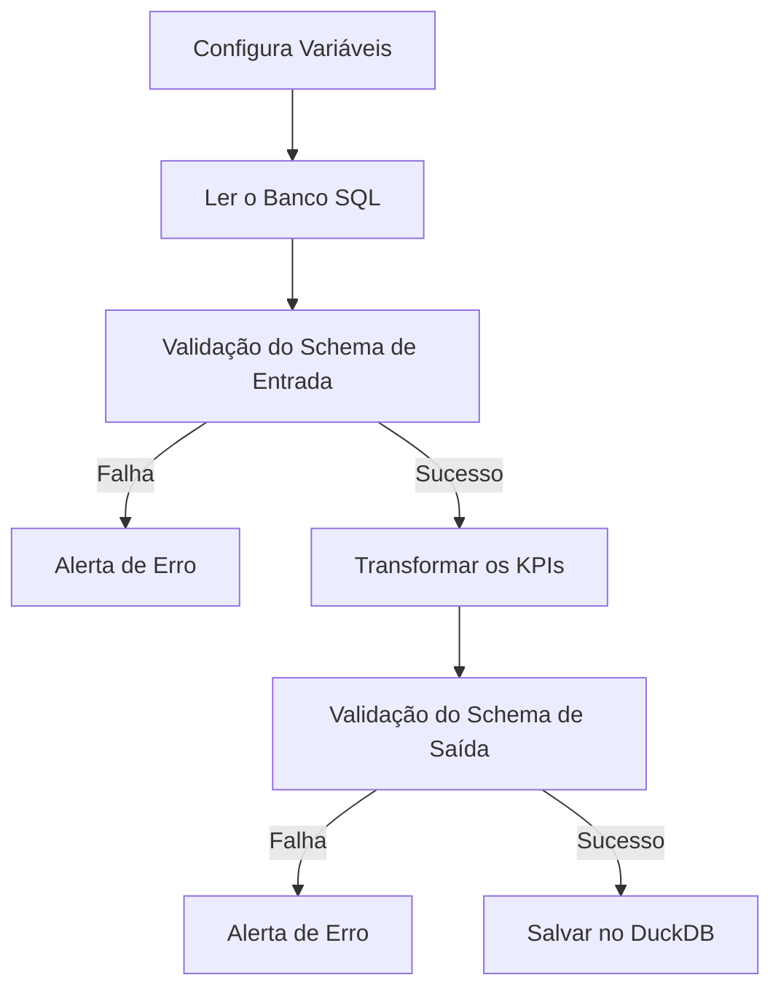

# Workshop 02 - Data Quality

Para desenvolver o desafio de negocio, vamos montar a seguinte ETL

## Fluxo

# Contrato de dados

::: app.schema.ProdutoSchema

# Transformacoes

## Configura Variáveis

::: app.etl.load_settings

## Ler o Banco SQL
::: app.etl.extrair_do_sql

## Transformar os KPIs

::: app.etl.transformar

## Salvar no DuckDB
S
::: app.etl.load_to_duckdb
