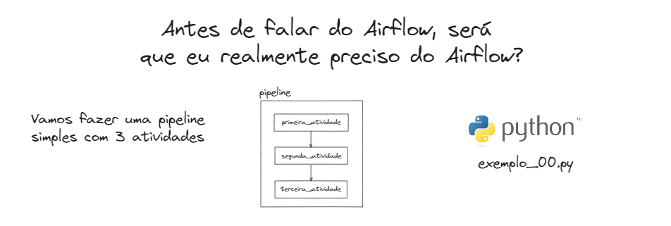
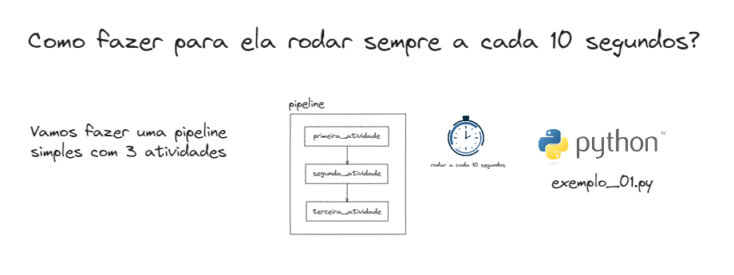
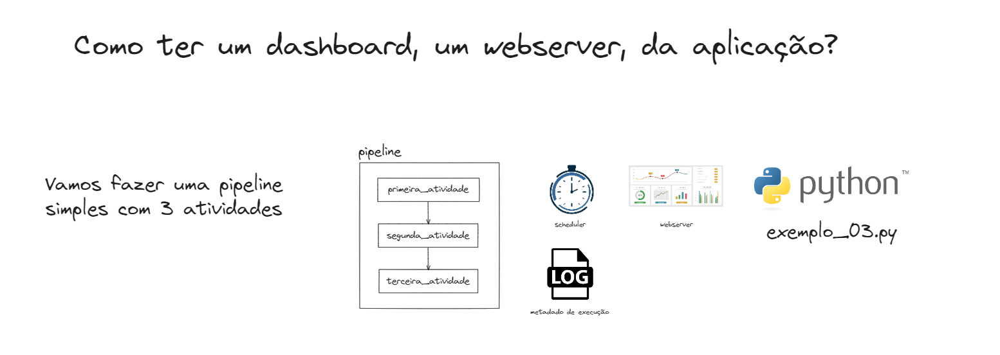
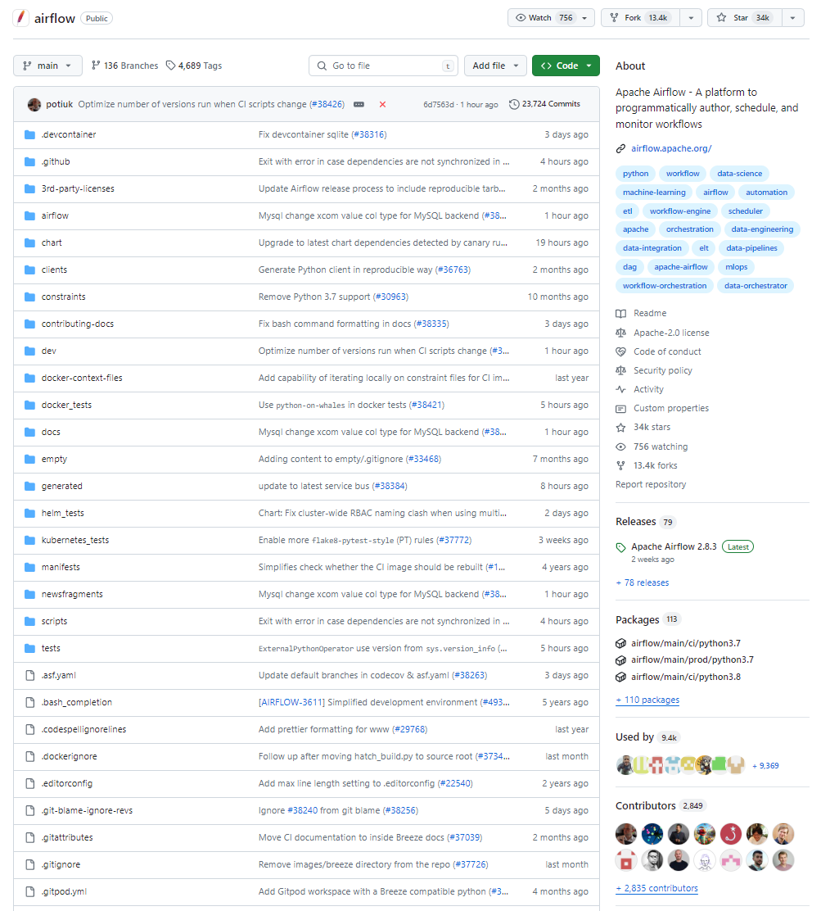
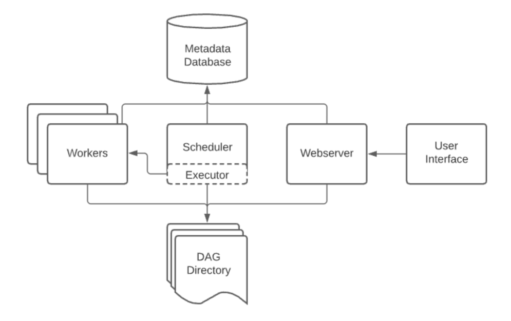
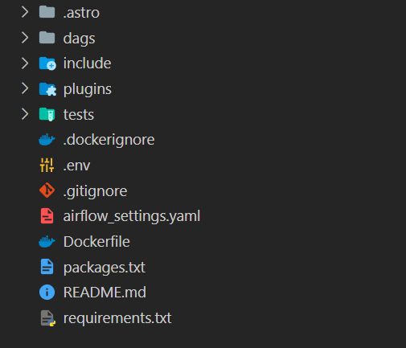

# Orquestração de ETLs

## Eu realmente preciso do Airflow?

Vamos pensar em uma pipeline inicial, onde possui 3 atividades e uma pipeline que encadeia ela.



exemplo_00.py
```python
from time import sleep

def primeira_atividade():
    print("Primeira atividade iniciada")
    sleep(1)
    print("Primeira atividade finalizada")

def segunda_atividade():
    print("Segunda atividade iniciada")
    sleep(1)
    print("Segunda atividade finalizada")

def terceira_atividade():
    print("Terceira atividade iniciada")
    sleep(1)
    print("Terceira atividade finalizada")

def pipeline():
    primeira_atividade()
    segunda_atividade()
    terceira_atividade()
    print("Pipeline finalizada")

if __name__ == "__main__":
    pipeline()
```

Qual o problema de realizar uma ETL desse jeito?



Como programar ela a cada 10 segundos?

exemplo_01.py
```python
from time import sleep

def primeira_atividade():
    print("Primeira atividade iniciada")
    sleep(1)
    print("Primeira atividade finalizada")

def segunda_atividade():
    print("Segunda atividade iniciada")
    sleep(1)
    print("Segunda atividade finalizada")

def terceira_atividade():
    print("Terceira atividade iniciada")
    sleep(1)
    print("Terceira atividade finalizada")

def pipeline():
    primeira_atividade()
    segunda_atividade()
    terceira_atividade()
    print("Pipeline finalizada")

if __name__ == "__main__":
    while True:
        pipeline()
        sleep(10)
```

Qual o problema de realizar uma ETL desse jeito?


Como ter o log a auditoria do que foi feito?

```python
from time import sleep

from loguru import logger

logger.add("execution_logs.log", format="{time} - {message}", level="INFO", rotation="1 day")

def primeira_atividade():
    logger.info("Primeira atividade iniciada")
    sleep(1)
    logger.info("Primeira atividade finalizada")

def segunda_atividade():
    logger.info("Segunda atividade iniciada")
    sleep(1)
    logger.info("Segunda atividade finalizada")

def terceira_atividade():
    logger.info("Terceira atividade iniciada")
    sleep(1)
    logger.info("Terceira atividade finalizada")

def pipeline():
    primeira_atividade()
    segunda_atividade()
    terceira_atividade()
    logger.info("Pipeline finalizada")

if __name__ == "__main__":
    while True:
        pipeline()
        sleep(10)
```

Qual o problema de realizar uma ETL desse jeito?



Como ter um webserver (dashboard) para ver o que foi feito?

(...)

## Vocês entenderam onde eu quero chegar

Gastei 10% do tempo gerando valor e 90% do tempo reinventando a roda

## Airflow Overview



O Apache Airflow é uma plataforma projetada para criar, agendar e monitorar fluxos de trabalho de forma programática.

Quando os fluxos de trabalho são definidos como código, eles se tornam mais fáceis de manter, versionar, testar e colaborar.

Utilize o Airflow para compor fluxos de trabalho como grafos acíclicos dirigidos (DAGs) de tarefas. O agendador do Airflow executa suas tarefas em uma série de workers respeitando as dependências definidas. Ferramentas de linha de comando abrangentes facilitam a realização de operações complexas nos DAGs. A interface de usuário intuitiva permite visualizar facilmente os pipelines em execução, monitorar o progresso e resolver problemas quando necessário.

O Airflow é especialmente útil em contextos de engenharia de dados e ciência de dados, pois permite a automação e a orquestração de processos complexos de tratamento de dados, treinamento de modelos de machine learning, execução de ETLs e muito mais. Tudo isso contribui para uma gestão mais eficiente do ciclo de vida dos dados e dos modelos preditivos.

## User Interface

- **DAGs**: Visão deral do seu ambiente.

  

- **Grid**: Visão de todas as execuções de um DAG.

  

- **Graph**: Visão de todas as tarefas de um DAG e suas dependências.

  

- **Task Duration**: Tempo de execução de cada tarefa de um DAG.

  

- **Gantt**: Duração de cada execução de um DAG.

  

- **Code**: Código de cada DAG.

  

## Quick Start

Vamos fazer o nosso primeiro projeto com Airflow, vamos refatorar o nosso código acima.

Porém, precisamos criar toda nossa infraestrutura do Airflow.

[](https://docs.astronomer.io/learn/airflow-components)

Como subir toda essa infra?

Para isso vamos conhecer o Astro CLI

## Criando um projeto Astro

Em um diretório vazio, rode o seguinte comando:

```bash
astro dev init
```

Esse comando vai gerar os seguintes arquivos no seu diretório:



```graphql
.
├── .env                        # Variáveis de ambiente locais
├── dags                        # Onde suas DAGs ficam
│   ├── example-dag-basic.py    # DAG de exemplo que mostra uma simples pipeline de dados ETL
│   └── example-dag-advanced.py # DAG de exemplo que mostra recursos mais avançados do Airflow, como a API TaskFlow
├── Dockerfile                  # Para a imagem Docker do Astro Runtime, variáveis de ambiente e sobrescritas
├── include                     # Para quaisquer outros arquivos que você gostaria de incluir
├── plugins                     # Para quaisquer plugins personalizados ou da comunidade do Airflow
│   └── example-plugin.py
├── tests                       # Para quaisquer arquivos de teste de unidade das DAGs a serem executados com pytest
│   └── test_dag_example.py     # Teste que verifica erros básicos em suas DAGs
├── airflow_settings.yaml       # Para suas conexões do Airflow, variáveis e pools (localmente)
├── packages.txt                # Para pacotes a nível do sistema operacional
└── requirements.txt            # Para pacotes Python
```

### DAGs

[Documentação](https://airflow.apache.org/docs/apache-airflow/stable/core-concepts/dags.html)


Uma DAG (Directed Acyclic Graph ou Grafo Acíclico Direcionado) é o conceito central do Airflow, reunindo Tarefas, organizadas com dependências e relações para dizer como elas devem ser executadas.


Ela define quatro Tarefas - A, B, C e D - e dita a ordem na qual devem ser executadas, e quais tarefas dependem de quais outras. Também determina com que frequência a DAG deve ser executada - talvez "a cada 5 minutos a partir de amanhã", ou "todos os dias desde 1º de janeiro de 2020".

A própria DAG não se preocupa com o que está acontecendo dentro das tarefas; ela está meramente preocupada em como executá-las - a ordem de execução, quantas vezes tentar novamente em caso de falha, se elas têm tempos de espera, e assim por diante.

Declarando uma DAG Existem três maneiras de declarar uma DAG - você pode usar um gerenciador de contexto, que adicionará a DAG a qualquer coisa dentro dele implicitamente:

```python
import datetime

from airflow import DAG
from airflow.operators.empty import EmptyOperator

with DAG(
    dag_id="meu_nome_de_dag",
    start_date=datetime.datetime(2021, 1, 1),
    schedule="@daily",
    catchup=False
):
    EmptyOperator(task_id="tarefa")
```

Ou, você pode usar um construtor padrão, passando a DAG para qualquer operador que você usar:

```python
import datetime

from airflow import DAG
from airflow.operators.empty import EmptyOperator

minha_dag = DAG(
    dag_id="meu_nome_de_dag",
    start_date=datetime.datetime(2024, 3, 23),
    schedule="@daily",
    catchup=False,  # Adiciona esta linha
)
EmptyOperator(task_id="tarefa", dag=minha_dag)
```

Ou, você pode usar o decorador `@dag` para transformar uma função em um gerador de DAG:

```python
import datetime

from airflow.decorators import dag
from airflow.operators.empty import EmptyOperator

@dag(start_date=datetime.datetime(2024, 3, 23), schedule="@daily", catchup=False)
def gerar_dag():
    EmptyOperator(task_id="tarefa")

gerar_dag()
```

DAGs não são nada sem Tasks para rodar, e essas sempre vão vir em forma de Operadores, Sensores ou Taskflows.

### Dependências de Tasks

Uma Task/Operador normalmente não vive sozinha, ela depende de outras tasks (aquelas que suas que são seu upstream), e outras tasks dependem dela (aquelas que são seu downstream). Declaram essas dependencias entre elas é o que cria uma estrutura de DAG (as edges/linhas dos directed acyclic graph)

Existem duas maneiras principais de declarar suas dependências, os operadores `>>` e `<<`

```python
first_task >> [second_task, third_task]
third_task << fourth_task
```

Você também pode declarar de uma maneira mais explicita com os métodos `set_upstream` e `set_downstream`

```python
first_task.set_downstream([second_task, third_task])
third_task.set_upstream(fourth_task)
```

Também existem alguns atalhos para declarar DAGs mais compelxas. Se você quer que duas lista de duas TASKS dependam todas de uma da outra, você pode usar o `cross_downstream`:

```python
from airflow.models.baseoperator import cross_downstream

# Replaces
# [op1, op2] >> op3
# [op1, op2] >> op4
cross_downstream([op1, op2], [op3, op4])
```

E se você quer que uma série de tasks tenham depedências entre sí, você pode usar uma `chain`:

```python
from airflow.models.baseoperator import chain

# Replaces op1 >> op2 >> op3 >> op4
chain(op1, op2, op3, op4)

# Replaces
# op1 >> op2 >> op4 >> op6
# op1 >> op3 >> op5 >> op6
chain(op1, [op2, op3], [op4, op5], op6)
```

### Carregando DAGs

Airflow carrega as DAGs dos seus arquivos Python, declarados dentro do seu `DAG_FOLDER`. Que irá pegar cada arquivo, executar, e carregar dentro de um objeto do tipo DAG.

### Rodando as DAGs

As DAGs vão rodar sempre de duas maneiras:

- Quando você são `triggered` seja de forma manual ou via uma API

- Definida via `schedule`, que é parte integrante de uma DAG

Você pode declarar seu schedule via argumento, exatamente assim:

O Airflow utiliza uma notação semelhante à dos cron jobs para definir os intervalos de agendamento das DAGs. Aqui estão alguns exemplos dos valores possíveis para o parâmetro schedule:

@once - Executa a DAG apenas uma vez, no momento da sua criação.
"* * * * *" - Executa a DAG a cada minuto
@hourly - Executa a DAG a cada hora.
@daily - Executa a DAG uma vez por dia.
@weekly - Executa a DAG uma vez por semana.
@monthly - Executa a DAG uma vez por mês.
@yearly - Executa a DAG uma vez por ano.
None - Se você não quer que a DAG seja agendada, mas apenas acionada manualmente, você pode usar None.
Notação cron (e.g., "0 0 * * *" para meia-noite diária, "*/10 * * * *" para a cada 10 minutos) - Permite especificar intervalos de agendamento personalizados utilizando a sintaxe cron.

### Nossa primeira ETL com Python

### Fazendo o Nosso Deploy

### Refatorando um Projeto seguindo MVC

