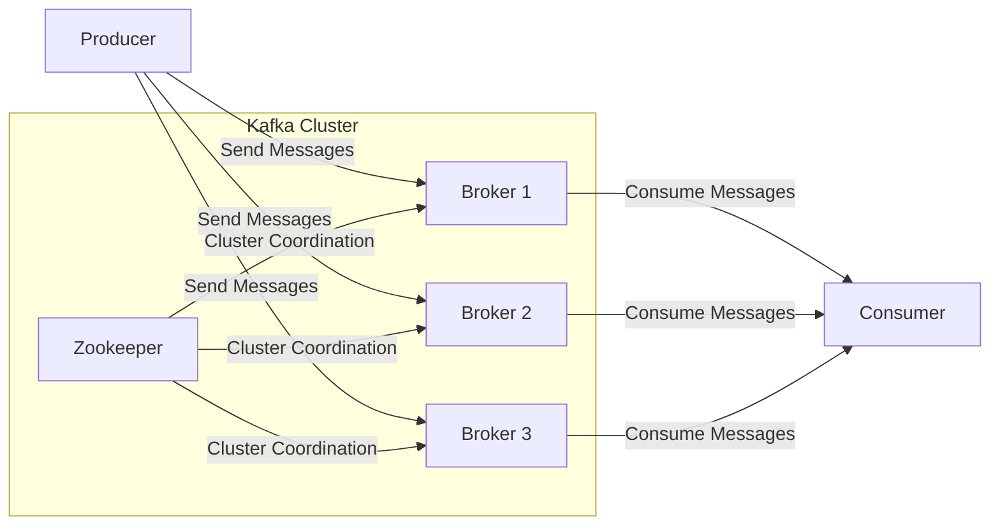
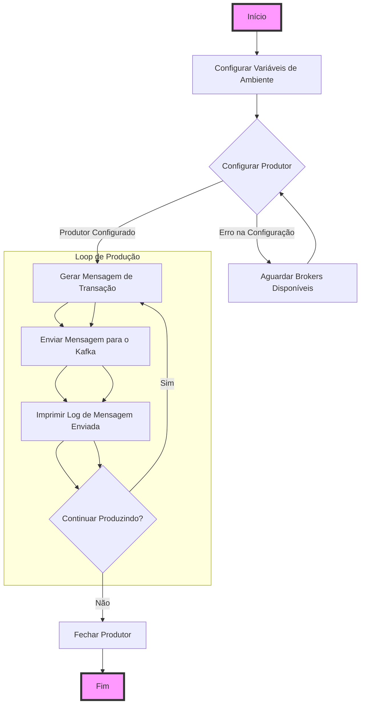
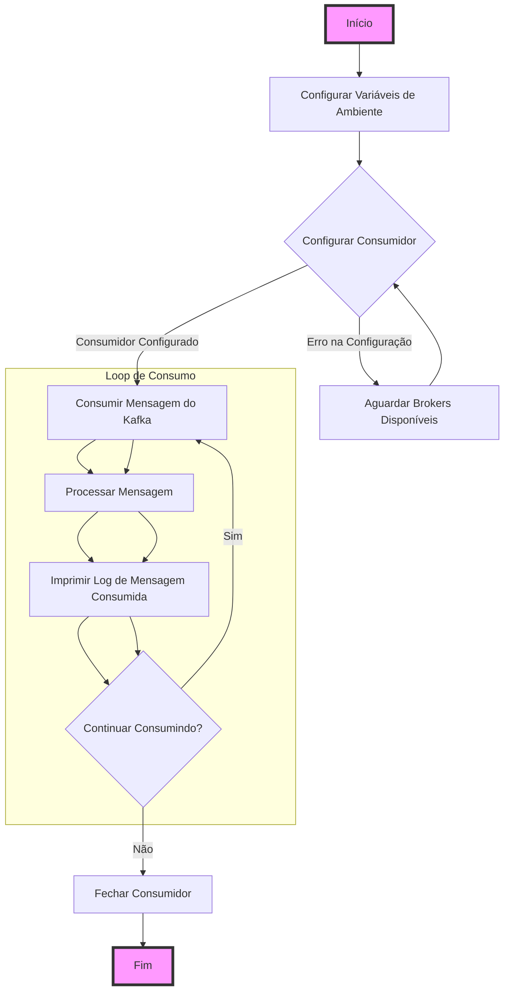

# kafka-workshop

# Projeto de Monitoramento de Transações Financeiras em Tempo Real com Apache Kafka

Bem-vindo ao projeto de monitoramento de transações financeiras em tempo real com Apache Kafka! Este projeto faz parte de um workshop prático exclusivo para os alunos da **Escola Jornada de Dados**.

## Sobre o Workshop

* **Data:** Sábado, 13 de julho
* **Horário:** 9:00 da manhã
* **Duração:** 4 horas
* **Público:** Exclusivo para alunos da Jornada de Dados

### Overview Kafka

Kafka-demo

Kafka-Topics-Partitions

Kafka-Brokers-Replications

Kafka-partitions

Kafka-producers

Kafka-connect

Schema-Registry


### Descrição do Workshop

O projeto se foca no monitoramento de transações financeiras em tempo real usando Apache Kafka. Neste cenário, o Producer gera transações simuladas utilizando a biblioteca Faker e as envia para um tópico Kafka. O Consumer então consome essas mensagens para análise ou processamento adicional.

### Arquitetura do Projeto



### Explicação do Diagrama

1. **Producer**:
    * Gera e envia mensagens simuladas de transações financeiras para os brokers do cluster Kafka.

2. **Kafka Cluster**:
    * **Zookeeper**: Coordena e gerencia o estado do cluster Kafka, colocado acima dos brokers.
    * **Brokers (Broker 1, Broker 2, Broker 3)**: Servidores Kafka que armazenam e gerenciam os dados. Eles recebem mensagens do producer e as encaminham para o consumer.

3. **Consumer**:
    * Consome e processa mensagens dos brokers do cluster Kafka.

### Fluxo de Dados

* **Producer** envia mensagens para os **Brokers**.
* **Brokers** armazenam as mensagens e se comunicam com o **Zookeeper** para coordenação.
* **Consumer** consome mensagens dos **Brokers**.

Este diagrama organizado da esquerda para a direita e com o Zookeeper acima dos brokers dentro do Kafka Cluster ilustra claramente o fluxo de dados e a coordenação dentro do sistema.

### Explicação dos Arquivos e Arquitetura do Projeto

#### Arquitetura do Projeto

O projeto é uma aplicação distribuída baseada em Apache Kafka, onde múltiplos componentes interagem para processar dados de transações financeiras em tempo real. A arquitetura do projeto consiste em:

1. **Zookeeper**: Gerencia e coordena os brokers do Kafka.
2. **Kafka Brokers**: Recebem, armazenam e distribuem mensagens (transações) entre produtores e consumidores.
3. **Kafka UI**: Interface gráfica para gerenciar e monitorar os tópicos e mensagens do Kafka.
4. **Producer**: Gera e envia mensagens simuladas (transações) para um tópico Kafka.
5. **Consumer**: Consome e processa as mensagens das transações enviadas pelo Producer.

#### Arquivos do Projeto

1. **docker-compose.yml**:
    - Define e configura todos os serviços necessários para a aplicação, incluindo Zookeeper, Kafka Brokers, Kafka UI, Producer e Consumer.
    - Configura redes, variáveis de ambiente, portas, dependências e políticas de reinício para cada serviço.

2. **Dockerfile**:
    - Utilizado para construir as imagens Docker do Producer e Consumer.
    - Especifica a base da imagem, instala dependências (`kafka-python` e `Faker`) e define o comando de inicialização.

3. **produce.py**:
    - Script Python para gerar e enviar mensagens simuladas de transações financeiras para o Kafka.
    - Utiliza a biblioteca `Faker` para criar dados fictícios e `kafka-python` para enviar essas mensagens para o tópico Kafka especificado.

4. **consume.py**:
    - Script Python para consumir e processar mensagens das transações financeiras do Kafka.
    - Utiliza `kafka-python` para se conectar ao Kafka e consumir mensagens do tópico especificado.

5. **run.sh**:
    - Script shell utilizado para iniciar o Producer ou Consumer baseado na variável de ambiente `ACTION`.
    - Verifica a variável de ambiente e executa o script Python correspondente (`produce.py` ou `consume.py`).

### O que Cada Docker Faz

1. **Zookeeper**:
    - Container que executa o Zookeeper, responsável por coordenar e gerenciar o estado dos brokers do Kafka.
    - Configurado para reiniciar automaticamente, se necessário.

2. **Kafka UI**:
    - Container que executa a interface gráfica do Kafka UI para monitorar e gerenciar os tópicos e mensagens.
    - Depende dos brokers Kafka e permite uma visualização fácil do estado do cluster Kafka.

3. **broker-1**, **broker-2**, **broker-3**:
    - Contêineres que executam os brokers do Kafka, responsáveis por armazenar e distribuir as mensagens entre produtores e consumidores.
    - Configurados para reiniciar automaticamente e conectados ao Zookeeper para coordenação.
    - Cada broker é identificado por um ID único e escuta em portas específicas.

4. **Producer**:
    - Container que executa o script `produce.py` para gerar e enviar mensagens simuladas de transações financeiras para o Kafka.
    - Configurado para reiniciar automaticamente e depende dos brokers Kafka para garantir que as mensagens sejam enviadas corretamente.

5. **Consumer**:
    - Container que executa o script `consume.py` para consumir e processar mensagens de transações financeiras do Kafka.
    - Configurado para reiniciar automaticamente e depende dos brokers Kafka e do Producer para garantir que as mensagens sejam consumidas corretamente.

### Conclusão

Para iniciar o projeto, siga os passos abaixo:

1. **Construir e Iniciar os Contêineres**:
    - Navegue até o diretório onde está localizado o arquivo `docker-compose.yml` e execute:
      ```sh
      docker-compose up --build
      ```

2. **Verificar a Interface do Kafka UI**:
    - Acesse a interface do Kafka UI em [http://localhost:8087](http://localhost:8087) para visualizar e gerenciar os tópicos e mensagens.

Com essa configuração, você terá um ambiente completo de Apache Kafka em execução com múltiplos brokers, um Zookeeper para coordenação, uma interface gráfica para gerenciamento e scripts Python para produção e consumo de mensagens de transações financeiras em tempo real.

### Iniciar o Projeto

#### Kafka in Docker

### Quick Start

1. **Inicializar a Stack**:

   Para inicializar todos os serviços definidos no `docker-compose.yml`, execute o comando abaixo no diretório onde o arquivo está localizado:

   ```sh
   docker-compose up --build -d
   ```

2. **Verificar os Logs do Producer**:

   Para acompanhar os logs do container do Producer e verificar se ele está enviando mensagens corretamente, execute o comando abaixo:

   ```sh
   docker logs -f producer
   ```

3. **Verificar os Logs do Consumer**:

   Para acompanhar os logs do container do Consumer e verificar se ele está consumindo mensagens corretamente, execute o comando abaixo:

   ```sh
   docker logs -f consumer
   ```

### Resumo

Este guia rápido permite que você inicialize todos os componentes necessários do projeto (Zookeeper, Kafka Brokers, Kafka UI, Producer e Consumer) usando Docker. O Kafka UI oferece uma interface gráfica para monitorar e gerenciar os tópicos e mensagens do Kafka, enquanto os logs do Producer e Consumer permitem verificar se as mensagens estão sendo produzidas e consumidas corretamente.

#### Produce

### Esquemático do Arquivo `produce.py`



### Explicação do Esquemático

1. **Início**:
   - O processo inicia.

2. **Configurar Variáveis de Ambiente**:
   - As variáveis de ambiente são configuradas (`TOPIC` e `BOOTSTRAP_SERVERS`).

3. **Configurar Produtor**:
   - O produtor Kafka é configurado para se conectar aos servidores bootstrap especificados.
   - Se a configuração falhar (por exemplo, se os brokers não estiverem disponíveis), o sistema aguarda um tempo e tenta novamente.

4. **Loop de Produção**:
   - **Gerar Mensagem de Transação**: Uma mensagem de transação é gerada utilizando dados simulados da biblioteca `Faker`.
   - **Enviar Mensagem para o Kafka**: A mensagem gerada é enviada para o tópico Kafka especificado.
   - **Imprimir Log de Mensagem Enviada**: Um log é impresso indicando que a mensagem foi enviada com sucesso.
   - **Continuar Produzindo?**: O sistema verifica se deve continuar produzindo mensagens. Se sim, o loop continua gerando e enviando mensagens. Caso contrário, o produtor é fechado.

5. **Fechar Produtor**:
   - O produtor Kafka é fechado adequadamente.

6. **Fim**:
   - O processo termina.

#### Consume



### Explicação do Esquemático

1. **Início**:
    
    * O processo inicia.
2. **Configurar Variáveis de Ambiente**:
    
    * As variáveis de ambiente são configuradas (`TOPIC`, `CONSUMER_GROUP` e `BOOTSTRAP_SERVERS`).
3. **Configurar Consumidor**:
    
    * O consumidor Kafka é configurado para se conectar aos servidores bootstrap especificados.
    * Se a configuração falhar (por exemplo, se os brokers não estiverem disponíveis), o sistema aguarda um tempo e tenta novamente.
4. **Loop de Consumo**:
    
    * **Consumir Mensagem do Kafka**: O consumidor busca uma mensagem no tópico Kafka especificado.
    * **Processar Mensagem**: A mensagem consumida é processada.
    * **Imprimir Log de Mensagem Consumida**: Um log é impresso indicando que a mensagem foi consumida com sucesso.
    * **Continuar Consumindo?**: O sistema verifica se deve continuar consumindo mensagens. Se sim, o loop continua consumindo e processando mensagens. Caso contrário, o consumidor é fechado.
5. **Fechar Consumidor**:
    
    * O consumidor Kafka é fechado adequadamente.
6. **Fim**:
    
    * O processo termina.
