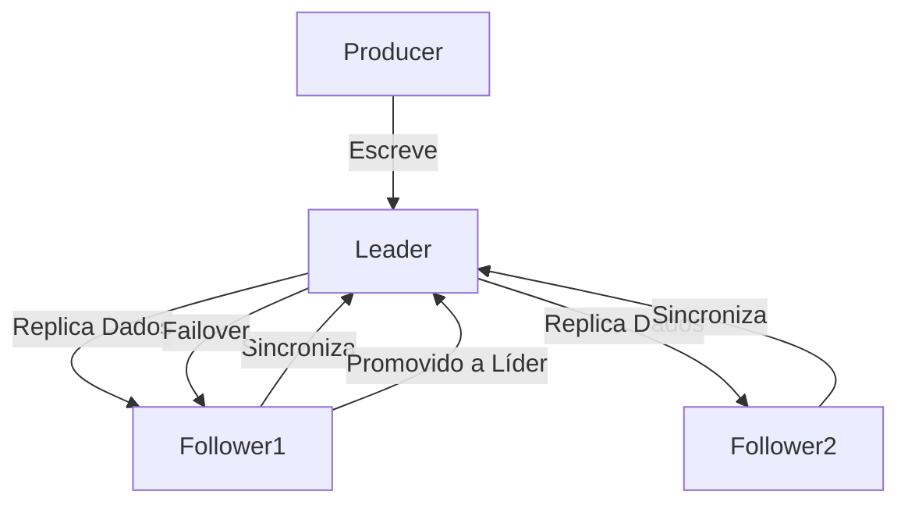
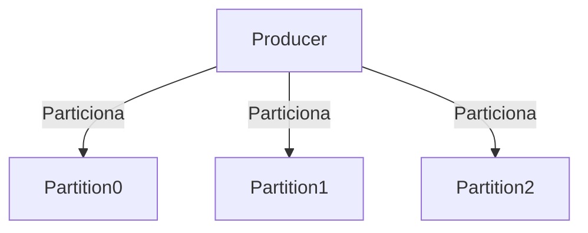
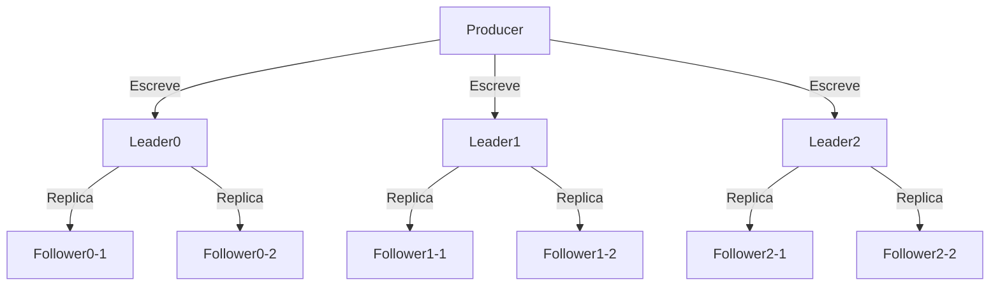

## Resumo: Kafka Brokers e Replicação

### Kafka Brokers

**Conceito Básico:**
- Kafka é um sistema distribuído composto por várias máquinas chamadas brokers.
- Cada broker hospeda um conjunto de partições do Kafka e lida com solicitações de leitura e escrita de eventos.

**Infraestrutura Física:**
- Os brokers podem ser servidores físicos, instâncias de nuvem, contêineres em pods, ou servidores virtualizados.
- Independentemente da forma de implementação, cada broker executa o processo do Kafka broker.

**Funções dos Brokers:**
- Cada broker gerencia algumas partições do Kafka, aceitando eventos novos para essas partições ou lendo eventos delas.
- Brokers também gerenciam a replicação de partições entre si.

**Simplicidade:**
- Brokers são projetados para serem simples, garantindo que eles sejam facilmente escaláveis, compreensíveis, modificáveis e extensíveis.

### Kafka Replication

**Necessidade de Replicação:**
- Armazenar cada partição em um único broker seria arriscado devido à suscetibilidade a falhas dos brokers e seus sistemas de armazenamento.
- Portanto, os dados das partições são copiados para vários brokers para garantir a segurança dos dados.

**Tipos de Réplicas:**
- **Líder**: A principal réplica da partição.
- **Seguidoras**: Réplicas adicionais que seguem a líder.

**Processo de Replicação:**
- Cada partição replicada tem uma réplica líder e várias seguidoras.
- Escrita e leitura de dados são feitas principalmente na réplica líder.
- Após a escrita na líder, a líder e as seguidoras trabalham juntas para replicar os dados.

### Introdução

A replicação é um aspecto crucial do Apache Kafka que garante a durabilidade e disponibilidade dos dados. Neste exercício, vamos entender como a replicação funciona e por que ela é essencial para um sistema de mensageria distribuído como o Kafka.

### Conceitos Básicos

- **Partition**: Uma partição é uma unidade de paralelismo em Kafka. Cada tópico pode ter várias partições.
- **Leader Replica**: A réplica líder é a partição principal onde todas as gravações ocorrem.
- **Follower Replicas**: As réplicas seguidoras são cópias da partição que residem em outros brokers para garantir a durabilidade e a disponibilidade dos dados.

### Funcionamento da Replicação

1. **Escrita no Leader**:
   - Quando os dados são produzidos para uma partição, eles são inicialmente escritos na réplica líder.

2. **Sincronização com Followers**:
   - Após a escrita, a réplica líder replica os dados para as réplicas seguidoras. Este processo garante que todas as réplicas tenham os mesmos dados.

3. **Falha e Recuperação**:
   - Se um broker que hospeda a réplica líder falhar, uma das réplicas seguidoras é promovida a líder. Isso garante a continuidade das operações sem perda de dados.

### Diagrama de Replicação



### Passos para Configurar e Verificar a Replicação

#### 1. Criar um Tópico com Réplicas
Para criar um tópico com múltiplas réplicas, use o comando:

```bash
confluent kafka topic create temperatura --partitions 3 --config min.insync.replicas=2 --config replication.factor=2
```

#### 2. Produzir Dados para o Tópico
Produza mensagens para o tópico `temperatura` com valores aleatórios entre 35 e 40:

```bash
echo "1:$(shuf -i 35-40 -n 1)" | confluent kafka topic produce temperatura
echo "2:$(shuf -i 35-40 -n 1)" | confluent kafka topic produce temperatura
echo "3:$(shuf -i 35-40 -n 1)" | confluent kafka topic produce temperatura
```

#### 3. Verificar a Replicação
Para verificar a replicação, use o comando `describe` no tópico:

```bash
confluent kafka topic describe temperatura
```

Isso mostrará informações sobre as partições e suas réplicas.

### Número Ideal de Réplicas no Kafka

Determinar o número ideal de réplicas para suas partições no Kafka é uma decisão que envolve considerar trade-offs entre durabilidade, disponibilidade e custo. Aqui estão algumas diretrizes gerais e como calcular a quantidade adequada de réplicas:

### Diretrizes Gerais

1. **Durabilidade e Alta Disponibilidade**:
   - Mais réplicas aumentam a durabilidade e a disponibilidade dos dados.
   - Em um cenário comum, ter 2 réplicas (um líder e um seguidor) pode ser suficiente para muitas aplicações, pois garante que os dados permaneçam disponíveis se um broker falhar.

2. **Custo**:
   - Cada réplica adicional aumenta o uso de armazenamento e recursos de rede, o que pode aumentar os custos operacionais.
   - Avalie o trade-off entre a necessidade de alta disponibilidade e os custos adicionais.

3. **Requisitos de Tolerância a Falhas**:
   - Se a aplicação exige uma alta tolerância a falhas (por exemplo, sistemas financeiros ou críticos), considere usar 3 réplicas ou mais.
   - Para ambientes menos críticos, 2 réplicas podem ser adequadas.

### Como Calcular o Número de Réplicas

Para calcular o número ideal de réplicas, você pode seguir estas etapas:

1. **Analisar a Criticidade dos Dados**:
   - Determine o impacto da perda temporária de acesso aos dados.
   - Quanto mais críticos os dados, mais réplicas você deve considerar.

2. **Avaliar a Infraestrutura**:
   - Considere o número de brokers no cluster. O número de réplicas não deve exceder o número de brokers.
   - Para garantir alta disponibilidade, o número de réplicas deve ser menor que o número total de brokers.

3. **Calcular o Fator de Replicação**:
   - Um fator de replicação de 2 (1 líder + 1 seguidor) é o mínimo recomendado para garantir alta disponibilidade.
   - Um fator de replicação de 3 (1 líder + 2 seguidores) oferece uma boa combinação de durabilidade e custo.

### Exemplo Prático

Vamos criar um tópico com 3 partições e 2 réplicas (1 líder e 1 seguidor) no Confluent Cloud.

#### 1. Criar um Tópico com Replicação

```bash
confluent kafka topic create temperatura --partitions 3 --config replication.factor=2
```

#### 2. Produzir Mensagens para o Tópico

Produza mensagens para o tópico `temperatura` com valores aleatórios entre 35 e 40:

```bash
for i in {1..8}; do echo "$i:$(shuf -i 35-40 -n 1)" | confluent kafka topic produce temperatura; done
```

#### 3. Verificar a Replicação

Use o comando `describe` no tópico para verificar a configuração das partições e réplicas:

```bash
confluent kafka topic describe temperatura
```

#### 4. Monitorar e Ajustar

- **Verificação na Interface Web**:
  - Navegue até a interface do Confluent Cloud e selecione seu cluster.
  - Na guia "Topics", clique no tópico `temperatura` para ver detalhes das partições e réplicas.

- **Monitoramento de Métricas**:
  - Use as ferramentas de monitoramento do Confluent Cloud para observar o comportamento do cluster, latências e disponibilidade.

### Conclusão

O número ideal de réplicas depende dos requisitos específicos de durabilidade, disponibilidade e custo da sua aplicação. Embora 2 réplicas possam ser suficientes para muitas aplicações, ambientes mais críticos podem exigir 3 réplicas ou mais. Use as diretrizes acima para tomar uma decisão informada.

### Diferença entre Partição e Replicação no Apache Kafka

### Partição (Partition)

#### Conceito
- **Definição**: Uma partição é uma unidade de paralelismo em Kafka. Cada tópico pode ter várias partições.
- **Objetivo**: Aumentar a capacidade de processamento e a paralelização das operações de leitura e escrita.
- **Distribuição**: As mensagens são distribuídas entre as partições de um tópico.
- **Ordenação**: Mensagens dentro de uma partição são ordenadas de forma estrita, mas não há garantia de ordenação entre partições diferentes do mesmo tópico.

#### Como Funciona
- Quando um produtor envia mensagens para um tópico, essas mensagens são distribuídas entre as partições.
- Cada partição é tratada de forma independente e pode ser armazenada em diferentes brokers no cluster.
- Consumidores podem ler mensagens de várias partições em paralelo, melhorando o throughput.

#### Exemplo
- Suponha um tópico `temperatura` com 3 partições:
    - Partição 0: Contém mensagens de sensor A
    - Partição 1: Contém mensagens de sensor B
    - Partição 2: Contém mensagens de sensor C



### Replicação (Replication)

#### Conceito
- **Definição**: Replicação é o processo de criar cópias de uma partição em diferentes brokers para garantir a durabilidade e a disponibilidade dos dados.
- **Objetivo**: Garantir a disponibilidade e a integridade dos dados em caso de falha de um broker.
- **Tipos de Réplicas**: 
    - **Leader Replica**: A réplica principal que recebe todas as operações de escrita e leitura.
    - **Follower Replicas**: Réplicas secundárias que mantêm uma cópia dos dados da réplica líder.

#### Como Funciona
- Quando uma mensagem é escrita em uma partição líder, essa mensagem é replicada para as partições seguidoras.
- Se o broker que hospeda a réplica líder falhar, uma das réplicas seguidoras é promovida a líder.
- Isso garante que os dados estejam disponíveis mesmo se um ou mais brokers falharem.

#### Exemplo
- Suponha um tópico `temperatura` com 3 partições e cada partição replicada em 3 brokers (1 líder e 2 seguidores).



### Comparação

| Aspecto       | Partição                          | Replicação                            |
|---------------|-----------------------------------|---------------------------------------|
| **Definição** | Unidade de paralelismo            | Cópia de dados para durabilidade      |
| **Objetivo**  | Aumentar a capacidade de processamento | Garantir disponibilidade e integridade dos dados |
| **Operação**  | Mensagens distribuídas entre partições | Mensagens replicadas entre réplicas  |
| **Falha**     | Se uma partição falhar, apenas uma parte dos dados é afetada | Se o líder falhar, um seguidor é promovido a líder |

### Conclusão

- **Partições**: São usadas para melhorar a escalabilidade e a paralelização no Kafka. Elas permitem que várias operações de leitura e escrita ocorram simultaneamente, aumentando o throughput.
- **Replicação**: Garante a alta disponibilidade e a durabilidade dos dados, criando cópias das partições em múltiplos brokers. Isso assegura que os dados estejam sempre acessíveis, mesmo em caso de falha de um broker.

Compreender a diferença entre partições e replicação é crucial para projetar sistemas Kafka escaláveis e resilientes. Se precisar de mais detalhes ou ajuda, estou à disposição!