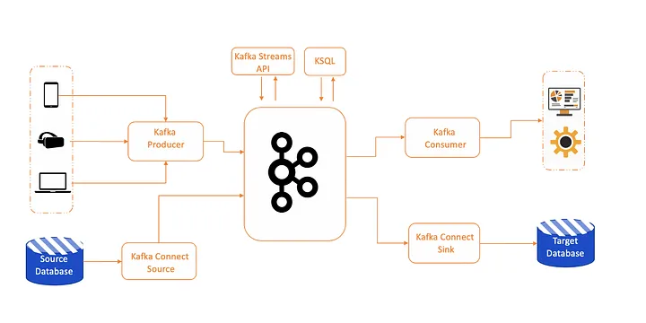

Aqui está um README melhorado com a explicação sobre o ecossistema Kafka e um diagrama Mermaid mais detalhado e sem erros:

# Ecossistema Kafka

### Introdução

Nessa parte, vamos explorar o ecossistema mais amplo do Kafka. Mesmo que os brokers gerenciem tópicos particionados e replicados, e que tenhamos uma coleção crescente de produtores e consumidores escrevendo e lendo eventos, certos padrões surgem na forma como esses componentes interagem. Esses padrões incentivam os desenvolvedores a construir funcionalidades recorrentes em torno do Kafka.

### Ecosistema Kafka

O ecossistema Kafka inclui várias ferramentas e componentes que resolvem problemas comuns e aumentam as capacidades do Kafka. Alguns dos principais componentes são:

- **Kafka Connect**: Uma ferramenta para mover dados entre Kafka e outros sistemas de forma robusta e escalável.
- **Confluent Schema Registry**: Um serviço para gerenciar e aplicar versões de esquemas de dados para Kafka.
- **Kafka Streams**: Uma biblioteca para processar fluxos de dados em tempo real.
- **ksqlDB**: Um banco de dados de streaming que oferece uma interface SQL para processar dados em Kafka.

### Diagrama do Ecossistema Kafka

### Componentes do Ecossistema Kafka

#### Kafka Connect

Kafka Connect é uma ferramenta para mover grandes coleções de dados dentro e fora do Kafka. Ele é usado para integrar Kafka com bancos de dados, sistemas de armazenamento e outros sistemas de dados.

#### Confluent Schema Registry

O Schema Registry gerencia e aplica versões de esquemas de dados, garantindo que os dados enviados para o Kafka estejam em conformidade com os esquemas esperados. Ele ajuda a manter a compatibilidade e a integridade dos dados.

#### Kafka Streams

Kafka Streams é uma biblioteca cliente para construir aplicações de streaming que processam e analisam dados em Kafka. Ele permite o processamento em tempo real de fluxos de dados.

#### ksqlDB

ksqlDB é um banco de dados de streaming que fornece uma interface SQL para processar e analisar dados em Kafka. Ele permite consultas ad-hoc e análise contínua de fluxos de dados.

### Conclusão

Entender o ecossistema Kafka é essencial para aproveitar ao máximo suas capacidades. Além dos produtores e consumidores básicos, ferramentas como Kafka Connect, Schema Registry, Kafka Streams e ksqlDB fornecem funcionalidades adicionais que simplificam e ampliam o uso do Kafka.

Continue explorando esses componentes para construir soluções robustas e escaláveis com Kafka.