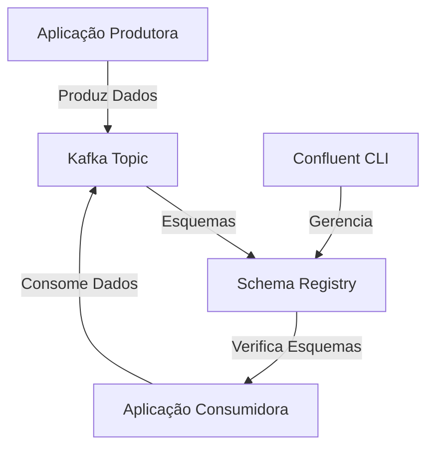

# Confluent Schema Registry

Quando aplicações estão produzindo e consumindo mensagens do Kafka, duas coisas acontecem:

1. **Novos Consumidores Emergentes**: Novas aplicações, potencialmente desenvolvidas por diferentes equipes, precisarão entender o formato das mensagens nos tópicos existentes.
2. **Evolução do Formato das Mensagens**: O formato das mensagens vai evoluir à medida que o negócio evolui. Por exemplo, objetos de pedido podem ganhar novos campos de status ou nomes de usuário podem ser divididos em nome e sobrenome.

## O Problema

O formato dos objetos de domínio é um alvo em constante movimento. Precisamos de uma maneira de concordar sobre o esquema das mensagens nos tópicos. É aí que entra o Confluent Schema Registry.

## O que é o Schema Registry?

O Schema Registry é um processo de servidor independente que roda em uma máquina externa aos brokers do Kafka. Ele mantém um banco de dados de todos os esquemas que foram escritos nos tópicos no cluster. Esse banco de dados é persistido em um tópico interno do Kafka e é armazenado em cache no Schema Registry para acesso de baixa latência.

### Funcionalidades

- **Manutenção de Esquemas**: O Schema Registry mantém um banco de dados de esquemas persistido em um tópico do Kafka.
- **API REST**: Produtores e consumidores podem usar a API REST do Schema Registry para verificar a compatibilidade dos esquemas.
- **Suporte a Alta Disponibilidade**: Pode ser configurado em uma configuração redundante para alta disponibilidade.
- **Compatibilidade de Esquemas**: Permite verificar a compatibilidade dos esquemas em tempo de produção e consumo.

## Exemplo de Uso

### Configurando um Produtor para Usar o Schema Registry

Quando um produtor é configurado para usar o Schema Registry, ele chama a API do Schema Registry no momento da produção de uma mensagem. Se o esquema da mensagem for compatível com as regras de compatibilidade definidas para o tópico, a produção terá sucesso. Caso contrário, a produção falhará, permitindo que o código da aplicação trate essa condição.

### Suporte a Diferentes Formatos de Serialização

O Schema Registry suporta três formatos de serialização:
- **JSON Schema**
- **Avro**
- **Protobuf**

## Vantagens

- **Gestão de Evolução de Esquemas**: Facilita a gestão da evolução de esquemas, evitando falhas de runtime quando possível.
- **Colaboração e Controle de Versão**: Permite a colaboração em torno das mudanças de esquema, utilizando ferramentas de controle de versão como arquivos IDL (Interface Description Language).

## Conclusão

Em sistemas não triviais, o uso do Schema Registry é essencial. Ele oferece uma maneira padronizada e automatizada de aprender sobre os esquemas e gerenciar suas evoluções internamente, facilitando a vida dos desenvolvedores e garantindo a compatibilidade das mensagens.

## Recursos Adicionais

- [Documentação do Confluent Schema Registry](https://docs.confluent.io/platform/current/schema-registry/index.html)
- [Guia de Início Rápido do Confluent Cloud](https://docs.confluent.io/cloud/current/get-started/index.html)
- [Deep Dive no Schema Registry](https://docs.confluent.io/platform/current/schema-registry/concepts.html)

## Diagrama de Arquitetura



## Exemplo de Configuração de Esquema

```json
{
  "type": "record",
  "namespace": "com.mycorp.mynamespace",
  "name": "vendas",
  "fields": [
    { "name": "id", "type": "int", "doc": "Identificador da venda." },
    { "name": "data_venda", "type": "string", "doc": "Data da venda." },
    { "name": "produto_id", "type": "int", "doc": "Identificador do produto." },
    { "name": "quantidade", "type": "int", "doc": "Quantidade vendida." },
    { "name": "valor_total", "type": "float", "doc": "Valor total da venda." }
  ]
}
```

Use o Schema Registry para garantir que as mensagens produzidas e consumidas estejam de acordo com este esquema, permitindo uma gestão eficiente e robusta da evolução dos dados.

## Hands-on: Confluent Schema Registry

### Configuração e Uso do Schema Registry

1. **Habilitar o Schema Registry**: No Confluent Cloud Console, selecione Schema Registry no canto inferior esquerdo.
2. **Configurar Credenciais de API**: Crie uma chave de API e um segredo na seção "API credentials" da página do Schema Registry.
3. **Criar Conector Datagen**: Navegue até "Data integration" e selecione "Connectors". Adicione um conector Datagen Source para gerar dados de exemplo.
4. **Configurar o Tópico e o Conector**: Crie um novo tópico chamado `orders` e configure o conector para usar o formato Avro.
5. **Consumir Mensagens**: Use o comando abaixo para consumir mensagens do tópico `orders`.

Passo 1: Armazenar a Chave da API
Armazene a chave da API e o segredo:

Ótimo! Agora que você tem a chave da API e o segredo, vamos seguir os passos para armazenar a chave da API e consumir mensagens do tópico `orders`.

### Passo 0: Criar uma nova chave

```bash
confluent api-key create --resource lkc-7zoqpw
```

### Passo 1: Armazenar a Chave da API

Armazene a chave da API e o segredo:

```bash
confluent api-key store CKTUPV72A52DME6K mVETdpD41gScm+njQJcljcm5M7IcFWWjcE3TXvfxTenxmzBHbM3syzxRii3iQoWC --resource lkc-7zoqpw
```

### Passo 2: Selecionar a Chave da API

Depois de armazenar a chave da API, selecione-a:

```bash
confluent api-key use CKTUPV72A52DME6K --resource lkc-7zoqpw
```

### Passo 3: Consumir Mensagens do Tópico

Finalmente, consuma as mensagens do tópico `orders`:

```bash
confluent kafka topic consume orders
```

### Código Completo

1. Armazene a chave da API:

    ```bash
    confluent api-key store CKTUPV72A52DME6K mVETdpD41gScm+njQJcljcm5M7IcFWWjcE3TXvfxTenxmzBHbM3syzxRii3iQoWC --resource lkc-7zoqpw
    ```

2. Selecione a chave da API:

    ```bash
    confluent api-key use CKTUPV72A52DME6K --resource lkc-7zoqpw
    ```

3. Consuma mensagens do tópico:

    ```bash
    confluent kafka topic consume orders
    ```

Seguindo esses passos, você deve conseguir consumir as mensagens do tópico `orders` usando o Confluent CLI.


```bash
confluent kafka topic consume --value-format avro --schema-registry-api-key N7CUKKPO4QRVRIXW --schema-registry-api-secret k4PPzQTYqMBDIV4es9P8rww5Kb48XlLWFwvP+nH1TPDkf6XqTYM3qmhOXHevoMYA orders
```