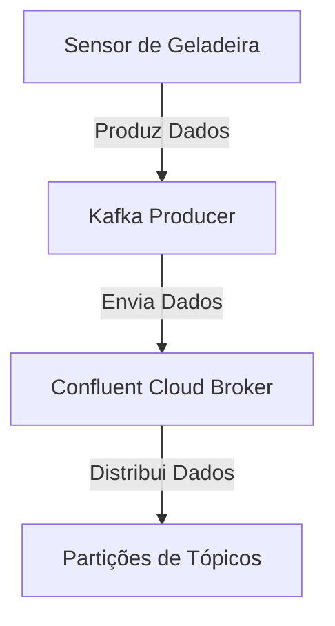
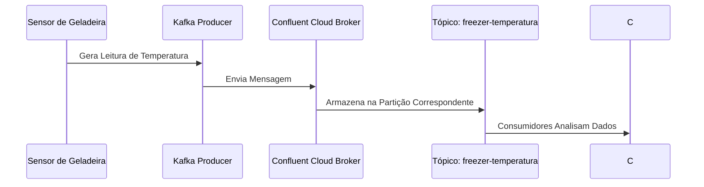

### Produtores com Confluent Kafka Python no Confluent Cloud

### Introdução

Nessa parte, vamos explorar como criar e configurar um produtor utilizando a biblioteca Python `confluent_kafka` para enviar mensagens para um broker Kafka hospedado no Confluent Cloud. Nosso objetivo é criar um sensor de geladeira para a Ambev, permitindo monitorar a temperatura do freezer e garantir que ele esteja na temperatura ideal.

### Conceitos Básicos

- **Produtor (Producer)**: Aplicações que enviam (produzem) dados para o Kafka.

### Diagrama de Arquitetura



### Estrutura do Produtor

No Kafka, os produtores são responsáveis por enviar mensagens para tópicos específicos. Usaremos a biblioteca `confluent_kafka` para criar e configurar um produtor em Python.

### Instalação da Biblioteca

Primeiro, instale a biblioteca `confluent_kafka`:

```bash
pip install confluent_kafka python-dotenv
```

### Configuração do Produtor para Confluent Cloud

#### Passos para Obter Configurações Necessárias

1. **Obter o Bootstrap Server**:
   - No Confluent Cloud Console, vá para seu cluster Kafka e encontre o endereço do bootstrap server.

2. **Obter as Credenciais de API (API Key e Secret)**:
   - No Confluent Cloud Console, vá para "API keys" e crie uma nova chave API. Anote a API Key e o Secret.

3. **Criar o Tópico Usando a CLI do Confluent Cloud**:

```bash
confluent kafka topic create freezer-temperatura --partitions 3 --cluster lkc-k08pop
```

### Arquivo `.env`

Crie um arquivo chamado `.env` no mesmo diretório do seu script Python e adicione as seguintes linhas:

```plaintext
BOOTSTRAP_SERVERS=pkc-12576z.us-west2.gcp.confluent.cloud:9092
SASL_USERNAME=YOUR_API_KEY  # Substitua pela sua API Key
SASL_PASSWORD=YOUR_API_SECRET  # Substitua pelo seu API Secret
CLIENT_ID=python-producer
TOPIC_PRODUCER=freezer-temperatura
```

### Exemplo de Configuração

Aqui está um exemplo completo de como configurar e usar o produtor em Python com a biblioteca `confluent_kafka` para o Confluent Cloud.

```python
from confluent_kafka import Producer
from dotenv import load_dotenv
import os
import random
import time

# Carregar variáveis de ambiente do arquivo .env
load_dotenv()

# Configurações do produtor
conf = {
    'bootstrap.servers': os.getenv('BOOTSTRAP_SERVERS'),
    'sasl.mechanisms': 'PLAIN',
    'security.protocol': 'SASL_SSL',
    'sasl.username': os.getenv('SASL_USERNAME'),
    'sasl.password': os.getenv('SASL_PASSWORD'),
    'client.id': os.getenv('CLIENT_ID')
}

# Criação do produtor
producer = Producer(**conf)

# Função de callback para entrega de mensagens
def delivery_report(err, msg):
    if err is not None:
        print(f"Message delivery failed: {err}")
    else:
        print(f"Message delivered to {msg.topic()} [{msg.partition()}]")

# Produção de mensagens simulando um sensor de geladeira
topic = os.getenv('TOPIC_PRODUCER')
for i in range(10):
    temperature = random.uniform(-5, 5)  # Temperatura aleatória entre -5 e 5 graus Celsius
    key = f"sensor{i % 3}"  # Usar diferentes chaves para distribuir entre partições
    producer.produce(topic, key=key, value=f"{temperature:.2f}", callback=delivery_report)
    producer.poll(0)
    time.sleep(1)  # Simula leitura de temperatura a cada segundo

# Espera até todas as mensagens serem entregues
producer.flush()
```

### Diagrama de Processo de Produção



### Como o Produtor Escolhe a Partição

O produtor decide a qual partição enviar cada mensagem, seja de forma round-robin (sem chave) ou computando a partição destino através do hash da chave.

1. **Round-Robin**:
   - Mensagens sem chave são distribuídas de forma round-robin entre as partições.

2. **Hash da Chave**:
   - Mensagens com chave têm a partição destino calculada através do hash da chave.

### Funcionamento Interno do Produtor

- **Gerenciamento de Pools de Conexão**: O produtor gerencia pools de conexão para otimizar a comunicação com o cluster.
- **Bufferização de Rede**: Mensagens são bufferizadas antes de serem enviadas para os brokers.
- **Acknowledge de Mensagens**: O produtor espera os acknowledgements dos brokers para liberar espaço no buffer.
- **Retransmissão de Mensagens**: Retransmissão de mensagens ocorre quando necessário.

### Recomendações

Para realmente entender como os produtores funcionam, é altamente recomendável que você escreva e execute algum código. Veja a API em ação, digite os comandos você mesmo e observe o comportamento do Kafka.

### Conclusão

Os produtores são uma parte essencial do Kafka, permitindo que você envie dados para o cluster de forma eficiente e escalável. Compreender como configurá-los e como eles interagem com as partições é crucial para aproveitar ao máximo o Apache Kafka.

### Execução do Script

Para executar o script, certifique-se de que o arquivo `.env` está no mesmo diretório e execute o seguinte comando:

```bash
python kafka_producers.py
```

Isso iniciará o produtor Kafka que enviará leituras de temperatura simuladas para o tópico `freezer-temperatura` no Confluent Cloud.

### Lendo os valores gerados

```bash
confluent kafka topic consume freezer-temperatura --cluster lkc-k08pop --from-beginning
```