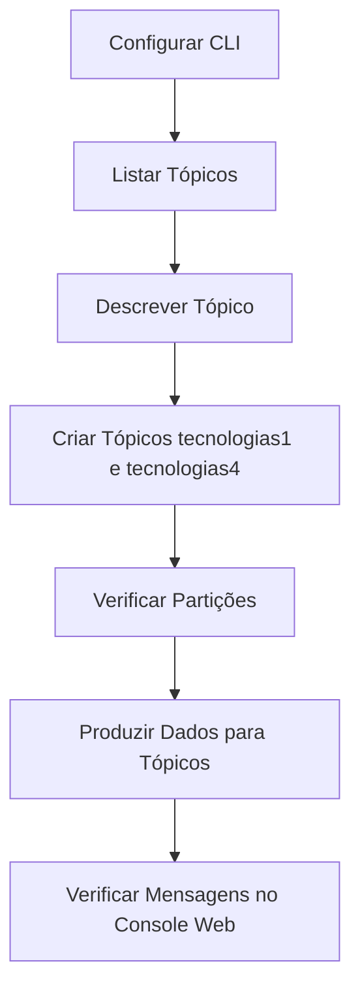

# Exercício de Particionamento de Tópicos

## Pré-requisitos

1. **Confluent Cloud Cluster:** Certifique-se de ter configurado o Confluent Cloud Cluster e o CLI conforme os exercícios anteriores.
2. **Kafka CLI:** Tenha o Kafka CLI instalado e configurado para se conectar ao seu cluster Confluent Cloud.

## Passos para o Exercício

### 1. Listar Tópicos Existentes
Para ver uma lista de tópicos no seu cluster, execute o comando abaixo no terminal:

```bash
confluent kafka topic list
```

### 2. Descrever o Tópico Existente
Para ver mais detalhes sobre a configuração do tópico `tecnologias`, use o comando:

```bash
confluent kafka topic describe tecnologias
```

### Principais Pontos do Comando `describe tecnologias`

Aqui estão os detalhes atualizados com os valores convertidos para segundos, megabytes (MB), e dias, conforme aplicável:

1. **cleanup.policy**: 
   - Valor: `delete`
   - Descrição: Define a política de limpeza de logs. `delete` significa que os logs antigos serão excluídos quando o tempo de retenção expirar.

2. **compression.type**: 
   - Valor: `producer`
   - Descrição: Especifica o tipo de compressão usada. `producer` indica que a compressão é definida pelo produtor.

3. **delete.retention.ms**: 
   - Valor: `86400000` (1 dia)
   - Descrição: Tempo de retenção em milissegundos para mensagens deletadas. (1 dia)

4. **file.delete.delay.ms**: 
   - Valor: `60000` (60 segundos)
   - Descrição: Atraso antes que um segmento de log deletado seja realmente removido do disco. (60 segundos)

5. **flush.messages**: 
   - Valor: `9223372036854775807`
   - Descrição: Número de mensagens que devem ser escritas antes que os dados sejam forçados a serem liberados no disco (influencia a durabilidade).

6. **flush.ms**: 
   - Valor: `9223372036854775807`
   - Descrição: Tempo em milissegundos antes que os dados sejam forçados a serem liberados no disco (influencia a durabilidade).

7. **index.interval.bytes**: 
   - Valor: `4096` (4 KB)
   - Descrição: Número de bytes entre entradas de índice. (4 KB)

8. **max.message.bytes**: 
   - Valor: `2097164` (2 MB)
   - Descrição: Tamanho máximo de uma mensagem (em bytes) que o tópico pode aceitar. (2 MB)

9. **message.downconversion.enable**: 
   - Valor: `true`
   - Descrição: Permite a conversão descendente de mensagens para versões anteriores de formato.

10. **message.format.version**: 
    - Valor: `3.0-IV1`
    - Descrição: Versão do formato da mensagem usada pelo tópico.

11. **message.timestamp.type**: 
    - Valor: `CreateTime`
    - Descrição: Tipo de timestamp usado para mensagens (tempo de criação da mensagem).

12. **min.cleanable.dirty.ratio**: 
    - Valor: `0.5`
    - Descrição: Proporção mínima de dados "sujos" em um log de segmento que aciona a limpeza de compactação.

13. **min.insync.replicas**: 
    - Valor: `2`
    - Descrição: Número mínimo de réplicas que devem estar sincronizadas para produzir mensagens com sucesso.

14. **num.partitions**: 
    - Valor: `6`
    - Descrição: Número de partições no tópico.

15. **retention.bytes**: 
    - Valor: `-1`
    - Descrição: Limite de retenção de bytes para o tópico. `-1` indica que não há limite.

16. **retention.ms**: 
    - Valor: `604800000` (7 dias)
    - Descrição: Tempo de retenção em milissegundos para mensagens no tópico. (7 dias)

17. **segment.bytes**: 
    - Valor: `104857600` (100 MB)
    - Descrição: Tamanho do segmento de log em bytes. (100 MB)

18. **segment.ms**: 
    - Valor: `604800000` (7 dias)
    - Descrição: Tempo em milissegundos antes que um novo segmento de log seja criado. (7 dias)

19. **unclean.leader.election.enable**: 
    - Valor: `false`
    - Descrição: Se `false`, desativa a eleição de líderes que não estão completamente sincronizados, melhorando a durabilidade à custa da disponibilidade.

### 3. Criar Novos Tópicos com Diferentes Partições
Vamos criar dois novos tópicos chamados `tecnologias1` e `tecnologias4` com 1 e 4 partições, respectivamente.

#### Criar o Tópico `tecnologias1` com 1 Partição
```bash
confluent kafka topic create tecnologias1 --partitions 1
```

#### Criar o Tópico `tecnologias4` com 4 Partições
```bash
confluent kafka topic create tecnologias4 --partitions 4
```

### 4. Verificar a Contagem de Partições dos Novos Tópicos
Para verificar a contagem de partições dos novos tópicos, use o comando `describe` novamente:

```bash
confluent kafka topic describe tecnologias1
confluent kafka topic describe tecnologias4
```

### 5. Produzir Dados para os Tópicos

#### Produzir Dados para o Tópico `tecnologias1`
```bash
confluent kafka topic produce tecnologias1
```

No prompt, insira uma mensagem de cada vez e pressione Enter:

```plaintext
1:Python
2:SQL
3:Kafka
4:Spark
5:Airflow
6:Kubernetes
7:Terraform
8:Docker
```

#### Produzir Dados para o Tópico `tecnologias4`
```bash
confluent kafka topic produce tecnologias4
```

No prompt, insira uma mensagem de cada vez e pressione Enter:

```plaintext
1:Python
2:SQL
3:Kafka
4:Spark
5:Airflow
6:Kubernetes
7:Terraform
8:Docker
```

### 6. Verificar as Mensagens Produzidas
No console web do Confluent Cloud, visualize as mensagens produzidas. Observe que o tópico `tecnologias1` tem todas as 8 mensagens em uma única partição, enquanto o tópico `tecnologias4` tem uma distribuição ligeiramente diferente.

### Conclusão
Com isso, você deve ter uma boa ideia de como a contagem de partições pode afetar a distribuição de dados nos seus tópicos. No próximo exercício, continuaremos explorando mais recursos do Kafka.

### Gráfico Mermaid



### Vantagens e Desvantagens de Trabalhar com um Número de Partições

## Vantagens

### 1. **Paralelismo**
   - **Vantagem**: Aumentar o número de partições permite maior paralelismo. Cada partição pode ser processada por um consumidor diferente, aumentando a capacidade de processamento.
   - **Exemplo**: Em um cenário de alta carga, múltiplos consumidores podem processar mensagens simultaneamente, reduzindo o tempo de processamento.

### 2. **Escalabilidade**
   - **Vantagem**: Maior número de partições facilita a escalabilidade horizontal, permitindo adicionar mais consumidores conforme a demanda aumenta.
   - **Exemplo**: Em sistemas distribuídos, adicionar novas instâncias de consumidores para lidar com picos de carga sem reconfigurar o cluster.

### 3. **Balanceamento de Carga**
   - **Vantagem**: Mensagens são distribuídas entre várias partições, o que ajuda a balancear a carga de trabalho entre diferentes consumidores.
   - **Exemplo**: Diferentes consumidores podem trabalhar em paralelo, cada um processando uma partição específica, evitando gargalos.

### 4. **Melhoria no Desempenho de Escrita**
   - **Vantagem**: Várias partições podem melhorar a taxa de transferência de escrita, já que múltiplos produtores podem escrever em diferentes partições simultaneamente.
   - **Exemplo**: Em aplicações com alta taxa de escrita, a capacidade de distribuir escritas entre múltiplas partições pode aumentar a eficiência geral.

## Desvantagens

### 1. **Complexidade na Gerência de Partições**
   - **Desvantagem**: Mais partições podem aumentar a complexidade da gerência, incluindo monitoramento, manutenção e configuração.
   - **Exemplo**: Necessidade de ferramentas avançadas para gerenciar grandes quantidades de partições, aumentando a carga administrativa.

### 2. **Rebalanceamento**
   - **Desvantagem**: Rebalancear partições entre consumidores pode ser custoso em termos de desempenho, especialmente em clusters grandes.
   - **Exemplo**: Durante o rebalanceamento, pode haver um tempo de inatividade ou degradação de desempenho à medida que as partições são redistribuídas.

### 3. **Overhead de Recursos**
   - **Desvantagem**: Mais partições exigem mais recursos do Kafka broker, incluindo memória, armazenamento e processamento.
   - **Exemplo**: Cada partição tem uma sobrecarga associada, e um número excessivo pode levar ao consumo excessivo de recursos do servidor.

### 4. **Problemas de Ordenação**
   - **Desvantagem**: Garantir a ordenação das mensagens pode ser mais difícil com múltiplas partições, pois cada partição mantém sua própria ordem.
   - **Exemplo**: Para manter a ordenação global de mensagens, pode ser necessário um processamento adicional ou uma lógica complexa no consumidor.

### 5. **Latência de Rebalanceamento**
   - **Desvantagem**: Quando um novo consumidor é adicionado, ou um consumidor existente falha, o tempo para rebalancear as partições pode adicionar latência.
   - **Exemplo**: Em um sistema com alta disponibilidade, a latência de rebalanceamento pode afetar a entrega de mensagens em tempo real.

### Conclusão
Escolher o número adequado de partições é uma decisão crítica que deve equilibrar as necessidades de desempenho e paralelismo com a complexidade de gerenciamento e os recursos disponíveis. Avaliar cuidadosamente os requisitos do sistema e realizar testes de carga podem ajudar a determinar a configuração ideal para um cenário específico.

Não há um número "ideal" de partições que funcione para todos os cenários, pois o número apropriado de partições para um tópico Kafka depende de diversos fatores, incluindo a taxa de produção e consumo de mensagens, o tamanho das mensagens, e a arquitetura geral do seu sistema. No entanto, aqui estão algumas diretrizes e considerações que podem ajudar a determinar um número adequado de partições:

## Fatores para Determinar o Número de Partições

### 1. **Taxa de Produção e Consumo**
   - **Alto Volume de Dados**: Se você está lidando com um alto volume de dados, mais partições podem ajudar a distribuir a carga entre vários consumidores.
   - **Concorrência de Consumidores**: O número de consumidores em um grupo deve idealmente corresponder ou ser menor que o número de partições para garantir que cada partição seja consumida eficientemente.

### 2. **Tamanho das Mensagens**
   - **Mensagens Grandes**: Se suas mensagens são grandes, mais partições podem ajudar a evitar que uma única partição se torne um gargalo.

### 3. **Desempenho e Latência**
   - **Paralelismo**: Mais partições permitem maior paralelismo, aumentando o throughput geral do sistema.
   - **Latência**: Muito poucas partições podem levar a gargalos, enquanto muitas partições podem introduzir sobrecarga administrativa.

### 4. **Escalabilidade**
   - **Crescimento Futuro**: Considere o crescimento futuro do seu sistema. Pode ser mais fácil começar com mais partições do que necessário e crescer nelas, do que aumentar o número de partições posteriormente.

### 5. **Replicação e Tolerância a Falhas**
   - **Número de Réplicas**: Partições adicionais podem ajudar a garantir maior resiliência e disponibilidade.

### 6. **Limitações Operacionais**
   - **Limites do Kafka**: Tenha em mente que cada partição adiciona uma certa quantidade de sobrecarga administrativa ao Kafka e ao Zookeeper.
   - **Recursos de Hardware**: Certifique-se de que seus brokers têm recursos suficientes (CPU, memória, disco) para lidar com o número de partições desejado.

## Implementação em Instâncias EC2

### 1. **Distribuição de Partições**
   - **Balanceamento de Carga**: As partições podem ser distribuídas entre várias instâncias EC2 para garantir balanceamento de carga e alta disponibilidade.
   - **Dimensionamento**: Dependendo do tamanho e da carga de trabalho, você pode alocar várias partições em uma única instância EC2, mas isso deve ser feito com cautela para evitar gargalos.

### 2. **Considerações de Deploy**
   - **Tipo de Instância**: Escolha instâncias EC2 que correspondam aos requisitos de desempenho do Kafka. Instâncias com alto I/O, como as séries I3, podem ser vantajosas.
   - **Storage**: Utilize armazenamento de alta performance, como SSDs, para partições Kafka.
   - **Rede**: Garanta que a latência da rede entre instâncias EC2 seja baixa, especialmente se elas estão em diferentes zonas de disponibilidade.

### 3. **Escalabilidade e Gerenciamento**
   - **Auto Scaling**: Configure grupos de auto scaling para instâncias EC2 para lidar com variações na carga de trabalho.
   - **Monitoramento e Alertas**: Use ferramentas de monitoramento para observar o desempenho das partições e instâncias, e configure alertas para identificar problemas rapidamente.

## Exemplo de Configuração

### Criar Tópico com Partições via CLI

```bash
confluent kafka topic create tecnologias --partitions 10
```

### Produzir e Consumir Mensagens

#### Produzir Mensagens

```bash
# Abra um terminal para produzir mensagens
confluent kafka topic produce tecnologias

# Insira mensagens manualmente
1:Python
2:Kafka
3:AWS
4:Docker
5:Spark
6:Hadoop
7:Kubernetes
8:TensorFlow
9:Pandas
10:SQL
```

#### Consumir Mensagens

```bash
# Abra um segundo terminal para consumir mensagens
confluent kafka topic consume tecnologias --from-beginning
```

## Conclusão

O número ideal de partições depende das necessidades específicas do seu sistema, incluindo a taxa de produção e consumo, o tamanho das mensagens e a necessidade de escalabilidade futura. Distribuir partições entre várias instâncias EC2 pode ajudar a garantir alta disponibilidade e desempenho, mas deve ser feito com planejamento cuidadoso para evitar gargalos e garantir eficiência operacional.


### Referências
- [Confluent Cloud Documentation](https://docs.confluent.io/cloud/current/get-started/index.html)
- [Kafka Documentation](https://kafka.apache.org/documentation/)
