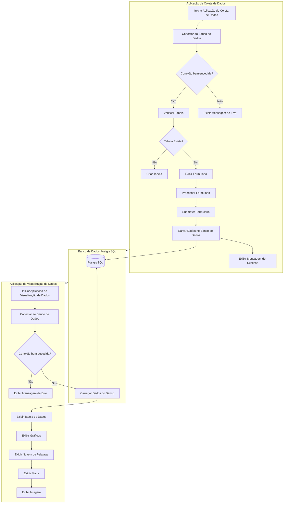
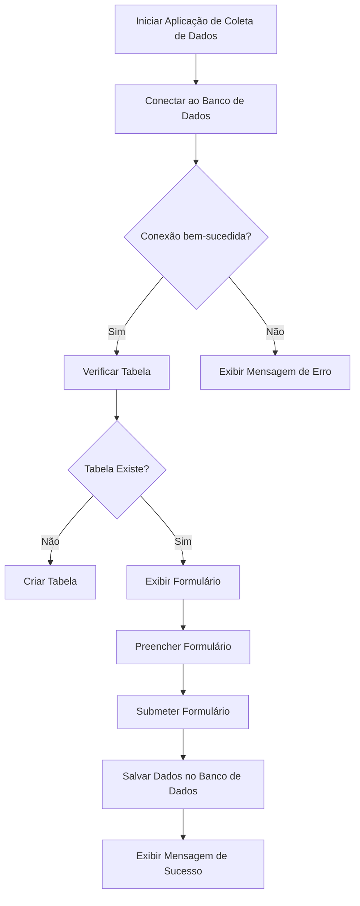
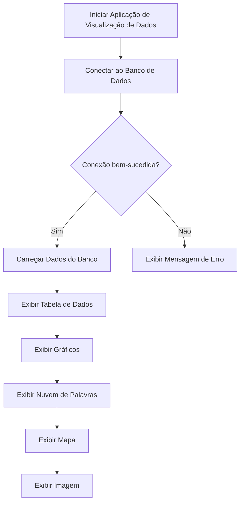

# Workshop Streamlit


## Roteiro da Aula

- **9h00** Boas vindas
- **9h30** Hello World
- **10h00** Principais comandos
- **10h30** Projeto Survey
- **11h30** Intervalo
- **12h00** Projeto Dashboard Realtime 

## O que vamos fazer hoje



## A Maneira Mais Simples de Criar um Aplicativo Web com Python

Criar aplicativos web geralmente envolve o uso de frameworks web Python como Django e Flask. Embora esses frameworks sejam poderosos e flexíveis, eles possuem uma curva de aprendizado significativa e podem exigir um investimento substancial de tempo para desenvolver algo funcional.

### Por que usar Streamlit?

Desenvolver com Streamlit torna o processo de criação de aplicativos web muito mais rápido e fácil. Com Streamlit, você pode transformar scripts Python em aplicativos web interativos em questão de minutos. Aqui estão alguns benefícios:

- **Rápida Prototipagem**: Streamlit permite que você crie protótipos rapidamente sem a necessidade de escrever código HTML, CSS ou JavaScript.
- **Foco em Dados**: Ideal para cientistas de dados e analistas, Streamlit facilita a visualização e a interação com dados diretamente em Python.
- **Simplicidade**: A API intuitiva do Streamlit permite que você escreva aplicativos web de forma natural, usando construções familiares do Python.
- **Interatividade**: Adicione widgets interativos como sliders, botões e seletores com facilidade para tornar suas análises de dados mais dinâmicas.

### Comparação com Outros Frameworks

| Característica        | Django & Flask                      | Streamlit                               |
|-----------------------|-------------------------------------|-----------------------------------------|
| **Curva de Aprendizado** | Alta                                | Baixa                                   |
| **Tempo de Desenvolvimento** | Lento (configuração manual de roteamento, templates, etc.) | Rápido (scripts Python para web apps)  |
| **Conhecimento Necessário**  | Python, HTML, CSS, JavaScript   | Apenas Python                           |
| **Interatividade**    | Necessário configurar manualmente  | Integrado e fácil de usar               |
| **Foco Principal**    | Desenvolvimento web geral           | Aplicações de dados e visualizações     |

### Exemplo de Código com Streamlit

Aqui está um exemplo simples de como é fácil criar uma aplicação web com Streamlit:

```python
import streamlit as st
import pandas as pd
import numpy as np

# Título da aplicação
st.title("Exemplo de Aplicação Streamlit")

# Adiciona um cabeçalho
st.header("Introdução ao Streamlit")

# Adiciona um texto
st.text("Esta é uma aplicação web criada com Streamlit!")

# Cria um dataframe
data = pd.DataFrame({
    'Coluna 1': [1, 2, 3, 4],
    'Coluna 2': [10, 20, 30, 40]
})

# Exibe o dataframe
st.dataframe(data)

# Adiciona um gráfico de linha
st.line_chart(data)

# Adiciona um botão e uma resposta ao clique
if st.button("Clique aqui"):
    st.write("Botão clicado!")

# Adiciona um seletor
opcao = st.selectbox("Escolha uma opção", ['Opção A', 'Opção B', 'Opção C'])
st.write("Você selecionou:", opcao)
```

### Iniciando com Streamlit

Para começar a usar Streamlit, siga estes passos:

1. **Instale Streamlit**:
   ```bash
   pip install streamlit
   ```

2. **Crie um script Python** com o conteúdo do exemplo acima e salve-o como `app.py`.

3. **Execute o Streamlit**:
   ```bash
   streamlit run app.py
   ```

4. **Abra o navegador** e acesse `http://localhost:8501` para ver sua aplicação web em ação!

Streamlit é uma ferramenta poderosa e simples que transforma a maneira como você desenvolve e compartilha suas análises de dados. Experimente e veja como pode facilitar o seu trabalho!

## O que é o Streamlit?

- **Streamlit é um Web Framework Open Source em Python** que transforma scripts de dados em aplicativos web interativos e compartilháveis em questão de minutos.
  
- **Streamlit não requer experiência em front-end**. Você pode criar aplicações completas usando apenas Python, o que permite que você foque no desenvolvimento do seu modelo e análise de dados, sem se preocupar com HTML, CSS ou JavaScript.

### Principais Vantagens do Streamlit

- **Fácil de Usar**: A simplicidade do Streamlit permite que você desenvolva rapidamente aplicativos web sem a necessidade de aprender tecnologias de front-end. Se você conhece Python, já sabe o suficiente para criar aplicativos web com Streamlit.
  
- **Rápido**: Com Streamlit, você pode transformar seus scripts Python em aplicativos web em minutos. A configuração é mínima, e você pode ver as mudanças em tempo real enquanto desenvolve.
  
- **Interativo**: Adicionar interatividade às suas análises de dados é simples com Streamlit. Você pode facilmente incluir widgets como sliders, botões, seletores e muito mais para tornar suas aplicações dinâmicas e responsivas.
  
- **Open Source**: Streamlit é gratuito e open source, apoiado por uma comunidade ativa. Isso significa que você pode contribuir para o projeto e se beneficiar das contribuições de outros desenvolvedores.

## Iniciando um Projeto Streamlit

Começar um projeto com Streamlit é simples e rápido. Aqui estão os passos básicos:

1. **Crie um Script Python**: O primeiro passo é criar um arquivo Python, por exemplo, `app.py`.

2. **Importe a Biblioteca Streamlit**: Dentro do seu script, importe a biblioteca Streamlit e use uma série de métodos do Streamlit para criar widgets de entrada e saída.

### Exemplo de Código

Aqui está um exemplo simples de como começar:

```python
import streamlit as st

# Título da aplicação
st.title("Meu Primeiro App com Streamlit")

# Adiciona um cabeçalho
st.header("Introdução ao Streamlit")

# Adiciona um texto
st.text("Streamlit facilita a criação de aplicações web interativas com Python!")

# Widgets de entrada
nome = st.text_input("Digite seu nome")
idade = st.slider("Selecione sua idade", 0, 100, 25)

# Exibe os dados de entrada
st.write(f"Nome: {nome}")
st.write(f"Idade: {idade}")

# Adiciona um gráfico simples
st.line_chart([1, 2, 3, 4, 5])
```

### Executando o Aplicativo

Para executar sua aplicação Streamlit, use o comando abaixo no terminal:

```bash
streamlit run app.py
```

Abra seu navegador e acesse `http://localhost:8501` para ver sua aplicação em ação!

# Aula Introdutória ao Streamlit

Este repositório contém um exemplo prático que explora os principais métodos do Streamlit, uma biblioteca em Python que facilita a criação de aplicações web interativas. O objetivo é fornecer uma base sólida para iniciantes aprenderem a utilizar os recursos básicos do Streamlit.

## Objetivo

O objetivo deste exemplo é explorar os principais métodos do Streamlit, abordando diferentes tipos de exibição de texto, dados, métricas, gráficos, mapas, mídia e widgets interativos. 

## Estrutura do Projeto

- **exemplo/main.py**: Contém o código principal que demonstra os métodos do Streamlit.
- **exemplo/main_exercicio.py**: Contém somente os comentários, servindo como exercício para preencher os métodos do Streamlit.
- **requirements.txt**: Lista de dependências necessárias para executar o projeto.
- **watch.py**: Script opcional para reiniciar automaticamente o Streamlit ao detectar alterações no código.

## Como Executar o Projeto

1. **Clone o repositório**:

   ```sh
   git clone https://github.com/seu-usuario/streamlit-intro.git
   cd streamlit-intro
   ```

2. **Crie um ambiente virtual e ative-o**:

   ```sh
   python -m venv venv
   source venv/bin/activate  # Para Windows: venv\Scripts\activate
   ```

3. **Instale as dependências**:

   ```sh
   pip install -r requirements.txt
   ```

4. **Execute o Streamlit**:

   ```sh
   streamlit run exemplo/main.py
   ```

   O Streamlit irá automaticamente observar mudanças no arquivo `main.py` e recarregar a aplicação.

# Conteúdo do Exemplo

### 1. Títulos e Texto

- **Título da aplicação**: `st.title(titulo)`
- **Cabeçalho**: `st.header(cabecalho)`
- **Subcabeçalho**: `st.subheader(subcabecalho)`
- **Texto simples**: `st.text(texto)`
- **Markdown**: `st.markdown(markdown_texto)`
- **Fórmula LaTeX**: `st.latex(latex_formula)`
- **Código com destaque de sintaxe**: `st.code(codigo)`

### 2. Exibição de Dados

- **Exibe um DataFrame**: `st.write(df)`
- **DataFrame com redimensionamento**: `st.dataframe(df)`
- **Tabela estática**: `st.table(df)`
- **Objeto JSON**: `st.json(json_obj)`
- **CSV como string**: `st.write(csv_string)`


- **Lista de números**: `st.write(lista)`

### 3. Métricas

- **Métrica com delta**: `st.metric(label, value, delta)`
- **Métricas diversas**: `st.metric(label, value)`

### 4. Gráficos

- **Gráfico de linha**: `st.line_chart(data)`
- **Gráfico de área**: `st.area_chart(data)`
- **Gráfico de barra**: `st.bar_chart(data)`
- **Gráfico de dispersão**: `st.plotly_chart(scatter_plot)`
- **Histograma**: `st.plotly_chart(histogram)`

### 5. Mapas

- **Exibe um mapa**: `st.map(map_data)`

### 6. Mídia

- **Imagem com legenda**: `st.image(url, caption)`
- **Reprodutor de áudio**: `st.audio(url)`
- **Reprodutor de vídeo**: `st.video(url)`

### 7. Widgets

- **Botão**: `st.button(label)`
- **Caixa de seleção**: `st.checkbox(label)`
- **Opções de escolha única**: `st.radio(label, options)`
- **Menu suspenso**: `st.selectbox(label, options)`
- **Menu suspenso múltiplo**: `st.multiselect(label, options)`
- **Barra deslizante**: `st.slider(label, min_value, max_value, value)`
- **Barra deslizante com opções de texto**: `st.select_slider(label, options, value)`
- **Caixa de entrada de texto**: `st.text_input(label)`
- **Caixa de entrada de número**: `st.number_input(label, min_value, max_value)`
- **Área de texto**: `st.text_area(label)`
- **Seletor de data**: `st.date_input(label, value)`

### 8. Barra Lateral

- **Título da barra lateral**: `st.sidebar.title(title)`
- **Botão na barra lateral**: `st.sidebar.button(label)`

### 9. Carregamento de CSV e Downloads

- **Carregamento de arquivo CSV**: `st.file_uploader(label, type)`
- **Barra de progresso durante o upload**: `st.progress(progress)`
- **Download de arquivo Parquet**: `st.download_button(label, data, file_name, mime)`

# Setup do nosso projeto

Este projeto utiliza Streamlit para criar aplicações web interativas em Python. Vamos configurar o ambiente de desenvolvimento com as seguintes ferramentas:

- Git e Github (utilizando o Github CLI) para versionamento do código
- Python 3.12.1 utilizando o Pyenv
- Poetry para gerenciamento de pacotes e ambiente virtual
- Streamlit para desenvolver a aplicação
- Ruff para linting
- Taskipy para tarefas automatizadas
- Pytest para testes

## Configurando o ambiente de desenvolvimento

### 1. Criando o repositório no Github

Utilize o Github CLI para criar um novo repositório:

```bash
gh repo create
```

### 2. Criando o arquivo .gitignore

Utilize o ignr para criar um arquivo .gitignore específico para projetos Python:

```bash
ignr -n python
```

### 3. Criando o README.md

Crie um arquivo README.md (este arquivo) para documentar o projeto.

```bash
touch README.md
```

### 4. Instalando Python 3.12.1 com Pyenv

```bash
pyenv install 3.12.1
pyenv local 3.12.1
```

### 5. Configurando o ambiente com Poetry

Inicialize um novo projeto com Poetry:

```bash
poetry init
```

### 6. Instalando Streamlit

Adicione o Streamlit ao seu projeto:

```bash
poetry add streamlit
```

### 7. Instalando e Configurando Ruff

Ruff é uma ferramenta de linting rápida para Python, que ajuda a identificar e corrigir problemas no código, como formatação incorreta, erros de sintaxe e práticas de codificação inadequadas. A análise estática de código, como a realizada pelo Ruff, é uma prática essencial para garantir a qualidade e a manutenção do código. Ela verifica o código-fonte sem executá-lo, encontrando erros comuns e garantindo conformidade com padrões de codificação.

#### 7.1. Adicionando Ruff ao grupo de desenvolvimento

Para adicionar Ruff ao grupo de desenvolvimento, execute:

```bash
poetry add --group dev ruff
```

#### 7.2. Configurando Ruff no `pyproject.toml`

Adicione a configuração do Ruff no arquivo `pyproject.toml` para personalizar seu comportamento:

```toml
[tool.ruff]
# Configurações de linting
line-length = 88  # Comprimento máximo de linha
select = ["E", "F", "W"]  # Seleciona as categorias de erros e avisos
ignore = ["E203", "W503"]  # Ignora regras específicas

# Adicione paths específicos se necessário
exclude = ["build", "dist"]

# Para especificar o conjunto de regras do Black para formatação
extend-select = ["B"]
```

### 7.3. Realizando análise estática

Para realizar a análise estática do código com Ruff, execute o seguinte comando:

```bash
ruff check .
```

### 7.4. Corrigindo problemas automaticamente

Ruff também pode corrigir problemas automaticamente quando possível. Para fazer isso, utilize o comando:

```bash
ruff check . --fix
```

### Exemplo de Configuração Completa no `pyproject.toml`

Aqui está um exemplo de como o `pyproject.toml` deve ficar com a configuração do Ruff:

```toml
[tool.poetry]
name = "projeto-streamlit"
version = "0.1.0"
description = "Projeto Streamlit para criar aplicações web interativas em Python."
authors = ["Seu Nome <seu.email@example.com>"]

[tool.poetry.dependencies]
python = "^3.12"
streamlit = "^1.0.0"

[tool.poetry.dev-dependencies]
ruff = "^0.0.255"
pytest = "^6.2.4"
taskipy = "^1.9.0"
pre-commit = "^2.14.0"

[build-system]
requires = ["poetry-core>=1.0.0"]
build-backend = "poetry.core.masonry.api"

[tool.ruff]
line-length = 88
select = ["E", "F", "W", "C", "N", "B", "I", "PL", "PT"]
ignore = ["E203", "W503"]
exclude = ["build", "dist"]
extend-select = ["B"]

[tool.taskipy.tasks]
lint = "ruff check ."
test = "pytest"
```

Com essas configurações, você terá um ambiente de desenvolvimento bem configurado, incluindo a análise estática do código com Ruff, garantindo que seu código esteja sempre em conformidade com as melhores práticas de desenvolvimento em Python.

### 8. Instalando Taskipy

Adicione Taskipy ao seu projeto:

```bash
poetry add --group dev taskipy
```

Adicione o seguinte ao seu `pyproject.toml` para configurar o Taskipy:

```toml
[tool.taskipy.tasks]
lint = "ruff check ."
```

# Integração Streamlit e outras bibliotecas gráficas

Streamlit é uma biblioteca de código aberto em Python que torna extremamente fácil criar e compartilhar aplicativos web de dados. Uma das grandes vantagens do Streamlit é a sua capacidade de integrar diversas bibliotecas gráficas populares do Python, proporcionando uma experiência visual rica e interativa. Aqui estão algumas vantagens e destaques dessas integrações:

### 1. Matplotlib

#### O que é?
Matplotlib é uma biblioteca de plotagem 2D extremamente popular em Python, usada para criar gráficos estáticos, animados e interativos. É altamente configurável e permite criar visualizações complexas com facilidade.

#### Vantagens no Streamlit
- **Facilidade de Integração**: Com Streamlit, você pode exibir gráficos Matplotlib de forma simples utilizando `st.pyplot()`.
- **Interatividade**: Streamlit permite adicionar interatividade aos seus gráficos Matplotlib sem a necessidade de configurar um ambiente web completo.
- **Visualizações Poderosas**: Combine a flexibilidade do Matplotlib com a simplicidade do Streamlit para criar dashboards poderosos e visualizações de dados detalhadas.

### Comando para Instalação
```bash
poetry add matplotlib
```

### 2. Folium

#### O que é?
Folium é uma biblioteca que facilita a visualização de dados geoespaciais utilizando Leaflet.js. Com Folium, você pode criar mapas interativos e adicionar marcadores, camadas e outras funcionalidades.

#### Vantagens no Streamlit
- **Mapas Interativos**: Streamlit e Folium juntos permitem a criação de mapas interativos dentro de aplicativos web, ideais para análises geoespaciais.
- **Visualização de Dados Geográficos**: Exiba dados geográficos e geolocalizados diretamente no navegador, facilitando a compreensão e análise espacial.
- **Simplicidade**: Adicione mapas interativos aos seus aplicativos com poucas linhas de código usando `folium_static()`.

### Comando para Instalação
```bash
poetry add folium streamlit-folium
```

### 3. WordCloud

#### O que é?
WordCloud é uma biblioteca para a geração de nuvens de palavras a partir de texto. As nuvens de

 palavras são uma forma visual de representar a frequência ou importância de palavras em um texto, com palavras mais frequentes aparecendo maiores.

#### Vantagens no Streamlit
- **Visualização de Texto**: Utilize WordCloud com Streamlit para criar representações visuais atraentes de dados textuais.
- **Facilidade de Uso**: Crie e exiba nuvens de palavras rapidamente usando `WordCloud` e `st.pyplot()`.
- **Análise Textual**: Ideal para visualizar e explorar grandes volumes de texto de maneira intuitiva.

### Comando para Instalação
```bash
poetry add wordcloud
```

### Conclusão

Streamlit se destaca como uma ferramenta poderosa para criar aplicativos de dados interativos, integrando facilmente bibliotecas gráficas populares como Matplotlib, Folium e WordCloud. Estas integrações permitem aos desenvolvedores focar na análise e visualização de dados, sem a necessidade de se preocupar com a infraestrutura web subjacente. Com Streamlit, você pode transformar scripts de dados em aplicativos web compartilháveis em minutos, facilitando a disseminação e compreensão de insights valiosos.

### Exemplo de Código

```python
import streamlit as st
import pandas as pd
import matplotlib.pyplot as plt
import folium
from streamlit_folium import folium_static
from wordcloud import WordCloud

# Exemplo de gráfico Matplotlib
st.header("Gráfico Matplotlib")
fig, ax = plt.subplots()
ax.plot([1, 2, 3, 4], [10, 20, 25, 30])
st.pyplot(fig)

# Exemplo de mapa Folium
st.header("Mapa Folium")
m = folium.Map(location=[45.5236, -122.6750], zoom_start=13)
folium.Marker([45.5236, -122.6750], popup="The Waterfront").add_to(m)
folium_static(m)

# Exemplo de nuvem de palavras WordCloud
st.header("Nuvem de Palavras")
text = "Python Streamlit Matplotlib Folium WordCloud"
wordcloud = WordCloud(width=800, height=400, background_color='white').generate(text)
fig, ax = plt.subplots()
ax.imshow(wordcloud, interpolation='bilinear')
ax.axis("off")
st.pyplot(fig)
```

Streamlit transforma a maneira como você trabalha com dados, tornando a criação de visualizações e aplicativos de dados mais acessível e eficiente.

## Survey App com Streamlit e PostgreSQL

### Descrição

Este projeto demonstra como criar uma aplicação web de enquete utilizando Streamlit para a interface do usuário e PostgreSQL para o armazenamento de dados. O objetivo é coletar dados dos participantes através de um formulário, salvar esses dados em um banco de dados PostgreSQL e posteriormente visualizá-los e analisá-los em uma outra aplicação web.

### Estrutura do Projeto

O projeto está dividido em duas partes principais, cada uma localizada em uma pasta separada:

1. **Aplicação de Coleta de Dados** (`projeto_coleta`):
   - Coleta os dados dos participantes através de um formulário web.
   - Salva os dados coletados em um banco de dados PostgreSQL.

2. **Aplicação de Visualização de Dados** (`projeto_dash`):
   - Carrega os dados do banco de dados PostgreSQL.
   - Exibe os dados em gráficos interativos e tabelas.

### Arquivos

- `projeto_coleta/main.py`: Contém a implementação da aplicação de coleta de dados.
- `projeto_dash/visualization.py`: Contém a implementação da aplicação de visualização de dados.
- `.env`: Arquivo de configuração com as variáveis de ambiente para conexão ao banco de dados PostgreSQL.
- `requirements.txt`: Lista de dependências do projeto.

### Instruções para Executar

#### 1. Clonar o Repositório

Clone o repositório para sua máquina local:

```bash
git clone https://github.com/seu-usuario/seu-repositorio.git
cd seu-repositorio
```

#### 2. Configurar o Ambiente Virtual

Crie e ative um ambiente virtual:

```bash
python -m venv venv
source venv/bin/activate  # No Windows use `venv\Scripts\activate`
```

#### 3. Instalar Dependências

Instale as dependências necessárias:

```bash
pip install -r requirements.txt
```

#### 4. Configurar Variáveis de Ambiente

Crie um arquivo `.env` na raiz do projeto e adicione as configurações de conexão ao banco de dados PostgreSQL:

```env
DB_HOST=seu_host
DB_DATABASE=seu_database
DB_USER=seu_usuario
DB_PASSWORD=sua_senha
```

#### 5. Executar a Aplicação de Coleta de Dados

Entre na pasta `projeto_coleta` e inicie a aplicação de coleta de dados:

```bash
cd projeto_coleta
streamlit run main.py
```

#### 6. Executar a Aplicação de Visualização de Dados

Em um novo terminal, entre na pasta `projeto_dash` e inicie a aplicação de visualização de dados:

```bash
cd projeto_dash
streamlit run visualization.py
```

### Funcionalidades

#### Aplicação de Coleta de Dados (`main.py`)

1. **Conexão ao Banco de Dados**:
   - Conecta ao banco de dados PostgreSQL utilizando as variáveis de ambiente configuradas.

2. **Criação da Tabela**:
   - Cria a tabela `survey_data` no banco de dados, caso ainda não exista.

3. **Formulário de Enquete**:
   - Coleta informações dos participantes, como estado, área de atuação, bibliotecas utilizadas, horas de estudo, conforto com dados e experiência em Python, SQL e Cloud.

4. **Salvar Dados**:
   - Salva os dados coletados no banco de dados PostgreSQL.

#### Aplicação de Visualização de Dados (`visualization.py`)

1. **Conexão ao Banco de Dados**:
   - Conecta ao banco de dados PostgreSQL utilizando as variáveis de ambiente configuradas.

2. **Carregar Dados**:
   - Carrega os dados da tabela `survey_data` do banco de dados.

3. **Exibir Dados**:
   - Exibe os dados em uma tabela.

4. **Gráficos Interativos**:
   - Exibe gráficos de área mostrando o nível de conforto com dados versus horas de estudo.
   - Exibe gráficos de linha mostrando a experiência técnica dos participantes em Python, SQL e Cloud.
   - Exibe um mapa do Brasil com a distribuição dos participantes por estado.
   - Exibe uma nuvem de palavras com as bibliotecas utilizadas pelos participantes.
   - Exibe as top 3 bibliotecas utilizadas por área de atuação.

5. **Exibir Imagem**:
   - Exibe uma imagem ao final da página.

### Workflow

#### Workflow da Aplicação de Coleta de Dados



#### Workflow da Aplicação de Visualização de Dados



Com esse guia, você estará preparado para configurar, desenvolver e executar um projeto completo utilizando Streamlit e PostgreSQL, desde a coleta até a visualização de dados.