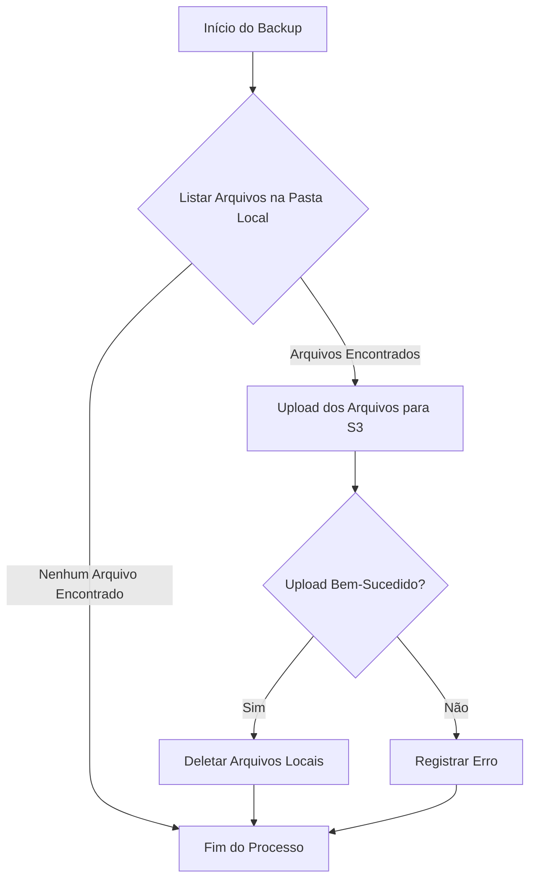

## Projeto Python: Backup de Arquivos Locais para o S3

### Introdução

O objetivo deste projeto é criar um sistema automatizado de backup utilizando Python e o serviço de armazenamento de objetos Amazon S3. O projeto será responsável por ler arquivos de uma pasta local no seu computador, enviar esses arquivos para um bucket S3 na AWS e, em seguida, deletar os arquivos locais após o upload bem-sucedido.

Essa solução é ideal para cenários onde é necessário garantir que os dados locais sejam salvos em um ambiente seguro e acessível, liberando espaço de armazenamento no dispositivo local e protegendo contra perdas de dados.

### Diagrama do Fluxo do Projeto



### Explicação do Fluxo:

1. **Início do Backup:** O processo começa com a execução do script Python.
2. **Listar Arquivos na Pasta Local:** O script verifica a presença de arquivos na pasta local especificada.
   - Se arquivos forem encontrados, o processo continua.
   - Se nenhum arquivo for encontrado, o processo termina.
3. **Upload dos Arquivos para S3:** Os arquivos listados são enviados para o bucket S3 designado.
4. **Upload Bem-Sucedido?:** Verifica se o upload dos arquivos foi realizado com sucesso.
   - Se o upload for bem-sucedido, os arquivos locais são deletados.
   - Se ocorrer algum erro durante o upload, o erro é registrado para análise posterior.
5. **Fim do Processo:** O processo de backup é concluído, seja após o upload e deleção dos arquivos ou após a detecção de um erro.

### 1. Configuração Inicial do Projeto

#### Passo 1: Criação do Ambiente de Desenvolvimento

1. **Criar uma Pasta para o Projeto:**
   - Crie uma nova pasta para o seu projeto, por exemplo: `backup_s3`.

2. **Criar um Ambiente Virtual (Opcional, mas Recomendado):**
   - Navegue até a pasta do projeto e crie um ambiente virtual:
   
   ```bash
   python -m venv venv
   ```

   - Ative o ambiente virtual:
     - **Windows:** `venv\Scripts\activate`
     - **Linux/MacOS:** `source venv/bin/activate`

3. **Instalar Dependências Necessárias:**
   - Instale o boto3 para interagir com o S3 e outras bibliotecas necessárias:
   
   ```bash
   pip install boto3
   ```

4. **Criar um Arquivo `requirements.txt`:**
   - Para facilitar a instalação de dependências no futuro, crie um arquivo `requirements.txt`:
   
   ```bash
   boto3
   ```

   - Você pode gerar este arquivo automaticamente com:
   
   ```bash
   pip freeze > requirements.txt
   ```

### 2. Configuração do AWS IAM e S3

1. **Criar um Bucket S3:**
   - Siga os passos mencionados na seção anterior para criar um bucket S3 que será utilizado para armazenar os backups.

2. **Criar um Usuário IAM para o Projeto:**
   - Crie um usuário IAM com permissões para acessar o bucket S3 específico.
   - Obtenha as credenciais (Access Key ID e Secret Access Key) que serão usadas no código.

### 3. Implementação do Código Python

#### Passo 1: Configurar as Credenciais AWS

1. **Criar um Arquivo de Configuração:**
   - Crie um arquivo `.env` para armazenar as credenciais do S3 de forma segura:
   
   ```
   AWS_ACCESS_KEY_ID=YOUR_ACCESS_KEY
   AWS_SECRET_ACCESS_KEY=YOUR_SECRET_KEY
   AWS_REGION=YOUR_REGION
   BUCKET_NAME=YOUR_BUCKET_NAME
   ```

   - Instale a biblioteca `python-dotenv` para carregar essas variáveis de ambiente:
   
   ```bash
   pip install python-dotenv
   ```

2. **Carregar as Credenciais no Código:**

   - No arquivo principal do projeto (`backup.py`), carregue as variáveis de ambiente:
   
   ```python
   import os
   from dotenv import load_dotenv

   load_dotenv()

   AWS_ACCESS_KEY_ID = os.getenv('AWS_ACCESS_KEY_ID')
   AWS_SECRET_ACCESS_KEY = os.getenv('AWS_SECRET_ACCESS_KEY')
   AWS_REGION = os.getenv('AWS_REGION')
   BUCKET_NAME = os.getenv('BUCKET_NAME')
   ```

#### Passo 2: Listar e Fazer Upload dos Arquivos

1. **Listar Arquivos em uma Pasta Local:**

   - No mesmo arquivo `backup.py`, adicione o código para listar todos os arquivos em uma pasta específica:
   
   ```python
   import os

   def listar_arquivos(pasta):
       arquivos = []
       for nome_arquivo in os.listdir(pasta):
           caminho_completo = os.path.join(pasta, nome_arquivo)
           if os.path.isfile(caminho_completo):
               arquivos.append(caminho_completo)
       return arquivos
   ```

2. **Fazer Upload dos Arquivos para o S3:**

   - Utilize o boto3 para fazer o upload dos arquivos listados para o S3:
   
   ```python
   import boto3

   s3_client = boto3.client(
       's3',
       aws_access_key_id=AWS_ACCESS_KEY_ID,
       aws_secret_access_key=AWS_SECRET_ACCESS_KEY,
       region_name=AWS_REGION
   )

   def upload_arquivos_para_s3(arquivos):
       for arquivo in arquivos:
           nome_arquivo = os.path.basename(arquivo)
           s3_client.upload_file(arquivo, BUCKET_NAME, nome_arquivo)
           print(f'{nome_arquivo} foi enviado para o S3.')
   ```

3. **Deletar Arquivos Locais Após o Upload:**

   - Após o upload, delete os arquivos locais para liberar espaço:
   
   ```python
   def deletar_arquivos_locais(arquivos):
       for arquivo in arquivos:
           os.remove(arquivo)
           print(f'{arquivo} foi deletado do local.')
   ```

#### Passo 3: Integrar Tudo e Rodar o Backup

1. **Função Principal do Projeto:**

   - Combine todas as funções em uma função principal que executa o backup:
   
   ```python
   def executar_backup(pasta):
       arquivos = listar_arquivos(pasta)
       if arquivos:
           upload_arquivos_para_s3(arquivos)
           deletar_arquivos_locais(arquivos)
       else:
           print("Nenhum arquivo encontrado para backup.")

   if __name__ == "__main__":
       PASTA_LOCAL = 'caminho/para/sua/pasta'
       executar_backup(PASTA_LOCAL)
   ```

2. **Rodar o Projeto:**

   - Salve o código e execute o script:
   
   ```bash
   python backup.py
   ```

### 4. Testar e Implementar Melhorias

1. **Testar o Backup:**
   - Coloque alguns arquivos na pasta local e execute o script. Verifique se os arquivos foram enviados corretamente para o S3 e se foram deletados do seu computador.

2. **Melhorias Futuras:**
   - **Logs:** Adicione logging para monitorar as operações.
   - **Exceções:** Implemente tratamento de exceções para lidar com erros durante o upload ou a exclusão de arquivos.
   - **Agendamento:** Considere utilizar o `cron` no Linux ou o Agendador de Tarefas no Windows para agendar execuções automáticas do script.