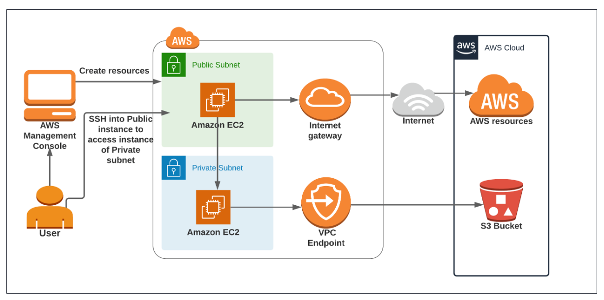

### **Desafio de Negócio**

**Desafio**: **Proteção e Processamento Seguro de Dados Sensíveis em Ambientes Regulatórios**

Em muitas indústrias, como a financeira, de saúde ou de tecnologia, as empresas lidam com grandes volumes de dados altamente sensíveis que devem ser protegidos rigorosamente para cumprir regulamentações como GDPR, HIPAA, ou normas internas de segurança. Um desafio comum é garantir que esses dados sejam processados de forma segura, sem exposição a ameaças externas, ao mesmo tempo em que permitem o acesso controlado para manutenção e monitoramento.

### **Cenário**

Uma empresa de serviços financeiros precisa processar dados de transações bancárias que são armazenados em um ambiente de armazenamento seguro (S3). Esses dados são altamente sensíveis e sujeitos a rigorosas regulamentações de proteção de dados. A empresa enfrenta o desafio de processar esses dados de forma eficiente e segura, garantindo que nenhum dado seja exposto à internet durante o processamento.

### **Motivação para Montar a Arquitetura**

1. **Segurança e Conformidade**: A principal motivação é proteger os dados sensíveis e cumprir as exigências regulatórias. Ao isolar o processamento de dados em uma subrede privada, a arquitetura garante que os dados não sejam expostos à internet. A conexão ao bucket S3 é feita exclusivamente através de um VPC Endpoint, mantendo o tráfego de dados dentro da infraestrutura segura da AWS.

2. **Acesso Controlado e Seguro**: Para manutenção e monitoramento, é necessário acesso à instância que processa os dados. No entanto, para evitar riscos, o acesso direto à instância privada não é permitido. Em vez disso, uma instância pública (Bastion Host) na subrede pública atua como um ponto de entrada seguro. Isso permite que apenas usuários autorizados, através de conexões seguras, possam acessar a instância privada, minimizando os riscos de ataques externos.

3. **Gerenciamento Eficiente de Recursos**: A arquitetura permite separar responsabilidades, com a instância privada focada exclusivamente no processamento seguro dos dados, enquanto a instância pública gerencia o acesso e monitoramento. Isso facilita a manutenção, escalabilidade e otimização de recursos, garantindo que cada componente esteja configurado para desempenhar sua função da forma mais eficiente possível.

### **Benefício para o Negócio**

Implementar essa arquitetura permite à empresa processar dados sensíveis em conformidade com regulamentações rigorosas, ao mesmo tempo em que assegura que os dados permanecem seguros e acessíveis apenas por usuários autorizados. Isso não só reduz o risco de violações de dados, como também garante que a empresa esteja em total conformidade com normas de proteção de dados, evitando penalidades e mantendo a confiança dos clientes e parceiros.

### **Estimativa de Custo para Implementação da Arquitetura**

Os custos de implementação de uma arquitetura como a descrita podem variar dependendo de vários fatores, como o tamanho e o uso dos recursos, a região da AWS em que o projeto é implementado, e o nível de utilização dos serviços. Abaixo, forneço uma estimativa aproximada baseada em preços de mercado comuns para os principais componentes da arquitetura.

#### **Componentes e Custos Estimados**

1. **VPC (Virtual Private Cloud)**
   - **Custo:** Geralmente, a criação e o uso de uma VPC são gratuitos. No entanto, os componentes dentro da VPC, como subredes e roteamento, podem gerar custos dependendo do tráfego.

2. **Instância EC2 Pública (Bastion Host)**
   - **Tipo de Instância:** t3.medium (2 vCPUs, 4 GB RAM)
   - **Custo:** Aproximadamente $0,0416 por hora.
   - **Uso Mensal (720 horas):** $29,95

3. **Instância EC2 Privada (Processamento)**
   - **Tipo de Instância:** m5.large (2 vCPUs, 8 GB RAM)
   - **Custo:** Aproximadamente $0,096 por hora.
   - **Uso Mensal (720 horas):** $69,12

4. **S3 Storage**
   - **Custo por GB armazenado:** $0,023 por GB.
   - **Transferência de dados entre buckets:** Sem custos dentro da mesma região.
   - **Estimativa de 500 GB de dados:** $11,50 por mês.

5. **VPC Endpoint para S3**
   - **Custo:** $0,01 por hora por endpoint.
   - **Uso Mensal (720 horas):** $7,20

6. **Tráfego de Dados (Internet Gateway)**
   - **Custo de saída de dados para a internet:** $0,09 por GB.
   - **Estimativa para 100 GB de tráfego de saída:** $9,00

7. **CloudWatch Logs e Métricas**
   - **Métricas Customizadas:** $0,30 por métrica por mês.
   - **Logs (5 GB por mês):** $0,50 por GB.
   - **Estimativa para logs e métricas:** $5,00 por mês.

8. **IAM (Roles e Usuários)**
   - **Custo:** A criação e gerenciamento de IAM Roles e Usuários não têm custos diretos associados.

#### **Custo Total Estimado Mensal**

| **Componente**                | **Custo Mensal** |
|--------------------------------|------------------|
| Instância EC2 Pública (t3.medium)  | $29,95           |
| Instância EC2 Privada (m5.large)   | $69,12           |
| Armazenamento S3 (500 GB)      | $11,50           |
| VPC Endpoint para S3           | $7,20            |
| Tráfego de Dados (100 GB)      | $9,00            |
| CloudWatch (Logs e Métricas)   | $5,00            |
| **Total Estimado**             | **$131,77**      |

### **Considerações Finais**

- **Custos Variáveis:** O custo final pode variar dependendo do uso efetivo dos recursos, como o tráfego de dados e o armazenamento adicional no S3.
- **Reduções Potenciais:** Usar instâncias spot ou reservar instâncias EC2 para contratos de longo prazo pode reduzir significativamente os custos.
- **Testes e Desenvolvimento:** Durante a fase de desenvolvimento e teste, você pode utilizar instâncias menores e reduzir a quantidade de dados processados para minimizar os custos.

Essas estimativas fornecem uma visão geral dos custos mensais associados a manter essa arquitetura AWS em produção. Ajustes específicos podem ser feitos com base nas necessidades e no uso real do projeto.

O custo de desenvolvimento de um projeto como esse pode variar amplamente dependendo de vários fatores, como a complexidade do projeto, a experiência e localização dos desenvolvedores, o tempo necessário para implementação, e se você contratará uma equipe interna, freelancers ou uma empresa especializada.

### **Fatores a Considerar no Cálculo do Custo de Desenvolvimento**

1. **Tamanho e Complexidade do Projeto**:
   - Este projeto envolve a configuração de uma infraestrutura AWS, desenvolvimento de scripts de automação e monitoramento, além de garantir segurança e conformidade com práticas recomendadas.

2. **Equipe Necessária**:
   - **Arquiteto de Soluções AWS**: Responsável por desenhar a arquitetura e configurar os serviços AWS.
   - **Engenheiro de DevOps**: Para implementar a infraestrutura como código (IaC) usando ferramentas como Terraform ou CloudFormation.
   - **Desenvolvedor Backend (Python, etc.)**: Para desenvolver scripts de automação e o dashboard.
   - **Especialista em Segurança**: Para configurar corretamente as políticas de IAM e garantir que a infraestrutura seja segura.
   - **Gerente de Projeto**: Para coordenar o desenvolvimento e garantir que o projeto seja entregue dentro do prazo e orçamento.

3. **Tempo de Desenvolvimento**:
   - **Fase de Planejamento e Design**: 1-2 semanas
   - **Configuração da Infraestrutura AWS**: 2-3 semanas
   - **Desenvolvimento de Scripts e Dashboard**: 3-4 semanas
   - **Testes e Ajustes**: 1-2 semanas
   - **Total Estimado**: 7-11 semanas

### **Estimativa de Custo de Desenvolvimento**

1. **Arquiteto de Soluções AWS**:
   - **Taxa por Hora**: $100 - $200
   - **Horas Estimadas**: 40 - 80 horas
   - **Custo Total**: $4,000 - $16,000

2. **Engenheiro de DevOps**:
   - **Taxa por Hora**: $80 - $150
   - **Horas Estimadas**: 60 - 100 horas
   - **Custo Total**: $4,800 - $15,000

3. **Desenvolvedor Backend**:
   - **Taxa por Hora**: $60 - $120
   - **Horas Estimadas**: 80 - 120 horas
   - **Custo Total**: $4,800 - $14,400

4. **Especialista em Segurança**:
   - **Taxa por Hora**: $100 - $200
   - **Horas Estimadas**: 20 - 40 horas
   - **Custo Total**: $2,000 - $8,000

5. **Gerente de Projeto**:
   - **Taxa por Hora**: $60 - $100
   - **Horas Estimadas**: 40 - 60 horas
   - **Custo Total**: $2,400 - $6,000

### **Custo Total Estimado de Desenvolvimento**

| **Função**                       | **Custo Estimado** |
|----------------------------------|--------------------|
| Arquiteto de Soluções AWS        | $4,000 - $16,000   |
| Engenheiro de DevOps             | $4,800 - $15,000   |
| Desenvolvedor Backend            | $4,800 - $14,400   |
| Especialista em Segurança        | $2,000 - $8,000    |
| Gerente de Projeto               | $2,400 - $6,000    |
| **Custo Total Estimado**         | **$18,000 - $59,400** |

### **Considerações Adicionais**

- **Sobrecarga e Contingências**: Geralmente, é recomendado adicionar 10-20% ao orçamento total para cobrir eventuais imprevistos ou mudanças no escopo do projeto.
- **Opções de Redução de Custo**: Se o orçamento for um problema, pode-se considerar freelancers ou empresas de desenvolvimento em regiões com taxas mais baixas. Alternativamente, parte do trabalho pode ser automatizada ou simplificada, reduzindo o tempo de desenvolvimento.

### **Custo Total Estimado (Desenvolvimento + Operação)**

- **Desenvolvimento**: $18,000 - $59,400
- **Operação Mensal**: $131,77 (como estimado anteriormente)
- **Primeiro Mês (Desenvolvimento + Operação)**: $18,131.77 - $59,531.77

Essa estimativa deve fornecer uma visão abrangente dos custos envolvidos na criação e operação dessa arquitetura AWS, permitindo um planejamento financeiro mais preciso.

### **Requisitos do Projeto: Arquitetura AWS para Acesso a S3 a Partir de EC2 em Rede Privada**

#### **1. Objetivo do Projeto**
O objetivo deste projeto é configurar uma arquitetura AWS onde uma instância EC2 privada acessa buckets S3 em uma rede privada usando um Gateway Endpoint. Para facilitar a gestão e o monitoramento, também será criada uma instância EC2 pública, que atuará como um bastion host, permitindo o acesso seguro à instância privada. A arquitetura será implementada dentro de uma VPC, com subredes públicas e privadas devidamente configuradas para garantir segurança e eficiência.

#### **2. Requisitos do Projeto**

**2.1. Infraestrutura de Rede (VPC)**
- **VPC**: Criar uma Virtual Private Cloud (VPC) que incluirá subredes públicas e privadas.
- **Subrede Pública**:
  - Deve conter uma instância EC2 pública que atuará como um bastion host, permitindo o acesso SSH à instância privada na subrede privada.
  - Deve ser conectada a um Internet Gateway para permitir o tráfego de entrada e saída da internet.
- **Subrede Privada**:
  - Deve conter uma instância EC2 privada, responsável por acessar e processar dados nos buckets S3.
  - Não deve ter acesso direto à internet, garantindo que todo o tráfego externo seja gerenciado através da instância pública.
- **Gateway Endpoint**:
  - Criar um Gateway Endpoint para S3, associado à tabela de rotas da subrede privada, permitindo que a instância EC2 privada acesse os buckets S3 sem passar pela internet.

**2.2. EC2 Instances**
- **Instância EC2 Pública (Bastion Host)**:
  - Deve ser configurada na subrede pública para permitir o acesso SSH à instância EC2 privada.
  - Esta instância terá acesso à internet para downloads de pacotes e outras operações de manutenção.
- **Instância EC2 Privada**:
  - Localizada na subrede privada, será responsável por processar os dados nos buckets S3.
  - Deve ser configurada para acessar os buckets S3 via o Gateway Endpoint.
  - O acesso SSH à instância privada deve ser feito exclusivamente através do bastion host, garantindo que a instância permaneça isolada da internet.

**2.3. S3 Buckets**
- **Buckets S3**:
  - Criar e configurar os buckets S3 necessários para o projeto.
  - Garantir que o acesso a esses buckets seja feito exclusivamente via o Gateway Endpoint a partir da instância privada, mantendo os dados seguros dentro da VPC.

**2.4. IAM Roles e Políticas**
- **IAM Role para Instância EC2 Privada**:
  - Criar uma IAM Role que conceda à instância EC2 privada as permissões necessárias para acessar os buckets S3 via o Gateway Endpoint.
  - Esta role deve ser restrita apenas às ações necessárias, seguindo o princípio do menor privilégio.
- **IAM User com Permissões Restritas**:
  - Criar um usuário IAM com permissões específicas para gerenciar os recursos do projeto (EC2, VPC, S3).
  - Este usuário deve ter permissões limitadas ao escopo do projeto e não deve ser capaz de criar outros usuários IAM ou modificar configurações globais de segurança.

#### **3. Escopo do Projeto**
O escopo do projeto inclui a configuração de uma VPC com subredes públicas e privadas, a criação de uma instância EC2 pública (bastion host) e uma instância EC2 privada, a configuração de um Gateway Endpoint para S3, e a implementação de políticas de segurança que garantam acesso seguro e restrito aos recursos AWS envolvidos.

**Incluído no Escopo**:
- Configuração da VPC com subredes públicas e privadas.
- Criação e configuração de uma instância EC2 pública (bastion host) e uma instância EC2 privada.
- Configuração de um Gateway Endpoint para S3.
- Criação e configuração de buckets S3 com políticas de acesso apropriadas.
- Configuração de IAM Roles e políticas para acesso seguro e restrito aos recursos.

**Excluído do Escopo**:
- Gerenciamento de outras infraestruturas não relacionadas ao projeto.
- Configuração de segurança e políticas IAM globais não especificadas no escopo do projeto.

#### **4. Entregáveis do Projeto**

**4.1. Documentação de Configuração**
- Instruções detalhadas sobre como criar e configurar cada componente da arquitetura (VPC, subredes, EC2, IAM Role, Gateway Endpoint, S3 buckets, etc.).
- Especificações das políticas IAM personalizadas utilizadas no projeto.

**4.2. Instâncias EC2 Configuradas**
- Instância EC2 pública (bastion host) e instância EC2 privada operacionais e configuradas corretamente.

**4.3. Buckets S3 Configurados**
- Buckets S3 configurados com as políticas de acesso corretas, garantido que o acesso seja feito via Gateway Endpoint.

**4.4. Usuário IAM com Permissões Restritas**
- Criação do usuário IAM com a política personalizada, garantindo que ele possa gerenciar os recursos deste projeto de forma segura e controlada.

**4.5. VPC Configurada**
- VPC configurada com subredes públicas e privadas, e um Gateway Endpoint para S3 configurado corretamente.

Com base nesse documento, o usuário deve ser capaz de criar e configurar toda a infraestrutura necessária para o projeto de transferência segura de dados entre buckets S3 na AWS utilizando uma instância EC2 privada e um bastion host.