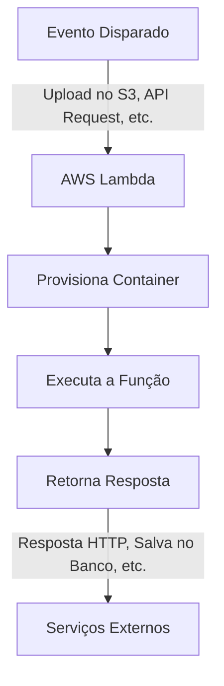
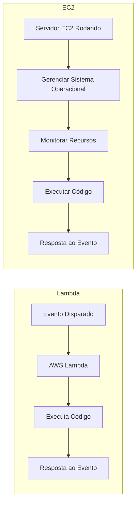
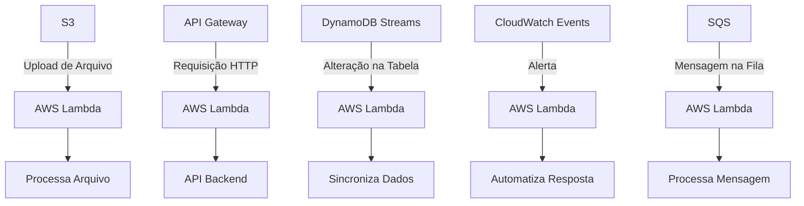
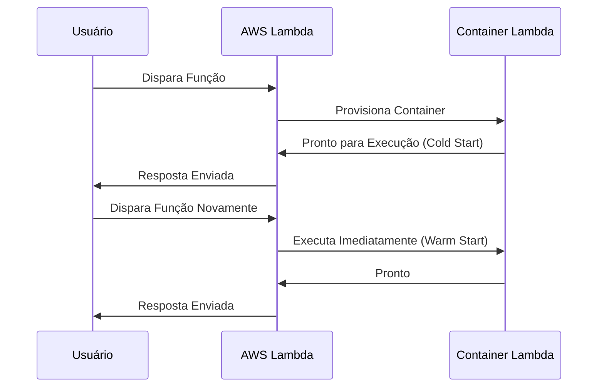

### Aula 09: AWS Lambda e Eventos na AWS

**Objetivo**: Nesta aula, exploraremos o AWS Lambda e seu papel dentro de arquiteturas serverless na AWS. Vamos entender as diferenças entre o AWS Lambda e o EC2, discutir suas vantagens e desafios, e aprender como eventos podem ser aproveitados para criar sistemas escaláveis e eficientes.

### **1. Introdução ao AWS Lambda**

AWS Lambda é um serviço de computação serverless que executa código sem que você precise gerenciar servidores. Ele é ideal para processos pontuais que respondem automaticamente a eventos, como uploads no S3, alterações em bancos de dados, e requisições HTTP através do API Gateway. Embora o termo "serverless" sugira a ausência de servidores, na prática, isso significa que o código é executado em servidores gerenciados pela AWS, não por você.

### **2. Diferença entre AWS Lambda e EC2**

#### **2.1. AWS EC2 (Elastic Compute Cloud)**
- **Definição**: Serviço de computação que permite criar e gerenciar instâncias de servidores virtuais na nuvem, oferecendo controle total sobre o ambiente.
- **Vantagens**:
  - **Controle Completo**: Customização do ambiente de software e hardware.
  - **Ambientes Persistentes**: Ideal para aplicações que exigem disponibilidade contínua.
  - **Escalabilidade Flexível**: Permite ajustes manuais ou automáticos de recursos.
- **Desafios**:
  - **Gerenciamento**: Requer manutenção contínua e configuração detalhada.
  - **Custo**: Pagamento contínuo pelo tempo de execução, independente do uso.
  - **Complexidade de Configuração**: Requer atenção aos detalhes de rede, segurança e capacidade.

#### **2.2. AWS Lambda**
- **Definição**: Serviço que executa código em resposta a eventos sem necessidade de gerenciar servidores, cobrando apenas pelo tempo de execução.
- **Vantagens**:
  - **Serverless**: Reduz a complexidade operacional.
  - **Escalabilidade Automática**: Ajusta automaticamente com base na carga de eventos.
  - **Custo-Eficiência**: Ideal para cargas intermitentes com pagamento por uso.
- **Desafios**:
  - **Limitações de Execução**: Tempo máximo de 15 minutos, com restrições de memória e armazenamento.
  - **Cold Starts**: Pequenos atrasos iniciais quando funções são ativadas após inatividade.
  - **Configuração de Permissões**: Requer configurações cuidadosas para garantir segurança.

### **3. Principais Casos de Uso do AWS Lambda**
- **Processamento de Arquivos**: Automatiza tarefas como redimensionamento de imagens e análise de dados em S3.
- **ETL em Tempo Real**: Transformação de dados em tempo real a partir de streams de dados.
- **APIs Serverless**: Gerenciamento de APIs com API Gateway e Lambda.
- **Eventos de IoT**: Resposta a dados de dispositivos IoT.
- **Automação de Infraestrutura**: Tarefas automatizadas como limpeza de recursos e monitoramento.

### **4. Eventos na AWS e Integração com Lambda**
Lambda pode ser acionado por diversos eventos na AWS, permitindo respostas dinâmicas a mudanças nos serviços.
- **Eventos S3**: Código executado ao upload de arquivos.
- **Eventos DynamoDB Streams**: Funções disparadas por alterações em tabelas.
- **Eventos API Gateway**: Requisições HTTP acionam funções Lambda.
- **Eventos CloudWatch**: Ações baseadas em alertas e agendamentos.
- **Eventos SQS**: Mensagens processadas de filas SQS.

### **5. Configurando uma Função AWS Lambda**
1. **Criar Função no Console AWS Lambda**: Selecione “Author from scratch” e configure nome, runtime e permissões.
2. **Escrever Código**: Escreva o código da função no editor integrado, definindo a lógica do lambda handler.
3. **Adicionar Trigger**: Configure o evento que irá acionar a função, como upload no S3 ou requisição HTTP.
4. **Testar Função**: Utilize o console para testes com eventos simulados e ajuste o código conforme necessário.

### **6. Comparação de Cenários de Uso: AWS Lambda vs. EC2**

| **Critério**           | **AWS EC2**                                  | **AWS Lambda**                              |
|------------------------|----------------------------------------------|---------------------------------------------|
| **Controle**           | Total sobre ambiente e recursos             | Limitado ao código da função                |
| **Persistência**       | Executa continuamente                       | Executa sob demanda, de forma intermitente  |
| **Escalabilidade**     | Manual ou automática                         | Automática com base em eventos              |
| **Gerenciamento**      | Requer configuração e manutenção            | Automação pela AWS                          |
| **Custo**              | Contínuo enquanto ativo                     | Paga apenas pelo uso                        |
| **Tempo de Resposta**  | Latência menor em execução contínua         | Cold starts podem aumentar a latência       |

### **7. Desafios ao Usar AWS Lambda e EC2**
- **AWS Lambda**: 
  - Limitações de tempo e recursos, cold starts e desafios de debug.
- **AWS EC2**: 
  - Requer gerenciamento contínuo, configuração de escalabilidade e custos constantes.

### **8. Motivação para Escolher AWS Lambda**
- **Economia**: Pagamento por uso sem custos fixos.
- **Escalabilidade**: Ajustes automáticos com base na demanda.
- **Foco no Código**: Sem preocupações com infraestrutura.

### **Conclusão**
AWS Lambda oferece uma abordagem serverless que simplifica a execução de código na nuvem, focando em escalabilidade e economia de custos. Comparado ao EC2, o Lambda reduz a complexidade de gerenciamento, mas exige um entendimento claro de suas limitações. A escolha entre Lambda e EC2 deve considerar o caso de uso específico, pesando controle, custos e necessidades operacionais.

Vou criar alguns diagramas usando Mermaid para ilustrar os conceitos apresentados na aula sobre AWS Lambda e EC2. Esses diagramas ajudarão a visualizar como o AWS Lambda funciona, suas integrações com eventos e uma comparação com o EC2.

### 1. **Funcionamento do AWS Lambda**

Este diagrama mostra como o AWS Lambda processa uma função em resposta a eventos. A função é executada em um ambiente serverless, escalando automaticamente conforme a necessidade.

### 2. **Comparação AWS Lambda vs EC2**

Este diagrama compara os fluxos de uso do AWS Lambda e do EC2, mostrando a diferença no gerenciamento de infraestrutura.

### 3. **Arquitetura Serverless com AWS Lambda**

Este diagrama mostra uma arquitetura típica serverless, onde múltiplos serviços da AWS interagem com o Lambda para automatizar processos.

### 4. **Cold Start do AWS Lambda**

Este diagrama ilustra o processo de Cold Start, mostrando o tempo adicional necessário para provisionar o ambiente na primeira execução após um período de inatividade.

Esses diagramas ajudam a visualizar os fluxos de trabalho e as diferenças entre AWS Lambda e EC2, bem como a dinâmica dos eventos que integram o Lambda em uma arquitetura serverless.