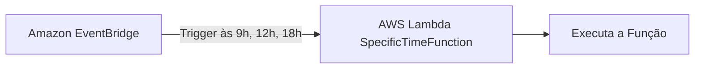

Aqui está a versão ajustada da aula, modificando o exemplo 4 para realizar um GET request usando a biblioteca `requests`:

### Aula 10: Projetos Práticos com AWS Lambda

**Objetivo**: Nesta aula, realizaremos uma série de projetos práticos utilizando AWS Lambda. Vamos explorar como configurar funções Lambda para serem acionadas por eventos temporais e específicos, realizar requests HTTP e integrar com o Amazon RDS para criar soluções serverless eficientes.

### **Projetos da Aula 10**

1. **Configuração de Timer de 10 em 10 Minutos com AWS Lambda**

   **Objetivo**: Demonstrar como agendar uma função Lambda para ser executada a cada 10 minutos usando o Amazon CloudWatch Events (ou EventBridge).

   **Passo a Passo**:
   1. Acesse o AWS Management Console e selecione **Lambda**.
   2. Crie uma nova função Lambda com o nome `TimerFunction`.
   3. Vá para **CloudWatch Events** e crie uma nova regra com uma expressão cron `cron(0/10 * * * ? *)` para disparar a cada 10 minutos.
   4. Vincule essa regra à função `TimerFunction`.
   5. Teste para confirmar que a função está sendo acionada conforme esperado.

   ```python
   def lambda_handler(event, context):
       print("Função executada a cada 10 minutos.")
       return {
           'statusCode': 200,
           'body': 'Execução bem-sucedida.'
       }
   ```

   ```mermaid
   graph LR
       CW[CloudWatch Events] -->|Trigger a cada 10 minutos| Lambda1[AWS Lambda TimerFunction]
       Lambda1 --> Process1[Executa a Função]
   ```

### 2. **Configuração de Funções Lambda para Horários Específicos**

**Objetivo**: Ensinar como configurar a execução de uma função Lambda em horários específicos, como às 9h, 12h, e 18h diariamente.

**Passo a Passo**:
1. No AWS Management Console, crie uma função Lambda chamada `SpecificTimeFunction`.
2. Acesse **EventBridge (antigo CloudWatch Events)**, que é o serviço da AWS responsável por gerenciar eventos e agendamentos.
3. Crie uma regra com uma expressão cron, por exemplo, `cron(0 9,12,18 * * ? *)`, que dispara a função nos horários específicos: 9h, 12h e 18h.
4. Vincule essa regra à função Lambda `SpecificTimeFunction` como destino.
5. Teste a configuração simulando o disparo da função nos horários especificados.

```python
def lambda_handler(event, context):
    print("Função executada nos horários específicos: 9h, 12h e 18h.")
    return {
        'statusCode': 200,
        'body': 'Execução bem-sucedida nos horários específicos.'
    }
```



### **Amazon EventBridge (antigo CloudWatch Events)**

Amazon EventBridge é um serviço que facilita a criação de arquiteturas baseadas em eventos, permitindo que os serviços da AWS e aplicativos personalizados respondam a eventos de forma rápida e escalável. EventBridge é amplamente utilizado para agendamentos e automatização de fluxos de trabalho, incluindo a execução de funções Lambda em horários específicos.

#### **Possibilidades com EventBridge (CloudWatch Scheduler)**

EventBridge oferece uma série de funcionalidades e flexibilidade na configuração de eventos e cronogramas:

1. **Cronogramas (Schedules)**:
   - Permite a criação de agendamentos para acionar funções Lambda, tarefas ECS, Step Functions, e outros destinos com base em uma expressão cron ou rate.
   - Pode ser utilizado para tarefas repetitivas como limpeza de logs, sincronização de dados, e execução de processos diários.

2. **Criar um Cronograma no EventBridge**:
   - **Etapa 1: Especificar Detalhes do Cronograma**:
     - Defina um nome para o cronograma e escolha entre uma expressão cron ou rate para determinar a frequência de execução.
     - Por exemplo, a expressão `cron(0 9,12,18 * * ? *)` agenda a execução para às 9h, 12h e 18h todos os dias.

   - **Etapa 2: Selecionar Destinos**:
     - Escolha o destino da regra de evento, como AWS Lambda, Step Functions, SQS, SNS, entre outros.
     - Nesse caso, o destino será a função `SpecificTimeFunction`.

   - **Etapa 3: Configurações**:
     - Configure permissões para que o EventBridge possa invocar o destino selecionado.
     - Inclua outras configurações opcionais, como filtros de eventos e políticas de retry em caso de falhas.

   - **Etapa 4: Revisar e Criar uma Programação**:
     - Revise as configurações definidas e clique em “Create” para finalizar a criação da regra.

3. **Exemplos de Uso do EventBridge**:
   - **Automação de Processos**: Execução de scripts de manutenção de banco de dados, backup de arquivos, ou limpeza de logs em horários pré-definidos.
   - **Alertas e Monitoramento**: Envio de alertas baseados em agendamentos ou eventos ocorridos em outros serviços AWS.
   - **Integração de Sistemas**: Facilita a comunicação entre sistemas, disparando eventos com base em horários ou outras condições.

4. **Benefícios do EventBridge**:
   - **Escalabilidade e Confiabilidade**: Gerencia eventos de forma eficiente e escalável, garantindo que os agendamentos ocorram conforme especificado.
   - **Redução de Complexidade**: Elimina a necessidade de gerenciar servidores para agendamentos, simplificando a arquitetura.
   - **Facilidade de Integração**: Integra facilmente com múltiplos serviços AWS e aplicações personalizadas.

Amazon EventBridge é uma ferramenta poderosa para agendamento e gerenciamento de eventos em sistemas distribuídos, proporcionando uma solução flexível para automatizar processos com Lambda e outros serviços na AWS. A utilização de cronogramas e regras facilita o desenvolvimento de soluções eficientes e escaláveis, reduzindo a carga operacional e permitindo que você foque em lógica de negócios ao invés de infraestrutura.

Se precisar de mais detalhes sobre EventBridge ou outros aspectos dos exemplos, me avise!

3. **Criação de Funções Lambda para Realizar Requests HTTP**

   **Objetivo**: Demonstrar como usar AWS Lambda para fazer requests HTTP utilizando o módulo `urllib3`, nativo do Python.

   **Passo a Passo**:
   1. Crie uma nova função Lambda chamada `HTTPRequestFunction`.
   2. Utilize o módulo `urllib3` para realizar um GET request para uma API pública e processar a resposta.
   3. Teste a função e visualize os logs para garantir que o request foi realizado corretamente.

   ```python
import urllib3
import json
import os

# Carregar variáveis de ambiente
url = os.getenv('API_URL')  # URL da API obtida das variáveis de ambiente
api_key = os.getenv('CMC_API_KEY')  # Chave da API obtida das variáveis de ambiente

# Parâmetros da requisição para obter a cotação do Bitcoin
parameters = {
    'symbol': 'BTC',  # Identificando o Bitcoin pelo símbolo
    'convert': 'USD'  # Convertendo a cotação para USD
}

# Headers com a chave da API
headers = {
    'Accept': 'application/json',
    'X-CMC_PRO_API_KEY': api_key  # Obtendo a chave da API das variáveis de ambiente
}

# Criar um PoolManager para gerenciar conexões
http = urllib3.PoolManager()

# Função Lambda
def lambda_handler(event, context):
    try:
        # Converte os parâmetros para o formato de query string
        query_string = '&'.join([f'{key}={value}' for key, value in parameters.items()])
        full_url = f"{url}?{query_string}"
        
        # Fazendo o request GET para a API
        response = http.request('GET', full_url, headers=headers)
        data = json.loads(response.data.decode('utf-8'))
        
        # Verificar se os dados do Bitcoin estão presentes na resposta
        if 'data' in data and 'BTC' in data['data']:
            bitcoin_data = data['data']['BTC']
            usd_quote = bitcoin_data['quote']['USD']
            
            # Log da resposta
            print(f"Cotação do Bitcoin obtida: {usd_quote}")
        else:
            print("Erro ao obter a cotação do Bitcoin:", data.get('status', {}).get('error_message', 'Erro desconhecido'))

    except urllib3.exceptions.HTTPError as e:
        print(f"Erro na requisição: {e}")

   ```

   ```mermaid
   graph LR
       Lambda3[AWS Lambda HTTPRequestFunction] -->|Faz Request HTTP| API[API Externa]
       API --> Process3[Processa Resposta]
   ```

Para criar um cron job que execute uma AWS Lambda a cada minuto, você pode usar o Amazon CloudWatch Events (agora parte do Amazon EventBridge) para configurar um agendamento. A seguir, explico como criar um evento cron que dispara sua Lambda a cada minuto:

### Passo a passo para configurar um cron job de 1 minuto para AWS Lambda:

1. **Acesse o Amazon EventBridge:**
   - Vá para o Console da AWS.
   - Pesquise por "EventBridge" (ou "CloudWatch Events" dependendo da interface).

2. **Crie uma nova regra:**
   - Clique em "Create rule".

3. **Configure a regra:**
   - **Name:** Dê um nome para a regra, como `lambda-every-minute`.
   - **Description:** Adicione uma descrição opcional para explicar o que a regra faz.
   - **Define pattern:** Escolha "Event Source" como "Event pattern" ou "Schedule".
   - Selecione **Schedule** e escolha **Cron expression**.

4. **Defina a expressão cron:**
   - Use a expressão cron para executar a cada minuto:
     ```
     cron(0/1 * * * ? *)
     ```
   - Explicação da expressão:
     - `0/1`: Começa no segundo zero e repete a cada 1 minuto.
     - `*`: Qualquer hora.
     - `*`: Qualquer dia do mês.
     - `*`: Qualquer mês.
     - `?`: Qualquer dia da semana.

5. **Defina o destino da regra:**
   - Escolha "Lambda function".
   - Selecione a função Lambda que deseja disparar a cada minuto.

6. **Configurações adicionais:**
   - Se precisar, adicione um "Input Transformer" para modificar os dados enviados para a Lambda, ou ajuste permissões conforme necessário.

7. **Permissões:**
   - O EventBridge precisará de permissões para invocar sua função Lambda. Se necessário, o AWS adicionará as permissões automaticamente quando você configurar o destino.

8. **Criar a regra:**
   - Clique em "Create" para finalizar a configuração.

### Nota Importante:

- **Limites de execução:** Executar uma Lambda a cada minuto pode impactar os limites de execução simultânea e a fatura da AWS. Monitore o uso para garantir que o cron não exceda os limites da sua conta.
- **Lambda Timeout:** Certifique-se de que sua Lambda está configurada com um timeout adequado para o processamento, especialmente se a execução em 1 minuto for crítica.

Se precisar de mais alguma coisa, me avise!

4. **Criação de Funções Lambda para Realizar Requests HTTP com `requests`**

   **Objetivo**: Mostrar como instalar o módulo `requests` e utilizá-lo para fazer um GET request para uma API.

   **Passo a Passo**:
   1. No AWS Lambda, crie uma função chamada `GetRequestFunction`.
   2. Adicione a biblioteca `requests` ao ambiente Lambda (você pode empacotar o `requests` com o código ou usar um Lambda Layer).
   3. Utilize `requests` para realizar um GET request a uma API pública.

   ```python
 import requests
import json
import os

# Carregar variáveis de ambiente
url = os.getenv('API_URL')  # URL da API obtida das variáveis de ambiente
api_key = os.getenv('CMC_API_KEY')  # Chave da API obtida das variáveis de ambiente

# Parâmetros da requisição para obter a cotação do Bitcoin
parameters = {
    'symbol': 'BTC',  # Identificando o Bitcoin pelo símbolo
    'convert': 'USD'  # Convertendo a cotação para USD
}

# Headers com a chave da API
headers = {
    'Accept': 'application/json',
    'X-CMC_PRO_API_KEY': api_key  # Obtendo a chave da API das variáveis de ambiente
}

# Função Lambda
def lambda_handler(event, context):
    try:
        # Criar uma sessão para gerenciar as requisições
        with requests.Session() as session:
            # Configurar os headers da sessão
            session.headers.update(headers)
            
            # Fazer o request GET para a API com parâmetros
            response = session.get(url, params=parameters)
            response.raise_for_status()  # Levanta um erro se o status code for 4xx ou 5xx
            
            data = response.json()  # Carregar a resposta JSON
            
            # Verificar se os dados do Bitcoin estão presentes na resposta
            if 'data' in data and 'BTC' in data['data']:
                bitcoin_data = data['data']['BTC']
                usd_quote = bitcoin_data['quote']['USD']
                
                # Log da resposta
                print(f"Cotação do Bitcoin obtida: {usd_quote}")
            else:
                print("Erro ao obter a cotação do Bitcoin:", data.get('status', {}).get('error_message', 'Erro desconhecido'))

    except requests.exceptions.RequestException as e:
        print(f"Erro na requisição: {e}")

   ```

   ```mermaid
   graph LR
       Lambda4[AWS Lambda GetRequestFunction] -->|Faz Request GET| API[API Externa]
       API --> Process4[Processa Resposta]
   ```

5. **Integração do AWS Lambda com Amazon RDS**

   **Objetivo**: Demonstrar como conectar uma função Lambda a um banco de dados RDS para fazer um GET request em uma API e inserir os dados no banco de dados.

   **Passo a Passo**:
   1. Crie um banco de dados RDS (PostgreSQL, MySQL, etc.) e configure as permissões de segurança para permitir acesso a partir da função Lambda.
   2. Crie uma função Lambda chamada `RDSIntegrationFunction` e configure-a para acessar o RDS.
   3. Utilize `urllib3` para fazer o GET request e `psycopg2` para inserir os dados no banco RDS.

   ```python
   import urllib3
   import psycopg2

   def lambda_handler(event, context):
       # Fazendo o request HTTP
       http = urllib3.PoolManager()
       response = http.request('GET', 'https://api.openweathermap.org/data/2.5/weather?q=London&appid=YOUR_API_KEY')
       data = response.data.decode('utf-8')
       
       # Configurações de conexão com o RDS
       conn = psycopg2.connect(
           host="rds-endpoint.amazonaws.com",
           database="mydb",
           user="username",
           password="password"
       )
       cursor = conn.cursor()

       # Inserindo dados no RDS
       cursor.execute("INSERT INTO weather_data (response) VALUES (%s)", (data,))
       conn.commit()

       cursor.close()
       conn.close()

       return {
           'statusCode': 200,
           'body': 'Dados inseridos com sucesso no RDS!'
       }
   ```

   ```mermaid
   graph LR
       Lambda5[AWS Lambda RDSIntegrationFunction] -->|Faz Request GET| API[API Externa]
       API --> Process5[Processa Resposta]
       Process5 -->|Insere Dados| RDS[RDS Database]
   ```

### **Conclusão da Aula 10**

Nesta aula prática, exploramos cinco cenários diferentes de uso do AWS Lambda, destacando sua flexibilidade e integração com outros serviços da AWS. As demonstrações forneceram uma base sólida sobre como configurar funções Lambda para operar com eventos temporais, realizar requisições HTTP e conectar-se a bancos de dados RDS, reforçando o papel do Lambda como uma ferramenta essencial para arquiteturas modernas e escaláveis.