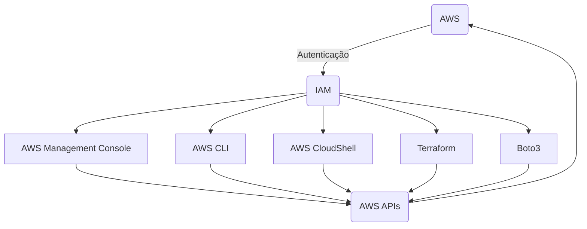

# Aula 12: Introdução ao AWS CLI

**Objetivo**: Nesta aula, vamos aprender sobre o AWS Command Line Interface (CLI), explorando como instalar a ferramenta, configurá-la e utilizá-la para gerenciar serviços da AWS diretamente do terminal. Vamos também discutir o AWS CloudShell, uma alternativa prática que permite usar o AWS CLI sem precisar instalar nada. O objetivo é que você saia desta aula sabendo como interagir com a AWS de forma eficiente e automatizada.



## **Tópicos da Aula 12**

### 1. **Introdução ao AWS CLI e AWS CloudShell**

   **Objetivo**: Entender o que é o AWS CLI e conhecer o AWS CloudShell como uma alternativa para começar a utilizar o CLI sem instalação local.

   **O que é AWS CLI**:
   - O AWS Command Line Interface (CLI) é uma ferramenta unificada para gerenciar serviços da AWS diretamente do terminal. Ele permite a criação, gerenciamento e automação de recursos na AWS de forma programática.
   - Com o AWS CLI, é possível interagir com todos os serviços da AWS, como S3, EC2, RDS, Lambda, entre outros, por meio de comandos simples.

   **Vantagens do AWS CLI**:
   - **Automação**: Facilita a automação de tarefas como criação de recursos, backups e monitoramento.
   - **Integração**: Trabalha bem com ferramentas de DevOps, pipelines de CI/CD, e scripts shell.
   - **Eficiência**: Reduz a necessidade de navegar pelo console da AWS para tarefas repetitivas.

   **O que é AWS CloudShell**:
   - O AWS CloudShell é uma ferramenta que permite usar o AWS CLI diretamente no navegador, sem precisar instalar nada no seu computador.
   - Ele oferece um ambiente shell baseado em navegador com o AWS CLI pré-instalado e configurado com suas credenciais de usuário.
   - Isso é particularmente útil quando você precisa executar comandos rápidos ou testar scripts em diferentes máquinas sem se preocupar com configurações locais.

   **Como usar o AWS CloudShell**:
   1. Acesse o **AWS Management Console** e procure por "CloudShell".
   2. Clique em **CloudShell** no menu superior. Isso abrirá um terminal diretamente no navegador, já autenticado com suas credenciais AWS.
   3. Use o AWS CLI no CloudShell como se estivesse no seu terminal local:
   ```bash
   aws s3 ls
   ```

   **Vantagens do CloudShell**:
   - Acesso rápido ao AWS CLI sem instalação.
   - Ambiente seguro e pré-configurado.
   - Capacidade de armazenar até 1 GB de dados no ambiente CloudShell.
   - Ideal para quem está começando ou para quem trabalha com múltiplos dispositivos.

### 2. **Instalação do AWS CLI no Windows**

   **Objetivo**: Demonstrar o passo a passo para instalar o AWS CLI em máquinas com o sistema operacional Windows.

   **Passo a Passo**:
   1. **Baixar o AWS CLI**:
      - Acesse a [página oficial de download do AWS CLI](https://aws.amazon.com/cli/) e selecione a versão para Windows.
   
   2. **Instalar o AWS CLI**:
      - Após o download, execute o arquivo `.msi` e siga as instruções do instalador.
   
   3. **Verificar a instalação**:
      - Abra o Prompt de Comando (cmd) ou PowerShell e digite o seguinte comando para verificar se a instalação foi concluída com sucesso:
      ```bash
      aws --version
      ```
      - A saída deve ser algo como `aws-cli/2.x.x Python/3.x.x`.

   4. **Configuração do AWS CLI**:
      - Para configurar o AWS CLI com suas credenciais, você pode usar o comando `aws configure`. Isso cria um perfil padrão que será usado para autenticação:
      ```bash
      aws configure
      ```
      - Insira as seguintes informações:
        - **AWS Access Key ID**: Sua chave de acesso.
        - **AWS Secret Access Key**: Sua chave secreta.
        - **Default region name**: A região padrão, como `us-east-1`.
        - **Default output format**: O formato de saída, como `json`.

### 3. **Configuração de Perfis com AWS CLI**

   **Objetivo**: Aprender a configurar múltiplos perfis para gerenciar diferentes contas ou ambientes de trabalho na AWS.

   **O que são perfis no AWS CLI?**
   - Perfis permitem que você configure diferentes credenciais e configurações regionais para várias contas ou projetos AWS, sem sobrescrever suas credenciais padrão.
   - Você pode alternar facilmente entre perfis para acessar diferentes ambientes (produção, desenvolvimento, etc.).

   **Como configurar perfis no AWS CLI**:
   1. Use o comando `aws configure --profile` para criar um novo perfil:
   ```bash
   aws configure --profile nome-do-perfil
   ```
   2. Você será solicitado a inserir suas credenciais da mesma forma que no comando `aws configure`:
      - **AWS Access Key ID**: Insira a chave de acesso para esse perfil específico.
      - **AWS Secret Access Key**: Insira a chave secreta associada.
      - **Default region name**: A região para este perfil.
      - **Default output format**: O formato de saída desejado.

   **Alternar entre perfis**:
   - Para usar um perfil específico em um comando, você pode adicionar o parâmetro `--profile`:
   ```bash
   aws s3 ls --profile nome-do-perfil
   ```
   - Para definir um perfil como o padrão para a sessão, defina a variável de ambiente `AWS_PROFILE`:
   ```bash
   export AWS_PROFILE=nome-do-perfil
   ```

   **Exemplo de uso de múltiplos perfis**:
   - Pode ser útil se você estiver trabalhando com diferentes ambientes, como `desenvolvimento`, `staging` e `produção`. Cada perfil pode ter suas próprias credenciais e configuração regional:
   ```bash
   aws ec2 describe-instances --profile producao
   aws ec2 describe-instances --profile desenvolvimento
   ```

### 3.1 Exercício

Aqui está o passo a passo detalhado para criar dois perfis no AWS CLI e alternar entre eles:

### 1. **Configuração de Perfis com AWS CLI**

   **Objetivo**: Criar dois perfis de CLI para diferentes contas ou ambientes (por exemplo, desenvolvimento e produção) e alternar entre eles.

#### **Passo 1: Criar o primeiro perfil (Desenvolvimento)**

1. Abra o terminal ou o Prompt de Comando (cmd) no Windows.
2. Execute o comando `aws configure --profile` para configurar o primeiro perfil, que será para **desenvolvimento**:
   ```bash
   aws configure --profile desenvolvimento
   ```
3. O AWS CLI solicitará as seguintes informações:
   - **AWS Access Key ID**: Insira a chave de acesso da conta de desenvolvimento.
   - **AWS Secret Access Key**: Insira a chave secreta correspondente.
   - **Default region name**: Especifique a região, como `us-east-1`.
   - **Default output format**: Escolha o formato de saída desejado, como `json` ou `text`.

#### **Passo 2: Criar o segundo perfil (Produção)**

1. Novamente, no terminal ou Prompt de Comando, execute o comando para configurar o segundo perfil, que será para **produção**:
   ```bash
   aws configure --profile producao
   ```
2. O AWS CLI solicitará as mesmas informações:
   - **AWS Access Key ID**: Insira a chave de acesso da conta de produção.
   - **AWS Secret Access Key**: Insira a chave secreta correspondente.
   - **Default region name**: Especifique a região, como `us-west-2`.
   - **Default output format**: Escolha o formato de saída, como `json`.

### 2. **Verificar a Configuração dos Perfis**

Para verificar se os perfis foram configurados corretamente, você pode listar os perfis que estão salvos no arquivo de configuração:

```bash
cat ~/.aws/credentials
```

Ou no Windows:
```bash
type %USERPROFILE%\.aws\credentials
```

O arquivo `credentials` deve mostrar algo assim:

```plaintext
[desenvolvimento]
aws_access_key_id = YOUR_ACCESS_KEY_ID_DEV
aws_secret_access_key = YOUR_SECRET_ACCESS_KEY_DEV

[producao]
aws_access_key_id = YOUR_ACCESS_KEY_ID_PROD
aws_secret_access_key = YOUR_SECRET_ACCESS_KEY_PROD
```

### 3. **Como Alternar Entre Perfis**

#### **Método 1: Usar o parâmetro `--profile` em cada comando**

Sempre que quiser executar um comando usando um perfil específico, adicione o parâmetro `--profile`:

- Para listar buckets S3 no ambiente de **desenvolvimento**:
  ```bash
  aws s3 ls --profile desenvolvimento
  ```

- Para listar buckets S3 no ambiente de **produção**:
  ```bash
  aws s3 ls --profile producao
  ```

#### **Método 2: Definir o perfil padrão para a sessão usando a variável de ambiente `AWS_PROFILE`**

Você pode configurar o perfil padrão para a sessão atual definindo a variável de ambiente `AWS_PROFILE`.

- Para definir o perfil **desenvolvimento** como padrão:
  - No Linux/macOS:
    ```bash
    export AWS_PROFILE=desenvolvimento
    ```
  - No Windows (PowerShell):
    ```bash
    $env:AWS_PROFILE="desenvolvimento"
    ```
  - No Windows (CMD):
    ```bash
    set AWS_PROFILE=desenvolvimento
    ```

- Para definir o perfil **produção** como padrão:
  - No Linux/macOS:
    ```bash
    export AWS_PROFILE=producao
    ```
  - No Windows (PowerShell):
    ```bash
    $env:AWS_PROFILE="producao"
    ```
  - No Windows (CMD):
    ```bash
    set AWS_PROFILE=producao
    ```

Com o perfil definido como variável de ambiente, todos os comandos subsequentes usarão esse perfil por padrão. Por exemplo:

```bash
aws s3 ls
```

### 4. **Alternando Perfis em Scripts**

Se estiver escrevendo scripts, você pode incluir o parâmetro `--profile` diretamente nos comandos, ou definir o perfil desejado no início do script:

```bash
#!/bin/bash

# Definindo o perfil de produção
export AWS_PROFILE=producao

# Listar instâncias EC2 no ambiente de produção
aws ec2 describe-instances
```

### 5. **Conclusão**

Agora você sabe como configurar múltiplos perfis no AWS CLI e alternar entre eles. Isso facilita muito o gerenciamento de diferentes ambientes ou contas AWS, permitindo que você mantenha as credenciais organizadas e use o perfil correto para cada tarefa.

### 4. **Comandos Básicos no AWS CLI**

   **Objetivo**: Introduzir os principais comandos utilizados no AWS CLI e explicar sua sintaxe básica.

   **Comandos Comuns**:
   - **Listar buckets no S3**:
     ```bash
     aws s3 ls
     ```
   - **Criar um bucket S3**:
     ```bash
     aws s3 mb s3://nome-do-seu-bucket
     ```
   - **Descrever instâncias EC2**:
     ```bash
     aws ec2 describe-instances
     ```

   **Estrutura dos comandos do AWS CLI**:
   ```bash
   aws [serviço] [operação] [opções]
   ```

Aqui está o passo a passo para criar um arquivo JSON usando o comando `touch`, e em seguida, exportá-lo para o bucket S3 que você criou:

### Passo a Passo

#### 1. **Criar o bucket S3**
Se você ainda não criou o bucket no S3, utilize o comando abaixo para criá-lo:

```bash
aws s3 mb s3://nome-do-seu-bucket
```

#### 2. **Criar o arquivo JSON**
Agora vamos criar um arquivo JSON localmente.

1. No terminal, use o comando `touch` para criar um arquivo vazio chamado `dados.json`:
   ```bash
   touch dados.json
   ```

2. Em seguida, abra o arquivo com um editor de texto (como `nano`, `vim`, ou outro de sua escolha) e adicione alguns dados JSON de exemplo:

   ```bash
   nano dados.json
   ```

   Adicione o seguinte conteúdo:

   ```json
   {
     "nome": "Luciano",
     "idade": 34,
     "profissao": "Engenheiro de Dados"
   }
   ```

   Salve o arquivo e saia do editor.

#### 3. **Enviar o arquivo JSON para o bucket S3**

Agora, use o comando `aws s3 cp` para copiar o arquivo JSON que você criou para o bucket S3:

```bash
aws s3 cp dados.json s3://nome-do-seu-bucket/dados.json
```

Esse comando copiará o arquivo `dados.json` para o bucket `nome-do-seu-bucket`.

#### 4. **Verificar o upload no S3**
Você pode listar o conteúdo do bucket para verificar se o arquivo foi enviado corretamente:

```bash
aws s3 ls s3://nome-do-seu-bucket/
```

Se tudo estiver certo, você verá o arquivo `dados.json` listado no bucket.

#### 3.2 Principais comandos do S3 no AWS CLI

Aqui está uma lista completa dos comandos do AWS CLI para interagir com o **Amazon S3**:

### Comandos Principais do S3 no AWS CLI

1. **`mb`** (Make Bucket): Cria um novo bucket no Amazon S3.
   ```bash
   aws s3 mb s3://nome-do-seu-bucket
   ```

2. **`rb`** (Remove Bucket): Remove (deleta) um bucket vazio no S3.
   ```bash
   aws s3 rb s3://nome-do-seu-bucket
   ```

3. **`cp`** (Copy): Copia arquivos ou objetos entre o sistema de arquivos local e o S3, ou entre dois buckets S3.
   ```bash
   aws s3 cp origem destino
   ```

4. **`mv`** (Move): Move arquivos ou objetos entre o sistema de arquivos local e o S3, ou entre dois buckets S3.
   ```bash
   aws s3 mv origem destino
   ```

5. **`ls`** (List): Lista todos os buckets ou lista os arquivos em um bucket S3.
   - Para listar todos os buckets:
     ```bash
     aws s3 ls
     ```
   - Para listar os arquivos em um bucket:
     ```bash
     aws s3 ls s3://nome-do-seu-bucket/
     ```

6. **`rm`** (Remove): Remove arquivos ou objetos do bucket no S3.
   ```bash
   aws s3 rm s3://nome-do-seu-bucket/arquivo.txt
   ```

7. **`sync`** (Synchronize): Sincroniza o conteúdo entre um diretório local e um bucket S3, ou entre dois buckets S3.
   - Sincronizar um diretório local com um bucket S3:
     ```bash
     aws s3 sync ./diretorio-local s3://nome-do-seu-bucket
     ```
   - Sincronizar um bucket S3 com outro:
     ```bash
     aws s3 sync s3://bucket-origem s3://bucket-destino
     ```

8. **`website`**: Configura um bucket S3 para hospedar um site estático.
   - Para definir um bucket como um site:
     ```bash
     aws s3 website s3://nome-do-seu-bucket/ --index-document index.html --error-document error.html
     ```

9. **`presign`**: Gera uma URL pré-assinada para um objeto no S3, permitindo que o objeto seja acessado temporariamente.
   ```bash
   aws s3 presign s3://nome-do-seu-bucket/arquivo.txt
   ```

### Comandos Avançados

1. **`control-list` (ACL)**: Define ou recupera permissões de acesso ao bucket.
   - Para obter a lista de permissões (ACL) de um bucket:
     ```bash
     aws s3api get-bucket-acl --bucket nome-do-seu-bucket
     ```

2. **`head-object`**: Recupera metadados de um objeto sem precisar baixá-lo.
   ```bash
   aws s3api head-object --bucket nome-do-seu-bucket --key caminho-do-arquivo
   ```

3. **`put-object`**: Carrega um arquivo para um bucket S3 (similar ao `cp`).
   ```bash
   aws s3api put-object --bucket nome-do-seu-bucket --key caminho-do-arquivo --body arquivo.txt
   ```

4. **`get-object`**: Baixa um arquivo de um bucket S3 (similar ao `cp`).
   ```bash
   aws s3api get-object --bucket nome-do-seu-bucket --key caminho-do-arquivo arquivo.txt
   ```

5. **`list-objects`**: Lista todos os objetos dentro de um bucket S3 (similar ao `ls`, mas com mais detalhes).
   ```bash
   aws s3api list-objects --bucket nome-do-seu-bucket
   ```

### Outros Comandos Úteis

1. **`put-bucket-encryption`**: Ativa a criptografia no lado do servidor (Server-Side Encryption) para um bucket.
   ```bash
   aws s3api put-bucket-encryption --bucket nome-do-seu-bucket --server-side-encryption-configuration file://encryption.json
   ```

2. **`put-bucket-policy`**: Define uma política de acesso para o bucket.
   ```bash
   aws s3api put-bucket-policy --bucket nome-do-seu-bucket --policy file://policy.json
   ```

3. **`delete-bucket-policy`**: Remove uma política de acesso de um bucket.
   ```bash
   aws s3api delete-bucket-policy --bucket nome-do-seu-bucket
   ```

4. **`put-bucket-lifecycle-configuration`**: Define as regras de ciclo de vida para o bucket (ex.: mover para o Glacier, expirar objetos antigos).
   ```bash
   aws s3api put-bucket-lifecycle-configuration --bucket nome-do-seu-bucket --lifecycle-configuration file://lifecycle.json
   ```

---

### Resumo dos Comandos:

- **`mb`**: Criar bucket.
- **`rb`**: Remover bucket.
- **`cp`**: Copiar arquivos.
- **`mv`**: Mover arquivos.
- **`ls`**: Listar buckets ou arquivos.
- **`rm`**: Remover arquivos.
- **`sync`**: Sincronizar diretórios/buckets.
- **`website`**: Configurar bucket para hospedagem de sites.
- **`presign`**: Gerar URL pré-assinada.
- **`put-object`** e **`get-object`**: Enviar/baixar arquivos para/do bucket.

Esses são os comandos principais e avançados do AWS CLI para o serviço Amazon S3, abrangendo desde a criação e remoção de buckets até a configuração de permissões e políticas de acesso.

### 5. **Criação de um Banco de Dados RDS com AWS CLI**

   **Objetivo**: Demonstrar como criar uma instância de banco de dados RDS usando o AWS CLI.

   **Passo a Passo**:
   1. **Criar uma instância RDS**:
      - Use o comando `create-db-instance` para criar uma instância RDS MySQL:
      ```bash
      aws rds create-db-instance \
      --db-instance-identifier mydbinstance \
      --db-instance-class db.t2.micro \
      --engine mysql \
      --master-username admin \
      --master-user-password password123 \
      --allocated-storage 20 \
      --profile producao
      ```

   2. **Verificar a criação da instância**:
      - Use o comando `describe-db-instances` para verificar se o banco foi criado corretamente:
      ```bash
      aws rds describe-db-instances --db-instance-identifier mydbinstance --profile producao
      ```

### 6. **Automatizando Tarefas com AWS CLI**

   **Objetivo**: Demonstrar como usar scripts para automatizar processos na AWS com o AWS CLI.

   **Exemplo**: Script para automatizar a criação de um backup de uma instância RDS:
   ```bash
   #!/bin/bash

   DB_INSTANCE_IDENTIFIER=mydbinstance
   BACKUP_NAME=db-backup-$(date +%F)

   aws rds create-db-snapshot \
   --db-instance-identifier $DB_INSTANCE_IDENTIFIER \
   --db-snapshot-identifier $BACKUP_NAME \
   --profile producao

   echo "Backup criado com sucesso: $BACKUP_NAME"
   ```

### 7. **Conclusão da Aula 12**

   **Resumo**:
   - Exploramos o AWS CLI e o AWS CloudShell como duas formas de interagir com a AWS sem depender do console.
   - Aprendemos a instalar e configurar o AWS CLI no Windows, e vimos como utilizar perfis para gerenciar múltiplas contas.
   - Demonstramos como criar um banco de dados RDS e automatizar tarefas com scripts.

   **Tarefa de Casa**:
   - Experimente configurar múltiplos perfis no AWS CLI e realizar operações em diferentes contas ou ambientes.
   - Crie um script para automatizar a criação e exclusão de buckets S3.

---

**Material de Apoio**:
- [Documentação oficial do AWS CLI](https://docs.aws.amazon.com/cli/latest/userguide/cli-configure-quickstart.html)