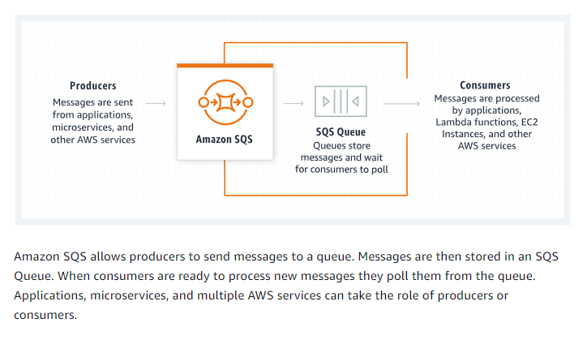

# Aula 13: Introdução ao Amazon SQS para Engenharia de Dados

**Objetivo**: Nesta aula, vamos explorar o Amazon Simple Queue Service (SQS), sua aplicação na engenharia de dados e como integrá-lo com outros serviços AWS para garantir escalabilidade e desacoplamento de processos. Ao final da aula, você será capaz de criar filas SQS, enviar e receber mensagens de forma programática, e entender como utilizar SQS em pipelines de dados.



Mais informções no site

## **Tópicos da Aula 13**

### 1. **O que é o Amazon SQS?**

   **Objetivo**: Compreender o funcionamento e os conceitos básicos do Amazon SQS.

   **O que é Amazon SQS?**
   - O Amazon Simple Queue Service (SQS) é um serviço de fila de mensagens completamente gerenciado pela AWS, projetado para ajudar no desacoplamento de componentes em aplicações distribuídas e pipelines de dados.
   - Com o SQS, você pode enviar, armazenar e receber mensagens entre diferentes partes de uma aplicação de maneira confiável e assíncrona.

   **Vantagens do Amazon SQS**:
   - **Escalabilidade**: Suporta grandes volumes de mensagens sem se preocupar com a infraestrutura subjacente.
   - **Desacoplamento**: Permite a separação dos componentes de uma aplicação, o que melhora a modularidade e manutenção.
   - **Durabilidade**: As mensagens são armazenadas de forma durável até que sejam processadas, com backups automáticos.

### 2. **Tipos de Filas no SQS**

   **Objetivo**: Entender os dois principais tipos de filas disponíveis no SQS: Standard e FIFO.

   - **Standard Queue**: 
     - Oferece entrega em "melhor esforço", garantindo alta taxa de transferência, mas sem garantia de ordem exata na entrega das mensagens.
     - **Caso de uso**: Processos que podem tolerar duplicação ocasional de mensagens e não precisam que as mensagens sejam processadas exatamente na ordem de envio.

   - **FIFO Queue**:
     - Oferece entrega exatamente uma vez e preserva a ordem das mensagens. Ideal para aplicações em que a ordem exata é crítica.
     - **Caso de uso**: Processos onde a ordem e entrega única das mensagens são fundamentais, como processamento de transações.

### 3. **Criando uma Fila SQS**

   **Objetivo**: Demonstrar o processo de criação de uma fila SQS no AWS Management Console e via AWS CLI.

   **No Console AWS**:
   1. Acesse o **AWS Management Console** e procure por **SQS**.
   2. Clique em **Criar Fila**.
   3. Escolha o tipo de fila (Standard ou FIFO) e defina as configurações, como tempo de retenção de mensagens e permissões de acesso.

Aqui está uma descrição detalhada das opções disponíveis ao criar uma fila Amazon SQS no AWS Management Console:

#### **1. Tipo de Fila (Type)**

   - **Standard**:
     - **Descrição**: Garante a entrega de cada mensagem ao menos uma vez, mas a ordem exata de entrega não é garantida.
     - **Recursos**:
       - **Entrega pelo menos uma vez**: A mensagem pode ser entregue mais de uma vez.
       - **Melhor esforço na ordenação**: A ordem de entrega das mensagens pode não ser preservada.
     - **Caso de Uso**: Ideal para sistemas onde a ordem exata de entrega não é crítica, como processamento em massa e comunicação entre microserviços.

   - **FIFO (First-in, First-out)**:
     - **Descrição**: Garante a entrega das mensagens na ordem em que foram enviadas e exatamente uma vez.
     - **Recursos**:
       - **Entrega exatamente uma vez**: As mensagens não serão duplicadas.
       - **Ordenação garantida**: As mensagens são processadas na ordem de envio.
     - **Caso de Uso**: Adequado para sistemas onde a ordem das mensagens é crucial, como processamento de transações financeiras.

#### **2. Nome da Fila (Name)**

   - O nome da fila é sensível a maiúsculas e minúsculas e pode ter até 80 caracteres.
   - Permitidos: Caracteres alfanuméricos, hífens (`-`), e underscores (`_`).
   - Fila FIFO deve terminar com `.fifo` no nome.

#### **3. Configurações da Fila (Configuration)**

   - **Visibility Timeout** (Timeout de Visibilidade):
     - **Descrição**: O tempo em segundos durante o qual uma mensagem ficará invisível para outros consumidores após ser lida.
     - **Padrão**: 30 segundos.
     - **Intervalo**: Entre 0 segundos e 12 horas.
     - **Caso de Uso**: Configurar para evitar que mensagens em processamento sejam visíveis para outros consumidores antes que o processo seja concluído.

   - **Message Retention Period** (Período de Retenção de Mensagens):
     - **Descrição**: O tempo durante o qual uma mensagem será armazenada na fila antes de ser excluída.
     - **Padrão**: 4 dias.
     - **Intervalo**: Entre 1 minuto e 14 dias.
     - **Caso de Uso**: Útil para gerenciar o tempo de vida das mensagens e evitar sobrecarga de armazenamento.

   - **Delivery Delay** (Atraso de Entrega):
     - **Descrição**: Define um atraso em segundos antes que uma mensagem seja entregue aos consumidores.
     - **Padrão**: 0 segundos.
     - **Intervalo**: Entre 0 segundos e 15 minutos.
     - **Caso de Uso**: Usado para controlar o tempo em que as mensagens ficam disponíveis para consumo.

   - **Maximum Message Size** (Tamanho Máximo da Mensagem):
     - **Descrição**: O tamanho máximo permitido para uma mensagem.
     - **Padrão**: 256 KB.
     - **Intervalo**: Entre 1 KB e 256 KB.
     - **Caso de Uso**: Definir o limite de tamanho para mensagens grandes ou pequenas, conforme a necessidade do sistema.

   - **Receive Message Wait Time** (Tempo de Espera para Receber Mensagens):
     - **Descrição**: O tempo máximo que o Amazon SQS aguardará por novas mensagens antes de retornar uma resposta vazia a um consumidor.
     - **Padrão**: 0 segundos.
     - **Intervalo**: Entre 0 e 20 segundos.
     - **Caso de Uso**: Usado para implementar o **long polling**, que reduz o custo de requisições e melhora a eficiência da fila.

#### **4. Criptografia (Encryption)**

   - **Criptografia Server-side (SSE)**:
     - **Opções**:
       - **Desativada**: A fila não usará criptografia em repouso.
       - **Ativada**: A fila usará criptografia para mensagens armazenadas.
     - **Tipos de Chave**:
       - **SSE-SQS (Chave SQS)**: Uma chave de criptografia gerenciada pela Amazon SQS.
       - **SSE-KMS (Chave AWS KMS)**: Uma chave gerenciada pelo AWS Key Management Service (KMS), que oferece mais controle sobre o gerenciamento da chave.
     - **Caso de Uso**: Para aumentar a segurança de dados em repouso, como em filas que processam informações sensíveis.

#### **5. Políticas de Acesso (Access Policy)**

   - **Método de Configuração**:
     - **Básico**: Use critérios simples para definir uma política de acesso.
     - **Avançado**: Use um objeto JSON para definir uma política de acesso mais detalhada.

   - **Quem pode enviar mensagens para a fila**:
     - **Apenas o proprietário**: Apenas o proprietário da fila pode enviar mensagens.
     - **AWS Accounts, IAM users and roles especificados**: Especifique IDs de contas da AWS, usuários e roles do IAM que podem enviar mensagens.

   - **Quem pode receber mensagens da fila**:
     - **Apenas o proprietário**: Apenas o proprietário da fila pode receber mensagens.
     - **AWS Accounts, IAM users and roles especificados**: Especifique IDs de contas da AWS, usuários e roles do IAM que podem receber mensagens.

   - **JSON (Política de Acesso)**:
     - É possível definir diretamente uma política em formato JSON, fornecendo um controle mais granular sobre quem pode realizar ações específicas na fila.

#### **6. Política de Redrive Allow (Redrive Allow Policy)**

   - **Descrição**: Determina quais filas de origem podem usar essa fila como fila de "dead-letter" (mensagens não entregues).
   - **Opções**:
     - **Desabilitada**: A fila não será usada como uma fila "dead-letter".
     - **Habilitada**: Permite que essa fila seja usada como fila "dead-letter" por outras filas de origem.

#### **7. Fila Dead-letter (Dead-letter Queue)**

   - **Descrição**: Configura essa fila para receber mensagens não entregáveis de outras filas. Se uma mensagem falhar repetidamente, ela é redirecionada para uma fila "dead-letter" para análise posterior.
   - **Opções**:
     - **Desabilitada**: A fila não atuará como uma fila "dead-letter".
     - **Habilitada**: A fila pode ser usada para receber mensagens de filas que falharam em processar mensagens após várias tentativas.

#### **8. Tags (Etiquetas - Tags)**

   - **Descrição**: Etiquetas são rótulos associados a um recurso AWS para ajudar a organizar, filtrar e rastrear os custos de recursos.
   - **Configuração**:
     - Adicionar até 50 tags no formato chave-valor.
     - **Exemplo**:
       - **Key**: `Projeto`
       - **Value**: `ProcessamentoDeDados`

### 4. **Envio e Recebimento de Mensagens com o CLI**

Verifique suas listas ativas

```bash
aws sqs list-queues
```

Para evitar a necessidade de adicionar o `--profile jornadadedados` em cada comando, você pode definir o perfil padrão da sessão atual utilizando o comando `export`. Esse comando irá configurar o perfil `AWS_PROFILE`, e todos os comandos subsequentes utilizarão automaticamente esse perfil.

### Configurando o perfil padrão com `export`:

```bash
export AWS_PROFILE=jornadadedados
```

Agora, o `AWS CLI` usará o perfil `jornadadedados` por padrão para todos os comandos, sem precisar especificá-lo novamente. Após configurar o perfil com o comando `export`, você pode executar seus comandos como normalmente, sem o parâmetro `--profile`.

Vamos explicar em detalhes o passo a passo dos comandos utilizados e a saída recebida, além de configurar o ambiente para não precisar especificar o perfil a cada comando.

#### Como verificar se o perfil foi configurado corretamente:

Você pode testar a configuração do perfil padrão verificando se o AWS CLI usa o perfil configurado ao executar qualquer comando:

```bash
aws sqs list-queues
```

Se o comando listar as filas sem exigir a região ou o perfil, significa que a configuração foi aplicada corretamente.

### Criando uma Fila SQS

**Objetivo**: Demonstrar como criar uma fila SQS no AWS Management Console e via AWS CLI.

#### No Console AWS:

1. Acesse o **AWS Management Console** e, na barra de busca, procure por **SQS**.
2. Clique em **Criar Fila**.
3. Escolha o tipo de fila que melhor atende às suas necessidades:
   - **Standard**: Oferece alta taxa de transferência e não garante a ordem exata de entrega das mensagens.
   - **FIFO**: Garante a entrega em ordem e a entrega única de cada mensagem.
4. Defina as configurações da fila, como:
   - Tempo de retenção de mensagens
   - Visibilidade das mensagens para consumidores
   - Tamanho máximo das mensagens
   - Permissões de acesso (quem pode enviar e receber mensagens da fila)
5. Clique em **Criar Fila** para finalizar a criação.

#### Usando AWS CLI:

- Para criar uma fila **Standard**, execute o seguinte comando no terminal:
   ```bash
   aws sqs create-queue --queue-name minha-fila-standard
   ```

- Para criar uma fila **FIFO**, adicione o atributo `FifoQueue=true` ao comando:
   ```bash
   aws sqs create-queue --queue-name minha-fila.fifo --attributes FifoQueue=true
   ```

---

### Envio e Recebimento de Mensagens

**Objetivo**: Demonstrar como enviar, receber e remover mensagens de uma fila SQS de forma programática usando AWS CLI.

#### Enviando Mensagens:

Para enviar uma mensagem para a fila, utilize o comando abaixo, especificando a URL da fila e o corpo da mensagem:

```bash
aws sqs send-message --queue-url URL_DA_FILA --message-body "Mensagem para a fila"
```

#### Recebendo Mensagens:

Para receber mensagens de uma fila SQS, use o comando:

```bash
aws sqs receive-message --queue-url URL_DA_FILA
```

Esse comando retornará as mensagens que estão na fila, junto com informações como o `ReceiptHandle`, necessário para deletar a mensagem após o processamento.

#### Explicação da Saída:

- **MessageId**: O identificador único da mensagem que foi recebida (mesmo ID da mensagem enviada anteriormente).
- **ReceiptHandle**: Um identificador temporário que será usado para remover a mensagem da fila após o processamento. Esse handle deve ser utilizado na operação de exclusão de mensagem.
- **MD5OfBody**: Um hash MD5 da mensagem recebida para garantir a integridade dos dados.
- **Body**: O conteúdo da mensagem, que é "Mensagem para a fila".

#### Removendo Mensagens:

Após processar a mensagem, ela deve ser removida da fila. Para isso, use o `ReceiptHandle` da mensagem recebida:

```bash
aws sqs delete-message --queue-url URL_DA_FILA --receipt-handle HANDLE_DA_MENSAGEM
```

Esses passos cobrem o ciclo completo de envio, recebimento e remoção de mensagens em uma fila SQS usando o AWS CLI.

### 5. **Integrando o SQS com código Python**

### 6. **Controle de Concorrência e Limite de Taxa**

   **Objetivo**: Explicar como gerenciar a concorrência no processamento de mensagens e configurar limites para evitar sobrecarga.

   - **Controle de Concorrência**: Defina o número máximo de mensagens que um worker pode processar simultaneamente.
   - **Visibilidade de Mensagens**: Use o parâmetro `Visibility Timeout` para garantir que uma mensagem seja invisível para outros consumidores enquanto está sendo processada.

   - **Exemplo**:
     ```bash
     aws sqs change-message-visibility --queue-url URL_DA_FILA --receipt-handle HANDLE_DA_MENSAGEM --visibility-timeout 30
     ```

### 7. **Boas Práticas com SQS na Engenharia de Dados**

   **Objetivo**: Discutir as melhores práticas ao usar o SQS em projetos de engenharia de dados.

   - **Monitoramento**: Utilize o Amazon CloudWatch para monitorar o número de mensagens não processadas e ajustar a escala dos consumidores.
   - **Erros e Retries**: Implemente Dead Letter Queues (DLQs) para capturar mensagens que falharam repetidamente no processamento.
   - **Segurança**: Configure permissões no IAM para restringir quem pode enviar e receber mensagens da fila.

### 8. **Exercício**

   **Objetivo**: Colocar em prática o que foi aprendido nesta aula.

   - **Tarefa**: Crie uma fila SQS, envie e receba mensagens utilizando a AWS CLI. Em seguida, integre o SQS com uma função AWS Lambda para processar as mensagens automaticamente.

### 9. **Conclusão da Aula 13**

   **Resumo**:
   - Exploramos o Amazon SQS e como ele pode ser utilizado para construir pipelines de dados escaláveis e desacoplados.
   - Aprendemos a criar filas, enviar e receber mensagens, e integrar o SQS com outros serviços AWS.
   - Discutimos as melhores práticas para implementar o SQS em projetos de engenharia de dados.

   **Tarefa de Casa**:
   - Configure uma Dead Letter Queue para gerenciar mensagens com falhas e monitore o uso do SQS com CloudWatch.

--- 

**Material de Apoio**:
- [Documentação oficial do Amazon SQS](https://docs.aws.amazon.com/sqs/)