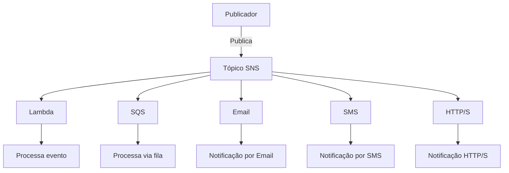

# Aula 14: Amazon SNS (Simple Notification Service) - Introdução e Comparação com SQS

## **Objetivo da Aula**
Nesta aula, vamos explorar o **Amazon Simple Notification Service (SNS)**, entender seu papel em sistemas distribuídos, a diferença entre SNS e SQS, além de demonstrar como configurar e integrar SNS a outros serviços AWS, como Lambda e SQS.

## **Conteúdo**
- O que é o Amazon SNS?
- Diferença entre SNS e SQS (com tabela comparativa).
- Demonstração de criação de um tópico SNS e assinantes.
- Pub/Sub (Publicação/Assinatura) e casos de uso.
- Exemplo prático de integração SNS + Lambda.
- Boas práticas e pontos importantes.

## **O que é o Amazon SNS?**
O Amazon SNS é um serviço de mensageria baseado no modelo **pub/sub** (publicação/assinatura). Ele permite que você publique mensagens em um tópico, que são distribuídas para múltiplos assinantes através de diferentes métodos de entrega (e-mail, SMS, SQS, Lambda, HTTP/S).

**Características principais:**
- **Pub/Sub**: Permite que uma mensagem seja publicada em um tópico e distribuída para vários assinantes.
- **Escalabilidade**: O SNS é escalável e pode lidar com grandes volumes de mensagens.
- **Baixa latência**: Entrega em tempo quase real.
- **Multiplos protocolos**: Suporta vários métodos de entrega, incluindo HTTP/S, e-mail, SMS, SQS, Lambda.



### **Tópicos e Assinantes**
- **Tópico**: Um canal onde as mensagens são publicadas e distribuídas para os assinantes.
- **Assinantes**: Recebem as mensagens publicadas no tópico via diferentes canais (Lambda, SQS, e-mail, SMS, etc).

---

## **Comparação SNS vs SQS**

| **Características**              | **Amazon SNS**                                    | **Amazon SQS**                           |
|-----------------------------------|---------------------------------------------------|------------------------------------------|
| **Modelo**                        | Pub/Sub                                           | Fila                                     |
| **Entrega de mensagens**          | Entrega para vários assinantes simultaneamente    | Mensagens entregues para um consumidor   |
| **Tipo de comunicação**           | Múltiplos assinantes (fan-out)                    | Ponto-a-ponto                            |
| **Latência**                      | Baixa latência (entrega quase em tempo real)      | Processamento assíncrono, maior latência |
| **Método de entrega**             | HTTP/S, Lambda, SQS, SMS, e-mail                  | Apenas consumidores de filas             |
| **Uso típico**                    | Notificações em tempo real                        | Processamento em segundo plano           |
| **Mensagens persistidas?**        | Não                                               | Sim, até 14 dias                         |
| **Garantia de ordem**             | Não no modelo padrão (apenas em FIFO)             | FIFO (quando configurado)                |

---

## **Modelo Pub/Sub e Casos de Uso**
### **Pub/Sub (Publicação/Assinatura)**
O modelo **pub/sub** permite que múltiplos assinantes sejam notificados quando um evento ocorre. No SNS, os publicadores enviam mensagens para um **tópico** e todos os assinantes desse tópico recebem a notificação.

**Exemplos de casos de uso:**
- **Notificações de sistema**: Informar múltiplos serviços sobre eventos importantes, como falhas ou atualizações.
- **Alertas via SMS ou E-mail**: Enviar notificações para equipes ou usuários em tempo real.
- **Integração entre sistemas**: Usar SNS para conectar diferentes serviços e sistemas, como Lambda e SQS, para orquestrar workflows complexos.

---

## **Demonstração: Criando e Configurando um Tópico SNS**

### **No Console AWS**:
1. Acesse o **AWS Management Console** e busque por **SNS**.
2. Clique em **Create Topic**.
3. Escolha entre **Standard** (sem garantia de ordem) ou **FIFO** (ordem garantida).
4. Dê um nome ao tópico e configure parâmetros adicionais (como permissões).
5. Clique em **Create Topic**.

### **Via AWS CLI**:
Para criar um tópico Standard:
```bash
aws sns create-topic --name meu-topico-sns
```

Para criar um tópico FIFO:
```bash
aws sns create-topic --name meu-topico.fifo --attributes FifoTopic=true
```

### **Assinando um Tópico SNS**

#### **No Console AWS**:
1. No tópico criado, vá para **Create Subscription**.
2. Selecione o **Protocolo** (e-mail, SMS, HTTP/S, Lambda, etc).
3. Insira o **endpoint** correspondente e clique em **Create Subscription**.

#### **Via AWS CLI**:
Adicionar um assinante Lambda:
```bash
aws sns subscribe --topic-arn arn:aws:sns:us-east-1:123456789012:meu-topico-sns --protocol lambda --notification-endpoint arn:aws:lambda:us-east-1:123456789012:function:meu-lambda
```

### **Publicando Mensagens em um Tópico SNS**
```bash
aws sns publish --topic-arn arn:aws:sns:us-east-1:123456789012:meu-topico-sns --message "Mensagem de teste para o tópico SNS."
```

---

## **Exemplo: Integrando SNS com Lambda**

**Objetivo**: Demonstrar como integrar SNS com Lambda para processar automaticamente as mensagens recebidas em um tópico SNS.

1. **Crie um tópico SNS**.
2. **Crie uma função Lambda** que processe as mensagens publicadas no tópico.
3. **Assine a função Lambda ao tópico** usando o console ou CLI.
4. **Publique uma mensagem** no tópico SNS e observe o processamento automático pela Lambda.

---

## **Conclusão**
O Amazon SNS é uma poderosa ferramenta para implementar arquiteturas baseadas em eventos, permitindo a comunicação eficiente entre serviços. Sua integração com outros serviços como Lambda e SQS permite o desenvolvimento de soluções altamente escaláveis e flexíveis.