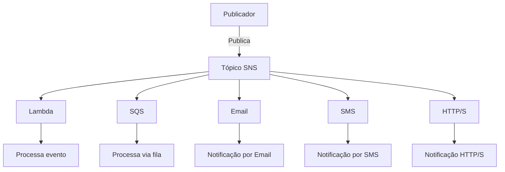
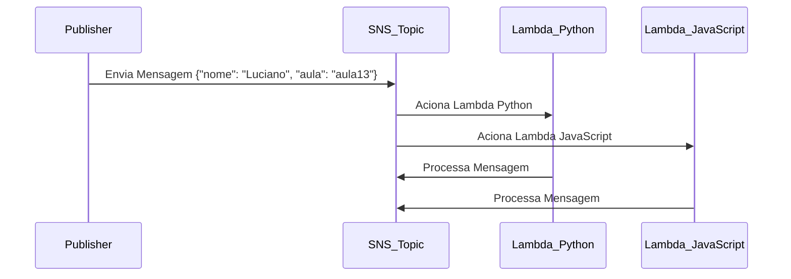

# Aula 14: Amazon SNS (Simple Notification Service)

## **Objetivo da Aula**
O foco desta aula é mostrar como engenheiros e analistas de dados podem utilizar o **Amazon SNS** para implementar sistemas de notificação e publicação/assinatura (Pub/Sub) em suas pipelines de dados e outras aplicações distribuídas. Vamos explorar os tópicos, as assinaturas, a configuração de tópicos no console da AWS, e as diferenças principais entre **SNS e SQS**.

## **Conteúdo**
1. O que é o Amazon SNS?
2. Diferença entre SNS e SQS.
3. Demonstração: Criando um tópico no Console AWS.
4. Como assinar um tópico (subscribers).
5. Pub/Sub (Publicação/Assinatura) e casos de uso.
6. Boas práticas e pontos importantes.

## **O que é o Amazon SNS?**
O **Amazon SNS** (Simple Notification Service) é um serviço de mensageria gerenciado que facilita a criação de sistemas baseados no modelo **Pub/Sub** (publicação/assinatura). Ele é utilizado para enviar notificações ou mensagens de eventos importantes para diferentes serviços ou usuários.

**Por que engenheiros e analistas de dados utilizariam o SNS?**
- **Notificações em tempo real**: Alertas sobre eventos importantes em pipelines de dados.
- **Escalabilidade**: SNS pode lidar com grandes volumes de mensagens e entrega quase em tempo real.
- **Integração entre serviços**: SNS permite conectar diversos serviços AWS como Lambda, SQS, e até endpoints HTTP para automatizar fluxos de trabalho de dados.

### **Tópicos e Assinantes**
- **Tópico**: Um canal onde as mensagens são publicadas. Os assinantes vinculados a esse tópico recebem as mensagens.
- **Assinantes (Subscribers)**: Os destinos que recebem as mensagens publicadas. Isso pode incluir serviços como Lambda, SQS, HTTP/S, e-mail, SMS, entre outros.

---

## **Comparação SNS vs SQS**

| **Características**              | **Amazon SNS**                                    | **Amazon SQS**                           |
|-----------------------------------|---------------------------------------------------|------------------------------------------|
| **Modelo**                        | Pub/Sub                                           | Fila                                     |
| **Entrega de mensagens**          | Entrega para múltiplos assinantes simultaneamente    | Entrega individual para consumidores   |
| **Tipo de comunicação**           | Múltiplos assinantes (fan-out)                    | Ponto-a-ponto                            |
| **Latência**                      | Baixa latência (entrega quase em tempo real)      | Processamento assíncrono, maior latência |
| **Método de entrega**             | HTTP/S, Lambda, SQS, SMS, e-mail                  | Apenas consumidores de filas             |
| **Uso típico**                    | Notificações em tempo real                        | Processamento em segundo plano           |
| **Mensagens persistidas?**        | Não                                               | Sim, até 14 dias                         |
| **Garantia de ordem**             | Não no modelo padrão (apenas em FIFO)             | FIFO (quando configurado)                |

### **Mermaid Diagram para SNS e SQS**:
Aqui está uma representação visual para você entender melhor como SNS e SQS funcionam juntos em um sistema Pub/Sub:



### **Modelo Pub/Sub e Casos de Uso**
No modelo **Pub/Sub**, o SNS permite que múltiplos assinantes sejam notificados ao mesmo tempo quando uma mensagem é publicada em um tópico. Esse padrão é especialmente útil para criar notificações em larga escala e orquestrar serviços automatizados.

**Exemplos de uso de SNS:**
- **Monitoramento de pipelines de dados**: Notificar equipes quando um job de ETL falhar ou for concluído.
- **Alertas em tempo real**: Notificações para usuários de sistemas quando determinados eventos ocorrerem, como grandes volumes de dados sendo processados ou dados chegando em um banco de dados.
- **Integração de sistemas**: Usar SNS para conectar diferentes serviços em uma arquitetura de microserviços.

---
### **Demonstração: Criando um Tópico no Console AWS**

### **Fluxo da Arquitetura (Mermaid)**



Neste diagrama, uma mensagem é enviada para o tópico SNS, que então aciona duas funções Lambda: uma escrita em Python e outra em JavaScript, para processar a mesma mensagem de diferentes formas.

---

### **1. Criar um Tópico SNS**
No **AWS Management Console**:
1. Acesse o **Amazon SNS** e clique em **Create Topic**.
2. Escolha o tipo de tópico:
   - **FIFO (First-In-First-Out)**: Garante a ordem das mensagens.
   - **Standard**: Permite alta taxa de mensagens, mas a ordem de entrega não é garantida.
   
   Para este exemplo, vamos usar o tipo **Standard**.
   
3. Defina o nome do tópico, por exemplo: `MeuTopicoJornadadeDados`.
4. Complete as demais configurações (como criptografia, políticas de acesso, etc.) e clique em **Create Topic**.

---

### **2. Criar as Funções Lambda**

#### **Função Lambda em Python**

1. Acesse o **AWS Lambda** e clique em **Create Function**.
2. Escolha **Author from Scratch**.
3. Dê um nome à sua função, por exemplo: `ProcessaMensagemSNSPython`.
4. Selecione **Python 3.9** como a linguagem de runtime.
5. Role até as permissões e configure permissões básicas que permitam à função Lambda ser acionada pelo SNS.
6. Clique em **Create Function**.

#### **Função Lambda em JavaScript**

1. Repita o processo acima, mas desta vez nomeie a função como `ProcessaMensagemSNSJavaScript`.
2. Selecione **Node.js 14.x** como a linguagem de runtime.
3. Configure as permissões como no exemplo anterior.

---

### **3. Escrevendo o Código Lambda**

#### **Código Python**

Este código extrai a mensagem enviada pelo SNS, faz o parsing para JSON e imprime os dados recebidos.

```python
import json

def lambda_handler(event, context):
    # Extrair a mensagem do evento SNS
    message = event['Records'][0]['Sns']['Message']
    
    # Parsear a mensagem para JSON
    parsed_message = json.loads(message)
    
    # Extrair informações da mensagem
    nome = parsed_message.get('nome')
    aula = parsed_message.get('aula')
    
    # Imprimir as informações
    print(f"Nome: {nome}, Aula: {aula}")
    
    # Retornar a resposta
    return {
        'statusCode': 200,
        'body': json.dumps({'nome': nome, 'aula': aula})
    }
```

#### **Código JavaScript**

A função Lambda em JavaScript também extrai e processa a mensagem SNS recebida.

```javascript
export const handler = async (event) => {
    // Extrair a mensagem do evento SNS
    const message = event.Records[0].Sns.Message;
    
    // Parsear a mensagem para JSON
    let parsedMessage;
    try {
        parsedMessage = JSON.parse(message);
    } catch (error) {
        console.error("Erro ao parsear a mensagem:", error);
        return {
            statusCode: 500,
            body: JSON.stringify({ error: "Erro ao processar a mensagem" })
        };
    }
    
    // Extrair informações da mensagem
    const nome = parsedMessage.nome;
    const aula = parsedMessage.aula;
    
    // Imprimir as informações
    console.log(`Nome: ${nome}, Aula: ${aula}`);
    
    // Retornar a resposta
    return {
        statusCode: 200,
        body: JSON.stringify({ nome: nome, aula: aula })
    };
};
```

---

### **4. Configurando o SNS como Trigger para os Lambdas**

1. Volte para o **Console SNS** e selecione o tópico que você criou.
2. Clique em **Create Subscription**.
3. Escolha **AWS Lambda** como o protocolo.
4. Selecione a função Lambda Python (`ProcessaMensagemSNSPython`) e crie a assinatura.
5. Repita o processo para a função Lambda JavaScript (`ProcessaMensagemSNSJavaScript`).

Agora, as duas funções Lambda serão acionadas automaticamente sempre que uma mensagem for publicada no tópico SNS.

---

### **5. Publicando Mensagens no SNS**

#### **Exemplo de Mensagem SNS Válida**
A mensagem enviada para o SNS deve estar formatada como JSON:

```json
{
  "nome": "Luciano",
  "aula": "aula13"
}
```

#### **Publicação Usando Python (com boto3)**

Aqui está um exemplo de código Python para publicar uma mensagem no SNS:

```python
import boto3
import json

# Criar o cliente SNS
sns_client = boto3.client('sns', region_name='us-east-2')

# Criar a mensagem JSON
message = {
    "nome": "Luciano",
    "aula": "aula13"
}

# Publicar a mensagem no tópico SNS
response = sns_client.publish(
    TopicArn='arn:aws:sns:us-east-2:148761673709:MeuTopico',
    Message=json.dumps(message)
)

print(response)
```

#### **Publicação Usando AWS CLI**
Se preferir usar a CLI da AWS, publique uma mensagem no SNS com o seguinte comando:

```bash
aws sns publish \
    --topic-arn arn:aws:sns:us-east-2:148761673709:MeuTopico \
    --message '{"nome": "Luciano", "aula": "aua13"}' \
    --region us-east-2
```

#### **Publicação via Console AWS**
1. No Console AWS, navegue até o tópico SNS que você criou.
2. Clique em **Publish Message**.
3. No campo **Message Body**, insira a mensagem JSON como mostrado acima.
4. Clique em **Publish** para enviar a mensagem.

---

### **6. Verificando a Mensagem no Lambda**

1. Acesse o **AWS CloudWatch**.
2. Vá até os logs da função Lambda.
3. Verifique o log da execução e veja se as informações da mensagem foram processadas corretamente.
   
Para cada mensagem enviada ao tópico SNS, ambas as funções Lambda (Python e JavaScript) serão acionadas, processando os dados e registrando-os nos logs.

### **Conclusão**

Este exemplo demonstra como integrar o **SNS** com **Lambda** para processar mensagens em tempo real. Essa arquitetura é poderosa para pipelines de dados, alertas e orquestração de serviços, fornecendo escalabilidade e desacoplamento dos componentes.