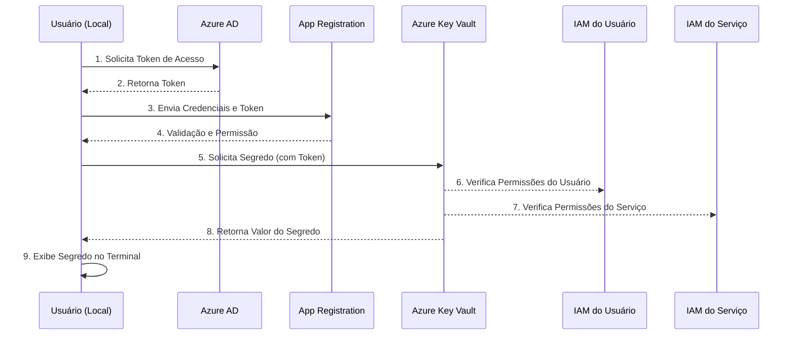
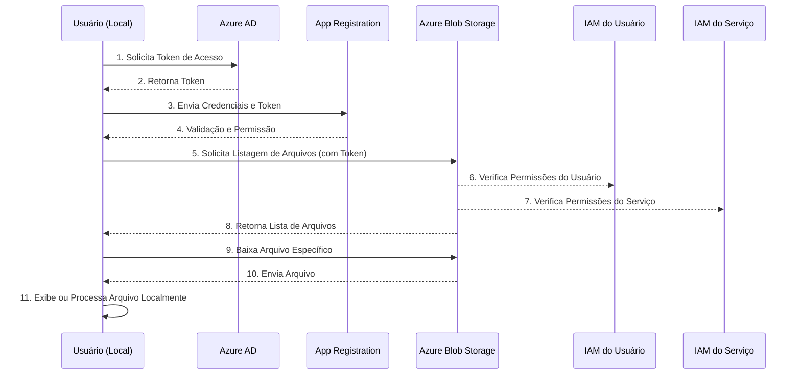
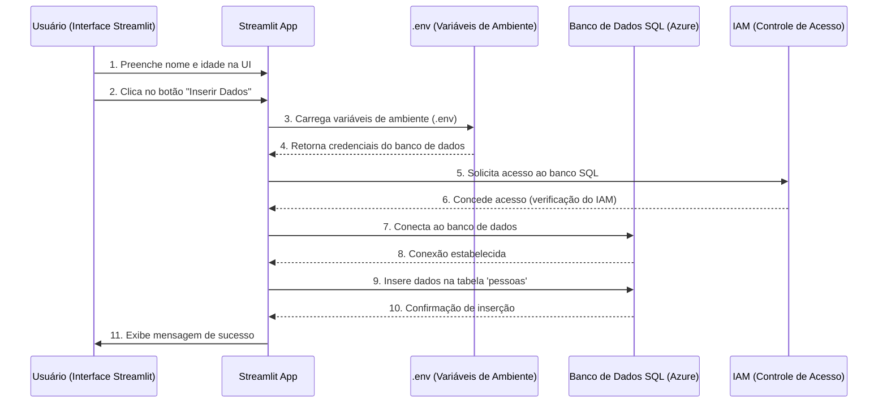

# **Bootcamp Cloud - Aula 16: Introdução ao Azure para Dados**  

---

### **Objetivo:**  
Explorar o ambiente do Azure, abordando a criação de conta, uso do **Azure Blob Storage** (equivalente ao S3), **máquinas virtuais (VMs)** para processamento de dados e o **Azure Active Directory (AAD)**, que substitui o IAM para gerenciamento de identidade e controle de acesso.

---

## Criação de Conta no Azure  
1. Acesse [portal.azure.com](https://portal.azure.com) e selecione **Create a Free Account**.  
2. Preencha as informações básicas: nome completo, telefone, e-mail e senha.  
3. Adicione as informações de **cartão de crédito** (somente para verificação; não haverá cobranças iniciais).  
4. Escolha o plano gratuito:  
   - 750 horas de uma VM B1S por mês (Ubuntu ou Windows).  
   - 5 GB gratuitos no Blob Storage.  
   - Banco de dados SQL com 250 GB gratuitos.  
5. No **Cost Management**, configure alertas para controlar custos e crie um orçamento mensal de teste.

---

## Assinaturas no Azure  
Uma **Assinatura do Azure** é uma unidade lógica para gerenciar o acesso, controle de custos e recursos. Permite organizar e isolar recursos como máquinas virtuais, bancos de dados e serviços.  

### Funções e Finalidades  
- **Gestão de Recursos e Acesso:** Define permissões específicas para equipes e projetos.  
- **Faturamento e Controle de Custos:** Cada assinatura tem seu próprio relatório de faturamento.  
- **Isolamento e Limites:** Permite separar ambientes de produção, desenvolvimento e teste.  
- **Governança:** As assinaturas aplicam políticas e limites via Grupos de Gerenciamento e AAD.

### Tipos de Assinaturas  
- **Plano Gratuito:** Oferece crédito inicial e limites gratuitos por 12 meses.  
- **Pay-As-You-Go:** Paga-se apenas pelo uso.  
- **Enterprise Agreement (EA):** Contrato com desconto por volume para grandes empresas.  
- **Cloud Solution Provider (CSP):** Parceiros que revendem serviços Azure.

---

## Equivalente na AWS  
Na AWS, o conceito mais próximo de uma assinatura do Azure é uma **Conta AWS**.  

- **AWS Organizations:** Permite consolidar e gerenciar várias contas AWS sob uma organização.  
- **Controle de Custos:** Cada conta tem seus próprios alertas e relatórios de custo.  

### Comparação entre Assinatura do Azure e Conta AWS  
| Azure (Assinatura)             | AWS (Conta AWS)                       |
|---------------------------------|----------------------------------------|
| Separa recursos e define limites | Isola ambientes e projetos            |
| Gerenciada por AAD              | Gerenciada por IAM e AWS Organizations |
| Faturamento por assinatura      | Faturamento por conta                 |

---

## Projeto 1. Acessando variáveis de ambiente no Azure



---

### **Azure Key Vault: O que é e para que serve?**

### **Objetivo:**
O **Azure Key Vault** é um serviço de nuvem da Microsoft projetado para gerenciar segredos, chaves de criptografia e certificados de maneira segura. Seu principal objetivo é fornecer uma forma centralizada e protegida de armazenar e acessar informações sensíveis, como senhas, tokens e chaves criptográficas, minimizando riscos de segurança.

### **Funcionalidades do Azure Key Vault:**

1. **Armazenamento Seguro de Segredos:**
   - Gerencia senhas, strings de conexão, tokens de API e outras informações confidenciais.
   - Fornece acesso seguro aos segredos por meio de autenticação robusta e controle de permissões via **Azure AD**.

2. **Gerenciamento de Chaves de Criptografia:**
   - Armazena e protege chaves usadas para criptografia de dados em repouso e em trânsito.
   - Oferece suporte para criptografia assimétrica e simétrica, podendo ser integrado a outros serviços do Azure, como SQL Database.

3. **Gestão de Certificados:**
   - Automatiza o processo de renovação e gerenciamento de certificados SSL/TLS.
   - Permite criar e manter certificados seguros que podem ser utilizados por serviços na nuvem ou locais.

4. **Controle de Acesso Granular:**
   - Usa **IAM (Identity and Access Management)** para controlar quais aplicações e usuários podem acessar os segredos e chaves.
   - Mantém logs de auditoria de todas as interações com o Key Vault.

### **Benefícios:**
- **Centralização:** Consolida a gestão de segredos e chaves, evitando que sejam armazenados em diferentes locais de forma não segura.
- **Automação:** Facilita a renovação automática de certificados e permite que aplicações acessem segredos sem intervenção manual.
- **Conformidade:** Ajuda a cumprir regulamentações de segurança e privacidade, mantendo as informações críticas em um ambiente protegido.
- **Alta Disponibilidade:** O serviço é distribuído por regiões do Azure, garantindo que segredos e chaves estejam sempre acessíveis.

---

### **Comparação com AWS Secrets Manager:**

| **Azure Key Vault**                    | **AWS Secrets Manager**                |
|----------------------------------------|----------------------------------------|
| Gerencia segredos, chaves e certificados | Gerencia segredos e credenciais |
| Integra-se com serviços Azure, como SQL Database | Integra-se com serviços AWS, como RDS |
| Oferece criptografia usando HSM (Hardware Security Modules) | Oferece criptografia e rotação automática de segredos |
| Controle de acesso via Azure AD        | Controle de acesso via IAM |
| Preços por transação e armazenamento   | Preços por segredos armazenados |

---

### **Nosso primeiro Erro**

Importância do IAM
O uso do IAM (Identity and Access Management) é essencial para criar e gerenciar um Key Vault. Ele permite configurar controle de acesso baseado em papéis (RBAC), garantindo que apenas usuários ou aplicações autorizadas possam acessar ou modificar segredos e chaves.

IAM no Azure é o serviço responsável por gerenciar identidades e permissões, assegurando que cada recurso ou aplicação tenha apenas os acessos necessários. Ele garante uma abordagem de segurança baseada em princípio de menor privilégio.

## **View Exemple**

### **"View Example" no Portal Azure Key Vault**

A opção **"View Example"** (ou "Ver Exemplo") na interface do **Key Vault** facilita o entendimento e uso do serviço. Esta funcionalidade:

1. **Demonstração de Exemplos Práticos:**  
   - Mostra exemplos de como armazenar e acessar chaves e segredos.
   - Fornece código de amostra, muitas vezes em **Python, C#, ou PowerShell**, para acessar os segredos via SDK.

2. **Ajuda na Automação:**  
   - Exemplos incluem snippets para automação com **Azure CLI** ou scripts para aplicações.
   - Acelera o processo de integração com outras aplicações e pipelines de dados.

3. **Facilita a Configuração Inicial:**  
   - Apresenta instruções claras de como criar e acessar segredos, chaves e certificados.
   - Demonstra como configurar corretamente o acesso via **IAM** ou atribuir permissões específicas.

A funcionalidade **"View Example"** é uma poderosa ferramenta educacional e prática no portal Azure. Ela facilita a adoção do Azure Key Vault ao fornecer exemplos de código claros, economizando tempo e simplificando o processo de integração. Com essa abordagem orientada a exemplos, é possível configurar o acesso seguro e garantir a conformidade com as boas práticas de segurança na nuvem.

---

## **Azure Active Directory (Azure AD)**

### **Visão Geral**

O **Azure Active Directory (Azure AD)** é o serviço de gerenciamento de identidade e acesso baseado na nuvem da Microsoft. Ele permite que as organizações administrem identidades e controlem o acesso a recursos em nuvem e on-premises, além de aplicativos SaaS. 

---

### **Objetivos do Azure AD**

1. **Autenticação e Autorização**  
   - Verifica identidades para permitir ou negar o acesso a recursos e aplicativos.
   - Suporta métodos como senha, MFA (autenticação multi-fator) e biometria.

2. **Gerenciamento de Usuários e Grupos**  
   - Permite criar usuários e organizar grupos para definir permissões e acessos.
   - Facilita a ativação e desativação de contas de usuários.

3. **Integração com Aplicativos SaaS**  
   - Oferece autenticação única (SSO) para diversos aplicativos, como Salesforce e Google Workspace.
   - Melhora a experiência do usuário eliminando a necessidade de múltiplas senhas.

4. **Políticas de Acesso e Segurança**  
   - Controla o acesso com base na localização e tipo de dispositivo.
   - Oferece políticas de acesso condicional para aumentar a segurança.

5. **Autenticação para APIs e Aplicativos Customizados**  
   - Desenvolvedores podem integrar o Azure AD para autenticação segura em suas APIs e aplicações.

---

### **Passo a Passo: Configuração no Azure AD**

#### **1. Acessar o Azure AD no Portal**
- Vá para o [portal do Azure](https://portal.azure.com).
- No menu, clique em **Azure Active Directory**.

#### **2. Registrar um Aplicativo no Azure AD**
- Clique em **App Registrations** > **New Registration**.
- Dê um nome ao aplicativo e escolha a conta ou organização que terá acesso.
- Clique em **Register** para finalizar.

#### **3. Criar um Client Secret**
- Na aplicação registrada, vá para **Certificates & Secrets**.
- Clique em **New Client Secret**.
- Adicione uma descrição (opcional) e defina a validade do segredo (6, 12 ou 24 meses).
- Ao clicar em **Add**, o segredo será gerado. **Copie o valor agora** – ele não será exibido novamente.

#### **4. Configurar IAM para o Serviço**
- Volte para o **Azure Key Vault** ou outro serviço relevante.
- Vá para **Access Control (IAM)** > **Role Assignments**.
- Adicione um novo papel, como **Key Vault Secrets User** ou **Reader**.
- Em **Select Members**, selecione o **App Registration** que você criou.

---

### **Relação entre Azure AD e AWS IAM**

| **Azure AD**                                | **AWS IAM**                                  |
|---------------------------------------------|----------------------------------------------|
| Gerencia identidade de usuários e autenticação. | Gerencia permissões de recursos na AWS. |
| Oferece SSO e políticas de acesso condicional. | Configura políticas detalhadas para acesso a recursos. |
| Integrado com Office 365 e aplicativos SaaS. | Integrado com serviços AWS, como EC2 e S3. |
| Suporta políticas baseadas em usuário e dispositivo. | Suporta permissões detalhadas por função e políticas. |

---

### **Conclusão**

O **Azure AD** é essencial para a autenticação e controle de identidades em ambientes Microsoft e aplicativos SaaS. Ele complementa o **IAM da AWS**, que é mais voltado para gerenciar permissões de recursos. Integrar o Azure AD com a AWS pode proporcionar uma experiência de autenticação unificada e simplificar a gestão de identidades e acessos.

## Projeto 2. Consumindo arquivos no Blob Storage



### **Projeto: Acessar e Fazer Upload de Arquivos no Azure Blob Storage com Python SDK**

Este passo a passo mostrará como criar uma **Storage Account no Azure**, configurar permissões usando **IAM**, e listar arquivos dentro de um **container Blob** utilizando o **Python SDK**.

---

## **Passo 1: Criar uma Storage Account no Azure**

1. Acesse o [Azure Portal](https://portal.azure.com/).
2. No menu de navegação, clique em **Storage accounts** e depois em **Create**.
3. **Configuração básica**:
   - **Subscription**: Escolha a assinatura correta.
   - **Resource group**: Selecione o grupo criado anteriormente.
   - **Storage account name**: Escolha um nome único (por exemplo, `armazenamentoexemplo`).
   - **Region**: Escolha a mesma região onde seus recursos estão hospedados (ex.: East US).
   - **Performance**: Standard.
   - **Replication**: LRS (Locally Redundant Storage) para este exemplo.
4. Clique em **Review + Create** e, em seguida, **Create**.

---

## **Passo 2: Criar um Container no Blob Storage**

1. Dentro da **Storage Account** recém-criada, vá para **Containers** no menu lateral.
2. Clique em **+ Container**.
3. **Nome do Container**: Por exemplo, `meus-arquivos`.
4. **Tipo de acesso público**: Deixe como **Private** (somente acesso autenticado).
5. Clique em **Create**.

---

## **Passo 3: Obter a URL de Conexão do Storage**

1. Na **Storage Account**, vá para **Access keys** no menu lateral.
2. Copie o **Connection string**. Ele será usado no código para conectar-se ao Blob Storage.

---

## **Passo 4: Dar Acesso no IAM ao Aplicativo Criado Anteriormente**

1. Acesse o **Azure Portal** e vá para **Storage accounts** > **sua Storage Account**.
2. No menu lateral, clique em **Access control (IAM)**.
3. Clique em **Add role assignment**.
4. **Função**: Selecione **Blob Data Contributor**.
5. **Membro**: Selecione o **App Registration** criado anteriormente no Azure Active Directory.
6. Clique em **Review + Assign**.

---

## **Passo 5: Código Python para Listar Arquivos no Blob Storage**

Crie um arquivo Python chamado `list_blob_files.py` e adicione o seguinte código:

### **Código Python**

```python
from azure.identity import ClientSecretCredential
from azure.storage.blob import BlobServiceClient
from dotenv import load_dotenv
import os

# Carrega as variáveis de ambiente do arquivo .env
load_dotenv()

# Variáveis de ambiente necessárias
client_id = os.environ['AZURE_CLIENT_ID']
tenant_id = os.environ['AZURE_TENANT_ID']
client_secret = os.environ['AZURE_CLIENT_SECRET']
storage_account_url = os.environ["AZURE_STORAGE_URL"]  # Ex: https://<nome_da_storage>.blob.core.windows.net/
container_name = "meus-arquivos"  # Nome do container criado

# Configura as credenciais usando Client Secret
credentials = ClientSecretCredential(
    client_id=client_id,
    client_secret=client_secret,
    tenant_id=tenant_id
)

# Conectar ao Blob Storage
blob_service_client = BlobServiceClient(
    account_url=storage_account_url,
    credential=credentials
)

# Acessa o container
container_client = blob_service_client.get_container_client(container_name)

# Lista todos os arquivos dentro do container
print(f"Listando arquivos no container '{container_name}':")
for blob in container_client.list_blobs():
    print(f" - {blob.name}")
```

---

## **Passo 6: Configurar o Arquivo `.env`**

Crie um arquivo chamado `.env` na mesma pasta do código e adicione as variáveis necessárias:

```env
AZURE_CLIENT_ID=seu_client_id
AZURE_TENANT_ID=seu_tenant_id
AZURE_CLIENT_SECRET=seu_client_secret
AZURE_STORAGE_URL=https://<nome_da_storage>.blob.core.windows.net/
```

---

## **Passo 7: Instalar as Dependências**

No terminal, execute o seguinte comando para instalar as bibliotecas necessárias:

```bash
pip install azure-identity azure-storage-blob python-dotenv
```

---

## **Passo 8: Executar o Código**

No terminal, execute o script:

```bash
python list_blob_files.py
```

---

## **Resultado Esperado**

Ao executar o código, você verá a lista de todos os arquivos presentes no container:

```
Listando arquivos no container 'meus-arquivos':
 - exemplo1.txt
 - relatorio2024.csv
 - imagem.png
```

---

## **Conclusão**

Com este projeto, você aprendeu a:

- **Criar uma Storage Account** e **container Blob** no Azure.
- **Configurar permissões IAM** para o aplicativo.
- **Listar arquivos** armazenados no container Blob usando **Python SDK**.

Este processo é fundamental para manipular dados na nuvem com segurança e eficiência, garantindo o acesso controlado por meio de credenciais e políticas de IAM.

## Projeto 3. Streamlit para inserir dados no Blob Storage

### **Código com Streamlit: Inserir Arquivos no Blob Storage**

Este exemplo utiliza o **Streamlit** para criar uma interface gráfica que permite ao usuário fazer upload de arquivos para o **Azure Blob Storage**.

---

#### **Instalar as Dependências**

Antes de começar, certifique-se de instalar as bibliotecas necessárias:

```bash
pip install streamlit azure-identity azure-storage-blob python-dotenv
```

---

#### **Código Python (app.py)**

```python
import streamlit as st
from azure.identity import ClientSecretCredential
from azure.storage.blob import BlobServiceClient
from dotenv import load_dotenv
import os

# Carregar variáveis de ambiente do arquivo .env
load_dotenv()

# Variáveis de ambiente necessárias
client_id = os.environ['AZURE_CLIENT_ID']
tenant_id = os.environ['AZURE_TENANT_ID']
client_secret = os.environ['AZURE_CLIENT_SECRET']
storage_account_url = os.environ["AZURE_STORAGE_URL"]
container_name = "meucontainer"

# Configura credenciais usando Client Secret
credentials = ClientSecretCredential(
    client_id=client_id,
    client_secret=client_secret,
    tenant_id=tenant_id
)

# Conectar ao Blob Storage
blob_service_client = BlobServiceClient(
    account_url=storage_account_url,
    credential=credentials
)

# Acessa o container
container_client = blob_service_client.get_container_client(container_name)

# Função para upload de arquivo
def upload_file(file):
    try:
        blob_client = container_client.get_blob_client(file.name)
        blob_client.upload_blob(file, overwrite=True)
        st.success(f"Arquivo '{file.name}' enviado com sucesso!")
    except Exception as e:
        st.error(f"Erro ao enviar arquivo: {str(e)}")

# Função para listar arquivos no container
def listar_arquivos():
    try:
        blobs = container_client.list_blobs()
        return [blob.name for blob in blobs]
    except Exception as e:
        st.error(f"Erro ao listar arquivos: {str(e)}")
        return []

# Interface do Streamlit
st.title("Upload para Azure Blob Storage")

uploaded_file = st.file_uploader("Escolha um arquivo para enviar", type=["csv", "txt", "png", "jpg", "pdf"])

if uploaded_file is not None:
    if st.button("Enviar"):
        upload_file(uploaded_file)

st.subheader("Arquivos no Container")
arquivos = listar_arquivos()
if arquivos:
    for arquivo in arquivos:
        st.write(f"- {arquivo}")
else:
    st.write("Nenhum arquivo encontrado.")
```

---

#### **Configuração do Arquivo `.env`**

Crie um arquivo chamado `.env` e adicione as variáveis de ambiente:

```env
AZURE_CLIENT_ID=seu_client_id
AZURE_TENANT_ID=seu_tenant_id
AZURE_CLIENT_SECRET=seu_client_secret
AZURE_STORAGE_URL=https://<nome_da_storage>.blob.core.windows.net/
```

---

#### **Como Executar o Projeto**

1. **Inicie o Streamlit** com o seguinte comando:

   ```bash
   streamlit run app.py
   ```

2. **Acesse a interface** no navegador através do link fornecido no terminal (por exemplo, `http://localhost:8501`).

---

#### **O que este Código Faz?**

- **Upload de Arquivos**: O usuário pode selecionar um arquivo e enviá-lo para o **Blob Storage** clicando em "Enviar".
- **Listagem de Arquivos**: Todos os arquivos presentes no container são listados abaixo da interface.
- **Tratamento de Erros**: Mensagens de erro e sucesso são exibidas para garantir uma melhor experiência do usuário.

---

#### **Conclusão**

Com este projeto, você pode enviar e gerenciar arquivos diretamente no **Azure Blob Storage** através de uma interface simples e intuitiva criada com **Streamlit**.

---
## Projeto 4. Máquinas Virtuais (VMs) no Azure  
VMs no Azure permitem criar máquinas para processamento de dados e desenvolvimento de aplicações.  

### Configuração de uma VM  
1. No Azure Portal, vá em **Virtual Machine** > **Create**.  
2. Escolha a região e imagem (ex.: Ubuntu Server 20.04 LTS).  
3. Configure o tamanho (ex.: B1S).  
4. Escolha entre SSH ou senha como método de login.

### Configuração de Rede e Segurança  
1. Crie uma VNet e uma sub-rede para isolar a comunicação.  
2. Configure o NSG para liberar a porta 22 (SSH).  
3. Defina o IP como estático.

---

## Deploy da Aplicação no Azure VM  

Para rodar uma aplicação Streamlit em uma **VM do Azure** utilizando HTTP (porta 80), siga os passos abaixo.

---

### Configuração da VM no Azure  

1. No **Azure Portal**, vá em **Virtual Machines** > **Create** > **Azure Virtual Machine**.  
2. Preencha os detalhes básicos:  
   - Nome: `streamlit-vm`  
   - Região: **East US**  
   - Imagem: **Ubuntu Server 20.04 LTS**  
   - Tamanho: **B1S** (ou outro disponível no plano gratuito).  
3. Em **Opções de Autenticação**, selecione **Chave SSH** e gere um novo par de chaves ou utilize um existente.  
4. Configure a **Rede**:  
   - Crie uma nova **Virtual Network (VNet)** e uma **sub-rede**.  
   - Configure um **Network Security Group (NSG)** e adicione uma **regra de entrada** para liberar a **porta 80 (HTTP)**.  
   - Defina o IP público como **estático**.  
5. Clique em **Review + Create** e, após a validação, selecione **Create**.  

---

### Acesso à VM via SSH  

Após a criação, conecte-se à VM utilizando o terminal:  

```bash
ssh -i /caminho/para/chave.pem azureuser@<ip-publico-da-vm>
```

---

### Instalação do Docker e Git na VM  

1. Atualize os pacotes do sistema:  
   ```bash
   sudo apt update && sudo apt upgrade -y
   ```  
2. Instale o Docker:  
   ```bash
   sudo apt install docker.io -y
   sudo systemctl start docker
   sudo systemctl enable docker
   ```  
3. Adicione o usuário ao grupo Docker para evitar o uso do `sudo`:  
   ```bash
   sudo usermod -aG docker $USER
   ```  
4. Desconecte-se e reconecte-se para aplicar as permissões:  
   ```bash
   exit
   ssh -i /caminho/para/chave.pem azureuser@<ip-publico-da-vm>
   ```

---

### Configuração da Aplicação e Dockerfile  

1. Clone o repositório com o código da aplicação:  
   ```bash
   git clone https://github.com/lvgalvao/hello-world-streamlit.git
   cd hello-world-streamlit
   ```  

2. Crie o **Dockerfile** se ainda não existir:  
   ```dockerfile
   FROM python:3.9-slim
   WORKDIR /app
   COPY requirements.txt .
   COPY app.py .
   RUN pip install --no-cache-dir -r requirements.txt
   EXPOSE 80
   CMD ["streamlit", "run", "app.py", "--server.port=80", "--server.address=0.0.0.0"]
   ```

---

### Construção e Execução da Imagem Docker  

1. **Construa a imagem Docker:**  
   ```bash
   docker build -t streamlit-app .
   ```  
2. **Rode o container na porta 80:**  
   ```bash
   docker run -d -p 80:80 streamlit-app
   ```  

---

### Acessando a Aplicação  

Abra o navegador e acesse a aplicação através do IP público da sua VM:  

```
http://<ip-publico-da-vm>
```

---

### Solução de Problemas  

1. **Erro de permissão com Docker:**  
   Se receber um erro de permissão, tente:  
   ```bash
   sudo docker run -d -p 80:80 streamlit-app
   ```  

2. **Problemas de conexão via HTTP:**  
   - Verifique se a porta 80 está aberta no **NSG**.  
   - Confirme que o container está rodando:  
     ```bash
     docker ps
     ```

---

### Parar o Container (Opcional)  

1. Liste os containers em execução:  
   ```bash
   docker ps
   ```  
2. Pare o container usando o ID:  
   ```bash
   docker stop <container_id>
   ```

---

Agora você tem sua aplicação **Streamlit "Hello World"** rodando em uma **VM do Azure** utilizando HTTP na porta 80, pronta para ser acessada e utilizada.

---

## Azure Active Directory (AAD)  
O AAD é o sistema de identidade e controle de acesso do Azure, semelhante ao IAM da AWS.

### Criando um Usuário e Atribuindo Funções  
1. No portal, vá em **Azure Active Directory** > **Usuários** > **Novo usuário**.  
2. Configure nome, função (Contributor) e senha inicial.  
3. No Access Control (IAM), adicione o usuário como Contributor na VM.

---

## Automatizando Uploads para Azure Blob Storage  
Exemplo de código em Python:
```python
from azure.storage.blob import BlobServiceClient

connect_str = "sua-connection-string"
service_client = BlobServiceClient.from_connection_string(connect_str)
container_client = service_client.get_container_client("dados-clientes")
container_client.create_container()

with open("exemplo.csv", "rb") as data:
    container_client.upload_blob(data)

print("Upload concluído!")
```

---

## Comparação: Azure vs AWS  
| Serviço                 | Azure                      | AWS                   |
|-------------------------|----------------------------|-----------------------|
| Armazenamento           | Azure Blob Storage         | Amazon S3             |
| Máquinas Virtuais       | Azure Virtual Machines     | EC2                   |
| Controle de Acesso      | Azure Active Directory     | IAM                   |
| Banco de Dados          | Azure SQL Database         | Amazon RDS            |
| Rede Virtual            | Virtual Network (VNet)     | VPC                   |
| Automação               | Azure Functions            | AWS Lambda            |

---

## Boas Práticas no Azure  
- **Automação com CLI:** Use Azure CLI para tarefas repetitivas.  
- **Tags:** Aplique tags para organizar e controlar custos.  
- **Backup:** Use replicação GRS para resiliência.  
- **Orçamento:** Configure alertas no Cost Management.

---

## Conclusão  
Esta aula apresentou conceitos fundamentais do Azure e sua comparação com a AWS, mostrando como configurar contas, VMs, Storage Accounts e identidade. Na próxima aula, exploraremos pipelines de dados no Azure com Data Factory e SQL Database.

Sim, a **VNet (Virtual Network)** no Azure é equivalente à **VPC (Virtual Private Cloud)** na AWS, embora cada uma tenha suas particularidades. Ambas são usadas para criar redes isoladas onde você pode executar seus recursos, como máquinas virtuais e bancos de dados, garantindo segurança e controle de tráfego.

### **Comparação entre VNet e VPC**

| **Aspecto**                     | **VNet (Azure)**                           | **VPC (AWS)**                          |
|----------------------------------|--------------------------------------------|---------------------------------------|
| **Propósito**                   | Rede virtual para isolar recursos no Azure | Rede virtual para isolar recursos na AWS |
| **Isolamento**                   | Totalmente isolada de outras VNets          | Totalmente isolada de outras VPCs    |
| **Sub-redes**                    | Suporta múltiplas sub-redes dentro da VNet | Suporta múltiplas sub-redes na VPC   |
| **Controle de Tráfego**          | NSG (Network Security Group) para regras de segurança | Security Groups e NACLs (Network ACLs) |
| **Conectividade entre Redes**   | VNet Peering                               | VPC Peering                          |
| **Gateway VPN**                  | VPN Gateway para conectar on-premises ou outras VNets | VPN Gateway para conectar on-premises ou outras VPCs |
| **CIDR Blocks**                  | Define o intervalo IP privado com CIDR     | Define o intervalo IP privado com CIDR |
| **DNS**                         | Azure-provided DNS ou customizado          | AWS-provided DNS ou customizado      |
| **Gateway NAT**                  | NAT Gateway para acesso à internet         | NAT Gateway ou NAT Instance          |
| **Firewall**                    | Azure Firewall                            | AWS Network Firewall                 |

### **Principais Semelhanças**
- **Isolamento:** Ambas permitem criar redes isoladas para manter a segurança e controle dos recursos.
- **Sub-redes:** Em ambas, você pode definir várias sub-redes para segmentar diferentes tipos de recursos.
- **Conectividade:** Tanto a VNet quanto a VPC suportam **peering**, permitindo comunicação entre redes.

### **Diferenças Notáveis**
1. **Controle de Tráfego:** 
   - Azure usa **NSGs (Network Security Groups)** para definir regras de tráfego para sub-redes e VMs.
   - AWS utiliza **Security Groups** e **Network ACLs**.

2. **Peering Global:**
   - O Azure permite **VNet Peering** global entre regiões.
   - A AWS também suporta **VPC Peering** entre contas e regiões, mas com algumas limitações dependendo do tipo de configuração.

3. **Firewall:**
   - O Azure oferece o **Azure Firewall** como um serviço integrado para proteção avançada.
   - A AWS possui o **AWS Network Firewall** e outras ferramentas como **WAF** para proteção.

### **Exemplo de Uso em Engenharia de Dados**
- No Azure, você pode criar uma **VNet** e definir sub-redes específicas para hospedar uma **máquina virtual** que processa dados.
- Essa VM pode acessar dados armazenados em uma **Storage Account** (como Blob Storage) pela VNet, garantindo que o tráfego não passe pela internet pública.

Essa arquitetura é ideal para pipelines de dados seguros e de alta performance, como processamento de arquivos CSV para Parquet, conforme o projeto que você está desenvolvendo.

### **Projeto 5. Criação de Banco de Dados SQL e Inserção de Dados com Streamlit**

Necessário baixar o driver de sqlserver

https://learn.microsoft.com/en-us/sql/connect/odbc/download-odbc-driver-for-sql-server?redirectedfrom=MSDN&view=sql-server-ver16

#### **1. Criando o Banco de Dados SQL no Azure**

1. Acesse o portal Azure ([portal.azure.com](https://portal.azure.com)).
2. Navegue para **SQL Databases** e clique em **Create**.
3. **Configurações Básicas**:
   - Nome do Banco: `meubancodedados`.
   - Servidor: Crie um novo servidor ou selecione um existente.
   - Grupo de Recursos: Selecione ou crie um novo grupo, por exemplo, `myResourceGroup`.
   - Região: Selecione **Brazil South** ou outra região próxima.
   - Elastic Pool: Escolha **Não** (se não for usar um pool).
4. **Compute + Storage**:
   - Escolha **General Purpose** com 2 vCores.
   - Defina 32 GB de armazenamento e redundância local ou geo-redundante.
5. Clique em **Review + Create** e depois em **Create**.

#### **2. Configurando o Acesso (IAM)**

1. Vá até o banco de dados criado e clique em **Access Control (IAM)**.
2. Adicione uma função **Contributor** ou **Data Reader** ao serviço usado no **App Registration** que foi criado anteriormente.
3. Copie a **string de conexão** do banco para utilizá-la no código.

#### **3. Configurando o Projeto em Python com Streamlit**

```sql
CREATE TABLE pessoas (
    id INT IDENTITY(1,1) PRIMARY KEY,  -- Coluna com auto incremento
    nome VARCHAR(100) NOT NULL,         -- Nome com limite de 100 caracteres
    idade INT NOT NULL                  -- Idade como número inteiro
);
```

1. Instale as dependências no terminal:
   ```bash
   pip install streamlit pyodbc python-dotenv
   ```
2. Crie um arquivo **`.env`** com as variáveis:
   ```
   AZURE_DB_SERVER=<seu-servidor>.database.windows.net
   AZURE_DB_NAME=meubancodedados
   AZURE_DB_USER=<seu-usuario>
   AZURE_DB_PASSWORD=<sua-senha>
   ```
3. Crie o seguinte **código Python** no arquivo `app.py`:

   ```python
   import streamlit as st
   import pyodbc
   from dotenv import load_dotenv
   import os

   # Carregar variáveis de ambiente
   load_dotenv()

   # Conectar ao banco de dados
   server = os.getenv("AZURE_DB_SERVER")
   database = os.getenv("AZURE_DB_NAME")
   username = os.getenv("AZURE_DB_USER")
   password = os.getenv("AZURE_DB_PASSWORD")
   
   connection_string = f'DRIVER={{ODBC Driver 17 for SQL Server}};SERVER={server};DATABASE={database};UID={username};PWD={password}'
   conn = pyodbc.connect(connection_string)
   cursor = conn.cursor()

   # Interface Streamlit
   st.title("Inserção de Dados no Banco SQL")

   nome = st.text_input("Nome")
   idade = st.number_input("Idade", min_value=0, max_value=120)

   if st.button("Inserir Dados"):
       cursor.execute(f"INSERT INTO pessoas (nome, idade) VALUES (?, ?)", (nome, idade))
       conn.commit()
       st.success("Dados inseridos com sucesso!")

   cursor.close()
   conn.close()
   ```

4. Execute o **Streamlit**:
   ```bash
   streamlit run app.py
   ```

---

### **Mermaid: Inserção de Dados com Streamlit e Azure SQL Database**



---

### **Conclusão**

Com este projeto, você agora possui uma aplicação em **Streamlit** conectada a um banco de dados **SQL no Azure**. A interface permite a inserção de dados e a configuração utiliza boas práticas, como o uso de **variáveis de ambiente** e **controle de acesso IAM**.