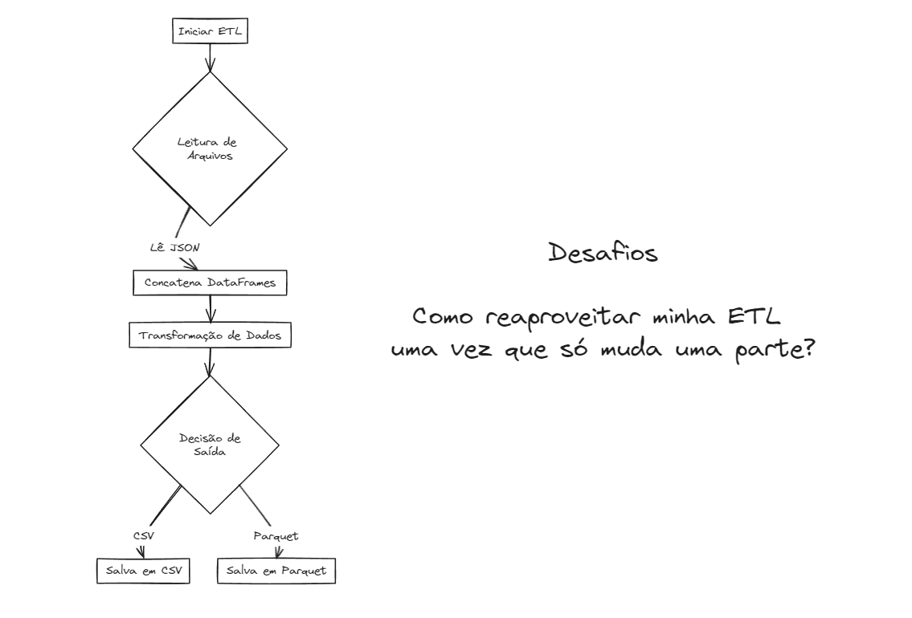

# Aula 08: Funções em Python - ETL com Pandas, JSON e Parquet


Para realizar uma ETL (Extract, Transform, Load) simples utilizando Python e a biblioteca Pandas, vamos seguir os seguintes passos:

Extract: Ler os dados de um arquivo JSON.

Transform: Concatenar os dados extraídos em um único DataFrame e aplicar uma transformação. A transformação específica dependerá dos dados, mas vamos assumir uma operação simples como um exemplo.

Load: Salvar o DataFrame resultante em um arquivo CSV ou PARQUET. 

**Usando LOG**

## Conteúdo


O Loguru é uma biblioteca de logging para Python que visa trazer uma experiência de uso mais simples e poderosa do que o módulo de logging padrão do Python. Com uma API simples, Loguru oferece várias funcionalidades úteis, como rotação de arquivos, serialização JSON, envio de mensagens para múltiplos destinos, e muito mais, tudo isso sem a necessidade de configuração inicial complicada.

### O que é Logging?

Logging é o processo de gravar mensagens que documentam os eventos que ocorrem durante a execução de um software. Essas mensagens podem indicar progresso da execução, falhas, erros, ou outras informações úteis. O logging é crucial para desenvolvimento e manutenção de software, pois permite aos desenvolvedores e administradores de sistema entender o que o aplicativo está fazendo, diagnosticar problemas e monitorar o desempenho em produção.

### Como Utilizar o Loguru

Para começar a usar o Loguru, você primeiro precisa instalá-lo. Isso pode ser feito facilmente via pip:

```bash
poetry add loguru
```

Agora, vamos aos exemplos de como utilizar o Loguru em seu código Python.

#### Exemplo 1: Logging Básico

Este exemplo mostra como fazer logging básico com Loguru, incluindo mensagens de diferentes níveis de severidade.

```python
from loguru import logger

# Mensagens de log de diferentes níveis
logger.debug("Isso é uma mensagem de debug")
logger.info("Isso é uma mensagem informativa")
logger.warning("Isso é um aviso")
logger.error("Isso é um erro")
logger.critical("Isso é crítico")

# A saída será exibida no console
```

Neste exemplo, utilizamos o `logger` importado do Loguru para registrar mensagens de diferentes níveis de severidade. O Loguru se encarrega de formatar e exibir essas mensagens no console, por padrão.

#### Exemplo 2: Configuração de Arquivo de Log

Aqui, configuramos o Loguru para salvar mensagens de log em um arquivo, incluindo a rotação do arquivo baseada no tamanho.

```python
from loguru import logger

# Configurando o arquivo de log com rotação de 5MB
logger.add("meu_app.log", rotation="5 MB")

logger.info("Essa mensagem será salva no arquivo")
```

No exemplo acima, `logger.add()` é usado para adicionar um "sink" (destino) que, neste caso, é um arquivo. A opção `rotation` determina que um novo arquivo será criado sempre que o atual atingir 5MB.

#### Exemplo 3: Capturando Exceções com Log

Loguru também facilita o logging de exceções, capturando automaticamente informações de traceback.

```python
from loguru import logger

def minha_funcao():
    raise ValueError("Um erro aconteceu!")

try:
    minha_funcao()
except Exception:
    logger.exception("Uma exceção foi capturada")
```

Usando `logger.exception()`, Loguru automaticamente captura e loga o traceback da exceção, o que é extremamente útil para diagnóstico de erros.

Vamos criar um decorador utilizando o Loguru para adicionar automaticamente logs a qualquer função Python. Isso nos permite registrar automaticamente quando uma função é chamada e quando ela termina, junto com qualquer informação relevante, como argumentos da função e o resultado retornado (ou exceção lançada).

Agora, vamos ao código do decorador:

```python
from loguru import logger

def log_decorator(func):
    def wrapper(*args, **kwargs):
        logger.info(f"Chamando '{func.__name__}' com {args} e {kwargs}")
        try:
            result = func(*args, **kwargs)
            logger.info(f"'{func.__name__}' retornou {result}")
            return result
        except Exception as e:
            logger.exception(f"'{func.__name__}' lançou uma exceção: {e}")
            raise
    return wrapper
```

Neste decorador, `log_decorator`, usamos `logger.info` para registrar quando a função decorada é chamada e o que ela retorna. Se uma exceção for lançada, usamos `logger.exception` para registrar a exceção, incluindo o traceback.

### Como Utilizar o Decorador

Agora, veja como aplicar o `log_decorator` a uma função:

```python
@log_decorator
def soma(a, b):
    return a + b

@log_decorator
def falha():
    raise ValueError("Um erro intencional")

# Testando as funções decoradas
soma(5, 3)  # Isso irá logar a chamada e o retorno
try:
    falha()  # Isso irá logar a chamada e a exceção
except ValueError:
    pass  # Ignora a exceção para fins de demonstração
```

Ao decorar as funções `soma` e `falha` com `@log_decorator`, automaticamente logamos a entrada e saída (ou exceção) dessas funções sem alterar o corpo delas. Isso é especialmente útil para debugar, monitorar a performance de aplicações ou simplesmente manter um registro de quais funções estão sendo chamadas e com quais argumentos.

### Benefícios do Uso de Decoradores com Loguru

O uso de decoradores em conjunto com o Loguru fornece uma abordagem elegante e poderosa para adicionar logs a aplicações Python. Sem a necessidade de modificar o corpo da função, podemos facilmente adicionar funcionalidades de logging, o que torna o código mais limpo, mantém a separação de preocupações e facilita a manutenção e o debugging.

Além disso, ao centralizar a lógica de logging no decorador, promovemos a reutilização de código e garantimos uma forma consistente de logar informações através de diferentes partes de uma aplicação.

### Conclusão

O Loguru oferece uma abordagem moderna e conveniente para logging em Python, simplificando muitos aspectos que requerem configuração manual detalhada com o módulo de logging padrão do Python. Seja para desenvolvimento, depuração ou produção, adicionar logging ao seu aplicativo com Loguru pode melhorar significativamente a visibilidade e a capacidade de diagnóstico do seu código.

### Desafio




