# Roadmap de Engenharia de Dados 

  <a href="https://suajornadadedados.com.br/">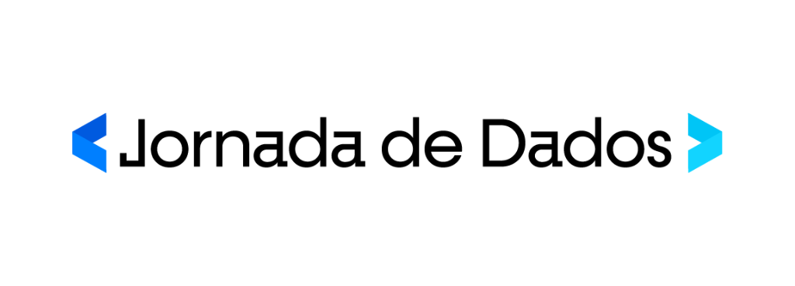</a>

    <em>Nossa missão é fornecer o melhor ensino em engenharia de dados</em>

Bem-vindo ao **Roadmap de Engenharia de Dados** da **Jornada de Dados**! Este repositório foi construído colaborativamente e tem como objetivo capacitá-lo para a carreira de engenharia de dados, ajudando profissionais como você a atingir novos patamares em sua trajetória profissional.

Aqui você encontrará:

- **Roadmap de Estudo:** Links, referências e materiais complementares para auxiliar no seu aprendizado. Se você quer ter um plano de estudo, você encontra uma série de projetos e recursos que o guiarão passo a passo no desenvolvimento das habilidades essenciais em engenharia de dados.
- **Códigos das Aulas:** Todos os códigos e materiais utilizados durante as aulas estão disponíveis neste repositório para que você possa praticar e aprofundar seu conhecimento.
- **Calendário dos Próximos Encontros:** Fique por dentro das datas e temas dos próximos workshops e bootcamps da Jornada de Dados.

Se você gostou do conteúdo e quer se inscrever em nosso programa profissional, pode fazer isso aqui:

## Comece por aqui

Bem-vindo à Jornada de Dados! Antes de mergulharmos nos conteúdos avançados, é essencial que você tenha seu ambiente de desenvolvimento devidamente configurado. O objetivo é que, em aproximadamente 1 hora, você esteja pronto para assistir às aulas no YouTube e participar das atividades práticas da Jornada de Dados.

Ter um ambiente bem configurado facilitará seu aprendizado e permitirá que você se concentre nos conceitos e práticas da engenharia de dados, sem se preocupar com problemas técnicos. Vamos começar?

| Imagem | Skills | Objetivo | YouTube |
|--------|--------|----------|---------|
|  | Python, Git, GitHub e VSCode | Tutorial de como configurar um ambiente de desenvolvimento para engenharia de dados com foco no mercado de trabalho. | [Link para o vídeo](https://www.youtube.com/watch?v=video_id) |
|  | Python, Pyenv, PIP, VENV, PIPX e Poetry | Segunda parte do tutorial de como configurar um ambiente de desenvolvimento para engenharia de dados com foco no mercado de trabalho. | [Link para o vídeo](https://www.youtube.com/watch?v=-M4pMd2yQOM&t=1s) |

---

# Lives no Youtube:

# Sumário:

| N   | Link                                                   | Código                                                    | Slides                                                                                     | Título                                                                                      | Convidado              | Duração   |
| --- | ------------------------------------------------------ | --------------------------------------------------------- | ------------------------------------------------------------------------------------------ | ------------------------------------------------------------------------------------------ | ---------------------- | ---------- |
| 5   | [link](https://youtube.com/live/IQtuWsNmB4o)          |                                                           |                                                                                            | Qualidade de dados em ETL com Pandera e Python: Um Guia para Contrato de Dados             | Renan Heckert          | 1h30min   |
| 4   | [link](https://youtube.com/live/n3R0c2ZB6BQ)          |                                                           |                                                                                            | Pipeline ETL Python - Monitoramento de Preços de Commodities com SQL e dbt-core (Data Warehouse) | Kaio Silva             | 2h50min   |
| 3   | [link](https://youtube.com/live/qNu1VCtUedg)          |                                                           |                                                                                            | Pipeline ETL Python - Web Scraping com Scrapy                                              | Fabio Melo             | 2h30min   |
| 2   | [link](https://youtube.com/live/4w6UQNn_6X0)          |                                                           |                                                                                            | Projeto completo de Modern Data Stack com SQL                                              | @MarcLamberti          | 7h        |
| 1   | [link](https://youtube.com/live/4w6UQNn_6X0)          |                                                           |                                                                                            | Criando ETL com Python e DUCKDB: Do Zero ao Deploy                                         | @mehdio                | 2h30min   |

---

🚀 **Não perca nenhuma oportunidade!** Mantenha-se atualizado e participe dos nossos eventos para evoluir como profissional e dominar as tecnologias mais modernas.  

---

Esse formato padronizado facilita a navegação, proporciona clareza e mantém a consistência em todos os workshops e eventos da Jornada de Dados.

## Workshops disponíveis na Jornada de dados

Workshops é uma imersão ao vivo sobre determinada ferramenta, onde você pode tirar dúvidas e aprender em grupo.

| Imagem | Skills | Objetivo | Repositório |
|--------|--------|----------|-------------|
| 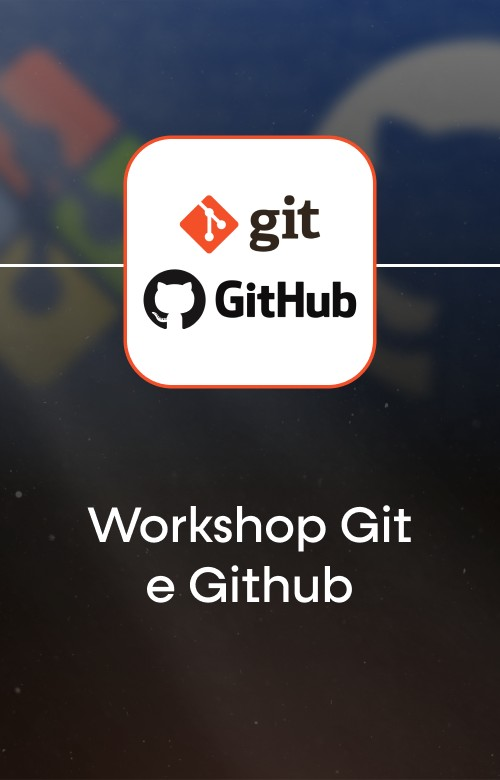 | **Git e Github** | Aprenda a trabalhar em equipe de dados de forma mais eficiente | [Link](./Workshop%20-%20Git%20e%20Github) |
| 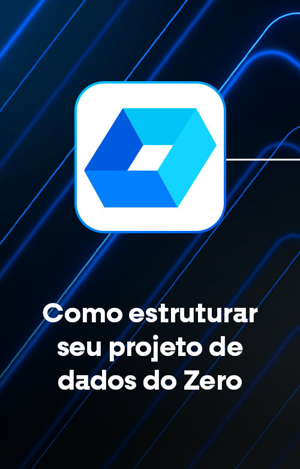 | **Como estruturar o seu projeto de dados do zero** | Aprenda a estruturar projetos de dados de forma eficiente desde o início. | [Link](./Workshop-1/) |
| 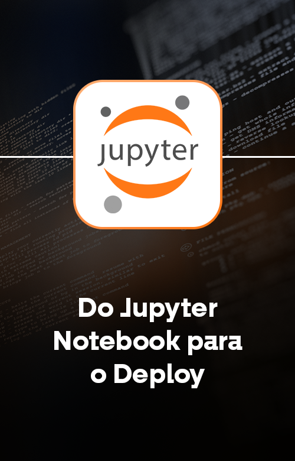 | **Do Jupyter Notebook Pro Deploy** | Descubra como transformar notebooks em aplicações prontas para deploy. | [Link](./Workshop-2/) |
|  | **Como construir um DW barato** | Saiba como construir um Data Warehouse de baixo custo com ferramentas acessíveis. | [Link](./Workshop-3/) |
| 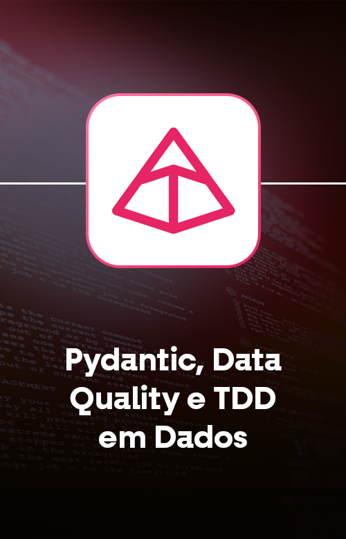 | **Pydantic, Data Quality e TDD em dados** | Utilize Pydantic para garantir a qualidade e integridade dos dados em seus projetos. | [Link](./Workshop-6/) |
| 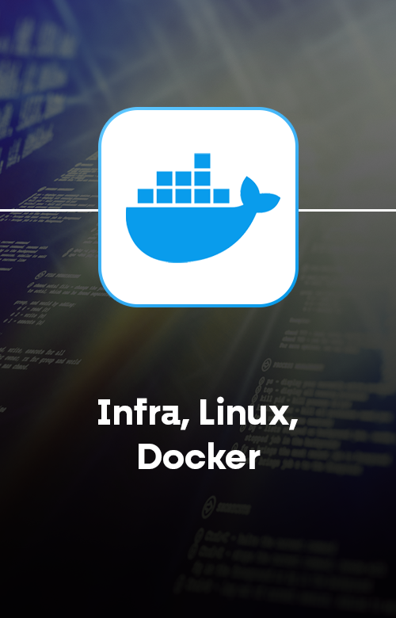 | **Docker para analista e engenheiro de dados** | Aprenda a utilizar Docker para criar ambientes isolados e facilitar o deploy de aplicações de dados. | [Link](./Workshop-7/) |
| 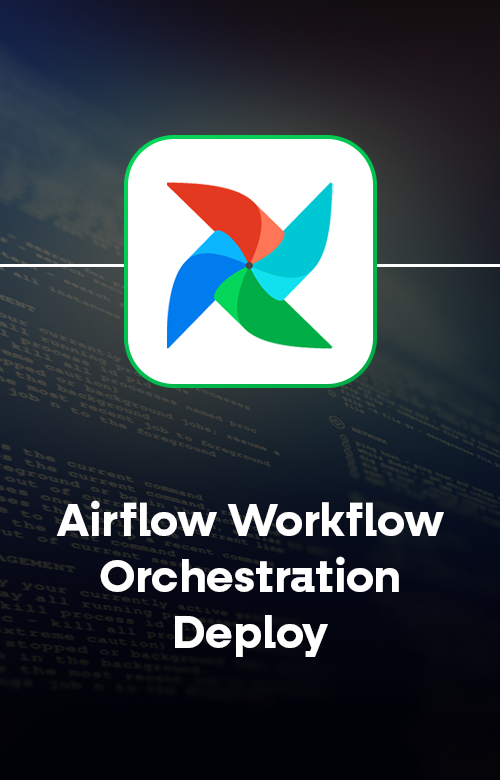 | **Orquestrando suas ETLs com Airflow** | Aprenda a orquestrar e agendar seus pipelines ETL utilizando o Apache Airflow. | [Link](./Workshop-9/) |
| 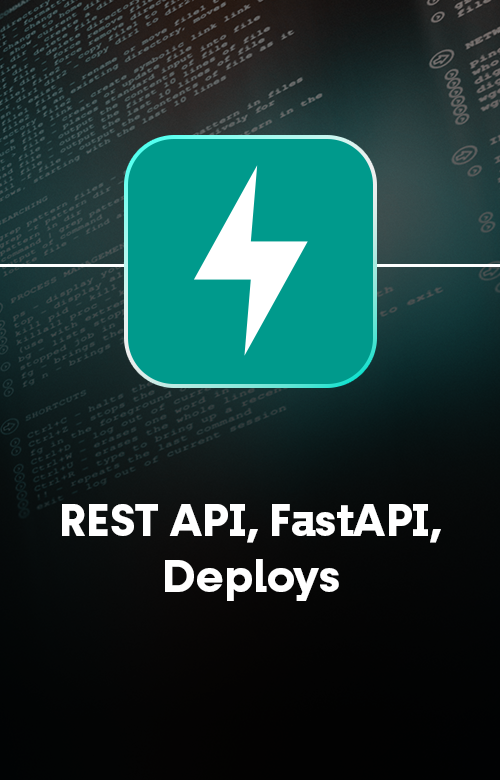 | **REST API FastAPI Deploy** | Desenvolva e faça deploy de APIs REST utilizando FastAPI. | [Link](./Workshop-11/) |
| 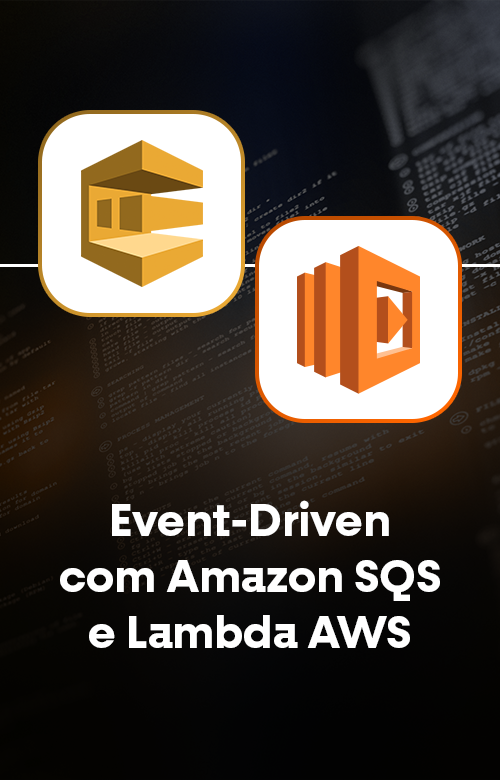 | **Amazon SQS e Lambda** | Integre serviços da AWS como SQS e Lambda em seus projetos de dados. | [Link](./Workshop-12/) |
| 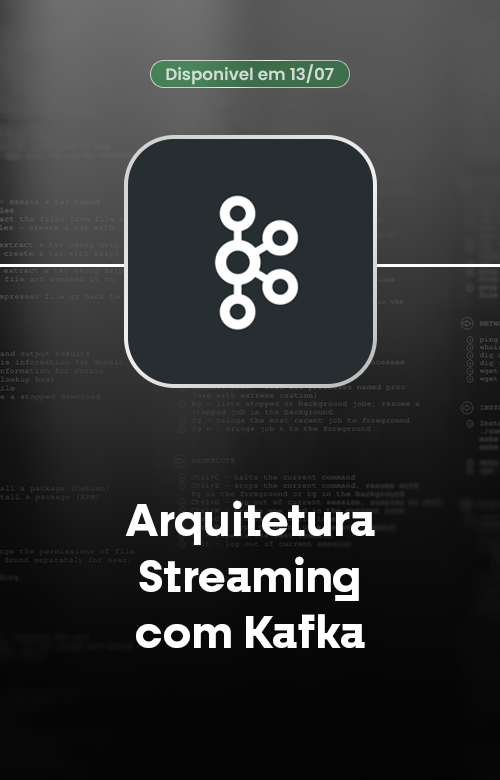 | **Kafka Streaming data processing** | Processamento de dados em tempo real utilizando Apache Kafka. | [Link](./Workshop-16/) |
| 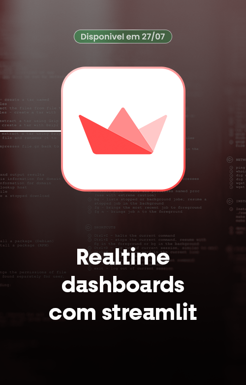 | **Streamlit Dashboard** | Crie dashboards interativos para visualização de dados utilizando Streamlit. | [Link](./Workshop-17/) |
| 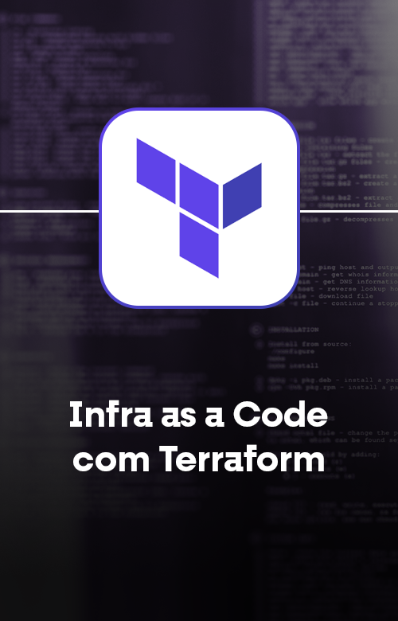 | **Terraform** | Automatize a sua infraestrutura com Terraform. | [Link](./Workshop-17/) |
|  | **Extração de dados em PDF e Regex** | Aprenda técnicas de extração de dados de PDFs e uso de expressões regulares. | [Link](./Workshop-17/) |

---

### **29 de outubro – Observabilidade Focada em Streaming de Dados**  
**Tema:** Monitoramento em Tempo Real para Pipelines de Streaming  
**Descrição:** Aprenda a aplicar práticas de **observabilidade** para garantir **estabilidade e eficiência** em pipelines de dados em tempo real, capturando métricas e logs críticos e detectando anomalias rapidamente.  

#### **O que você vai aprender:**  
- Configuração de métricas para monitoramento em tempo real.  
- Captura de logs relevantes para resolução de incidentes.  
- Criação de alertas inteligentes para eventos críticos.  
- Integração com plataformas de observabilidade e serviços de streaming.

## Bootcamps Jornada de Dados

Aqui estão todos os bootcamps disponíveis na Jornada de Dados:

| Acesso e início       | Bootcamp                        | Carga Horária       | Link GitHub | Status        |
|-----------------------|---------------------------------|----------------------|-------------|---------------|
| Acesso Imediato       | **Python para Dados**           | 30 horas            | [Link](#)   | **Concluído** |
|                       | *Descrição:* Aprenda os fundamentos de Python aplicados à engenharia de dados, incluindo bibliotecas como Pandas e NumPy, manipulação e limpeza de dados. |
| Acesso Imediato       | **SQL para Analytics Engineer** | 20 horas            | [Link](#)   | **Concluído** |
|                       | *Descrição:* Domine conceitos avançados de SQL necessários para um Analytics Engineer, incluindo consultas complexas e otimização de desempenho. |
| Acesso Imediato       | **dbt-core**                   | 10 horas            | [Link](#)   | **Concluído** |
|                       | *Descrição:* Utilize o dbt-core para transformar dados em seu data warehouse, implementando práticas modernas de engenharia de dados. |
| Acesso Imediato       | **Web Scraping Avançado**       | 10 horas            | [Link](#)   | **Concluído** |
|                       | *Descrição:* Aprenda técnicas avançadas de web scraping, extração de dados de sites complexos e manipulação de APIs. |
| Acesso Imediato       | **Power BI**                    | -- horas            | [Link](#)   | **Concluído** |
|                       | *Descrição:* Explore o Power BI para criar dashboards interativos e análises visuais de dados. |
| Início 22/08          | **Cloud para Dados**            | 30 horas            | [Link](#)   | **Em andamento** |
|                       | *Descrição:* Conheça os serviços de nuvem aplicados à engenharia de dados nas plataformas AWS, Azure e GCP, e implemente soluções escaláveis. |

Acredito no ensino ao vivo, temos aulas todas as terças, YouTube e Bootcamps, e no último sábado do mês.

Os encontros são aos **sábados às 9 horas, com duração de 4 horas**.

## Pré-requisitos

Para você aproveitar ao máximo do curso, é importante que você se sinta confortável com SQL e tenha experiência com Python. Idealmente, você deve ter entre 1 e 2 anos trabalhando com dados.

Caso você não tenha essa experiência, será necessário estudar bastante SQL e Python em paralelo. Recomenda-se ao menos 1 hora por dia de estudos além dos workshops.

Mas fique tranquilo, temos o nosso Bootcamp de 100 dias de Python e SQL para te colocar em forma.

Aqui é o lugar certo para aprender Python e SQL voltado para a engenharia de dados.

## Plataforma e Autonomia

Você pode acessar nossa plataforma, que disponibiliza um ambiente amigável para acessar todo o material do curso.

## Possui dúvidas?

- Fale comigo [no LinkedIn](https://www.linkedin.com/in/lucianovasconcelosf/)

## Como sugerir temas para próximos workshops?

- [Abra uma issue](https://github.com/lvgalvao/data-engineering-roadmap/issues)
