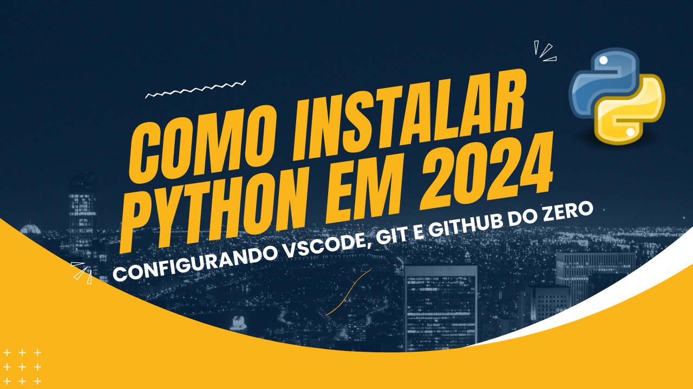

# Jornada de dados 2024

Nossa missão é **fornecer o melhor ensino em engenharia de dados**

Se você quer:

1) Construir uma **base sólida** em Python e SQL
2) Aprender as **principais habilidades e ferramentas** de engenharia de dados
3) Criar ou melhorar seu **portfólio** de dados
4) Criar ou aumentar o seu **networking** na área
5) Mudar ou dar o **próximo passo em sua carreira**

A **Jornada de Dados** é o seu lugar

Para conhecer mais sobre o projeto clique na figura

Para entrar na lista de espera clique no botao

## Calendário

|Data |Workshop|Horário e canal|
|-----|--------|--------|
|24/01|Automacao Data Quality Excel ETL| 20h Youtube
|27/01|Projeto e processos do Zero| 09h Zoom
|24/02|Pydantic, Data Quality e TDD em dados| 09h Zoom
|09/03|Infra, Linux, Docker criando nosso ambiente perfeito| 09h Zoom
|23/03| Airflow Workflow Orchestration Deploy | 09h Zoom
|15/04| Redis Mongodb esse tal de noSQL | 09h Zoom
|27/04|restAPI fastAPI Deploy| 09h Zoom
|11/05|Kafka Streaming data processing| 09h Zoom
|25/05|Amazon SNS, SQS e Rabbit MQ| 09h Zoom
|08/06|Infra as a Code com Terraform| 09h Zoom
|06/07|Prometheus Datadog Sentry Monitoramento| 09h Zoom
|20/07|Machine Learning Ops| 09h Zoom
|03/08|Databricks e Fabric, nosso DW de milhoes| 09h Zoom

## Calendário Bootcamp - Python e SQL aplicado em engenharia de dados

Um workshop focado em Python e SQL voltado para engenharia de dados
|Data |Workshop|Horário|
|-----|--------|--------|
| Data | Workshop | Horário |
| --- | --- | --- |
| 19/02 | Hello world + Revisão de Setup Inicial: Python, Git e VScode | 12am |
| 20/02 | Variáveis em Python | 12am |
| 21/02 | Estrutura de Dados - Listas, Tuplas, Dicionários e Conjuntos | 12am |
| 22/02 | Controle de Fluxo: if, else, for loops e while | 12am |
| 23/02 | Projeto 01: Leitura e Escrita de Arquivos, lendo 1 bilhão de linhas | 12am |
| 26/02 | Exercício de revisão | 12am |
| 27/02 | Funções em Python e Estrutura de Dados - Parte 1 | 12am |
| 28/02 | Funções em Python e Estrutura de Dados - Parte 2 | 12am |
| 01/03 | Funções em Python e Estrutura de Dados - Parte 3 | 12am |
| 02/03 | Introdução a POO | 12am |
| 04/03 | Exercício de revisão | 19pm |
| 05/03 | Introdução às Classes em Python - Parte 01 | 19pm |
| 06/03 | Introdução às Classes em Python - Parte 02| 19pm |
| 07/03 | Herança e Polimorfismo | 19pm |
| 08/03 | Classes Avançadas | 19pm |
| 11/03 | Introdução à Orientação a Objetos | 19pm |
| 12/03 | OOP Aplicado: Padrões de Projeto | 19pm |
| 13/03 | OOP Aplicado: Testando Classes | 19pm |
| 14/03 | Projeto 02: Criando nosso Duckdb | 19pm |
| 15/03 | Projeto 02: Criando nosso Duckdb | 19pm |
| 18/03 | Introdução ao SQL: Seleção e Filtragem de Dados com Duckdb | 12am |
| 19/03 | Junções, Subqueries e Agregações com Duckdb | 12am |
| 20/03 | Inserção, Atualização e Deleção de Dados com Postgres| 12am |
| 21/03 | SQL Avançado: Funções de Janela e CTEs com Postgres | 12am |
| 22/03 | Introdução ao ETL com SQL | 12am |
| 25/03 | Projeto 03: Transformação de Dados parte 01 | 12am |
| 26/03 | Projeto 03: Transformação de Dados parte 02 | 12am |
| 27/03 | Projeto 03: Automatização de ETL e Triggers | 12am |
| 28/03 | Projeto 03: Deploy de Bancos de Dados | 12am |
| 29/03 | Projeto 03: Índices e Performance Tuning | 12am |
| 01/04 | Otimização de Consultas e Plano de Execução | 19pm |
| 02/04 | Introdução a ORMs | 19pm |
| 03/04 | Projeto 04: Aplicando ORMs: SQLAlchemy e fazendo CRUD parte 1 | 19pm |
| 04/04 | Projeto 04: SQLAlchemy e fazendo CRUD parte 2 | 19pm |
| 05/04 | Projeto 04: SQLAlchemy e fazendo CRUD parte 3 | 19pm |
| 08/04 | Projeto 05: Mkdocs e documentação | 12 am |
| 09/04 | Projeto 06: Lendo 1 trilhão de linhas parte 1| 12 am |
| 10/04 | Projeto 06: Lendo 1 trilhão de linhas parte 2 | 12 am |
| 11/04 | Projeto 07: Criando nosso dashboard com Streamlit | 19pm |
| 12/04 | Projeto 07: Criando nosso dashboard com Streamlit | 19pm |

## Detalhe Bootcamp

## Aula 00: Assistir video de setup

Tutorial de como configurar um ambiente de desenvolvimento Python com foco no mercado de trabalho

Passo a passo para você criar os seus projetos do Zero de forma profissional

## Aula 01 | Dia 19 as 12:00am Revisao de Setup Inicial: Python, Git e VSCode

* Configuracao Python
* Configuracao Git e Github
* Configuracao VSCode

## Aula 02 | Dia 20 as 12:00am Ambientes Virtuais e Gerenciamento de Pacotes em Python

* Compreender a importância dos ambientes virtuais para o desenvolvimento em Python.
* Aprender a criar e gerenciar ambientes virtuais utilizando `pip`, `pipx`, `venv` e `poetry`.
* Explorar as vantagens e casos de uso de cada ferramenta.

## Aula 03 | Dia 21 as 12:00am Variáveis em Python

* Compreender o conceito de variáveis e sua importância na programação.
* Aprender a declarar e atribuir valores às variáveis em Python.
* Explorar os tipos de dados simples suportados por Python.
* Discutir boas práticas para nomear variáveis.

## Aula 04 | Dia 22 as 12:00am Estrutura de Dados (Parte 1) - Listas, Tuplas, Dicionários e Conjuntos

* Compreender a diferença entre listas e tuplas em Python.
* Aprender a criar, acessar e manipular listas e tuplas.
* Explorar métodos e operações comuns aplicáveis a listas e tuplas.
* Dicionários: criação, chave-valor, métodos
* Conjuntos: criação, operações de conjunto, métodos

## Aula 05 | Dia 23 as 12:00am Controle de Fluxo: if, else, for loops e while, Exceções e Manipulação de Erros

* Estruturas condicionais com if, else, e elif
* Loops com for para iterar sobre sequências
* Uso de loops while para execução condicional
* Exercícios práticos para reforçar o aprendizado
* Introdução a exceções e como elas são usadas em Python
* Tratamento de exceções com blocos try e except
* Utilização de else e finally em manipulação de erros
* Levantando exceções com raise e práticas recomendadas

## Aula 06 | Dia 26 as 12:00am Exercicio de revisao
* Revisao variaveis, tipos e fluxos
* Projeto 01
* Projeto 02

## Aula 07 | Dia 27 as 12:00am Trabalhando com Strings
* Métodos básicos de strings: encontrar, substituir, dividir
* Concatenação, fatiamento, e formatação de strings
* Exercícios práticos para manipulação de strings

## Aula 08 | Dia 28 as 12:00am Funções Básicas
* Definição e chamada de funções
* Argumentos e retorno de valores
* Exemplos práticos e exercícios para solidificar o entendimento

## Aula 09 | Dia 01 as 12:00am Arquivos: Leitura e Escrita
* Abrindo e lendo arquivos, incluindo o uso de with para gerenciamento automático de recursos
* Escrevendo em arquivos, tratando tanto texto quanto binário
* Dicas para práticas seguras com arquivos
Exercícios de aplicação para consolidar o aprendizado

## Aula 10 | Dia 02 as 12:00am Introdução a objetos, mas usando os objetos dos outros

* Instalando e importando a biblioteca Pandas
* Estruturas de dados do Pandas: Series e DataFrame
* Carregando dados de um arquivo para um DataFrame
* Operações básicas com Pandas: filtragem, seleção e manipulação de dados
* Exercícios práticos com datasets reais para aplicar os conceitos aprendidos

Esta estrutura oferece uma introdução abrangente e acessível ao Python, começando com operações fundamentais de strings, passando por controle de exceções, introdução a funções, manipulação de arquivos e, finalmente, utilizando uma biblioteca externa popular como o Pandas. Cada aula é projetada para construir a base de conhecimento do aluno gradualmente, permitindo-lhes aplicar o que aprenderam em exemplos e exercícios práticos, preparando-os efetivamente para trabalhos mais avançados com Python no futuro.

## Aula 11 | Dia 04 as 07:00pm Funções em Python - Parte 1

* Introdução às funções: definição, chamadas e retornos
* Parâmetros de funções: obrigatórios, opcionais e argumentos de palavra-chave
* Escopo de variáveis: global vs. local

## Aula 12 | Dia 05 as 07:00pm Funções em Python - Parte 2

* Funções anônimas (lambda)
* Decoradores: modificando o comportamento das funções
* Funções geradoras e a palavra-chave `yield`

## Aula 13 | Dia 06 as 07:00pm Introdução às Classes em Python

* Conceitos básicos de classes e objetos
* Definindo classes: atributos, métodos e o `__init__`
* Criando e interagindo com instâncias de objetos

## Aula 14 | Dia 07 as 07:00pm Herança e Polimorfismo

* Conceitos de herança: criando subclasses
* Sobrescrevendo métodos e uso de `super()`
* Polimorfismo e métodos mágicos (dunder methods)

## Aula 15 | Dia 08 as 07:00pm Classes Avançadas - Composição e Encapsulamento

* Composição vs. Herança: melhores práticas
* Encapsulamento: protegendo os dados da classe
* Métodos estáticos e de classe

## Aula 16 | Dia 11 as 07:00pm Introdução à Orientação a Objetos

* Princípios fundamentais da OOP: encapsulamento, herança, e polimorfismo
* Aplicando conceitos de OOP em Python
* Exemplos e exercícios práticos

## Aula 17 | Dia 12 as 07:00pm  OOP Aplicado: Padrões de Projeto

* Introdução a padrões de projeto: Singleton, Factory, Strategy
* Implementando padrões de projeto em Python
* Discussão sobre quando e por que usar cada padrão

## Aula 18 | Dia 13 as 07:00pm OOP Aplicado: Testando Classes

* Testes unitários com `unittest`
* Mocking e testando comportamentos em OOP
* Melhores práticas para testar código orientado a objetos

## Aula 19 | Dia 14 as 07:00pm Projetos Práticos: Criando nosso Duckdb Parte 01

* Desenvolvendo um projeto prático utilizando OOP
* Planejamento, implementação e revisão de um projeto Python orientado a objetos
* Dicas para estruturação e organização de projetos maiores

## Aula 20 | Dia 15 as 07:00pm Projetos Práticos: Criando nosso Duckdb Parte 02

* Revisão dos conceitos chave de OOP em Python
* Início do projeto final: aplicando OOP para resolver um problema prático
* Orientações para continuação do aprendizado em Python e próximos passos

## Jornada de dados 2024

Nossa missão é fornecer o melhor ensino em engenharia de dados

Se você quer:

1) Construir uma base sólida em Python e SQL
2) Aprender as principais habilidades e ferramentas de engenharia de dados
3) Criar ou melhorar seu portfólio de dados
4) Criar ou aumentar o seu networking na área
5) Mudar ou dar o próximo passo em sua carreira

A Jornada de Dados é o seu lugar

## Metodologia

Acredito no ensino ao vivo, **são 13 workshops no total**

Os encontros são aos **sábados ás 9 horas, são 4 horas de workshop**

## Detalhe das aulas

### [Workshop 24/01: Automação Data Quality Excel Etl](./00-automacao-data-qualiy-excel-etl/)

* Criando uma colletor de excel em python
* Qualidade com Pydantic
* Versionamento com Git e Github
* Documentando com Mkdcos
* Observabilidade com Sentry
* UI com Streamlit (se eu não achar nada mais fácil até lá)

### [Workshop 27/01: Estruturando um projeto e um processo de dados](https://github.com/lvgalvao/DataProjectStarterKit)

* Introdução aos 12 fatores
* Versionamento com Git e Github
* Migrando para Python 3.12 com Pyenv
* Ambiente virtual com PIP, Poetry e Conda
* Documentação com Mkdocs
* Teste sua aplicação com Pyenv
* Criando um fluxo de trabalho com pré-commit
* Estruturando uma PR e criando um processo
* Garantindo conformidade com CI/CD
  
### [Workshop 24/02: Pydantic, Data Quality e TDD em Dados](./02-pydantic-data-quality-e-tdd-aplicado-em-projeto-de-dados/)

* Pydantic para Modelagem de Dados
* Garantindo Qualidade de Dados
* Test-Driven Development em Dados com Pytest
* Estratégias de Validação de Dados
* Pydantic e TDD: Casos Práticos

### [Workshop 09/03: Infra, Linux, Docker](./03-infra-linux-docker-em-projeto-de-dados/)

* Fundamentos de Infraestrutura para Dados
* Linux Essencial para Engenheiros de Dados
* Docker: Containerização em Dados
* Criando Ambientes de Dados com Docker
* Melhores Práticas em Infra de Dados

### [Workshop 23/03: Airflow Workflow Orchestration Deploy](./04-workflow-orchestration-deploy-airflow/)

* Introdução ao Airflow para Orquestração
* Configurando Airflow: Melhores Práticas
* Desenvolvendo Workflows Eficientes no Airflow
* Deploy de Workflows com Airflow
* Monitoramento e Troubleshooting no Airflow

### [Workshop 15/04: Redis, MongoDB, NoSQL](./05-redis-mongodb-esse-tal-de-nosql/)

* Introdução ao NoSQL: Redis e MongoDB
* Redis para Caching e Gerenciamento de Dados
* MongoDB: Modelagem e Consultas
* Comparativo NoSQL: Redis vs MongoDB
* Casos de Uso: Redis e MongoDB

### [Workshop 27/04: REST API, FastAPI, Deploys](/06-restAPI-fastAPI-deploy/)

* Desenvolvendo REST APIs Eficientes
* FastAPI: Criação e Documentação
* Estratégias de Deploy para APIs
* Segurança e Escalabilidade em APIs
* APIs com FastAPI: Estudos de Caso

### [Workshop 11/05: Arquitetura Streaming com Kafka](./07-spark-kafka-streaming-data-processing/)

* Introdução ao Processamento de Streaming
* Apache Kafka: Fundamentos e Práticas
* Desafios no Streaming de Dados
* Casos Práticos Kafka

### [Workshop 25/05: Arquitetura de eventos com Amazon SNS, SQS, RabbitMQ](./08-amazon-sns-sqs-rabbit-mq/)

* Mensageria com Amazon SNS e SQS
* RabbitMQ: Configuração e Uso
* Comparação: SNS, SQS, RabbitMQ
* Padrões de Mensageria na Cloud
* Casos de Uso em Sistemas Distribuídos

### [Workshop 08/06: Infra as a Code com Terraforms](./09-infra-as-a-code-terraform/)

* Introdução a Infraestrutura como Código
* Terraform: Conceitos Básicos
* Gerenciando Cloud com Terraform
* Segurança e Compliance com Terraform
* Terraform: Casos de Uso Práticos

### [Workshop 06/07: Prometheus, Datadog, Sentry](./10-prometheus-datadog-sentry-monitoramento/)

* Monitoramento com Prometheus
* Datadog para Observabilidade de Dados
* Sentry para Gestão de Erros
* Integrando Prometheus, Datadog e Sentry
* Melhores Práticas de Monitoramento

### [Workshop 20/07: Machine Learning Ops](./12-databricks-fabrick-dw-de-milhoes/)

* Introdução ao MLOps
* Ciclo de Vida de Modelos ML
* Automação e Orquestração em ML
* Monitoramento e Governança de ML
* Casos Práticos de MLOps

### [Workshop 03/08: Databricks e Fabrics](./12-databricks-fabrick-dw-de-milhoes/)

* Databricks: Plataforma de Big Data
* Fabric: Gestão de Dados em Escala
* Arquiteturas de Data Warehouse
* Databricks e Fabric: Integração
* DW de Milhões: Desafios e Soluções

### Pré requisitos

Para você aproveitar ao máximo do curso, é importante que você se sinta confortável com SQL e uma experiência com Python também será útil, ideal que você tenha entre 1 e 2 anos trabalhando com dados.

Caso você não tenha de 1 a 2 anos na área terá que estudar muito SQL e Python em paralelo, acredito que ao menos 1h por dia de estudos fora os Workshops.

Mas fique tranquilo, temos o nosso Bootcamp de 100 dias de Python e SQL para te colocar no shape.

Aqui é o lugar certo para aprender Python e SQL voltado para a engenharia de dados

## Plataforma e autonomia

Alternativamente, você pode acessar nossa plataforma, nossa aplicação disponibiliza uma plataforma bem user-frindly para você pode acessar ao material do curso

## Possui dúvidas? 

- Fale comigo [Link do Linkedin](https://www.linkedin.com/in/lucianovasconcelosf/)
