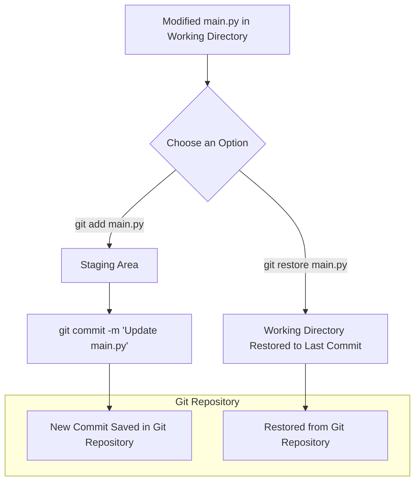
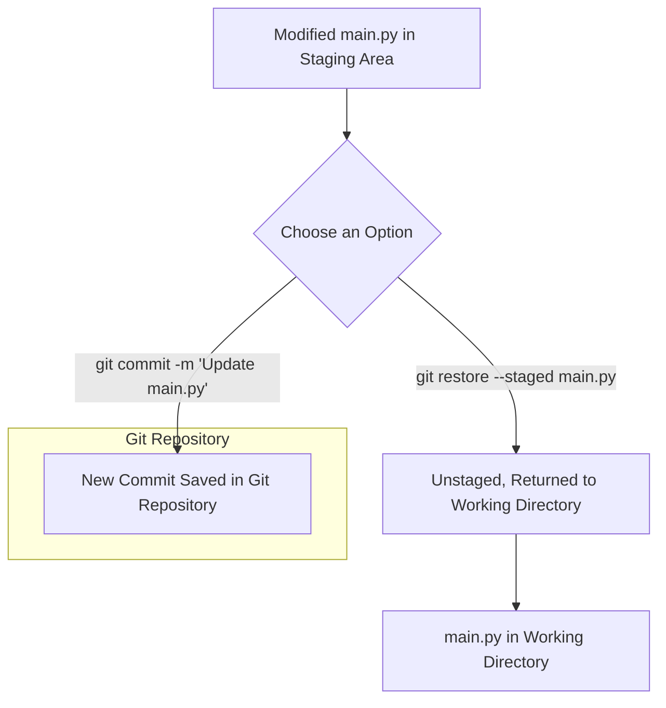
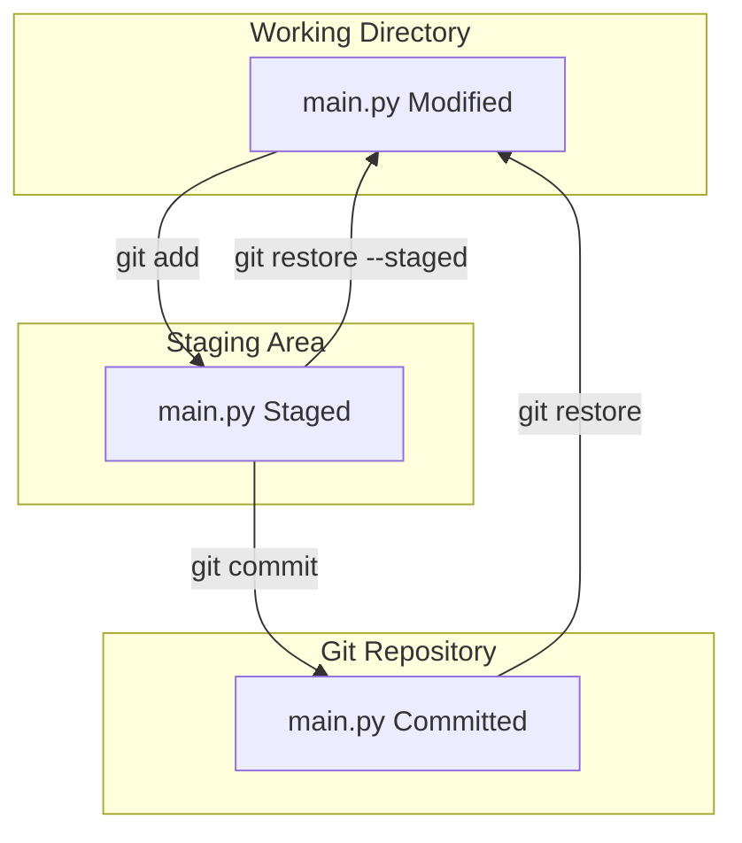
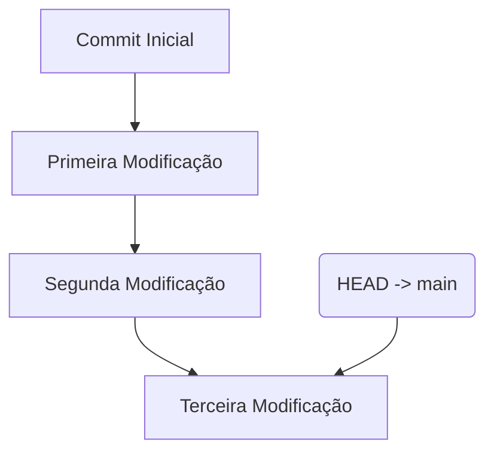
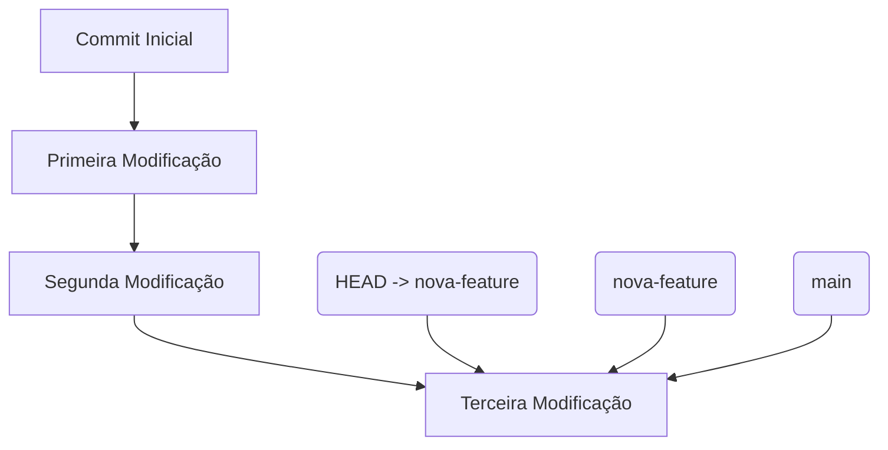
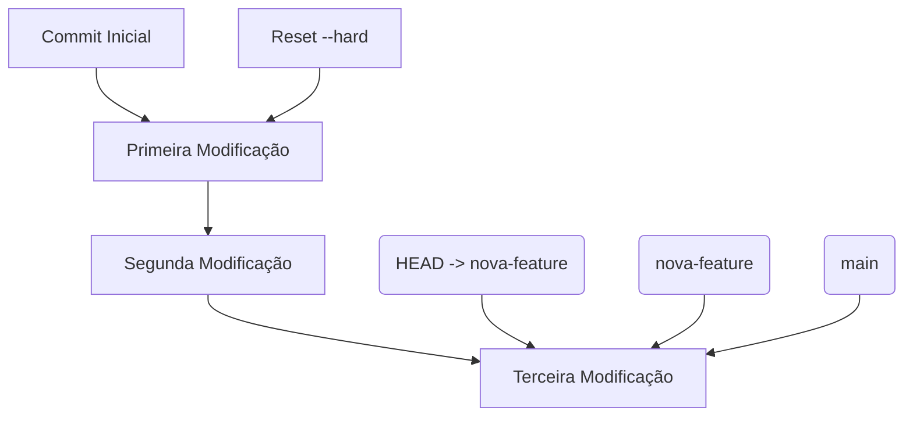
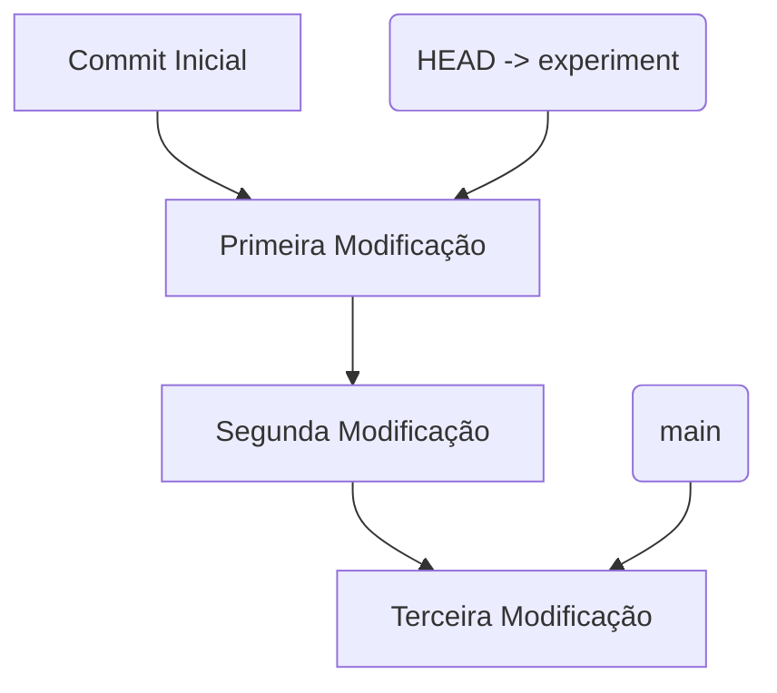
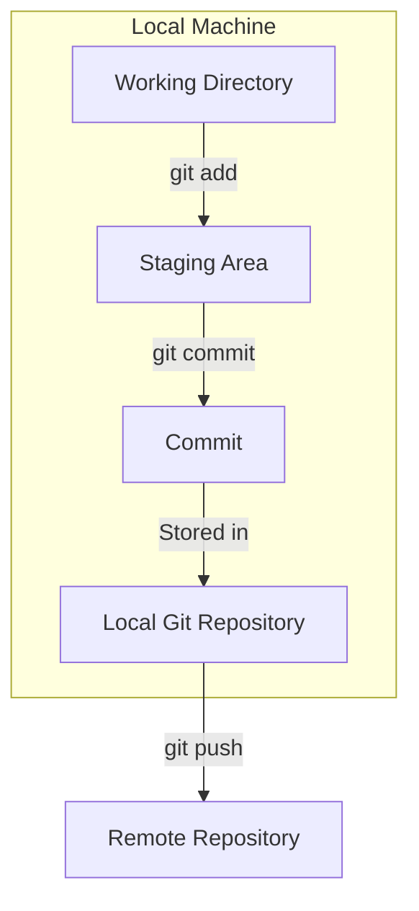

# Introdução ao Git - Aula 01

Bem-vindo ao workshop de introdução ao Git! Neste workshop, nosso objetivo é fornecer uma visão clara e prática sobre o uso do Git, ajudando você a aplicar essas habilidades em seus projetos de dados. O Git é uma ferramenta fundamental para o versionamento de código e colaboração em equipes de desenvolvimento, especialmente quando múltiplas pessoas estão trabalhando em um mesmo projeto.

## 📜 Problema no Desenvolvimento

### Desafios com o Desenvolvimento Colaborativo

Em projetos de software, especialmente na área de dados, é comum termos várias pessoas contribuindo ao mesmo tempo. Isso pode gerar conflitos de código, perda de trabalho e dificuldades em gerenciar diferentes versões de um mesmo arquivo. Antes do Git, essas situações frequentemente resultavam em erros e retrabalho, pois não existia um controle eficiente sobre as mudanças feitas no código.

**Perguntas para Reflexão:**

- **Como vocês costumam compartilhar código em equipe?** Será que enviar arquivos por e-mail ou usar drives compartilhados é a forma mais eficiente de colaborar?
- **Como garantir que todos os membros da equipe estão trabalhando na versão mais atual do código?** O que acontece quando diferentes pessoas fazem mudanças no mesmo arquivo simultaneamente?
- **Qual seria o impacto de perder uma semana de trabalho por causa de um conflito de código não resolvido?** Como podemos prevenir a perda de progresso no desenvolvimento de software?
- **Como vocês organizam as diferentes versões de um projeto?** Existe alguma estratégia que vocês usam para controlar quais mudanças foram feitas e por quem?
- **O que acontece quando queremos testar uma nova funcionalidade sem impactar o código que já está funcionando?** Como isolar essas mudanças para garantir que não introduzimos novos bugs?

## 📂 Vamos Criar um Projeto Simples

### 1. Criação de uma Pasta

Primeiro, vamos criar uma pasta para o nosso projeto:

```bash
mkdir projeto-git
cd projeto-git
```

### 2. Criação de um Arquivo Python

Dentro da pasta, vamos criar um arquivo Python simples:

```bash
touch main.py
```

Abra o arquivo `main.py` e adicione o seguinte código:

```python
print("Hello, World!")
```

### Exemplo de Modificações Sem o Git

Vamos seguir o exemplo onde modificamos um arquivo Python várias vezes e criamos novos arquivos, mas sem utilizar o Git para rastrear essas mudanças. Isso demonstra o problema de não ter controle de versão e como é fácil perder o histórico do que foi feito.

#### Passo 1: Criando e Modificando o Arquivo Inicial

Primeiro, criamos o arquivo `main.py` com o seguinte conteúdo:

```python
print("Hello, World!")
```

Essa é a primeira versão do arquivo. Agora, imagine que você precisa fazer algumas mudanças.

#### Passo 2: Primeira Modificação

Você modifica o arquivo `main.py` para adicionar uma nova linha de código:

```python
print("Hello, World!")
print("Primeira Modificação")
```

Essa mudança é feita diretamente no arquivo, substituindo a versão anterior. Como não estamos usando Git, a versão original do arquivo é perdida, e não temos mais acesso a ela.

#### Passo 3: Segunda Modificação

Depois de algum tempo, você decide modificar o arquivo novamente:

```python
print("Hello, World!")
print("Primeira Modificação")
print("Segunda Modificação")
```

Mais uma vez, o arquivo original e a primeira modificação são substituídos por essa nova versão. Sem o Git, não há registro das mudanças anteriores.

#### Passo 4: Terceira Modificação e Criação de um Novo Arquivo

Agora, você faz uma terceira modificação no `main.py` e também cria um novo arquivo chamado `auxiliary.py`:

**main.py:**

```python
print("Hello, World!")
print("Primeira Modificação")
print("Segunda Modificação")
print("Terceira Modificação")
```

**auxiliary.py:**

```python
def helper():
    print("Função Auxiliar")
```

Essas novas mudanças também são feitas diretamente no arquivo, substituindo tudo o que havia antes. Como não estamos usando Git, o histórico das três versões anteriores do `main.py` é completamente perdido.

### O Problema Sem Git

Sem o Git, não temos como recuperar o estado anterior do arquivo `main.py` em nenhum desses momentos. Se algo der errado, não há como voltar para uma versão anterior. Além disso, se tivermos conflitos ou dúvidas sobre o que foi mudado ao longo do tempo, não temos um histórico para consultar.

### Como o Git Resolveria Esse Problema

Se estivéssemos usando Git, cada uma dessas modificações poderia ter sido feita em um novo commit. Isso significaria que, a qualquer momento, poderíamos voltar a uma versão anterior do arquivo ou ver exatamente o que mudou entre os commits. Também poderíamos criar branches para testar novas funcionalidades sem afetar o código principal, garantindo que sempre tivéssemos uma versão estável do projeto.

## 🐧 História do Git

### História do Git: A Palestra Famosa de Linus Torvalds

Git foi criado em 2005 por Linus Torvalds, o criador do Linux, em resposta à necessidade de um sistema de controle de versão robusto e eficiente para o desenvolvimento do kernel Linux. Na época, o time de desenvolvimento enfrentava desafios significativos para gerenciar contribuições de milhares de desenvolvedores ao redor do mundo. O Git foi concebido para ser rápido, distribuído e capaz de lidar com a complexidade de projetos desse porte.

### A Famosa Palestra de Linus Torvalds

Em uma palestra bem conhecida, Linus Torvalds falou sobre a criação do Git e como ele o desenvolveu em apenas alguns dias. Com seu humor característico, ele mencionou que decidiu criar o Git durante um final de semana, após ficar frustrado com as limitações das ferramentas de controle de versão existentes na época.

Linus explicou que, ao criar o Git, ele focou em três principais características: velocidade, simplicidade no design e suporte para desenvolvimento distribuído. Ele queria uma ferramenta que fosse fácil de usar para desenvolvedores de todo o mundo, permitindo que cada um tivesse uma cópia completa do repositório, sem a necessidade de um servidor central, e que fosse rápida o suficiente para lidar com as necessidades do kernel Linux.

Durante a palestra, Linus destacou a importância da liberdade e do controle que o Git proporciona aos desenvolvedores, algo que faltava nas ferramentas anteriores. Ele também brincou sobre o fato de que, embora tenha começado o projeto em um final de semana, o Git rapidamente se tornou uma das ferramentas mais importantes e amplamente adotadas na história do desenvolvimento de software.

Essa história ilustra não só a genialidade de Linus Torvalds, mas também a urgência e a necessidade que existiam por uma solução como o Git. Desde então, o Git se tornou a ferramenta padrão para controle de versão em quase todos os projetos de software no mundo.

Para entender mais sobre Git:
- [Sobre Git com Akita e Palestra de Linus Torvalds sobre Git](https://www.youtube.com/watch?v=6Czd1Yetaac)

## 🛠️ O Que é o Git?

### Um Programa Como Qualquer Outro

Git é um programa que você instala em seu computador, semelhante a como o PowerBI é utilizado para criar dashboards. No caso do Git, ele é usado para versionar arquivos de texto, como código-fonte, de maneira eficiente. Isso permite que você:

- **Versione Arquivos:** Mantenha um histórico detalhado de todas as mudanças feitas em seus arquivos.
- **Colabore Facilmente:** Trabalhe com muitos contribuidores de forma organizada.
- **Distribua Código:** Compartilhe seu código com outras pessoas, garantindo que todos estejam sincronizados com a versão mais recente.

## 💻 Como Instalar o Git

### Windows

1. Baixe o instalador do Git [aqui](https://git-scm.com/download/win).
2. Execute o instalador e siga as instruções.

### Linux

1. Abra o terminal.
2. Execute o comando:
   
   ```bash
   sudo apt-get install git
   ```

### Mac

1. Abra o terminal.
2. Execute o comando:
   
   ```bash
   brew install git
   ```

## 🎯 Configuração do Git

Antes de começar a usar o Git, precisamos configurar o nome e o e-mail do usuário:

```bash
git config --global user.name "Seu Nome"
git config --global user.email "seu.email@exemplo.com"
```

Os arquivos de configuração do Git que armazenam as configurações feitas com os comandos `git config` são armazenados em diferentes locais, dependendo do nível de configuração:

1. **Configurações Globais (`--global`)**:
   - As configurações globais são salvas no arquivo `.gitconfig` localizado no diretório home do usuário.
   - **Localização**:
     - **Linux/Mac**: `~/.gitconfig`
     - **Windows**: `C:\Users\SeuNomeDeUsuario\.gitconfig`
   - Você pode abrir esse arquivo em um editor de texto para visualizar ou editar as configurações.

2. **Configurações de Sistema (`--system`)**:
   - As configurações de sistema são aplicadas a todos os usuários da máquina e são armazenadas no arquivo de configuração global do sistema.
   - **Localização**:
     - **Linux**: `/etc/gitconfig`
     - **Windows**: Pode estar em um caminho como `C:\Program Files\Git\etc\gitconfig`
   - Essas configurações requerem permissões de administrador para serem alteradas.

3. **Configurações Locais (por repositório)**:
   - As configurações locais são específicas para um único repositório Git e são salvas no arquivo `config` dentro da pasta `.git` do repositório.
   - **Localização**:
     - No diretório do repositório Git: `.git/config`

Você pode visualizar as configurações atuais usando os seguintes comandos:

- **Para ver todas as configurações globais**:
  ```bash
  git config --global --list
  ```

Esses comandos vão listar as configurações e seus valores, permitindo que você veja detalhes como o nome de usuário e o e-mail configurados para o Git.

### Exemplo Completo Usando Git: Passo a Passo

Vamos seguir um exemplo onde fazemos modificações em um arquivo Python e gerenciamos essas alterações usando Git. Este processo incluirá a criação de commits para cada modificação, além de explorar conceitos importantes como o `HEAD`, branches, e o comando `git checkout`.

### 1. Criação do Repositório e Primeira Modificação

#### Inicializando o Repositório

Primeiro, vamos inicializar um novo repositório Git no diretório do projeto:

```bash
git init
```

Este comando cria um repositório Git vazio, onde começaremos a rastrear nossas alterações.

#### Criando e Adicionando o Arquivo ao Controle de Versão

Vamos criar um arquivo Python chamado `main.py`:

```bash
touch main.py
```

Abra o arquivo `main.py` e adicione o

 seguinte código:

```python
print("Hello, World!")
```

Agora, vamos verificar o estado do repositório para ver como o Git está reconhecendo o arquivo:

```bash
git status
```

Você verá que `main.py` está listado como um arquivo não rastreado (untracked). Vamos adicionar esse arquivo ao Git para que ele comece a ser rastreado:

```bash
git add main.py
```

Agora, faremos o primeiro commit para salvar o estado inicial do projeto:

```bash
git commit -m "Adiciona o arquivo main.py com um simples print"
```

### 2. Primeira Modificação e Novo Commit

Agora, vamos modificar o arquivo `main.py`:

```python
print("Hello, World!")
print("Primeira Modificação")
```

Depois de fazer a modificação, vamos verificar novamente o estado dos arquivos:

```bash
git status
```

Agora observamos que temos duas opções



### Explicação do Fluxo:

- **Opção 1: `git add`**:
    - **`git add main.py`**: As mudanças no `main.py` são movidas para a Staging Area.
    - **`git commit -m 'Update main.py'`**: Um novo commit é criado, e as mudanças são salvas na caixa do Git Repository.

- **Opção 2: `git restore`**:
    - **`git restore main.py`**: O arquivo `main.py` no Working Directory é restaurado a partir da última versão salva no Git Repository, descartando as mudanças feitas localmente.

Esse diagrama ilustra claramente como as mudanças fluem entre o Working Directory, a Staging Area, e o Git Repository, dependendo da ação escolhida (`git add` ou `git restore`).

O Git mostrará que o arquivo `main.py` foi modificado. Vamos adicionar essa modificação à área de staging e fazer um novo commit:

### 2. Primeira Modificação e Novo Commit

```bash
git add main.py
```

### Git status

Ao realizar o Git status observamos que temos 2 opções novamente



### Explicação do Fluxo:

- **Opção 1: `git commit`**:
    - **`git commit -m 'Update main.py'`**: Cria um novo commit no Git Repository, salvando as mudanças que estavam na Staging Area.

- **Opção 2: `git restore --staged`**:
    - **`git restore --staged main.py`**: Remove o arquivo `main.py` da Staging Area, retornando-o ao Working Directory sem as mudanças serem cometidas. Ele volta ao estado antes de ser adicionado à Staging Area.

Vamos seguir com o commit

### 2. Primeiro Save no Commit

```bash
git commit -m "Adiciona a primeira modificação ao arquivo main.py"
```

### Fluxo



### 3. Segunda Modificação e Novo Commit

Vamos modificar o arquivo novamente:

```python
print("Hello, World!")
print("Primeira Modificação")
print("Segunda Modificação")
```

Novamente, adicionamos e fazemos um commit dessas mudanças:

```bash
git add main.py
git commit -m "Adiciona a segunda modificação ao arquivo main.py"
```

### 4. Terceira Modificação e Novo Commit

Finalmente, vamos adicionar uma terceira modificação:

```python
print("Hello, World!")
print("Primeira Modificação")
print("Segunda Modificação")
print("Terceira Modificação")
```

E, novamente, fazemos o commit:

```bash
git add main.py
git commit -m "Adiciona a terceira modificação ao arquivo main.py"
```

### 5. Verificando o Histórico de Commits

Agora, podemos usar o `git log` para visualizar o histórico de commits e ver todas as modificações que fizemos até agora:

```bash
git log
```

O `git log` exibirá uma lista de todos os commits, mostrando as mensagens e os identificadores únicos (hashes) dos commits.

### 6. Entendendo o `HEAD`

O `HEAD` é um apontador especial que indica o commit atual em que você está trabalhando. Normalmente, o `HEAD` aponta para a branch `main`, que é a linha principal de desenvolvimento do projeto.

**Ilustração com Mermaid:**



Aqui, o `HEAD` está apontando para o commit mais recente na branch `main`. Isso significa que todas as operações, como novos commits, partirão desse ponto.

### 7. Trabalhando com Branches

Branches são como linhas do tempo paralelas no seu repositório. Elas permitem que você trabalhe em diferentes funcionalidades ou correções de bugs sem afetar a `main`.

**Criando uma Nova Branch:**

Vamos criar uma nova branch chamada `nova-feature` para trabalhar em uma nova funcionalidade:

```bash
git branch nova-feature
```

Agora, podemos mudar para essa branch e começar a trabalhar nela:

```bash
git checkout nova-feature
```

Isso muda o `HEAD` para a nova branch `nova-feature`, o que significa que qualquer commit feito agora será registrado nessa branch.

**Ilustração com Mermaid:**



Aqui, a `nova-feature` diverge da `main` a partir do mesmo ponto, permitindo que você desenvolva funcionalidades de forma isolada.

### 8. Usando `git checkout` para Navegar Entre Commits e Branches

O comando `git checkout` permite que você navegue entre diferentes branches e commits. Se você quiser voltar para a branch `main`, pode usar:

```bash
git checkout main
```

Se quiser explorar o estado do projeto em um commit anterior, use:

```bash
git checkout <hash_do_commit>
```

Isso coloca você em um estado de "detached HEAD", onde você pode ver o estado do projeto naquele momento específico.

### 9. Usando `git reset` para Voltar ao Commit Anterior

Se você deseja desfazer as últimas mudanças e voltar ao estado de um commit anterior, pode usar o `git reset`. Aqui estão as opções:

- **`git reset --soft <idCommit>`**: Volta para o commit anterior e mantém todas as alterações na área de staging.

- **`git reset --mixed <idCommit>`**: Volta para o commit anterior, remove as alterações da área de staging, mas as mantém no diretório de trabalho.

- **`git reset --hard <idCommit>`**: Volta para o commit anterior e descarta completamente todas as alterações feitas após esse commit.

**Ilustração com Mermaid:**



Aqui, o comando `git reset --hard` move o `HEAD` de volta para a "Primeira Modificação", descartando todas as alterações feitas após esse ponto.

### 10. Criando uma Branch a Partir de um Commit Anterior

Se você quer preservar o estado atual do projeto, mas precisa voltar a um commit anterior para experimentar algo novo, pode criar uma nova branch a partir desse commit:

```bash
git checkout -b experiment <hash_do_commit>
```

Isso cria uma nova branch chamada `experiment`, começando a partir do commit que você especificou.

**Ilustração com Mermaid:**



### 11. Usando `git revert` para Desfazer um Commit

Se você quer desfazer um commit específico, mas manter o histórico de commits, pode usar `git revert`:

```bash
git revert <idCommit>
```

Isso cria um novo commit que desfaz as alterações do commit especificado, mantendo o histórico intacto.

### Resumo

Com esses comandos, você pode gerenciar de forma eficiente as modificações no seu projeto, garantindo que todas as mudanças sejam rastreadas e que você possa voltar a estados anteriores sempre que necessário. Isso proporciona um controle muito maior sobre o desenvolvimento do projeto e minimiza o risco de perder trabalho importante. As ilustrações com Mermaid ajudam a visualizar como o `HEAD`, branches e resets funcionam no contexto do desenvolvimento em Git.

### O que vamos ver amanhã:

Amanhã, vamos explorar em detalhes o conceito de **Remote Repository** no Git. Até agora, vimos como o **Working Directory**, a **Staging Area**, e o **Local Git Repository** trabalham juntos na sua máquina local para gerenciar as mudanças no seu projeto.

Agora, vamos entender como o **Remote Repository** se encaixa nesse fluxo. O **Remote Repository** é uma versão do seu repositório que fica armazenada em um servidor remoto, como o GitHub, GitLab ou Bitbucket. Ele permite que você:

- **Compartilhe Código com Outros Desenvolvedores**: Enviar (push) seus commits para um repositório remoto permite que outros desenvolvedores acessem e colaborem no seu projeto.
- **Mantenha um Backup Externo**: Ter uma cópia do seu repositório em um servidor remoto fornece uma camada extra de segurança para o seu trabalho.
- **Colabore de Forma Eficiente**: Usar um repositório remoto facilita a colaboração entre times, onde cada membro pode clonar, puxar (pull) e enviar mudanças para o repositório compartilhado.

No diagrama que revisamos, o **Remote Repository** é representado como o destino para onde você envia as mudanças feitas no **Local Git Repository**. Amanhã, veremos como configurar e trabalhar com repositórios remotos, incluindo comandos essenciais como `git push`, `git pull`, e `git clone`, para que você possa colaborar efetivamente em projetos de dados com outras pessoas.

