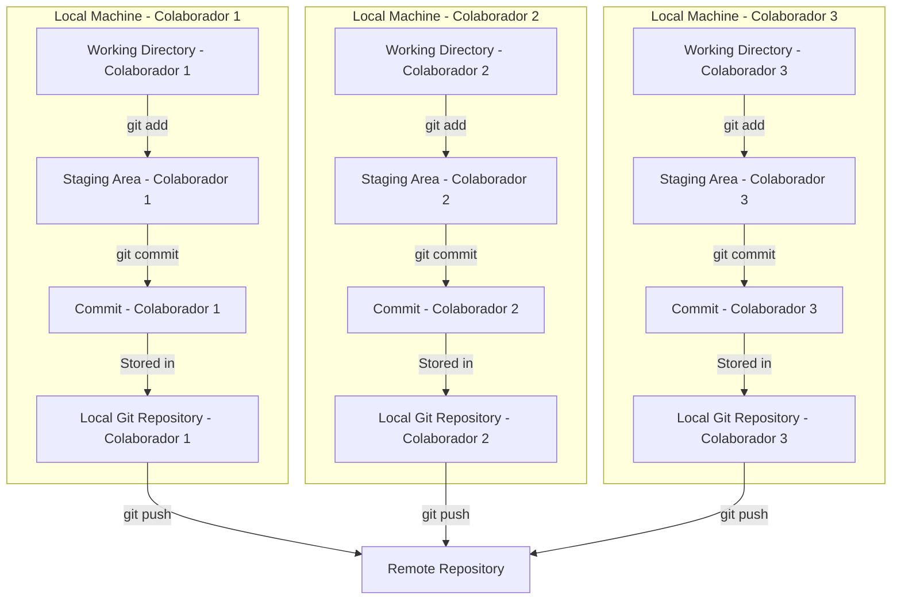
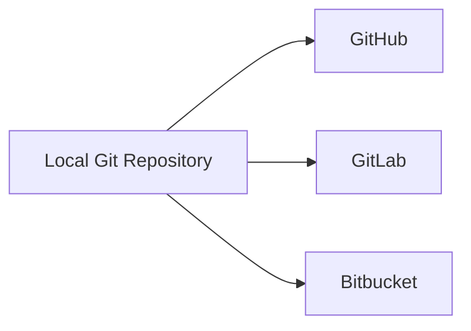
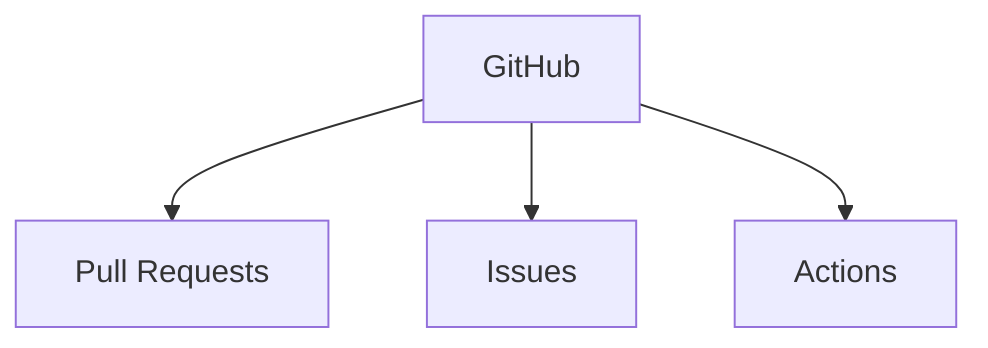
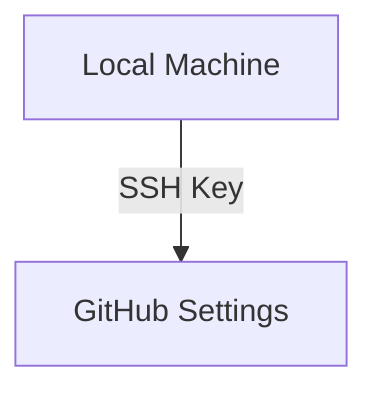
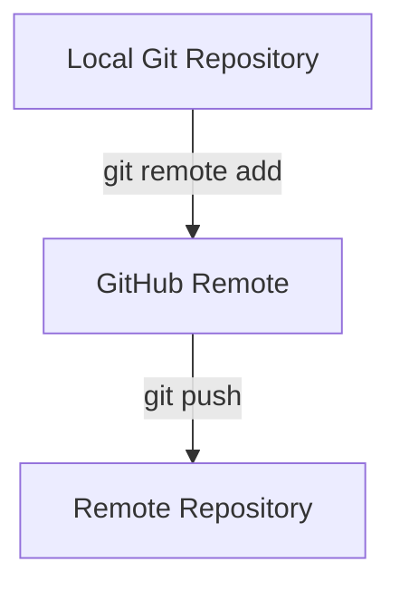
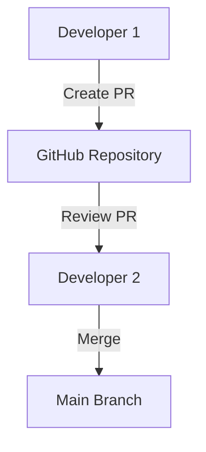
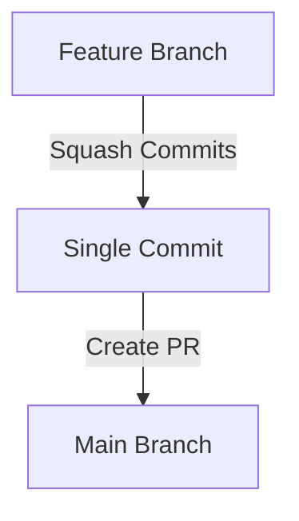
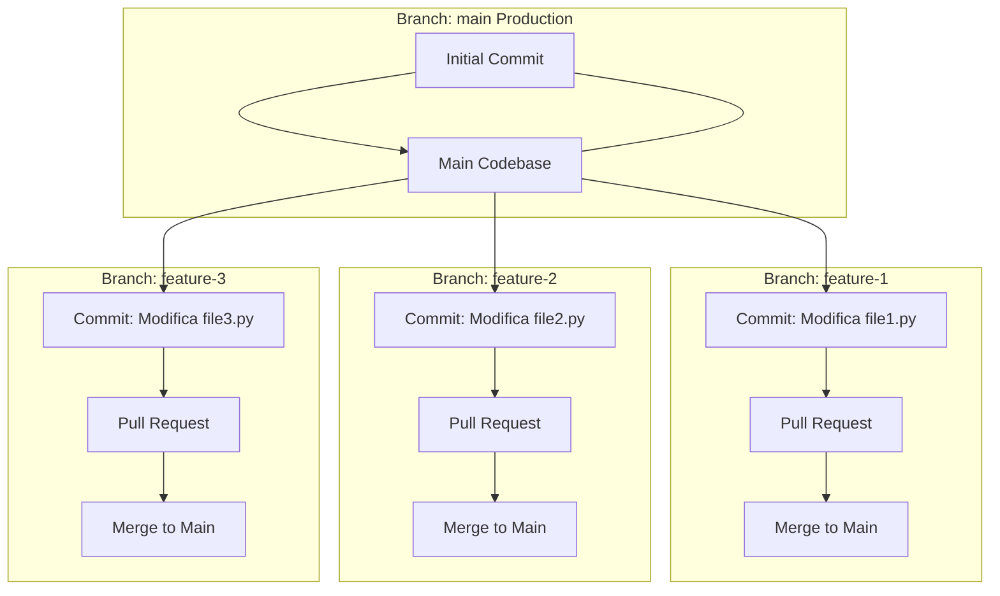
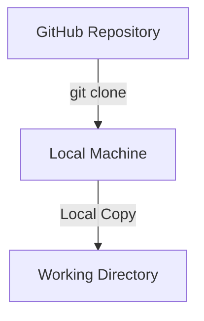
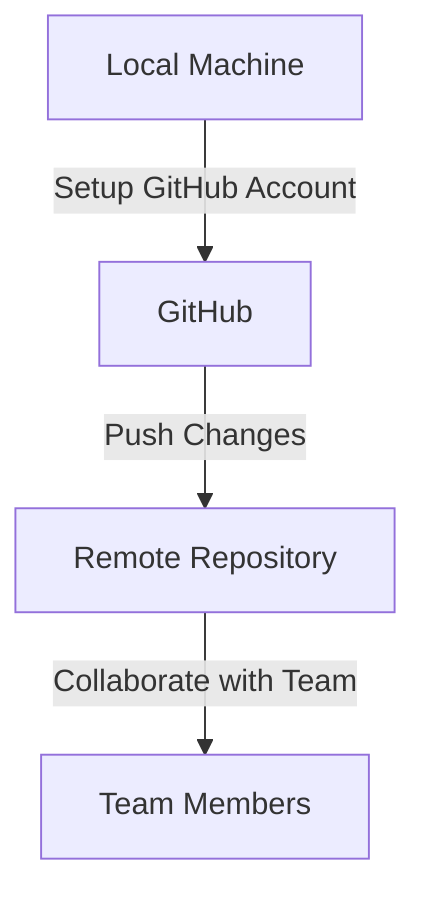

# Introdução ao GitHub e Repositórios Remotos - Aula 02

Bem-vindo à nossa aula sobre GitHub e repositórios remotos! Hoje, vamos explorar como o uso de um repositório remoto, como o GitHub, pode resolver vários desafios que surgem ao trabalhar com um repositório Git local. Veremos como configurar sua conta no GitHub, migrar seu projeto local para lá, e utilizar as principais funcionalidades dessa plataforma.

## 1. Problemas ao Ter Apenas um Git Local

### Desafios de Trabalhar Somente com Git Local

Quando trabalhamos apenas com um repositório Git local, enfrentamos algumas limitações:

- **Colaboração Limitada**: Compartilhar código com outros desenvolvedores exige o uso de métodos manuais, como enviar arquivos por e-mail, o que é ineficiente e propenso a erros.
- **Falta de Backup**: Sem um repositório remoto, todo o código fica armazenado em sua máquina local. Se o disco rígido falhar, você pode perder todo o trabalho.
- **Histórico de Projetos Restrito**: Manter um histórico de versões só em sua máquina impede que outros colaboradores acessem facilmente o progresso do projeto.

**Diagrama Ilustrativo**:



## 2. Quais Opções Temos?

### Opções de Repositórios Remotos

Existem várias plataformas que fornecem serviços de repositórios remotos, cada uma com suas características:

- **GitHub**: Popular e amplamente utilizado, com forte integração com ferramentas de CI/CD e uma grande comunidade de desenvolvedores.
- **GitLab**: Focado em DevOps, com recursos avançados de CI/CD e privacidade aprimorada.
- **Bitbucket**: Integrado com a Atlassian (Jira, Confluence), popular em ambientes corporativos.

**Diagrama Ilustrativo**:



## 3. GitHub: Uma Visão Geral

### O que é GitHub?

O GitHub é uma plataforma de hospedagem de código que oferece controle de versão distribuído e funcionalidades de colaboração para desenvolvedores de software. Ele facilita o gerenciamento de repositórios Git e fornece ferramentas para revisão de código, gerenciamento de projetos, integração contínua, e mais.

**Principais Recursos**:
- **Pull Requests (PRs)**: Facilita a revisão de código e a colaboração.
- **Issues**: Gerenciamento de tarefas e bugs.
- **Actions**: Automação de fluxos de trabalho com CI/CD.

**Diagrama Ilustrativo**:



## 4. Criando Nossa Conta e Configurando o GitHub

### Configurando GitHub via HTTP e SSH

1. **Criando uma Conta no GitHub**:
   - Visite [GitHub.com](https://github.com) e crie uma conta gratuita.

2. **Configurando Autenticação HTTP**:
   - No terminal, configure suas credenciais:
     ```bash
     git config --global user.name "Seu Nome"
     git config --global user.email "seu.email@exemplo.com"
     ```

3. **Configurando Autenticação SSH**:
   - Gere uma chave SSH:
     ```bash
     ssh-keygen -t rsa -b 4096 -C "seu.email@exemplo.com"
     ```
   - Adicione a chave SSH ao seu GitHub (Acesse `Settings > SSH and GPG keys`).

**Diagrama Ilustrativo**:



## 5. Migrando Nosso Projeto para o GitHub

### Usando `git remote` e `git push`

1. **Criando um Novo Repositório no GitHub**:
   - No GitHub, clique em "New Repository" e crie um repositório vazio.

2. **Adicionando o Repositório Remoto**:
   - No terminal, vincule seu repositório local ao GitHub:
     ```bash
     git remote add origin https://github.com/usuario/repo.git
     ```

O comando `git remote add origin https://github.com/usuario/repo.git` é usado para vincular seu repositório Git local a um repositório remoto no GitHub (ou em outra plataforma de hospedagem de código). Esse comando essencialmente cria uma referência para o repositório remoto, permitindo que você envie (push) ou traga (pull) alterações entre o repositório local e o remoto.

Aqui está uma explicação mais detalhada:

- **`git remote add`**: Esse é o comando que adiciona um novo repositório remoto ao seu repositório local. Você pode ter múltiplos repositórios remotos associados a um único repositório local, cada um com um nome diferente (por exemplo, `origin`, `upstream`, etc.).

- **`origin`**: Este é o nome padrão dado ao repositório remoto principal. O termo "origin" é apenas um nome que você escolhe para se referir ao repositório remoto. Você pode renomeá-lo, se desejar, mas `origin` é o nome padrão e mais comum.

- **`https://github.com/usuario/repo.git`**: Esse é o URL do repositório remoto no GitHub. Ele indica a localização exata do repositório no qual você deseja enviar seu código. Esse URL pode estar no formato HTTP(S) (como neste caso) ou SSH, dependendo de como você configurou a autenticação.

Depois de executar esse comando, o repositório local agora conhece a localização do repositório remoto e o nome `origin` está associado a esse URL. Isso permite que você use comandos como `git push origin main` para enviar suas alterações para o repositório remoto ou `git pull origin main` para trazer as mudanças mais recentes do remoto para o seu repositório local.

3. **Enviando o Código para o GitHub**:
   - Envie o código para o GitHub:
     ```bash
     git push -u origin main
     ```

O parâmetro `-u` no comando `git push -u origin main` é utilizado para definir a branch local (`main` neste caso) como a branch "upstream" padrão para a branch remota associada. Isso significa que, depois de utilizar esse comando uma vez, você pode simplesmente executar `git push` ou `git pull` sem precisar especificar explicitamente o repositório (`origin`) e a branch (`main`) novamente.

### Explicando em mais detalhes:

- **`-u` ou `--set-upstream`**: Este parâmetro faz com que o Git associe a branch local (no exemplo, `main`) com a branch remota correspondente no repositório remoto (`origin`). Após essa associação, o Git "sabe" de onde puxar (`pull`) e para onde empurrar (`push`) as alterações por padrão.

- **Por que isso é útil?** 
  - Facilita comandos futuros: Uma vez que você fez o `git push -u origin main`, você não precisa mais escrever `git push origin main` em futuros pushes; basta usar `git push`.
  - Automatiza o comportamento: Com essa associação configurada, comandos como `git pull` saberão automaticamente de onde trazer as mudanças, simplificando o fluxo de trabalho.

### Exemplo de Uso:

Suponha que você esteja trabalhando em um novo repositório local e ainda não tenha feito nenhum push para o repositório remoto. Você usa o seguinte comando:

```bash
git push -u origin main
```

Isso faz com que:
1. A branch `main` no seu repositório local seja enviada para o repositório `origin`.
2. O Git configure a branch `main` local para "rastrear" a branch `main` no `origin`. Com isso, no futuro, você pode usar apenas `git push` ou `git pull` para enviar ou buscar atualizações, sem precisar especificar `origin` ou `main` novamente.

Essa conveniência é especialmente útil em projetos onde você frequentemente faz push e pull da mesma branch remota.

**Diagrama Ilustrativo**:



## 6. Principais Features do GitHub

### Explorando PRs, Issues, e Actions

- **Pull Requests**: Facilita a revisão de código, permite discussões e aprovação antes da integração ao código principal.
- **Issues**: Ferramenta para rastrear bugs, melhorias e tarefas.
- **Actions**: Automatiza testes, deploys e outras tarefas de CI/CD.

**Diagrama Ilustrativo**:



Vamos refatorar o exemplo anterior utilizando Pull Requests (PRs) para melhorar o fluxo de trabalho e a colaboração entre os desenvolvedores.

## 7. Estratégias de Pull Requests (PRs)

### Melhorando a Colaboração com PRs

1. **Branch Naming**: Utilize nomes de branches que reflitam a tarefa ou bug a ser resolvido.
2. **PR Review Process**: Estabeleça um processo claro para a revisão de PRs, incluindo revisores designados.
3. **Squash Commits**: Combine múltiplos commits em um único antes de fazer o merge, para manter o histórico de commits limpo.

**Diagrama Ilustrativo**:



### Situação

1. **Branch `main`**: Contém o código de produção, sem as novas funcionalidades que estamos desenvolvendo.
2. **Branch `feature-1`**: Modifica o `file1.py` para adicionar uma nova funcionalidade.
3. **Branch `feature-2`**: Modifica o `file2.py` para adicionar outra funcionalidade.
4. **Branch `feature-3`**: Modifica o `file3.py` para adicionar uma terceira funcionalidade.

### Passos para Implementação com PRs

1. **Criar e Mudar para a Branch `feature-1`**:
    ```bash
    git checkout -b feature-1
    # Modificar file1.py e fazer commit
    git commit -am "Adiciona nova funcionalidade em file1.py"
    # Enviar a branch para o repositório remoto
    git push -u origin feature-1
    ```

2. **Criar um Pull Request para `feature-1`**:
    - No GitHub, crie um Pull Request da branch `feature-1` para a `main`.
    - Aguarde a revisão e aprovação do PR.

3. **Criar e Mudar para a Branch `feature-2`**:
    ```bash
    git checkout -b feature-2
    # Modificar file2.py e fazer commit
    git commit -am "Adiciona nova funcionalidade em file2.py"
    # Enviar a branch para o repositório remoto
    git push -u origin feature-2
    ```

4. **Criar um Pull Request para `feature-2`**:
    - No GitHub, crie um Pull Request da branch `feature-2` para a `main`.
    - Aguarde a revisão e aprovação do PR.

5. **Criar e Mudar para a Branch `feature-3`**:
    ```bash
    git checkout -b feature-3
    # Modificar file3.py e fazer commit
    git commit -am "Adiciona nova funcionalidade em file3.py"
    # Enviar a branch para o repositório remoto
    git push -u origin feature-3
    ```

6. **Criar um Pull Request para `feature-3`**:
    - No GitHub, crie um Pull Request da branch `feature-3` para a `main`.
    - Aguarde a revisão e aprovação do PR.

### Diagrama Mermaid Atualizado com PRs:

Aqui está o diagrama que ilustra o processo de criação de branches e PRs:



### Explicação do Diagrama Atualizado:

- **Branch `main`**: Representa o código de produção.
- **Branches de Funcionalidade**:
  - **`feature-1`**: Modifica `file1.py` e é enviada como um PR para a `main`.
  - **`feature-2`**: Modifica `file2.py` e segue o mesmo processo.
  - **`feature-3`**: Modifica `file3.py` e também segue o processo de PR.
- **Pull Requests e Merges**:
  - Cada branch é enviada como um PR. Após revisão e aprovação, ela é mesclada (`merged`) na `main`, garantindo que o código de produção seja atualizado de forma controlada e revisada.

### Conclusão:

Esse fluxo de trabalho com Pull Requests (PRs) promove uma colaboração mais organizada e segura, garantindo que todas as modificações sejam revisadas antes de serem integradas ao código de produção. Cada PR permite a discussão, revisão e validação das mudanças, assegurando a qualidade do código e a minimização de bugs em produção.

## 8. Fazendo `git clone`

### Como Clonar um Repositório

1. **Clonando um Repositório Existente**:
   - No terminal, clone o repositório:
     ```bash
     git clone https://github.com/usuario/repo.git
     ```

2. **Trabalhando com o Repositório Clonado**:
   - Navegue até o diretório clonado e comece a trabalhar:
     ```bash
     cd repo
     ```

**Diagrama Ilustrativo**:



## Conclusão

Agora que cobrimos os conceitos básicos sobre GitHub e repositórios remotos, você está pronto para começar a utilizar essas ferramentas em seus projetos. Ao final dessa aula, você deve ser capaz de configurar seu repositório remoto, migrar seu código, e colaborar efetivamente com outros desenvolvedores.

**Próxima Aula**: Na próxima aula, vamos nos aprofundar em workflows avançados com Git, incluindo rebase, cherry-pick, e estratégias de merge em projetos complexos.

