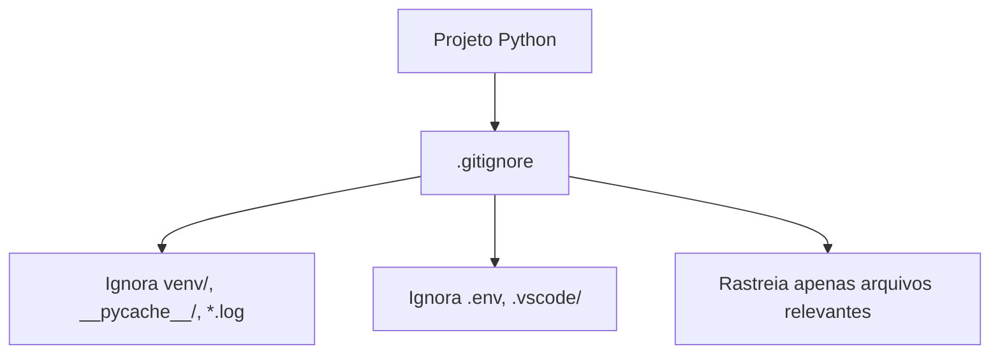

# Introdução ao GitHub e Repositórios Remotos - Aula 02

Bem-vindo à nossa aula sobre GitHub e repositórios remotos! Hoje, vamos explorar como o uso de um repositório remoto, como o GitHub, pode resolver vários desafios que surgem ao trabalhar com um repositório Git local. Veremos como configurar sua conta no GitHub, migrar seu projeto local para lá, e utilizar as principais funcionalidades dessa plataforma.

## 1. Problemas ao Ter Apenas um Git Local

### Desafios de Trabalhar Somente com Git Local

Quando trabalhamos apenas com um repositório Git local, enfrentamos algumas limitações:

- **Colaboração Limitada**: Compartilhar código com outros desenvolvedores exige o uso de métodos manuais, como enviar arquivos por e-mail, o que é ineficiente e propenso a erros.
- **Falta de Backup**: Sem um repositório remoto, todo o código fica armazenado em sua máquina local. Se o disco rígido falhar, você pode perder todo o trabalho.
- **Histórico de Projetos Restrito**: Manter um histórico de versões só em sua máquina impede que outros colaboradores acessem facilmente o progresso do projeto.

**Diagrama Ilustrativo**:


## 2. Quais Opções Temos?

### Opções de Repositórios Remotos

Existem várias plataformas que fornecem serviços de repositórios remotos, cada uma com suas características:

- **GitHub**: Popular e amplamente utilizado, com forte integração com ferramentas de CI/CD e uma grande comunidade de desenvolvedores.
- **GitLab**: Focado em DevOps, com recursos avançados de CI/CD e privacidade aprimorada.
- **Bitbucket**: Integrado com a Atlassian (Jira, Confluence), popular em ambientes corporativos.

**Diagrama Ilustrativo**:


## 3. GitHub: Uma Visão Geral

### O que é GitHub?

O GitHub é uma plataforma de hospedagem de código que oferece controle de versão distribuído e funcionalidades de colaboração para desenvolvedores de software. Ele facilita o gerenciamento de repositórios Git e fornece ferramentas para revisão de código, gerenciamento de projetos, integração contínua, e mais.

**Principais Recursos**:
- **Pull Requests (PRs)**: Facilita a revisão de código e a colaboração.
- **Issues**: Gerenciamento de tarefas e bugs.
- **Actions**: Automação de fluxos de trabalho com CI/CD.

**Diagrama Ilustrativo**:


## 4. Criando Nossa Conta e Configurando o GitHub

### Configurando GitHub via HTTP e SSH

1. **Criando uma Conta no GitHub**:
   - Visite [GitHub.com](https://github.com) e crie uma conta gratuita.

2. **Configurando Autenticação HTTP**:
   - No terminal, configure suas credenciais:
     ```bash
     git config --global user.name "Seu Nome"
     git config --global user.email "seu.email@exemplo.com"
     ```

3. **Configurando Autenticação SSH**:
   - Gere uma chave SSH:
     ```bash
     ssh-keygen -t rsa -b 4096 -C "seu.email@exemplo.com"
     ```
   - Adicione a chave SSH ao seu GitHub (Acesse `Settings > SSH and GPG keys`).

**Diagrama Ilustrativo**:


## 5. Migrando Nosso Projeto para o GitHub

### Usando `git remote` e `git push`

1. **Criando um Novo Repositório no GitHub**:
   - No GitHub, clique em "New Repository" e crie um repositório vazio.

2. **Adicionando o Repositório Remoto**:
   - No terminal, vincule seu repositório local ao GitHub:
     ```bash
     git remote add origin https://github.com/usuario/repo.git
     ```

O comando `git remote add origin https://github.com/usuario/repo.git` é usado para vincular seu repositório Git local a um repositório remoto no GitHub (ou em outra plataforma de hospedagem de código). Esse comando essencialmente cria uma referência para o repositório remoto, permitindo que você envie (push) ou traga (pull) alterações entre o repositório local e o remoto.

Aqui está uma explicação mais detalhada:

- **`git remote add`**: Esse é o comando que adiciona um novo repositório remoto ao seu repositório local. Você pode ter múltiplos repositórios remotos associados a um único repositório local, cada um com um nome diferente (por exemplo, `origin`, `upstream`, etc.).

- **`origin`**: Este é o nome padrão dado ao repositório remoto principal. O termo "origin" é apenas um nome que você escolhe para se referir ao repositório remoto. Você pode renomeá-lo, se desejar, mas `origin` é o nome padrão e mais comum.

- **`https://github.com/usuario/repo.git`**: Esse é o URL do repositório remoto no GitHub. Ele indica a localização exata do repositório no qual você deseja enviar seu código. Esse URL pode estar no formato HTTP(S) (como neste caso) ou SSH, dependendo de como você configurou a autenticação.

Depois de executar esse comando, o repositório local agora conhece a localização do repositório remoto e o nome `origin` está associado a esse URL. Isso permite que você use comandos como `git push origin main` para enviar suas alterações para o repositório remoto ou `git pull origin main` para trazer as mudanças mais recentes do remoto para o seu repositório local.

3. **Enviando o Código para o GitHub**:
   - Envie o código para o GitHub:
     ```bash
     git push -u origin main
     ```

Ao executar o comando `git push -u origin main`, o Git tentará enviar os commits do seu repositório local para o repositório remoto no GitHub. **Neste momento**, se você estiver usando HTTPS para acessar o GitHub (o que é indicado pelo URL `https://github.com/usuario/repo.git`), o Git solicitará que você insira seu nome de usuário e senha do GitHub para autenticar a operação.

### O que esperar:

- **Nome de Usuário e Senha**: Quando o Git tenta fazer o push para o repositório remoto pela primeira vez, ele precisa autenticar sua identidade com o GitHub. Você verá uma solicitação no terminal pedindo para inserir seu nome de usuário e senha.
  
- **Autenticação com Tokens**: Desde agosto de 2021, o GitHub não aceita mais senhas para autenticação ao usar HTTPS. Em vez disso, você precisará usar um "Personal Access Token" (token de acesso pessoal) no lugar da senha. Este token pode ser gerado na sua conta do GitHub, na seção de configurações de desenvolvedor. Quando solicitado pela senha, insira o token.

### Explicando em mais detalhes:

- **Nome de Usuário e Token**: 
  - **Nome de Usuário**: O seu nome de usuário do GitHub.
  - **Token**: Um token de acesso pessoal que você deve gerar no GitHub e usar no lugar da senha.

- **Por que isso acontece?**
  - **Autenticação HTTPS**: Quando você usa HTTPS para acessar o repositório, o Git precisa garantir que você tem as permissões necessárias para enviar (push) alterações. Isso é feito pedindo sua autenticação.
  
- **Após a primeira vez**: Se você configurar o cache de credenciais ou usar SSH, o Git pode armazenar essas informações para que você não precise digitá-las novamente para cada push.

Essa autenticação é essencial para garantir que apenas usuários autorizados possam enviar alterações para o repositório remoto.

O parâmetro `-u` no comando `git push -u origin main` é utilizado para definir a branch local (`main` neste caso) como a branch "upstream" padrão para a branch remota associada. Isso significa que, depois de utilizar esse comando uma vez, você pode simplesmente executar `git push` ou `git pull` sem precisar especificar explicitamente o repositório (`origin`) e a branch (`main`) novamente.

### Explicando em mais detalhes:

- **`-u` ou `--set-upstream`**: Este parâmetro faz com que o Git associe a branch local (no exemplo, `main`) com a branch remota correspondente no repositório remoto (`origin`). Após essa associação, o Git "sabe" de onde puxar (`pull`) e para onde empurrar (`push`) as alterações por padrão.

- **Por que isso é útil?** 
  - Facilita comandos futuros: Uma vez que você fez o `git push -u origin main`, você não precisa mais escrever `git push origin main` em futuros pushes; basta usar `git push`.
  - Automatiza o comportamento: Com essa associação configurada, comandos como `git pull` saberão automaticamente de onde trazer as mudanças, simplificando o fluxo de trabalho.

### Exemplo de Uso:

Suponha que você esteja trabalhando em um novo repositório local e ainda não tenha feito nenhum push para o repositório remoto. Você usa o seguinte comando:

```bash
git push -u origin main
```

Isso faz com que:
1. A branch `main` no seu repositório local seja enviada para o repositório `origin`.
2. O Git configure a branch `main` local para "rastrear" a branch `main` no `origin`. Com isso, no futuro, você pode usar apenas `git push` ou `git pull` para enviar ou buscar atualizações, sem precisar especificar `origin` ou `main` novamente.

Essa conveniência é especialmente útil em projetos onde você frequentemente faz push e pull da mesma branch remota.

**Diagrama Ilustrativo**:


## 6. Principais Features do GitHub

### Explorando PRs, Issues, e Actions

- **Pull Requests**: Facilita a revisão de código, permite discussões e aprovação antes da integração ao código principal.
- **Issues**: Ferramenta para rastrear bugs, melhorias e tarefas.
- **Actions**: Automatiza testes, deploys e outras tarefas de CI/CD.

**Diagrama Ilustrativo**:


Vamos refatorar o exemplo anterior utilizando Pull Requests (PRs) para melhorar o fluxo de trabalho e a colaboração entre os desenvolvedores.

## 7. Estratégias de Pull Requests (PRs)

### Melhorando a Colaboração com PRs

1. **Branch Naming**: Utilize nomes de branches que reflitam a tarefa ou bug a ser resolvido.
2. **PR Review Process**: Estabeleça um processo claro para a revisão de PRs, incluindo revisores designados.
3. **Squash Commits**: Combine múltiplos commits em um único antes de fazer o merge, para manter o histórico de commits limpo.

**Diagrama Ilustrativo**:


### Situação

1. **Branch `main`**: Contém o código de produção, sem as novas funcionalidades que estamos desenvolvendo.
2. **Branch `feature-1`**: Modifica o `file1.py` para adicionar uma nova funcionalidade.
3. **Branch `feature-2`**: Modifica o `file2.py` para adicionar outra funcionalidade.
4. **Branch `feature-3`**: Modifica o `file3.py` para adicionar uma terceira funcionalidade.

### Passos para Implementação com PRs

1. **Criar e Mudar para a Branch `feature-1`**:
    ```bash
    git checkout -b feature-1
    # Modificar file1.py e fazer commit
    git commit -am "Adiciona nova funcionalidade em file1.py"
    # Enviar a branch para o repositório remoto
    git push -u origin feature-1
    ```

2. **Criar um Pull Request para `feature-1`**:
    - No GitHub, crie um Pull Request da branch `feature-1` para a `main`.
    - Aguarde a revisão e aprovação do PR.

3. **Criar e Mudar para a Branch `feature-2`**:
    ```bash
    git checkout -b feature-2
    # Modificar file2.py e fazer commit
    git commit -am "Adiciona nova funcionalidade em file2.py"
    # Enviar a branch para o repositório remoto
    git push -u origin feature-2
    ```

4. **Criar um Pull Request para `feature-2`**:
    - No GitHub, crie um Pull Request da branch `feature-2` para a `main`.
    - Aguarde a revisão e aprovação do PR.

5. **Criar e Mudar para a Branch `feature-3`**:
    ```bash
    git checkout -b feature-3
    # Modificar file3.py e fazer commit
    git commit -am "Adiciona nova funcionalidade em file3.py"
    # Enviar a branch para o repositório remoto
    git push -u origin feature-3
    ```

6. **Criar um Pull Request para `feature-3`**:
    - No GitHub, crie um Pull Request da branch `feature-3` para a `main`.
    - Aguarde a revisão e aprovação do PR.

### Diagrama Mermaid Atualizado com PRs:

Aqui está o diagrama que ilustra o processo de criação de branches e PRs:


### Explicação do Diagrama Atualizado:

- **Branch `main`**: Representa o código de produção.
- **Branches de Funcionalidade**:
  - **`feature-1`**: Modifica `file1.py` e é enviada como um PR para a `main`.
  - **`feature-2`**: Modifica `file2.py` e segue o mesmo processo.
  - **`feature-3`**: Modifica `file3.py` e também segue o processo de PR.
- **Pull Requests e Merges**:
  - Cada branch é enviada como um PR. Após revisão e aprovação, ela é mesclada (`merged`) na `main`, garantindo que o código de produção seja atualizado de forma controlada e revisada.

### Conclusão:

Esse fluxo de trabalho com Pull Requests (PRs) promove uma colaboração mais organizada e segura, garantindo que todas as modificações sejam revisadas antes de serem integradas ao código de produção. Cada PR permite a discussão, revisão e validação das mudanças, assegurando a qualidade do código e a minimização de bugs em produção.

Aqui está um ciclo de desenvolvimento típico usando Git, desde a criação de mudanças no diretório de trabalho até a integração dessas mudanças na branch principal (main) após um Pull Request (PR).

### Fluxo de Desenvolvimento

1. **Diretório de Trabalho (Work Directory)**: Onde você faz as modificações nos arquivos.
2. **Staging Area**: Onde você adiciona as mudanças que deseja incluir no próximo commit.
3. **.git (Repositório Local)**: Onde os commits são armazenados localmente.
4. **Push**: Envia os commits do repositório local para o repositório remoto (GitHub).
5. **GitHub Branch**: A branch específica no GitHub onde as mudanças são enviadas.
6. **Pull Request (PR) para Main**: As mudanças na branch específica são revisadas e, se aprovadas, mescladas na branch principal (`main`).
7. **Pull Main**: A branch `main` atualizada é puxada (pull) de volta para o repositório local, sincronizando as mudanças aprovadas.

### Verificação e Alterações

O fluxo descrito está correto, mas vamos detalhar cada etapa no diagrama Mermaid para garantir que todas as etapas estão cobertas.

### Diagrama Mermaid

```mermaid
graph TD;
    A[Work Directory] --> |"git add"| B[Staging Area];
    B --> |"git commit"| C[.git (Local Repository)];
    C --> |"git push"| D[GitHub Branch (feature-branch)];
    D --> |"Create Pull Request"| E[Pull Request to Main];
    E --> |"Review and Merge PR"| F[GitHub Branch (main)];
    F --> |"git pull"| G[.git (Local Repository)];
    G --> |"Update Work Directory"| A;
```

### Explicação do Diagrama

1. **Work Directory**: Você começa fazendo alterações no código, que estão no diretório de trabalho do seu projeto.
2. **Staging Area**: Com o comando `git add`, você move as alterações para a Staging Area, preparando-as para o commit.
3. **.git (Local Repository)**: Usando `git commit`, as mudanças na Staging Area são registradas no repositório local, criando um snapshot do código naquele momento.
4. **Push para GitHub Branch**: O comando `git push` envia os commits do repositório local para uma branch específica no GitHub, como `feature-branch`.
5. **GitHub Branch (feature-branch)**: Essa branch no GitHub é onde o código modificado reside enquanto aguarda revisão.
6. **Pull Request para Main**: Um PR é criado a partir da `feature-branch` para a `main`. Outros desenvolvedores revisam as mudanças, discutem e sugerem melhorias.
7. **Review e Merge do PR**: Após a revisão, o PR é mesclado na branch principal (`main`) no GitHub.
8. **Pull Main**: Finalmente, você sincroniza o repositório local com o repositório remoto atualizado usando `git pull`, trazendo as mudanças aprovadas na branch `main` de volta para o seu ambiente local.

### Conclusão

Esse fluxo reflete um ciclo de desenvolvimento completo e organizado, promovendo boas práticas de controle de versão, colaboração e integração contínua. Cada etapa garante que as mudanças sejam revisadas antes de serem integradas ao código principal, mantendo a integridade do projeto.

## 8. Fazendo `git clone`

### Como Clonar um Repositório

1. **Clonando um Repositório Existente**:
   - No terminal, clone o repositório:
     ```bash
     git clone https://github.com/usuario/repo.git
     ```

2. **Trabalhando com o Repositório Clonado**:
   - Navegue até o diretório clonado e comece a trabalhar:
     ```bash
     cd repo
     ```

**Diagrama Ilustrativo**:


### 9. Trabalhando com o `.gitignore`

### O que é o `.gitignore`?

O arquivo `.gitignore` é um arquivo especial que você pode incluir em seu repositório Git para especificar quais arquivos ou diretórios devem ser ignorados pelo Git. Isso significa que qualquer coisa listada no `.gitignore` não será rastreada, versionada ou enviada ao repositório remoto, mesmo se estiver no diretório de trabalho.

### Por que Usar um `.gitignore`?

- **Arquivos Temporários**: Muitas vezes, projetos geram arquivos temporários ou de build que não precisam ser versionados. Exemplos incluem arquivos `.log`, diretórios `node_modules/`, arquivos de compilação, entre outros.
- **Dados Sensíveis**: Evitar a inclusão de arquivos que contenham informações sensíveis, como senhas, chaves de API, ou configurações locais específicas que não deveriam ser compartilhadas.
- **Configurações de Ambiente**: Arquivos de configuração que variam de acordo com o ambiente (por exemplo, `.env`) e não devem ser incluídos no repositório para evitar conflitos entre diferentes ambientes de desenvolvimento.

### Como Criar e Usar um `.gitignore`?

1. **Criando um Arquivo `.gitignore`**:
   - No diretório raiz do seu projeto, crie um arquivo chamado `.gitignore`.
     ```bash
     touch .gitignore
     ```

2. **Adicionando Padrões ao `.gitignore`**:
   - Especifique os arquivos e diretórios que você deseja ignorar.
     ```plaintext
     # Ignorar todos os arquivos .log
     *.log

     # Ignorar o diretório node_modules/
     node_modules/

     # Ignorar arquivos de configuração de ambiente
     .env
     ```

3. **Aplicando o `.gitignore`**:
   - Após adicionar arquivos ao `.gitignore`, eles não serão mais rastreados pelo Git. Se algum arquivo já estiver sendo rastreado, você precisará removê-lo do índice do Git (sem removê-lo do seu diretório de trabalho):
     ```bash
     git rm --cached nome_do_arquivo
     ```

### Exemplo de `.gitignore` para um Projeto Python

Aqui está um exemplo de um arquivo `.gitignore` típico para um projeto Python:

```plaintext
# Byte-compiled / optimized / DLL files
__pycache__/
*.py[cod]
*$py.class

# Diretórios de ambiente virtual
venv/
env/
.venv/

# Arquivos de configuração local
.env

# Arquivos de log
*.log

# Arquivos de configuração do IDE
.vscode/
.idea/
```

**Diagrama Ilustrativo**:



### Dicas ao Usar `.gitignore`:

- **Coloque o `.gitignore` no início do projeto**: É uma boa prática configurar o `.gitignore` logo no início do desenvolvimento para evitar que arquivos indesejados sejam adicionados ao repositório.
- **Não ignore demais**: Certifique-se de que apenas arquivos realmente desnecessários sejam ignorados. Ignorar demais pode levar à perda de arquivos importantes.
- **Modelos de `.gitignore`**: Existem modelos prontos de `.gitignore` para diferentes linguagens e frameworks. O GitHub, por exemplo, oferece uma ampla coleção de templates de `.gitignore` [aqui](https://github.com/github/gitignore).

### Conclusão

O uso do `.gitignore` é essencial para manter um repositório Git limpo e organizado, rastreando apenas os arquivos que realmente importam para o desenvolvimento do projeto. Ele ajuda a evitar conflitos e garante que dados sensíveis ou desnecessários não sejam acidentalmente compartilhados ou versionados.

### 10. Importância do `README.md`

### O que é o `README.md`?

O `README.md` é um arquivo de texto, geralmente escrito em formato Markdown, que é incluído na raiz de um repositório Git. Ele serve como a "porta de entrada" do seu projeto, fornecendo informações essenciais e contextuais para qualquer pessoa que acessar o repositório. Um bom `README.md` é fundamental para tornar o projeto acessível, compreensível e útil para outros desenvolvedores, colaboradores ou até mesmo para você no futuro.

### Por que o `README.md` é Importante?

- **Primeira Impressão**: O `README.md` é geralmente a primeira coisa que as pessoas veem quando visitam seu repositório. Um arquivo bem escrito e claro pode atrair e engajar colaboradores, usuários, ou mesmo empregadores potenciais.
- **Documentação Essencial**: Ele fornece uma visão geral do projeto, incluindo seu propósito, como configurá-lo, utilizá-lo, e contribuir com ele. Isso ajuda a diminuir a curva de aprendizado para novos usuários ou desenvolvedores.
- **Facilita a Colaboração**: Um `README.md` bem documentado esclarece como os colaboradores podem contribuir, incluindo diretrizes sobre pull requests, issues, e outros aspectos do desenvolvimento colaborativo.

### O Que Incluir em um `README.md`?

1. **Título do Projeto**:
   - Nome claro e descritivo do projeto.

2. **Descrição**:
   - Uma breve descrição do que o projeto faz e qual problema ele resolve.

3. **Instalação**:
   - Instruções claras sobre como instalar ou configurar o projeto. Isso pode incluir requisitos de sistema, dependências e passos de instalação.

4. **Uso**:
   - Exemplos de como usar o projeto. Isso pode incluir exemplos de código, comandos ou capturas de tela.

5. **Contribuição**:
   - Diretrizes para contribuir com o projeto. Inclua informações sobre como enviar pull requests, reportar bugs ou sugerir melhorias.

6. **Licença**:
   - Especificar a licença sob a qual o projeto é distribuído, como MIT, GPL, Apache, etc.

7. **Referências e Créditos**:
   - Agradecimentos e links para recursos, bibliotecas ou pessoas que contribuíram para o projeto.