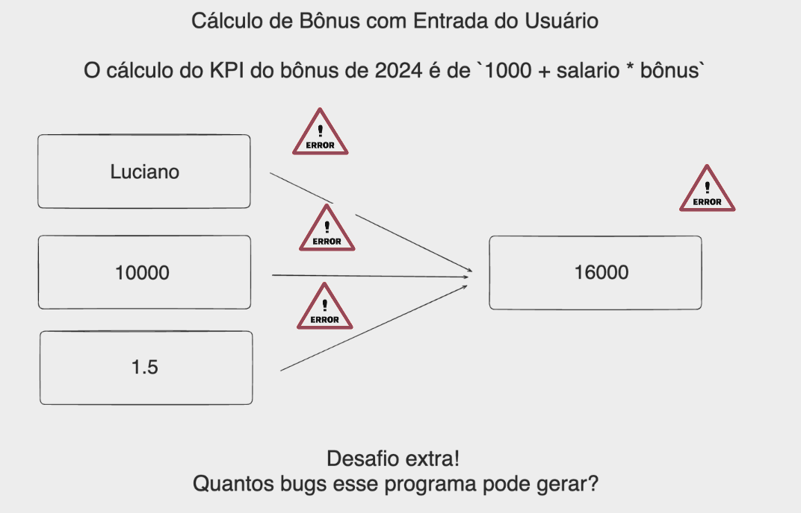

# Aula 02: TypeError, Type Check, Type Conversion, try-except e if

Bem-vindo à segunda aula do bootcamp! 


Hoje, vamos explorar mais a fundo um dos conceitos mais fundamentais da programação: variáveis. As variáveis são essenciais para armazenar e manipular dados em qualquer linguagem de programação, e em Python não é diferente. Nesta aula, vamos entender o que são variáveis, como declará-las, os tipos de dados simples suportados por Python e algumas boas práticas para nomeá-las.

Além disso, vamos mostrar como lidar e trabalhar com erros usando TypeError, Type Check, Type Conversion, try-except e if

## 1. Tipos primitivos

Variáveis são espaços de memória designados para armazenar dados que podem ser modificados durante a execução de um programa. Em Python, a declaração de variáveis é dinâmica, o que significa que o tipo de dado é inferido durante a atribuição.

**Exemplo em Python:**

Python suporta vários tipos de dados simples, tais como:

- **Inteiros (`int`)**: Representam números inteiros.
- **Ponto Flutuante (`float`)**: Representam números reais.
- **Strings (`str`)**: Representam sequências de caracteres.
- **Booleanos (`bool`)**: Representam valores verdadeiros (`True`) ou falsos (`False`).


#### 1. Inteiros (`int`)

* **Métodos e operações:**
    1. `+` (adição)
    2. `-` (subtração)
    3. `*` (multiplicação)
    4. `//` (divisão inteira)
    5. `%` (módulo - resto da divisão)

#### 2. Números de Ponto Flutuante (`float`)

* **Métodos e operações:**
    1. `+` (adição)
    2. `-` (subtração)
    3. `*` (multiplicação)
    4. `/` (divisão)
    5. `**` (potenciação)

#### 3. Strings (`str`)

* **Métodos e operações:**
    1. `.upper()` (converte para maiúsculas)
    2. `.lower()` (converte para minúsculas)
    3. `.strip()` (remove espaços em branco no início e no final)
    4. `.split(sep)` (divide a string em uma lista, utilizando `sep` como delimitador)
    5. `+` (concatenação de strings)

#### 4. Booleanos (`bool`)

* **Operações lógicas:**
    1. `and` (E lógico)
    2. `or` (OU lógico)
    3. `not` (NÃO lógico)
    4. `==` (igualdade)
    5. `!=` (diferença)

### Exercícios

#### Inteiros (`int`)

1. Escreva um programa que soma dois números inteiros inseridos pelo usuário.
2. Crie um programa que receba um número do usuário e calcule o resto da divisão desse número por 5.
3. Desenvolva um programa que multiplique dois números fornecidos pelo usuário e mostre o resultado.
4. Faça um programa que peça dois números inteiros e imprima a divisão inteira do primeiro pelo segundo.
5. Escreva um programa que calcule o quadrado de um número fornecido pelo usuário.

#### Números de Ponto Flutuante (`float`)

6. Escreva um programa que receba dois números flutuantes e realize sua adição.
7. Crie um programa que calcule a média de dois números flutuantes fornecidos pelo usuário.
8. Desenvolva um programa que calcule a potência de um número (base e expoente fornecidos pelo usuário).
9. Faça um programa que converta a temperatura de Celsius para Fahrenheit.
10. Escreva um programa que calcule a área de um círculo, recebendo o raio como entrada.

#### Strings (`str`)

11. Escreva um programa que receba uma string do usuário e a converta para maiúsculas.
12. Crie um programa que receba o nome completo do usuário e imprima o nome com todas as letras minúsculas.
13. Desenvolva um programa que peça ao usuário para inserir uma frase e, em seguida, imprima esta frase sem espaços em branco no início e no final.
14. Faça um programa que peça ao usuário para digitar uma data no formato "dd/mm/aaaa" e, em seguida, imprima o dia, o mês e o ano separadamente.
15. Escreva um programa que concatene duas strings fornecidas pelo usuário.

#### Booleanos (`bool`)

16. Escreva um programa que avalie duas expressões booleanas inseridas pelo usuário e retorne o resultado da operação AND entre elas.
17. Crie um programa que receba dois valores booleanos do usuário e retorne o resultado da operação OR.
18. Desenvolva um programa que peça ao usuário para inserir um valor booleano e, em seguida, inverta esse valor.
19. Faça um programa que compare se dois números fornecidos pelo usuário são iguais.
20. Escreva um programa que verifique se dois números fornecidos pelo usuário são diferentes.

### Exercícios Resolução

### Exercício 1: Soma de Dois Números Inteiros

```python
# num1 = int(input("Digite o primeiro número inteiro: "))
# num2 = int(input("Digite o segundo número inteiro: "))
num1 = 8  # Exemplo de entrada
num2 = 12  # Exemplo de entrada
resultado_soma = num1 + num2
print("A soma é:", resultado_soma)
```

### Exercício 2: Resto da Divisão por 5

```python
# num = int(input("Digite um número: "))
num = 18  # Exemplo de entrada
resultado_resto = num % 5
print("O resto da divisão por 5 é:", resultado_resto)
```

### Exercício 3: Multiplicação de Dois Números

```python
# num1 = int(input("Digite o primeiro número: "))
# num2 = int(input("Digite o segundo número: "))
num1 = 5  # Exemplo de entrada
num2 = 7  # Exemplo de entrada
resultado_multiplicacao = num1 * num2
print("O resultado da multiplicação é:", resultado_multiplicacao)
```

### Exercício 4: Divisão Inteira do Primeiro pelo Segundo Número

```python
# num1 = int(input("Digite o primeiro número inteiro: "))
# num2 = int(input("Digite o segundo número inteiro: "))
num1 = 20  # Exemplo de entrada
num2 = 3  # Exemplo de entrada
resultado_divisao_inteira = num1 // num2
print("O resultado da divisão inteira é:", resultado_divisao_inteira)
```

### Exercício 5: Quadrado de um Número

```python
# num = int(input("Digite um número: "))
num = 6  # Exemplo de entrada
resultado_quadrado = num ** 2
print("O quadrado do número é:", resultado_quadrado)
```

### Exercício 6: Adição de Dois Números Flutuantes

```python
# num1 = float(input("Digite o primeiro número flutuante: "))
# num2 = float(input("Digite o segundo número flutuante: "))
num1 = 2.5  # Exemplo de entrada
num2 = 4.5  # Exemplo de entrada
resultado_soma = num1 + num2
print("A soma é:", resultado_soma)
```

### Exercício 7: Média de Dois Números Flutuantes

```python
# num1 = float(input("Digite o primeiro número flutuante: "))
# num2 = float(input("Digite o segundo número flutuante: "))
num1 = 3.5  # Exemplo de entrada
num2 = 7.5  # Exemplo de entrada
media = (num1 + num2) / 2
print("A média é:", media)
```

### Exercício 8: Potência de um Número

```python
# base = float(input("Digite a base: "))
# expoente = float(input("Digite o expoente: "))
base = 2.0  # Exemplo de entrada
expoente = 3.0  # Exemplo de entrada
potencia = base ** expoente
print("O resultado da potência é:", potencia)
```

### Exercício 9: Conversão de Celsius para Fahrenheit

```python
# celsius = float(input("Digite a temperatura em Celsius: "))
celsius = 30.0  # Exemplo de entrada
fahrenheit = (celsius * 9/5) + 32
print(f"{celsius}°C é igual a {fahrenheit}°F")
```

### Exercício 10: Área de um Círculo

```python
# raio = float(input("Digite o raio do círculo: "))
raio = 5.0  # Exemplo de entrada
area = 3.14159 * raio ** 2
print("A área do círculo é:", area)
```

### Exercício 11: Converter String para Maiúsculas

```python
# texto = input("Digite um texto: ")
texto = "Olá, mundo!"  # Exemplo de entrada
texto_maiusculas = texto.upper()
print("Texto em maiúsculas:", texto_maiusculas)
```

### Exercício 12: Imprimir Nome Completo em Minúsculas

```python
# nome_completo = input("Digite seu nome completo: ")
nome_completo = "Fulano de Tal"  # Exemplo de entrada
nome_minusculas = nome_completo.lower()
print("Nome em minúsculas:", nome_minusculas)
```

### Exercício 13: Remover Espaços em Branco de uma Frase

```python
# frase = input("Digite uma frase: ")
frase = "  Olá, mundo!  "  # Exemplo de entrada
frase_sem_espacos = frase.strip()
print("Frase sem espaços no início e no final:", frase_sem_espacos)
```

### Exercício 14: Separar Dia, Mês e Ano de uma Data

```python
# data = input("Digite uma data no formato dd/mm/aaaa: ")
data = "01/01/2024"  # Exemplo de entrada
dia, mes, ano = data.split("/")
print("Dia:", dia)
print("Mês:", mes)
print("Ano:", ano)
```

### Exercício 15: Concatenar Duas Strings

```python
# parte1 = input("Digite a primeira parte do texto: ")
# parte2 = input("Digite a segunda parte do texto: ")
parte1 = "Olá,"  # Exemplo de entrada
parte2 = " mundo!"  # Exemplo de entrada
texto_concatenado = parte1 + parte2
print("Texto concatenado:", texto_concatenado)
```

#### Exercício 16. Operador `and` (E lógico)

```python
# Exemplo de entrada
valor1 = True
valor2 = False
resultado_and = valor1 and valor2
print("Resultado do AND lógico:", resultado_and)
```

#### Exercício 17. Operador `or` (OU lógico)

```python
# Exemplo de entrada
resultado_or = valor1 or valor2
print("Resultado do OR lógico:", resultado_or)
```

#### Exercício  18. Operador `not` (NÃO lógico)

```python
# Exemplo de entrada
resultado_not = not valor1
print("Resultado do NOT lógico:", resultado_not)
```

#### Exercício 19. Operador `==` (Igualdade)

```python
# Exemplo de entrada
num1 = 5
num2 = 5
resultado_igualdade = (num1 == num2)
print("Resultado da igualdade:", resultado_igualdade)
```

#### Exercício 20. Operador `!=` (Diferença)

```python
# Exemplo de entrada
resultado_diferenca = (num1 != num2)
print("Resultado da diferença:", resultado_diferenca)
```

# TypeError, Type Check e Type Conversion em Python

Python é uma linguagem de programação dinâmica, mas fortemente tipada, o que significa que não é necessário declarar tipos de variáveis explicitamente, mas o tipo de uma variável é determinado pelo valor que ela armazena. Isso introduz a necessidade de compreender como Python lida com diferentes tipos de dados, especialmente quando se trata de operações que envolvem múltiplos tipos. Vamos explorar três conceitos importantes: `TypeError`, verificação de tipo (`type check`), e conversão de tipo (`type conversion`).

## TypeError

Um `TypeError` ocorre em Python quando uma operação ou função é aplicada a um objeto de tipo inadequado. Python não sabe como aplicar a operação porque os tipos de dados não são compatíveis.

### Exemplo de TypeError

Um exemplo clássico é tentar utilizar a função `len()` com um inteiro, o que resulta em `TypeError`, pois `len()` espera um objeto iterável, como uma string, lista, ou tupla, não um inteiro.

```python
# Exemplo que causa TypeError
try:
    resultado = len(5)
except TypeError as e:
    print(e)  # Imprime a mensagem de erro
```

O código acima tenta obter o comprimento de um inteiro, o que não faz sentido, resultando na mensagem de erro: "object of type 'int' has no len()".

## Type Check

Verificação de tipo (`type check`) é o processo de verificar o tipo de uma variável. Isso pode ser útil para garantir que operações ou funções sejam aplicadas apenas a tipos de dados compatíveis, evitando erros em tempo de execução.

### Exemplo de Type Check

Para verificar o tipo de uma variável em Python, você pode usar a função `type()` ou `isinstance()`.

```python
numero = 10
if isinstance(numero, int):
    print("A variável é um inteiro.")
else:
    print("A variável não é um inteiro.")
```

Este código verifica se `numero` é uma instância de `int` e imprime uma mensagem apropriada.

## Type Conversion

Conversão de tipo (`type conversion`), também conhecida como casting, é o processo de converter o valor de uma variável de um tipo para outro. Python oferece várias funções integradas para realizar conversões explícitas de tipo, como `int()`, `float()`, `str()`, etc.

### Exemplo de Type Conversion

Se você quiser somar um inteiro e um número flutuante, pode ser necessário converter o inteiro para flutuante ou vice-versa para garantir que a operação de soma seja realizada corretamente.

```python
numero_inteiro = 5
numero_flutuante = 2.5
# Converte o inteiro para flutuante e realiza a soma
soma = float(numero_inteiro) + numero_flutuante
print(soma)  # Resultado: 7.5
```

### try-except

A estrutura `try-except` é usada para tratamento de exceções em Python. Uma exceção é um erro que ocorre durante a execução do programa e que, se não tratado, interrompe o fluxo normal do programa e termina sua execução. O tratamento de exceções permite que o programa lide com erros de maneira elegante, permitindo que continue a execução ou falhe de forma controlada.

* **try:** Este bloco é o primeiro na estrutura de tratamento de exceções. Python tenta executar o código dentro deste bloco.
* **except:** Se uma exceção ocorrer no bloco `try`, a execução imediatamente salta para o bloco `except`. Você pode especificar tipos de exceção específicos para capturar e tratar apenas essas exceções. Se nenhum tipo de exceção for especificado, ele captura todas as exceções.

#### Exemplo de try-except

```python
try:
    # Código que pode gerar uma exceção
    resultado = 10 / 0
except ZeroDivisionError:
    # Código que executa se a exceção ZeroDivisionError for levantada
    print("Divisão por zero não é permitida.")
```

### if

O `if` é uma estrutura de controle de fluxo que permite ao programa executar diferentes ações com base em diferentes condições. Se a condição avaliada pelo `if` for verdadeira (`True`), o bloco de código indentado sob ele será executado. Se a condição for falsa (`False`), o bloco de código será ignorado.

* **if:** Avalia uma condição. Se a condição for verdadeira, executa o bloco de código associado.
* **elif:** Abreviação de "else if". Permite verificar múltiplas condições em sequência.
* **else:** Executa um bloco de código se todas as condições anteriores no `if` e `elif` forem falsas.

#### Exemplo de if

```python
idade = 20
if idade < 18:
    print("Menor de idade")
elif idade == 18:
    print("Exatamente 18 anos")
else:
    print("Maior de idade")
```

Ambas as estruturas, `try-except` e `if`, são fundamentais para a criação de programas em Python que são capazes de lidar com situações inesperadas (como erros de execução) e tomar decisões com base em condições, permitindo assim que você construa programas mais robustos, flexíveis e seguros.

## Exercícios

Aqui estão cinco exercícios que envolvem `TypeError`, verificação de tipo (`type check`), o uso de `try-except` para tratamento de exceções e a utilização da estrutura condicional `if`. Esses exercícios aumentam progressivamente em dificuldade e abordam situações práticas onde você pode aplicar esses conceitos.

### Exercício 21: Conversor de Temperatura

Escreva um programa que converta a temperatura de Celsius para Fahrenheit. O programa deve solicitar ao usuário a temperatura em Celsius e, utilizando `try-except`, garantir que a entrada seja numérica, tratando qualquer `ValueError`. Imprima o resultado em Fahrenheit ou uma mensagem de erro se a entrada não for válida.

### Exercício 22: Verificador de Palíndromo

Crie um programa que verifica se uma palavra ou frase é um palíndromo (lê-se igualmente de trás para frente, desconsiderando espaços e pontuações). Utilize `try-except` para garantir que a entrada seja uma string. Dica: Utilize a função `isinstance()` para verificar o tipo da entrada.

### Exercício 23: Calculadora Simples

Desenvolva uma calculadora simples que aceite duas entradas numéricas e um operador (+, -, *, /) do usuário. Use `try-except` para lidar com divisões por zero e entradas não numéricas. Utilize `if-elif-else` para realizar a operação matemática baseada no operador fornecido. Imprima o resultado ou uma mensagem de erro apropriada.

### Exercício 24: Classificador de Números

Escreva um programa que solicite ao usuário para digitar um número. Utilize `try-except` para assegurar que a entrada seja numérica e utilize `if-elif-else` para classificar o número como "positivo", "negativo" ou "zero". Adicionalmente, identifique se o número é "par" ou "ímpar".

### Exercício 25: Conversão de Tipo com Validação

Crie um script que solicite ao usuário uma lista de números separados por vírgula. O programa deve converter a string de entrada em uma lista de números inteiros. Utilize `try-except` para tratar a conversão de cada número e validar que cada elemento da lista convertida é um inteiro. Se a conversão falhar ou um elemento não for um inteiro, imprima uma mensagem de erro. Se a conversão for bem-sucedida para todos os elementos, imprima a lista de inteiros.

## Exercícios Resolvidos

### Exercício 21: Conversor de Temperatura

```python
try:
    celsius = float(input("Digite a temperatura em Celsius: "))
    fahrenheit = (celsius * 9/5) + 32
    print(f"{celsius}°C é igual a {fahrenheit}°F.")
except ValueError:
    print("Por favor, digite um número válido para a temperatura.")
```

### Exercício 22: Verificador de Palíndromo

```python
entrada = input("Digite uma palavra ou frase: ")
if isinstance(entrada, str):
    formatado = entrada.replace(" ", "").lower()
    if formatado == formatado[::-1]:
        print("É um palíndromo.")
    else:
        print("Não é um palíndromo.")
else:
    print("Entrada inválida. Por favor, digite uma palavra ou frase.")
```

### Exercício 23: Calculadora Simples

```python
try:
    num1 = float(input("Digite o primeiro número: "))
    num2 = float(input("Digite o segundo número: "))
    operador = input("Digite o operador (+, -, *, /): ")
    if operador == '+':
        resultado = num1 + num2
    elif operador == '-':
        resultado = num1 - num2
    elif operador == '*':
        resultado = num1 * num2
    elif operador == '/' and num2 != 0:
        resultado = num1 / num2
    else:
        print("Operador inválido ou divisão por zero.")
    print("Resultado:", resultado)
except ValueError:
    print("Erro: Entrada inválida. Certifique-se de inserir números.")
```

### Exercício 24: Classificador de Números

```python
try:
    numero = int(input("Digite um número: "))
    if numero > 0:
        print("Positivo")
    elif numero < 0:
        print("Negativo")
    else:
        print("Zero")
    if numero % 2 == 0:
        print("Par")
    else:
        print("Ímpar")
except ValueError:
    print("Por favor, digite um número inteiro válido.")
```

### Exercício 25: Conversão de Tipo com Validação

```python
entrada_lista = input("Digite uma lista de números separados por vírgula: ")
numeros_str = entrada_lista.split(",")
numeros_int = []
try:
    for num in numeros_str:
        numeros_int.append(int(num.strip()))
    print("Lista de inteiros:", numeros_int)
except ValueError:
    print("Erro: certifique-se de que todos os elementos são números inteiros válidos.")
```


### Desafio - Refatorar o projeto da aula anterior evitando Bugs!

Para resolver os bugs identificados — tratamento de entradas inválidas que não podem ser convertidas para um número de ponto flutuante e prevenção de valores negativos para salário e bônus, você pode modificar o código diretamente. Isso envolve adicionar verificações adicionais após a tentativa de conversão para garantir que os valores sejam positivos.



```python
# Solicita ao usuário que digite seu nome
try:
    nome = input("Digite seu nome: ")

    # Verifica se o nome está vazio
    if len(nome) == 0:
        raise ValueError("O nome não pode estar vazio.")
    # Verifica se há números no nome
    elif any(char.isdigit() for char in nome):
        raise ValueError("O nome não deve conter números.")
    else:
        print("Nome válido:", nome)
except ValueError as e:
    print(e)

# Solicita ao usuário que digite o valor do seu salário e converte para float

try:
    salario = float(input("Digite o valor do seu salário: "))
    if salario < 0:
        print("Por favor, digite um valor positivo para o salário.")
except ValueError:
    print("Entrada inválida para o salário. Por favor, digite um número.")

# Solicita ao usuário que digite o valor do bônus recebido e converte para float
try:
    bonus_recebido = float(input("Digite o valor do bônus recebido: "))
    if bonus_recebido < 0:
        print("Por favor, digite um valor positivo para o bônus.")
except ValueError:
    print("Entrada inválida para o bônus. Por favor, digite um número.")

# Assumindo uma lógica de cálculo para o bônus final e KPI
bonus_final = bonus_recebido * 1.2  # Exemplo, ajuste conforme necessário
kpi = (salario + bonus_final) / 1000  # Exemplo simples de KPI

# Imprime as informações para o usuário
print(f"Seu KPI é: {kpi:.2f}")
print(f"{nome}, seu salário é R${salario:.2f} e seu bônus final é R${bonus_final:.2f}.")
```

