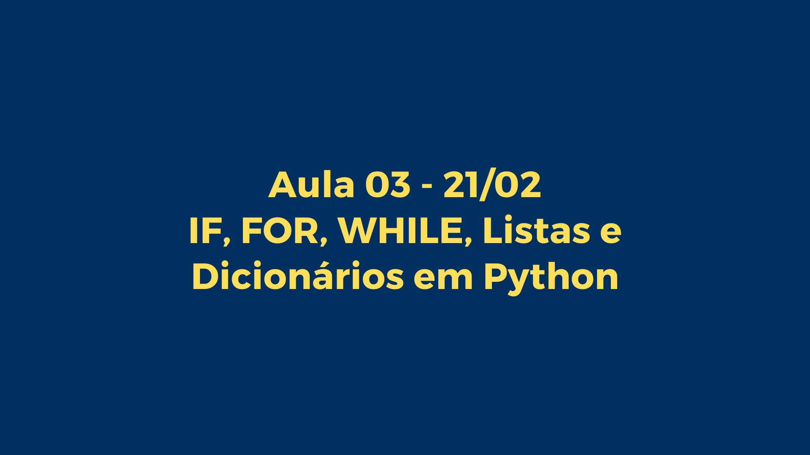

# Aula 03: DEBUG, IF, FOR, While, Listas e Dicionários em Python



Bem-vindo à terceira aula do bootcamp!

Hoje, vamos explorar estruturas de controle de fluxo como if, for, e while. 

Usamos estrutura de Controle de Fluxo para tomar decisões!

Databricks tem workflow


Airflow principal ferramenta de workflow


### Estruturas de Controle de Fluxo

Exploraremos como utilizar `if` para tomar decisões baseadas em condições, `for` para iterar sobre sequências de dados, e `while` para executar blocos de código enquanto uma condição for verdadeira.

Para saber mais:
[Doc](https://docs.python.org/pt-br/3/tutorial/controlflow.html)


## Estruturas de Controle de Fluxo

O if é uma estrutura condicional fundamental em Python que avalia se uma condição é verdadeira (True) e, se for, executa um bloco de código. Se a condição inicial não for verdadeira, você pode usar elif (else if) para verificar condições adicionais, e else para executar um bloco de código quando nenhuma das condições anteriores for verdadeira.

Provavelmente o mais conhecido comando de controle de fluxo é o if. Por exemplo:

```python
x = int(input("Please enter an integer: "))

if x < 0:
    x = 0
    print('Negative changed to zero')
elif x == 0:
    print('Zero')
elif x == 1:
    print('Single')
else:
    print('More')
```

### Exercício 1: Verificação de Qualidade de Dados

Você está analisando um conjunto de dados de vendas e precisa garantir que todos os registros tenham valores positivos para `quantidade` e `preço`. Escreva um programa que verifique esses campos e imprima "Dados válidos" se ambos forem positivos ou "Dados inválidos" caso contrário.

```python
quantidade = 10  # Exemplo de valor, substitua com input do usuário se necessário
preço = 20  # Exemplo de valor, substitua com input do usuário se necessário

if quantidade > 0 and preço > 0:
    print("Dados válidos")
else:
    print("Dados inválidos")
```

### Exercício 2: Classificação de Dados de Sensor

Imagine que você está trabalhando com dados de sensores IoT. Os dados incluem medições de temperatura. Você precisa classificar cada leitura como 'Baixa', 'Normal' ou 'Alta'. Considerando que:

* Temperatura < 18°C é 'Baixa'
* Temperatura >= 18°C e <= 26°C é 'Normal'
* Temperatura > 26°C é 'Alta'

```python
temperatura = 22  # Exemplo de valor, substitua com input do usuário se necessário

if temperatura < 18:
    print("Baixa")
elif 18 <= temperatura <= 26:
    print("Normal")
else:
    print("Alta")
```

### Exercício 3: Filtragem de Logs por Severidade

Você está analisando logs de uma aplicação e precisa filtrar mensagens com severidade 'ERROR'. Dado um registro de log em formato de dicionário como `log = {'timestamp': '2021-06-23 10:00:00', 'level': 'ERROR', 'message': 'Falha na conexão'}`, escreva um programa que imprima a mensagem se a severidade for 'ERROR'.

```python
log = {'timestamp': '2021-06-23 10:00:00', 'level': 'ERROR', 'message': 'Falha na conexão'}

if log['level'] == 'ERROR':
    print(log['message'])
```

### Exercício 4: Validação de Dados de Entrada

Antes de processar os dados de usuários em um sistema de recomendação, você precisa garantir que cada usuário tenha idade entre 18 e 65 anos e tenha fornecido um email válido. Escreva um programa que valide essas condições e imprima "Dados de usuário válidos" ou o erro específico encontrado.

```python
idade = 25  # Exemplo de valor, substitua com input do usuário se necessário
email = "usuario@exemplo.com"  # Exemplo de valor, substitua com input do usuário se necessário

if not 18 <= idade <= 65:
    print("Idade fora do intervalo permitido")
elif "@" not in email or "." not in email:
    print("Email inválido")
else:
    print("Dados de usuário válidos")
```

### Exercício 5: Detecção de Anomalias em Dados de Transações

Você está trabalhando em um sistema de detecção de fraude e precisa identificar transações suspeitas. Uma transação é considerada suspeita se o valor for superior a R$ 10.000 ou se ocorrer fora do horário comercial (antes das 9h ou depois das 18h). Dada uma transação como `transacao = {'valor': 12000, 'hora': 20}`, verifique se ela é suspeita.

```python
transacao = {'valor': 12000, 'hora': 20}

if transacao['valor'] > 10000 or transacao['hora'] < 9 or transacao['hora'] > 18:
    print("Transação suspeita")
else:
    print("Transação normal")
```

### FOR

O loop `for` é utilizado para iterar sobre os itens de qualquer sequência, como listas, strings, ou objetos de dicionário, e executar um bloco de código para cada item. É especialmente útil quando você precisa executar uma operação para cada elemento de uma coleção.

O comando for em Python é um pouco diferente do que costuma ser em C ou Pascal. Ao invés de sempre iterar sobre uma progressão aritmética de números (como no Pascal), ou permitir ao usuário definir o passo de iteração e a condição de parada (como C), o comando for do Python itera sobre os itens de qualquer sequência (seja uma lista ou uma string), na ordem que aparecem na sequência. Por exemplo:

```python
# Measure some strings:
words = ['cat', 'window', 'defenestrate']
for w in words:
    print(w, len(w))
```

```python
# Measure some strings:
nome = ['Luciano']
for letra in nome:
    print(letra)
```

Se você precisa iterar sobre sequências numéricas, a função embutida `range()` é a resposta. Ela gera progressões aritméticas:


```python
for i in range(5):
    print(i)
```

O ponto de parada fornecido nunca é incluído na lista; range(10) gera uma lista com 10 valores, exatamente os índices válidos para uma sequência de comprimento 10. É possível iniciar o intervalo com outro número, ou alterar a razão da progressão (inclusive com passo negativo):


```python
list(range(5, 10))
[5, 6, 7, 8, 9]

list(range(0, 10, 3))
[0, 3, 6, 9]

list(range(-10, -100, -30))
[-10, -40, -70]
```

Para iterar sobre os índices de uma sequência, combine range() e len() da seguinte forma:

```python
a = ['Mary', 'had', 'a', 'little', 'lamb']
for i in range(len(a)):
    print(i, a[i])
```

[Material sobre Dicionários](https://www.youtube.com/watch?v=ZWj8o692qGY)

#### 6. Contagem de Palavras em Textos

**Objetivo:** Dado um texto, contar quantas vezes cada palavra única aparece nele.

```python
texto = "a raposa marrom salta sobre o cachorro preguiçoso"
palavras = texto.split()
contagem_palavras = {}

for palavra in palavras:
    if palavra in contagem_palavras:
        contagem_palavras[palavra] += 1
    else:
        contagem_palavras[palavra] = 1

print(contagem_palavras)
```

#### 7. Normalização de Dados

**Objetivo:** Normalizar uma lista de números para que fiquem na escala de 0 a 1.

```python
numeros = [10, 20, 30, 40, 50]
minimo = min(numeros)
maximo = max(numeros)
normalizados = [(x - minimo) / (maximo - minimo) for x in numeros]

print(normalizados)
```

#### 8. Filtragem de Dados Faltantes

**Objetivo:** Dada uma lista de dicionários representando dados de usuários, filtrar aqueles que têm um campo específico faltando.

```python
usuarios = [
    {"nome": "Alice", "email": "alice@example.com"},
    {"nome": "Bob", "email": ""},
    {"nome": "Carol", "email": "carol@example.com"}
]

usuarios_validos = [usuario for usuario in usuarios if usuario["email"]]

print(usuarios_validos)
```

#### 9. Extração de Subconjuntos de Dados

**Objetivo:** Dada uma lista de números, extrair apenas aqueles que são pares.

```python
numeros = range(1, 11)
pares = [x for x in numeros if x % 2 == 0]

print(pares)
```

#### 10. Agregação de Dados por Categoria

**Objetivo:** Dado um conjunto de registros de vendas, calcular o total de vendas por categoria.

```python
vendas = [
    {"categoria": "eletrônicos", "valor": 1200},
    {"categoria": "livros", "valor": 200},
    {"categoria": "eletrônicos", "valor": 800}
]

total_por_categoria = {}
for venda in vendas:
    categoria = venda["categoria"]
    valor = venda["valor"]
    if categoria in total_por_categoria:
        total_por_categoria[categoria] += valor
    else:
        total_por_categoria[categoria] = valor

print(total_por_categoria)
```

### Exercícios com WHILE

O loop while é uma estrutura de controle de fluxo fundamental em Python, permitindo executar um bloco de código repetidamente enquanto uma condição especificada é avaliada como verdadeira (True). Na engenharia de dados, o uso do while pode ser extremamente útil para diversas tarefas, como monitoramento contínuo de fontes de dados, execução de processos de ETL (Extract, Transform, Load) até que não haja mais dados para processar, ou mesmo para implementar tentativas de reconexão automáticas a serviços ou bancos de dados quando a primeira tentativa falha.

#### Exemplo de Uso do while em Engenharia de Dados
Um cenário comum em engenharia de dados é a necessidade de executar uma tarefa de maneira periódica, como verificar novos dados em um diretório, fazer polling de uma API para novas respostas ou monitorar mudanças em um banco de dados. Nestes casos, um loop while pode ser utilizado para manter o script rodando continuamente ou até que uma condição específica seja atingida (por exemplo, um sinal para desligar ou uma condição de erro).

#### Exemplo Prático: while True com Pausa

Um exemplo direto do uso de while True em Python é criar um loop infinito que executa uma ação a cada intervalo definido, como imprimir uma mensagem a cada 10 segundos. Isso pode ser útil para monitorar processos ou dados em tempo real com uma verificação periódica.

```python
import time

while True:
    print("Verificando novos dados...")
    # Aqui você pode adicionar o código para verificar novos dados,
    # por exemplo, checar a existência de novos arquivos em um diretório,
    # fazer uma consulta a um banco de dados ou API, etc.
    
    time.sleep(10)  # Pausa o loop por 10 segundos
```
Neste exemplo, o while True cria um loop infinito, que é uma maneira poderosa de manter um script rodando continuamente. O print simula a ação de verificar novos dados, e o time.sleep(10) pausa a execução do loop por 10 segundos antes da próxima iteração. Essa abordagem é simples, mas eficaz para muitos cenários de monitoramento e polling em engenharia de dados, permitindo que o script execute uma verificação ou tarefa de maneira periódica.

Contudo, é importante usar loops infinitos com cautela para evitar criar condições em que o script possa consumir recursos desnecessários ou tornar-se difícil de encerrar de forma controlada. Em ambientes de produção, outras abordagens como agendamento de tarefas (por exemplo, usando cron jobs em sistemas Unix) ou o uso de sistemas de enfileiramento de mensagens e triggers de banco de dados podem ser mais adequados para algumas dessas tarefas.

#### 11. Leitura de Dados até Flag

**Objetivo:** Ler dados de entrada até que uma palavra-chave específica ("sair") seja fornecida.

```python
dados = []
entrada = ""
while entrada.lower() != "sair":
    entrada = input("Digite um valor (ou 'sair' para terminar): ")
    if entrada.lower() != "sair":
```

#### 12. Validação de Entrada

**Objetivo:** Solicitar ao usuário um número dentro de um intervalo específico até que a entrada seja válida.

```python
numero = int(input("Digite um número entre 1 e 10: "))
while numero < 1 or numero > 10:
    print("Número fora do intervalo!")
    numero = int(input("Por favor, digite um número entre 1 e 10: "))

print("Número válido!")
```

#### 13. Consumo de API Simulado

**Objetivo:** Simular o consumo de uma API paginada, onde cada "página" de dados é processada em loop até que não haja mais páginas.

```python
pagina_atual = 1
paginas_totais = 5  # Simulação, na prática, isso viria da API

while pagina_atual <= paginas_totais:
    print(f"Processando página {pagina_atual} de {paginas_totais}")
    # Aqui iria o código para processar os dados da página
    pagina_atual += 1

print("Todas as páginas foram processadas.")
```

#### 14. Tentativas de Conexão

**Objetivo:** Simular tentativas de reconexão a um serviço com um limite máximo de tentativas.

```python
tentativas_maximas = 5
tentativa = 1

while tentativa <= tentativas_maximas:
    print(f"Tentativa {tentativa} de {tentativas_maximas}")
    # Simulação de uma tentativa de conexão
    # Aqui iria o código para tentar conectar
    if True:  # Suponha que a conexão foi bem-sucedida
        print("Conexão bem-sucedida!")
        break
    tentativa += 1
else:
    print("Falha ao conectar após várias tentativas.")
```

#### 15. Processamento de Dados com Condição de Parada

**Objetivo:** Processar itens de uma lista até encontrar um valor específico que indica a parada.

```python
itens = [1, 2, 3, "parar", 4, 5]

i = 0
while i < len(itens):
    if itens[i] == "parar":
        print("Parada encontrada, encerrando o processamento.")
        break
    # Processa o item
    print(f"Processando item: {itens[i]}")
    i += 1
```
## Estruturas de Controle de Fluxo


Integre na solução anterior um fluxo de While que repita o fluxo até que o usuário insira as informações corretas
    
##### Solução
```python
# Inicializa as variáveis para o controle do loop
nome_valido = False
salario_valido = False
bonus_valido = False

# Loop para verificar o nome
while not nome_valido:
    try:
        nome = input("Digite seu nome: ")
        if len(nome) == 0:
            raise ValueError("O nome não pode estar vazio.")
        elif any(char.isdigit() for char in nome):
            raise ValueError("O nome não deve conter números.")
        else:
            print("Nome válido:", nome)
            nome_valido = True
    except ValueError as e:
        print(e)

# Loop para verificar o salário
while not salario_valido:
    try:
        salario = float(input("Digite o valor do seu salário: "))
        if salario < 0:
            print("Por favor, digite um valor positivo para o salário.")
        else:
            salario_valido = True
    except ValueError:
        print("Entrada inválida para o salário. Por favor, digite um número.")

# Loop para verificar o bônus
while not bonus_valido:
    try:
        bonus = float(input("Digite o valor do bônus recebido: "))
        if bonus < 0:
            print("Por favor, digite um valor positivo para o bônus.")
        else:
            bonus_valido = True
    except ValueError:
        print("Entrada inválida para o bônus. Por favor, digite um número.")

bonus_recebido = 1000 + salario * bonus  # Exemplo simples de cálculo de bônus

# Imprime as informações para o usuário
print(f"{nome}, seu salário é R${salario:.2f} e seu bônus final é R${bonus_recebido:.2f}.")
```


