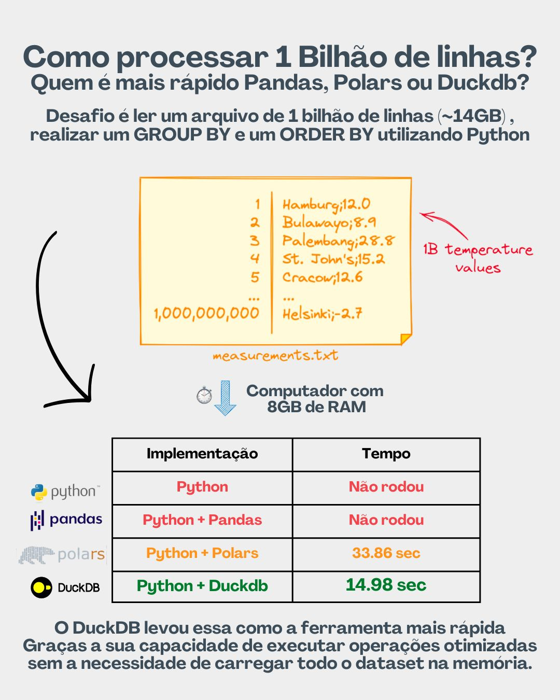

# Aula 04 | Type hint, Tipos complexos (Dicionários vs DataFrames Vs Tabelas Vs Excel) e Funções

Bem-vindos à quarta aula de Python e SQL focada em Engenharia de Dados. Nesta aula você vai aprender sobre: Type Hint, Listas e Dicionários e Funções. Esses elementos são essenciais para a manipulação de dados, ajudando na organização, interpretação e análise eficiente das informações. 


Vamos começar com uma introdução a cada um desses temas para nos prepararmos para o nosso primeiro prsojeto, como ler 1 bilhão de linhas!


E o nosso workshop de sabado, dia 24 as 9am, como validar 1 bilhão de linhass.




## 1. Type Hint

O uso de Type Hint ajuda a tornar o código mais legível e seguro, especificando o tipo de dados esperados por funções e variáveis. Na engenharia de dados, isso é especialmente útil para garantir que as funções de manipulação e análise de dados recebam os dados no formato correto, reduzindo erros em tempo de execução.

Para demonstrar como utilizar Type Hints com tipos primitivos em Python, vamos criar quatro variáveis representando os tipos mais comuns: int para números inteiros, float para números de ponto flutuante, str para strings (cadeias de caracteres) e bool para valores booleanos. Type Hints são usados para indicar o tipo de uma variável no momento da sua declaração, melhorando a legibilidade do código e facilitando a detecção de erros.

Sem Type Hint
```python
idade = 30
altura = 1.75
nome = "Alice"
is_estudante = True
```

Com Type Hint
```python
idade: int = 30
altura: float = 1.75
nome: str = "Alice"
estudante: bool = True
```

O uso de Type Hint ajuda a tornar o código mais legível e seguro, especificando o tipo de dados esperados por funções e variáveis. Na engenharia de dados, isso é especialmente útil para garantir que as funções de manipulação e análise de dados recebam os dados no formato correto, reduzindo erros em tempo de execução.

Na Python, a tipagem de funções é facilitada pelo uso de "Type Hints" (Dicas de Tipo), uma característica introduzida no Python 3.5 através do PEP 484. Os Type Hints permitem aos desenvolvedores especificar os tipos de dados esperados para os parâmetros de uma função e o tipo de dado que a função deve retornar. Embora essas dicas de tipo não sejam estritamente aplicadas em tempo de execução, elas são extremamente úteis para ferramentas de análise estática de código, melhorando a legibilidade do código e ajudando na detecção precoce de erros.

### Tipagem Fraca vs. Forte

* **Tipagem Forte**: Em linguagens com tipagem forte, uma vez que uma variável é atribuída a um tipo, não pode ser automaticamente tratada como outro tipo sem uma conversão explícita. Python é um exemplo de linguagem com tipagem forte. Isso significa que operações que misturam tipos incompatíveis (como adicionar um número a uma string) resultarão em erro.
    
* **Tipagem Fraca**: Linguagens com tipagem fraca permitem maior flexibilidade nas operações entre diferentes tipos, fazendo conversões de tipo implícitas. JavaScript é um exemplo clássico, onde você pode adicionar números a strings sem erros, resultando em uma concatenação de texto.
    
### Tipagem Estática vs. Dinâmica

* **Tipagem Estática**: Linguagens de tipagem estática, como Java e C++, exigem que o tipo de cada variável seja declarado explicitamente no momento da compilação. Isso ajuda a detectar erros de tipo antes da execução do programa, aumentando a segurança do tipo e potencialmente melhorando o desempenho.
    
* **Tipagem Dinâmica**: Python é um exemplo de linguagem com tipagem dinâmica, onde os tipos são inferidos em tempo de execução e não precisam ser declarados explicitamente. Isso oferece flexibilidade e rapidez no desenvolvimento, mas pode aumentar o risco de erros de tipo que só serão detectados em tempo de execução.

Exercício será tipar o desafio da aula 03

```python
nome_valido = False
salario_valido = False
bonus_valido = False

while not nome_valido:
    try:
        nome = input("Digite seu nome: ")

        # Verifica se o nome está vazio
        if len(nome) == 0:
            raise ValueError("O nome não pode estar vazio.")
        # Verifica se há números no nome
        elif any(char.isdigit() for char in nome):
            raise ValueError("O nome não deve conter números.")
        else:
            print("Nome válido:", nome)
            nome_valido = True
    except ValueError as e:
        print(e)

# Solicita ao usuário que digite o valor do seu salário e converte para float

try:
    salario = float(input("Digite o valor do seu salário: "))
    if salario < 0:
        print("Por favor, digite um valor positivo para o salário.")
except ValueError:
    print("Entrada inválida para o salário. Por favor, digite um número.")
    exit()

# Solicita ao usuário que digite o valor do bônus recebido e converte para float
try:
    bonus = float(input("Digite o valor do bônus recebido: "))
    if bonus < 0:
        print("Por favor, digite um valor positivo para o bônus.")
except ValueError:
    print("Entrada inválida para o bônus. Por favor, digite um número.")
    exit()

bonus_recebido = 1000 + salario * bonus  # Exemplo simples de KPI

# Imprime as informações para o usuário
print(f"{nome}, seu salário é R${salario:.2f} e seu bônus final é R${bonus_recebido:.2f}.")
```

## 2. Listas e Dicionários

### Importância na Engenharia de Dados

Listas e dicionários são estruturas de dados versáteis que permitem armazenar e manipular coleções de dados de forma eficiente. Na engenharia de dados, essas estruturas são fundamentais para organizar dados coletados de diversas fontes, facilitando operações como filtragem, busca, agregação e transformação de dados.

### Exercícios de Listas e Dicionários

1. Crie uma lista com os números de 1 a 10 e use um loop para imprimir cada número elevado ao quadrado.
2. Dada a lista `["Python", "Java", "C++", "JavaScript"]`, remova o item "C++" e adicione "Ruby".
3. Crie um dicionário para armazenar informações de um livro, incluindo título, autor e ano de publicação. Imprima cada informação.
4. Escreva um programa que conta o número de ocorrências de cada caractere em uma string usando um dicionário.
5. Dada a lista `["maçã", "banana", "cereja"]` e o dicionário `{"maçã": 0.45, "banana": 0.30, "cereja": 0.65}`, calcule o preço total da lista de compras.

### Exercícios de Listas e Dicionários resolvidos

## Resoluções de Listas e Dicionários

### 1. Lista de números ao quadrado

```python
numeros = list(range(1, 11))
for numero in numeros:
    print(quadrados**2)
```

### 2. Modificar lista de linguagens

```python
linguagens = ["Python", "Java", "C++", "JavaScript"]
linguagens.remove("C++")
linguagens.append("Ruby")
print(linguagens)
```

### 3. Informações de um livro

```python
livro = {"titulo": "1984", "autor": "George Orwell", "ano": 1949}
for chave, valor in livro.items():
    print(f"{chave}: {valor}")
```

### 4. Contar ocorrências de caracteres

```python
def contar_caracteres(s):
    contagem = {}
    for caractere in s:
        contagem[caractere] = contagem.get(caractere, 0) + 1
    return contagem

print(contar_caracteres("engenharia de dados"))
```

### 5. Preço total da lista de compras

```python
lista_compras = ["maçã", "banana", "cereja"]
precos = {"maçã": 0.45, "banana": 0.30, "cereja": 0.65}
total = sum(precos[item] for item in lista_compras)
print(f"Preço total: {total}")
```

## Exercícios intermediários e mais avançados

### 6. Eliminação de Duplicatas

**Objetivo:** Dada uma lista de emails, remover todos os duplicados.

```python
emails = ["user@example.com", "admin@example.com", "user@example.com", "manager@example.com"]
emails_unicos = list(set(emails))

print(emails_unicos)
```

#### 7. Filtragem de Dados

**Objetivo:** Dada uma lista de idades, filtrar apenas aquelas que são maiores ou iguais a 18.

```python
idades = [22, 15, 30, 17, 18]
idades_validas = [idade for idade in idades if idade >= 18]

print(idades_validas)
```

#### 8. Ordenação Personalizada

**Objetivo:** Dada uma lista de dicionários representando pessoas, ordená-las pelo nome.

```python
pessoas = [
    {"nome": "Alice", "idade": 30},
    {"nome": "Bob", "idade": 25},
    {"nome": "Carol", "idade": 20}
]
pessoas.sort(key=lambda pessoa: pessoa["nome"])

print(pessoas)
```

#### 9. Agregação de Dados

**Objetivo:** Dado um conjunto de números, calcular a média.

```python
numeros = [10, 20, 30, 40, 50]
media = sum(numeros) / len(numeros)

print("Média:", media)
```

#### 10. Divisão de Dados em Grupos

**Objetivo:** Dada uma lista de valores, dividir em duas listas: uma para valores pares e outra para ímpares.

```python
valores = [1, 2, 3, 4, 5, 6, 7, 8, 9, 10]
pares = [valor for valor in valores if valor % 2 == 0]
impares = [valor for valor in valores if valor % 2 != 0]

print("Pares:", pares)
print("Ímpares:", impares)
```

### Exercícios com Dicionários

#### 11. Atualização de Dados

**Objetivo:** Dada uma lista de dicionários representando produtos, atualizar o preço de um produto específico.

```python
produtos = [
    {"id": 1, "nome": "Teclado", "preço": 100},
    {"id": 2, "nome": "Mouse", "preço": 80},
    {"id": 3, "nome": "Monitor", "preço": 300}
]

# Atualizar o preço do produto com id 2 para 90
for produto in produtos:
    if produto["id"] == 2:
        produto["preço"] = 90

print(produtos)
```

#### 12. Fusão de Dicionários

**Objetivo:** Dados dois dicionários, fundi-los em um único dicionário.

```python
dicionario1 = {"a": 1, "b": 2}
dicionario2 = {"c": 3, "d": 4}

dicionario_fundido = {**dicionario1, **dicionario2}

print(dicionario_fundido)
```

#### 13. Filtragem de Dados em Dicionário

**Objetivo:** Dado um dicionário de estoque de produtos, filtrar aqueles com quantidade maior que 0.

```python
estoque = {"Teclado": 10, "Mouse": 0, "Monitor": 3, "CPU": 0}

estoque_positivo = {produto: quantidade for produto, quantidade in estoque.items() if quantidade > 0}

print(estoque_positivo)
```

#### 14. Extração de Chaves e Valores

**Objetivo:** Dado um dicionário, criar listas separadas para suas chaves e valores.

```python
dicionario = {"a": 1, "b": 2, "c": 3}
chaves = list(dicionario.keys())
valores = list(dicionario.values())

print("Chaves:", chaves)
print("Valores:", valores)
```

#### 15. Contagem de Frequência de Itens

**Objetivo:** Dada uma string, contar a frequência de cada caractere usando um dicionário.

```python
texto = "engenharia de dados"
frequencia = {}

for caractere in texto:
    if caractere in frequencia:
        frequencia[caractere] += 1
    else:
        frequencia[caractere] = 1

print(frequencia)
```

## 3.Lendo arquivos

Para ler um arquivo CSV em Python utilizando o módulo nativo, você pode usar a combinação do comando with open... para abrir o arquivo e o método .reader() do módulo csv para ler o arquivo linha por linha. O uso de with assegura que o arquivo será fechado corretamente após sua leitura, mesmo que ocorram erros durante o processo. Abaixo está um exemplo básico de como realizar essa operação:

```python
import csv

# Caminho para o arquivo CSV
caminho_arquivo = 'exemplo.csv'

# Inicializa uma lista vazia para armazenar os dados
dados = []

# Usa o gerenciador de contexto `with` para abrir o arquivo
with open(caminho_arquivo, mode='r', encoding='utf-8') as arquivo:
    # Cria um objeto leitor de CSV
    leitor_csv = csv.DictReader(arquivo)
    
    # Itera sobre as linhas do arquivo CSV
    for linha in leitor_csv:
        # Adiciona cada linha (um dicionário) à lista de dados
        dados.append(linha)

# Exibe os dados lidos do arquivo CSV
for registro in dados:
    print(registro)
```

## 4. Funções

### Importância na Engenharia de Dados

Funções permitem modularizar e reutilizar código, essencial para processar e analisar grandes conjuntos de dados. Na engenharia de dados, funções são usadas para encapsular lógicas de transformação, limpeza, agregação e análise de dados, tornando o código mais organizado e mantendo a qualidade do código.

As funções em programação são abstrações poderosas que permitem encapsular blocos de código para realizar tarefas específicas. Elas servem não apenas para organizar o código e torná-lo mais legível, mas também para abstrair complexidades, permitindo que os programadores pensem em problemas em um nível mais alto. Uma função bem projetada pode ser vista como um "mini-programa" dentro de um programa maior, com sua própria lógica e dados de entrada e saída.

Um exemplo clássico dessa abstração é a ordenação de uma lista. Vamos primeiro desenvolver uma função simples em Python que ordena uma lista usando o algoritmo de ordenação por seleção, um método simples mas eficaz para listas pequenas e médias. Em seguida, mostraremos como essa tarefa pode ser realizada de forma mais direta usando o método `sort()` built-in do Python, que é uma abstração fornecida pela linguagem para realizar a mesma tarefa.

### Função de Ordenação Personalizada

```python
# Implementação do algoritmo de ordenação por seleção
lista = [64, 34, 25, 12, 22, 11, 90]

for i in range(len(lista)):
    for j in range(i+1, len(lista)):
        if lista[i] > lista[j]:
            lista[i], lista[j] = lista[j], lista[i]

# Ordenando a lista
print("Lista ordenada com função personalizada:", lista)
```

### Usando o Método Built-in `sort()`

O Python fornece uma abstração poderosa através do método `sort()`, que pode ordenar listas in-place de maneira eficiente e com uma sintaxe simples.

```python
# Lista de exemplo
lista_exemplo = [64, 34, 25, 12, 22, 11, 90]

# Ordenando a lista com sort()
lista_exemplo.sort()

print("Lista ordenada com método built-in:", lista_exemplo)
```

A comparação entre a função de ordenação personalizada e o método `sort()` ilustra perfeitamente como as abstrações em programação, como funções e métodos built-in, podem simplificar significativamente o desenvolvimento de software. Enquanto a implementação manual de um algoritmo de ordenação é uma ótima maneira de entender os princípios da computação e algoritmos, na prática, utilizar abstrações fornecidas pela linguagem pode economizar tempo e evitar erros, permitindo que os desenvolvedores se concentrem na lógica de negócios e nos aspectos de alto nível de seus programas.

#### Exemplo: Transformação de Dados com Funções

Suponhamos a necessidade de limpar e transformar nomes de usuários em um conjunto de dados. Uma função dedicada pode ser implementada para essa tarefa.

```python
def normalizar_nome(nome: str) -> str:
    return nome.strip().lower()

nomes = [" Alice ", "BOB", "Carlos"]
nomes_normalizados = [normalizar_nome(nome) for nome em nomes]
print(nomes_normalizados)
```

Cada um desses temas desempenha um papel crucial na engenharia de dados, permitindo a manipulação eficiente de dados, garantindo a qualidade do código e facilitando a análise de dados complexos. Esses exemplos ilustram como listas, dicionários, type hints e funções podem ser aplicados para resolver problemas comuns encontrados nesse campo.

### Exercícios de Funções

16. Escreva uma função que receba uma lista de números e retorne a soma de todos os números.
17. Crie uma função que receba um número como argumento e retorne `True` se o número for primo e `False` caso contrário.
18. Desenvolva uma função que receba uma string como argumento e retorne essa string revertida.
19. Implemente uma função que receba dois argumentos: uma lista de números e um número. A função deve retornar todas as combinações de pares na lista que somem ao número dado.
20. Escreva uma função que receba um dicionário e retorne uma lista de chaves ordenadas

O padrão de nomeação de funções em Python segue convenções que são amplamente aceitas pela comunidade Python, conforme recomendado no PEP 8, o guia de estilo para a codificação em Python. Adotar esses padrões não só melhora a legibilidade do código, mas também facilita a compreensão e a manutenção por outros desenvolvedores, incluindo aqueles novos ao projeto.

### Padrões de Nomes de Funções

* **Nomes Claros e Descritivos**: O nome de uma função deve ser descritivo o suficiente para indicar sua finalidade ou o que ela faz. Por exemplo, `calcular_area_circulo` é mais descritivo do que simplesmente `area`.
    
* **Letras Minúsculas com Sublinhados**: Funções em Python devem ser nomeadas usando letras minúsculas, com palavras separadas por sublinhados para melhorar a legibilidade. Este estilo é algumas vezes referido como snake_case. Por exemplo, `carregar_dados_usuario` é um bom exemplo.
    
* **Evitar Nomes Genéricos**: Nomes como `processo`, `executar`, ou `fazer_algo` são muito genéricos e não fornecem informações suficientes sobre o que a função faz. Prefira nomes que ofereçam um nível adequado de detalhe.
    
* **Evitar Abreviações Obscuras**: Embora abreviações possam encurtar o nome de uma função, elas podem tornar o código menos acessível para outros desenvolvedores. Por exemplo, `calc_media_notas` é preferível a `cmn`.
    
* **Prefixos com Verbo**: Muitas vezes, funções realizam ações, então é útil iniciar o nome da função com um verbo que descreve essa ação, como `obter_`, `calcular_`, `processar_`, `validar_` ou `limpar_`.

Na Python, a tipagem de funções é facilitada pelo uso de "Type Hints" (Dicas de Tipo), uma característica introduzida no Python 3.5 através do PEP 484. Os Type Hints permitem aos desenvolvedores especificar os tipos de dados esperados para os parâmetros de uma função e o tipo de dado que a função deve retornar. Embora essas dicas de tipo não sejam estritamente aplicadas em tempo de execução, elas são extremamente úteis para ferramentas de análise estática de código, melhorando a legibilidade do código e ajudando na detecção precoce de erros.

### Tipagem dos Parâmetros

Você pode especificar o tipo de cada parâmetro ao definir uma função. Isso indica claramente o tipo de argumento que a função espera.

```python
def saudacao(nome: str, idade: int) -> str:
    return f"Olá, {nome}, você tem {idade} anos."
```

### Parâmetros com Valores Default

Python permite definir valores default para os parâmetros, o que significa que a função pode ser chamada sem fornecer todos os argumentos, desde que os omitidos tenham um valor padrão definido. A tipagem funciona da mesma forma, com o tipo sendo especificado antes do sinal de igual.

```python
def saudacao(nome: str, idade: int = 30) -> str:
    return f"Olá, {nome}, você tem {idade} anos."
```


Refatorar nosso código usando Dicionário, Type Hint e Funcões.


Duvidas