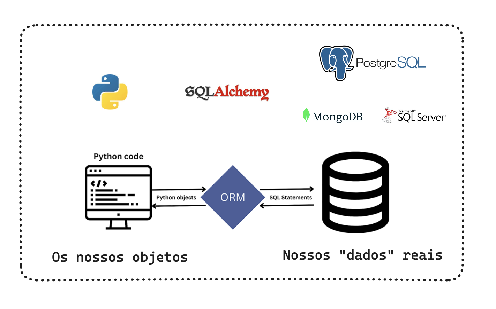

# CRUD FASTAPI POSTGRES STREAMLIT

Você sabe o que é CRUD?


A BlackFriday ta chegando. Você sabe como que o Iphone fica mais barato? Você sabe como que o vídeo game é cadastrado? Você sabia que quando abre o seu navegador, nada mais é do que o seu browser fazendo um SELECT no banco do Mercado Livre 🤯

Você precisa conhecer o CRUD.

O principal responsável por tornar isso possível é o ORM



## Instalação via docker

```bash
docker-compose up -d --build
```

### Uso

Frontend:
Acesse o endereço http://localhost:8501

### Documentação

Backend:
Acesse o endereço http://localhost:8000/docs

## Nossa estrutura de pastas e arquivos

```bash
├── README.md # arquivo com a documentação do projeto
├── backend # pasta do backend (FastAPI, SQLAlchemy, Uvicorn, Pydantic)
├── frontend # pasta do frontend (Streamlit, Requests, Pandas)
├── docker-compose.yml # arquivo de configuração do docker-compose (backend, frontend, postgres)
├── poetry.lock # arquivo de lock do poetry
└── pyproject.toml # arquivo de configuração do poetry
```

## Nosso Backend

Nosso backend vai ser uma API, que será responsável por fazer a comunicação entre o nosso frontend com o banco de dados. Vamos detalhar cada uma das pastas e arquivos do nosso backend.

### FastAPI

O FastAPI é um framework web para construir APIs com Python. Ele é baseado no Starlette, que é um framework assíncrono para construir APIs. O FastAPI é um framework que está crescendo muito, e que tem uma curva de aprendizado muito baixa, pois ele é muito parecido com o Flask.

### Uvicorn

O Uvicorn é um servidor web assíncrono, que é baseado no ASGI, que é uma especificação para servidores web assíncronos. O Uvicorn é o servidor web recomendado pelo FastAPI, e é o servidor que vamos utilizar nesse projeto.

### SQLAlchemy

O SQLAlchemy é uma biblioteca para fazer a comunicação com o banco de dados. Ele é um ORM (Object Relational Mapper), que é uma técnica de mapeamento objeto-relacional que permite fazer a comunicação com o banco de dados utilizando objetos.

Uma das principais vantagens de trabalhar com o SQLAlchemy é que ele é compatível com vários bancos de dados, como MySQL, PostgreSQL, SQLite, Oracle, Microsoft SQL Server, Firebird, Sybase e até mesmo o Microsoft Access.

Além disso, ele realiza a sanitização dos dados, evitando ataques de SQL Injection.


Outro ponto, é que você pode trabalhar com métodos nativos do Python, como por exemplo o filter, que é muito utilizado para fazer filtros em listas. Isso facilita muito a nossa vida, pois não precisamos aprender uma nova linguagem para fazer a comunicação com o banco de dados. Quem tiver familidade com Pandas, vai se sentir em casa.

### Pydantic

O Pydantic é uma biblioteca para fazer a validação de dados. Ele é utilizado pelo FastAPI para fazer a validação dos dados que são recebidos na API, e também para definir os tipos de dados que são retornados pela API.

## docker-compose.yml

Esse arquivo `docker-compose.yml` define uma aplicação composta por três serviços: `postgres`, `backend` e `frontend`, e cria uma rede chamada `mynetwork`. Vou explicar cada parte em detalhes:

### Services:

#### Postgres:

* `image: postgres:latest`: Esse serviço utiliza a imagem mais recente do PostgreSQL disponível no Docker Hub.
* `volumes`: Mapeia o diretório `/var/lib/postgresql/data` dentro do contêiner do PostgreSQL para um volume chamado `postgres_data` no sistema hospedeiro. Isso permite que os dados do banco de dados persistam mesmo quando o contêiner é desligado.
* `environment`: Define variáveis de ambiente para configurar o banco de dados PostgreSQL, como nome do banco de dados (`POSTGRES_DB`), nome de usuário (`POSTGRES_USER`) e senha (`POSTGRES_PASSWORD`).
* `networks`: Define que este serviço está na rede chamada `mynetwork`.

#### Backend:

* `build`: Especifica que o Docker deve construir uma imagem para esse serviço, usando um Dockerfile localizado no diretório `./backend`.
* `volumes`: Mapeia o diretório `./backend` (no sistema hospedeiro) para o diretório `/app` dentro do contêiner. Isso permite que as alterações no código fonte do backend sejam refletidas no contêiner em tempo real.
* `environment`: Define a variável de ambiente `DATABASE_URL`, que especifica a URL de conexão com o banco de dados PostgreSQL.
* `ports`: Mapeia a porta `8000` do sistema hospedeiro para a porta `8000` do contêiner, permitindo que o serviço seja acessado através da porta `8000`.
* `depends_on`: Indica que este serviço depende do serviço `postgres`, garantindo que o banco de dados esteja pronto antes que o backend seja iniciado.
* `networks`: Também define que este serviço está na rede `mynetwork`.

#### Frontend:

* `build`: Similar ao backend, especifica que o Docker deve construir uma imagem para este serviço, usando um Dockerfile localizado no diretório `./frontend`.
* `volumes`: Mapeia o diretório `./frontend` (no sistema hospedeiro) para o diretório `/app` dentro do contêiner, permitindo alterações em tempo real.
* `ports`: Mapeia a porta `8501` do sistema hospedeiro para a porta `8501` do contêiner, permitindo acesso ao frontend através da porta `8501`.
* `networks`: Define que este serviço também está na rede `mynetwork`.

### Networks:

* `mynetwork`: Define uma rede personalizada para os serviços se comunicarem entre si.

### Volumes:

* `postgres_data`: Define um volume para armazenar os dados do banco de dados PostgreSQL.

### Comando `docker-compose up`:

Quando você executa `docker-compose up`, o Docker Compose lerá o arquivo `docker-compose.yml`, criará os serviços conforme as definições especificadas e os iniciará. Isso significa que os contêineres para o banco de dados PostgreSQL, o backend e o frontend serão criados e conectados à rede `mynetwork`. O banco de dados será configurado com os detalhes fornecidos (nome do banco de dados, usuário e senha), e as imagens para os serviços de backend e frontend serão construídas a partir dos Dockerfiles fornecidos. Uma vez iniciados, você poderá acessar o backend através de `http://localhost:8000` e o frontend através de `http://localhost:8501`. Os dados do banco de dados serão persistidos no volume `postgres_data`.

## Nossa estrutura de pastas e arquivos

```bash
├── backend
│   ├── Dockerfile # arquivo de configuração do Docker
│   ├── crud.py # arquivo com as funções de CRUD utilizando o SQL Alchemy ORM
│   ├── database.py # arquivo com a configuração do banco de dados utilizando o SQL Alchemy 
│   ├── main.py
│   ├── models.py
│   ├── requirements.txt
│   ├── router.py
│   └── schemas.py
```

## Arquivo `database.py`

O arquivo `database.py` é responsável por fazer a configuração do banco de dados utilizando o SQLAlchemy. Ele é responsável por criar a conexão com o banco de dados, e também por criar a sessão do banco de dados.

Caso queira mudar de banco de dados, você só precisa mudar a URL de conexão, que está na variável SQLALCHEMY_DATABASE_URL. o SQLAlchemy é compatível com vários bancos de dados, como MySQL, PostgreSQL, SQLite, Oracle, Microsoft SQL Server, Firebird, Sybase e até mesmo o Microsoft Access.

Os principais pontos desse arquivo é a engine, que é a conexão com o banco de dados, e o SessionLocal, que é a sessão do banco de dados. O SessionLocal é quem executada as queries no banco de dados.

Lembrar sempre de:

1) Declarar a URL do banco
2) Criar a engine usando o 'create_engine'
3) Criar a sessão do banco
4) Criar a Base do ORM (nosso Model vai herdar ele)
5) Criar um gerador de sessão para ser reutilizado

## Arquivo `models.py`

O arquivo `models.py` é responsável por definir os modelos do SQLAlchemy, que são as classes que definem as tabelas do banco de dados. Esses modelos são utilizados para fazer a comunicação com o banco de dados.

É aqui que definimos o nome da tabela, os campos e os tipos de dados. Conseguimos incluir campos gerados aleatoriamente, como o id e o created_at. Para o id, ao incluir o campo Integer, com o parâmetro primary_key=True, o SQLAlchemy já entende que esse campo é o id da tabela. Para o created_at, ao incluir o campo DateTime, com o parâmetro default=datetime, o SQLAlchemy já entende que esse campo é a data de criação da tabela.

Lembrar:

1) O models é agnóstico ao banco, ele não sabe qual é o banco que é criado! Ele vai importar o base do database!

2) Declarar sua Tabela

## Arquivo `schemas.py`

O arquivo `schemas.py` é responsável por definir os schemas do Pydantic, que são as classes que definem os tipos de dados que serão utilizados na API. Esses schemas são utilizados para fazer a validação dos dados que são recebidos na API, e também para definir os tipos de dados que são retornados pela API.

O pydantic é a principal biblioteca para validação de dados em Python. Ela é utilizada pelo FastAPI para fazer a validação dos dados recebidos na API, e também para definir os tipos de dados que são retornados pela API.

Além disso, ela possui uma integração muito boa com o SQLAlchemy, que é a biblioteca que utilizamos para fazer a comunicação com o banco de dados.

Outra vantagem são os seus tipos pré-definidos, que facilitam muito a nossa vida. Por exemplo, se você quer definir um campo que aceita apenas números positivos, você pode utilizar o PositiveInt. Se você quer definir um campo que aceita apenas determinadas categorias, você pode utilizar o construtor constrains.

Detalhe que criamos schemas diferentes para os retornos da nossa API. Isso é uma boa prática, pois permite que você tenha mais flexibilidade para alterar os schemas no futuro.

Temos o schema `ProductBase`, que é o schema base para o cadastro de produtos. Esse schema é utilizado para fazer a validação dos dados que são recebidos na API, e também para definir os tipos de dados que são retornados pela API.

Temos o schema `ProductCreate`, que é o schema que é retornado pela API. Ele é uma classe que herda do schema `ProductBase`, e possui um campo a mais, que é o id. Esse campo é utilizado para identificar o produto no banco de dados.

Temos o schema `ProductResponse`, que é o schema que é retornado pela API. Ele é uma classe que herda do schema `ProductBase`, e possui dois campos a mais, que é o id e o created_at. Esses campos são gerados pelo nosso banco de dados.

Temos o schema `ProductUpdate`, que é o schema que é recebido pela API para update. Ele possui os campos opcionais, pois não é necessário enviar todos os campos para fazer o update.

## Arquivo `crud.py`

O arquivo `crud.py` é responsável por definir as funções de CRUD utilizando o SQLAlchemy ORM. Essas funções são utilizadas para fazer a comunicação com o banco de dados. É nele que definimos as funções de listagem, criação, atualização e remoção de produtos. É onde os dados são persistidos no banco de dados.

## Arquivo `router.py`

O arquivo `router.py` é responsável por definir as rotas da API utilizando o FastAPI. É aqui que definimos as rotas, e também as funções que serão executadas em cada rota. Todas as funções definidas aqui recebem um parâmetro, que é o parâmetro request, que é o objeto que contém os dados da requisição.

Os principais parametros são o path, que é o caminho da rota, o methods, que são os métodos HTTP que a rota aceita, e o response_model, que é o schema que é retornado pela rota.

```python
@router.post("/products/", response_model=ProductResponse)
```
Importante destacar que o FastAPI utiliza o conceito de type hints, que são as anotações de tipos. Isso permite que o FastAPI faça a validação dos dados que são recebidos na API, e também para definir os tipos de dados que são retornados pela API. Por exemplo, ao definir o parâmetro product do tipo ProductResponse, o FastAPI já entende que os dados recebidos nesse parâmetro devem ser do tipo ProductResponse.

Conseguimos também retornar parâmetros pelo nosso path, no caso do delete, por exemplo, precisamos passar o id do produto que queremos deletar. Para isso, utilizamos o path /products/{product_id}, e definimos o parâmetro product_id na função delete_product.

```python
@router.get("/products/{product_id}", response_model=ProductResponse)
def read_product_route(product_id: int, db: Session = Depends(get_db)):
    db_product = get_product(db, product_id=product_id)
    if db_product is None:
        raise HTTPException(status_code=404, detail="Product not found")
    return db_product
```

## Arquivo `main.py`

O arquivo `main.py` é responsável por definir a aplicação do FastAPI, e também por definir o servidor web Uvicorn. É aqui que definimos o servidor web, e também as configurações do servidor web, como o host e a porta.


## Nosso Frontend

Nosso frontend vai ser uma aplicação que vai consumir a nossa API, e vai ser responsável por fazer o cadastro, alteração e remoção de produtos. Vamos detalhar cada uma das pastas e arquivos do nosso frontend.

### Streamlit

O Streamlit é uma biblioteca para construir aplicações web com Python. Ele é muito utilizado para construir dashboards, e também para construir aplicações que consomem APIs.

### Requests

O Requests é uma biblioteca para fazer requisições HTTP com Python. Ele é muito utilizado para consumir APIs, e também para fazer web scraping.

### Pandas

O Pandas é uma biblioteca para manipulação de dados com Python. Ele é muito utilizado para fazer análise de dados, e também para construir dashboards.


## Deploy <> Em construção


### AWS ECS

Além disso, nesse projeto vamos apresentar como colocar em produção um projeto utilizando containers Docker, utilizando o AWS ECS (Amazon Elastic Container Service).

Se você quer ter toda a facilidade do Docker, garantir que o seu ambiente de desenvolvimento e de produção são idênticos, e ainda ter a possibilidade de escalar a sua aplicação, esse projeto é para você.

A AWS ECS é um serviço de orquestração de containers, que permite que você execute containers Docker de forma escalável e altamente disponível. Com ele, você não precisa se preocupar com a infraestrutura, pois a AWS cuida de tudo para você.

### AMAZON ECS

É um serviço de orquestração de containers, que permite que você execute containers Docker de forma escalável e altamente disponível. A vantagem principal é que você não precisa se preocupar com a orquestração dos containers (Kubernetes) mas tenha todas as vantagens de utilizar containers Docker.

### AMAZON ECS FARGATE

O ECS Fargate é um serviço que permite que você execute containers Docker sem precisar gerenciar servidores. Ou seja, todo o gerenciamento de servidores, balanceamento de carga, auto scaling, etc, é feito pela AWS. É um serviço ainda mais gerenciado que o ECS, pois você não precisa se preocupar com a infraestrutura.

### Conceitos

[Imagem arquitetura](assets/arquitetura.png)

#### Cluster

Um cluster é um grupo de instâncias EC2 (máquinas) que executam as suas tarefas. Ou seja, as máquinas onde os meus containers vão ser executados.

#### Task Definition

Uma task definition é um arquivo de configuração (com a formatação JSON) que define como a sua aplicação vai ser executada. Nesse arquivo você define qual imagem Docker vai ser utilizada, qual o poder computacional necessário, qual o volume que vai ser utilizado, etc.

#### Task

Uma task é uma instância de uma task definition. Ou seja, é uma execução da sua aplicação. Por exemplo, se você tem uma task definition que define que a sua aplicação vai ser executada com 2 instâncias, você terá 2 tasks executando a sua aplicação. Aplicado ao Airflow que vimos no Workshop 02, podemos subir mais de uma instância do Airflow, para garantir que a nossa aplicação vai estar sempre disponível. Além disso, podemos configurar para subir mais instâncias quando a CPU estiver alta, por exemplo.

#### Service

Um service é um grupo de tasks que são executadas juntas. Por exemplo, se você tem uma task definition que define que a sua aplicação vai ser executada com 2 instâncias, você terá 2 tasks executando a sua aplicação. Essas 2 tasks formam um service. Se alguma tarefa falhar, o service vai garantir que ela vai ser executada novamente. O service também pode ser utilizado para balancear a carga entre as tasks.

